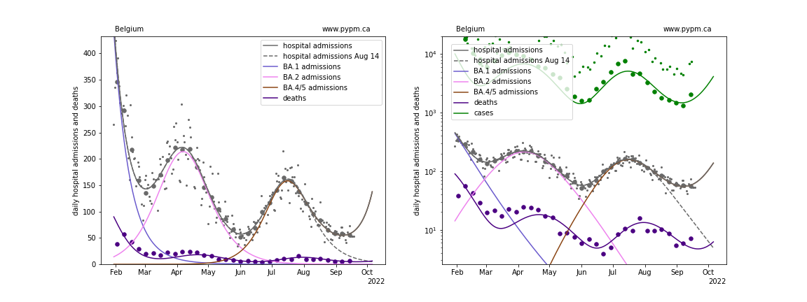
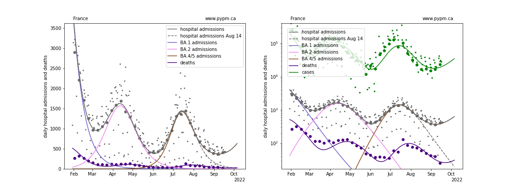
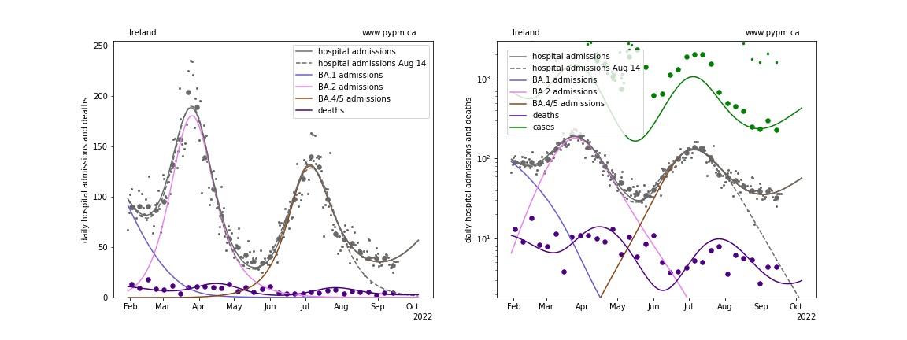
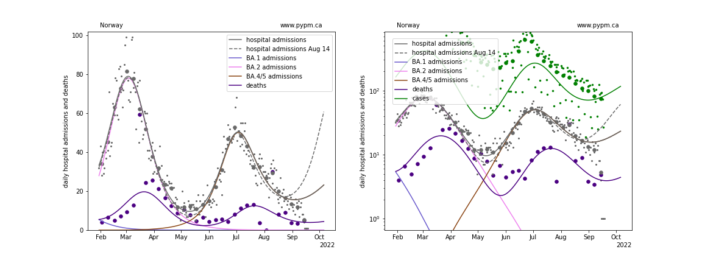
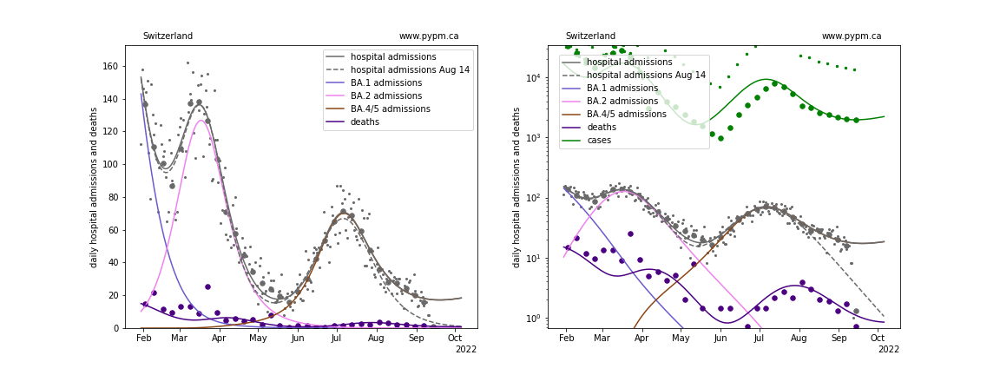
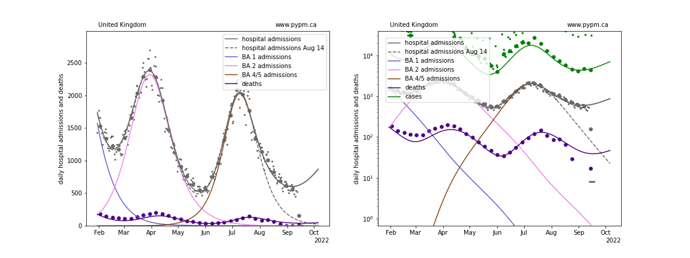

## September 18, 2022 Analysis of EU national data

This is an update to the analysis approach first used for the July 2022 analyses of European data.
See the descriptions from those pages for background about the analysis.
The method uses hospital admission data alone to estimate population-level immunity by the shape of the BA.2 wave.

## Model fits to data: possible signs for waning of immunity

Hospital admission data from August 14 (except for Norway) followed the projections from the analysis of August 7 data which used models
without waning.
August 21 data from all six countries were all above expectations, and to interpret these data,
waning of immunity was included, with typical time scales of about 8 months.
August 28 data followed those projections well.
In this report, the waning parameters were adjusted to best match the data available as of September 18.
There is not sufficient data to firmly establish the waning parameters, and as a result the projections
continue to have a large amount of uncertainty.

The recent decline in hospital admissions in France and Ireland appear to have plateaued in the past weeks, in accord
with August 21 projections. Seeing the plateau in the other nations followed by return to growth will be
a very strong indicator that immunity waning is playing an important role in the spread of COVID-19, and
may be responsible for a fall resurgence.

The projections below show quite different longer term behaviour from one nation to another.
This is an indication of the sensitivity on the degree to which immunity wanes, which is not well established.
It is possible that a fall resurgance of BA.5 will exceed the first BA.5 wave, should the population immunity
(particularly from infections in the previous waves) wane fast enough.

### [Belgium](img/be_4_4_0918.pdf)

### [France](img/fr_4_4_0918.pdf)

### [Ireland](img/ie_4_4_0918.pdf)

### [Norway](img/no_4_4_0918.pdf)

### [Switzerland](img/ch_4_4_0918.pdf)

### [United Kingdom](img/gb_4_4_0918.pdf)

## waning parameter fit results

Country| a_5 | escape frac | wane frac | wane delay 
--|--|--|--|--
Belgium| 3.0 | 0.046 | 0.7 | 342.0 
France| 2.9 | 0.052 | 0.306 | 260.0 
Ireland| 1.4 | 0.091 | 0.602 | 200.5 
Norway| 2.2 | 0.0 | 0.5 | 290.9 
Switzerland| 3.0 | 0.013 | 0.24 | 197.4 
United Kingdom| 2.3 | 0.025 | 0.417 | 240.9

* a_5: transmission rate for BA.5 variant
* escape frac: fraction of BA.1 and BA.2 infections that BA.4/5 infections escape
* wane frac: fraction of immunity that wanes with time after infection
* wane delay: time required for half of the immunity waning to take place (std dev is fixed at 2 months)

The values in the table below do not differ significantly from the fits done on September 4.

The wide range of values from different nations, for properties that should be common, indicates the
large uncertainty involved in estimating these quantities at this time.
Should upswings in hospital admission rates be observed, waning will be well established and these
quantities can be estimated more accurately.

## [return to case studies](../index.md)

