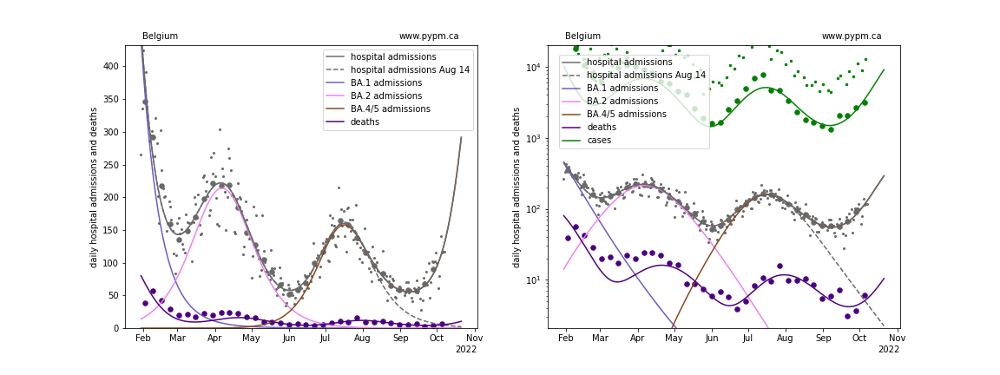
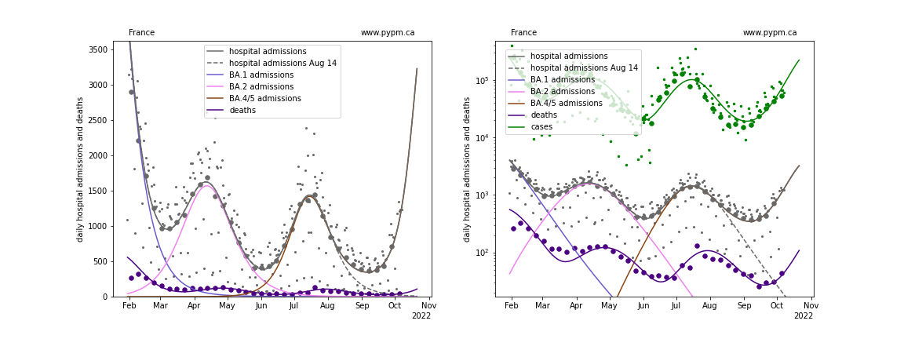
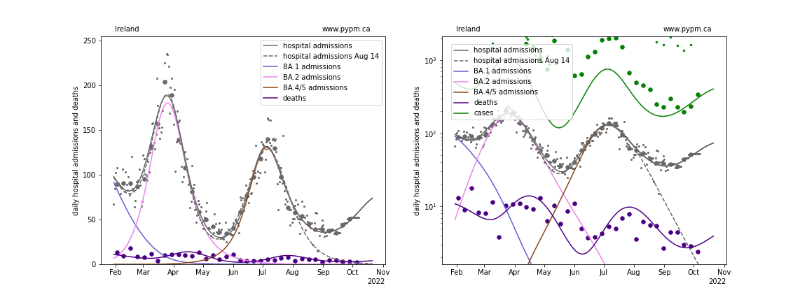
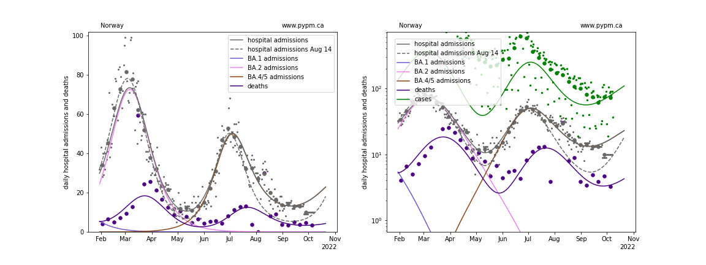
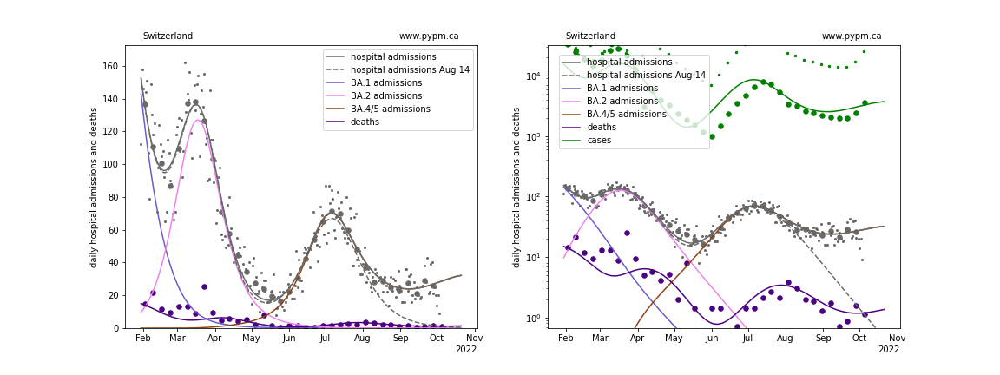
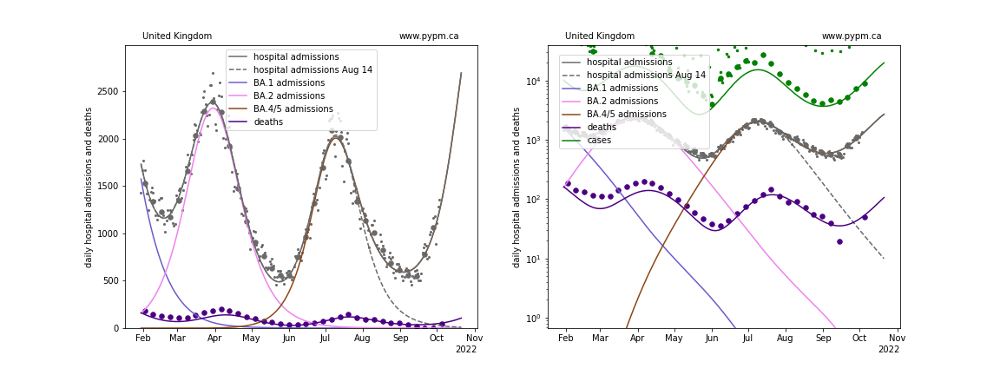

## October 9, 2022 Analysis of EU national data

This is an update to the analysis approach first used for the July 2022 analyses of European data.
See the descriptions from those pages for background about the analysis.
The method uses hospital admission data alone to estimate population-level immunity by the shape of the BA.2 wave.

## Model fits to data: waning of immunity is clearly established

Hospital admission data from August 14 (except for Norway) followed the projections from the analysis of August 7 data which used models
without waning.
In this report, the waning parameters were adjusted to best match the data available as of October 9.
The ECDC hospital admission data repository has stale data, so the
[OWID repository](https://github.com/owid/covid-19-data/blob/master/public/data/hospitalizations/covid-hospitalizations.csv) has been used to
supplement the ECDC data.

The recent decline in hospital admissions have transitioned to growth in all nations being tracked, except for Norway and Switzerland.
Rapid growth is seen in Nelgium, France, and UK.
The exponential growth rate, r (% per day), has continually increased in the last few months, which is the
expected behaviour for a resurgance caused by waning of immunity.
A simple change to transmission rates cannot cause this on its own, since with robust immunity, the growth rate, r, would continue
to decline.

The projections below show quite different longer term behaviour from one nation to another.
It is possible that the fall resurgance of BA.5 will exceed the first BA.5 wave, for some nations,
should the population immunity (particularly from infections in the previous waves) wane fast enough.

### [Belgium](img/be_4_4_1009.pdf)

### [France](img/fr_4_4_1009.pdf)

### [Ireland](img/ie_4_4_1009.pdf)

### [Norway](img/no_4_4_1009.pdf)

### [Switzerland](img/ch_4_4_1009.pdf)

### [United Kingdom](img/gb_4_4_1009.pdf)

## waning parameter fit results

Country| a_5 | escape frac | wane frac | wane delay | wane sigma 
--|--|--|--|--|--
Belgium| 3.0 | 0.045 | 0.533 | 331.6 | 58.2 
France| 2.2 | 0.09 | 1.0 | 315.8 | 56.4 
Ireland| 1.5 | 0.087 | 0.602 | 199.3 | 60.0 
Norway| 2.0 | 0.011 | 0.467 | 294.3 | 60.0 
Switzerland| 3.0 | 0.023 | 0.267 | 213.6 | 60.0 
United Kingdom| 1.6 | 0.127 | 0.866 | 311.9 | 60.0 

* a_5: transmission rate for BA.5 variant
* escape frac: fraction of BA.1 and BA.2 infections that BA.4/5 infections escape
* wane frac: fraction of immunity that wanes with time after infection
* wane delay: time required for half of the immunity waning to take place
* wane sigma: standard deviation for time delay (gamma distribution) fixed at 60 days, except BE and FR.

## [return to case studies](../index.md)

