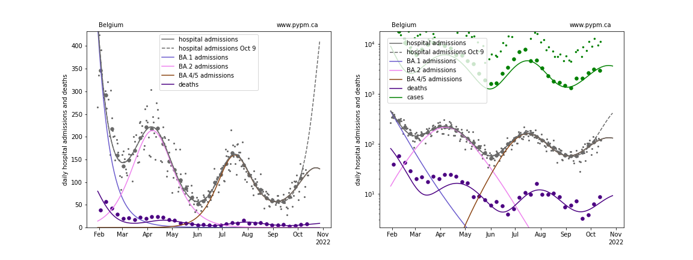
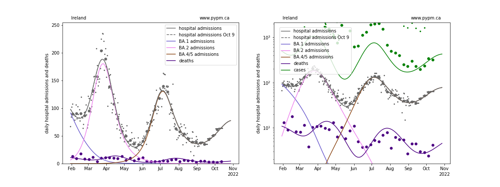
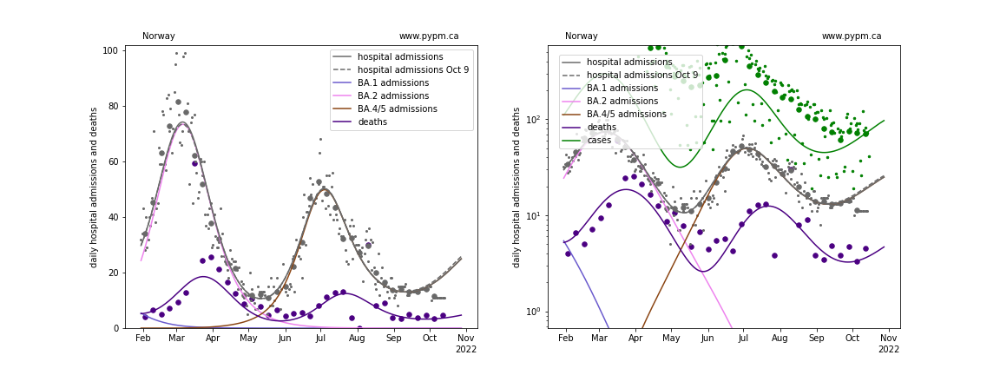
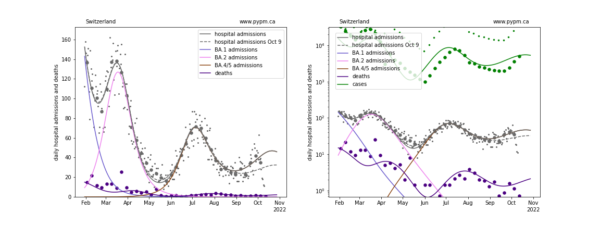
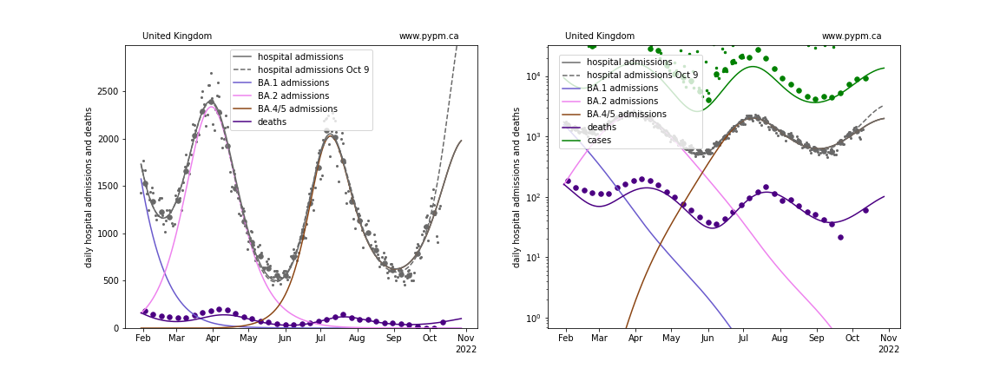

## October 16, 2022 Analysis of EU national data

This is an update to the analysis approach first used for the July 2022 analyses of European data.
See the descriptions from those pages for background about the analysis.
The method uses hospital admission data alone to estimate population-level immunity by the shape of the BA.2 wave.

## Model fits to data: waning of immunity is clearly established

Hospital admission data from August 14 (except for Norway) followed the projections from the analysis of August 7 data which used models
without waning.
In this report, the waning parameters were adjusted to best match the data available as of October 16.
The ECDC hospital admission data repository has stale data, so the
[OWID repository](https://github.com/owid/covid-19-data/blob/master/public/data/hospitalizations/covid-hospitalizations.csv) has been used to
supplement the ECDC data.

With this most recent data, the exponential growth rate (%/day) for Belgium, France, and UK are now seen to be declining, suggesting that the peak
hospital admissions will be seen in the coming weeks.
Growth is now clearly seen for Switzerland.

### [Belgium](img/be_4_4_1016.pdf)

### [France](img/fr_4_4_1016.pdf)

### [Ireland](img/ie_4_4_1016.pdf)

### [Norway](img/no_4_4_1016.pdf)

### [Switzerland](img/ch_4_4_1016.pdf)

### [United Kingdom](img/gb_4_4_1016.pdf)

## waning parameter fit results

The model for Ireland was not adjusted this week: it is the same as fitted for the October 9 analysis.

Country| a_5 | escape frac | wane frac | wane delay | wane sigma 
--|--|--|--|--|--
Belgium| 2.8 | 0.054 | 0.109 | 257.0 | 10.9 
France| 2.2 | 0.092 | 0.293 | 256.3 | 28.7 
Ireland| 1.5 | 0.087 | 0.602 | 199.3 | 60*
Norway| 2.0 | 0.015 | 0.464 | 294.2 | 60* 
Switzerland| 3.0 | 0.039 | 0.293 | 235.4 | 60* 
United Kingdom| 2.1 | 0.059 | 0.66 | 294.6 | 80.9

* a_5: transmission rate for BA.5 variant
* escape frac: fraction of BA.1 and BA.2 infections that BA.4/5 infections escape
* wane frac: fraction of immunity that wanes with time after infection
* wane delay: time required for half of the immunity waning to take place
* wane sigma: standard deviation for time delay (gamma distribution) fixed at 60 days, except BE, FR, and UK

## [return to case studies](../index.md)

