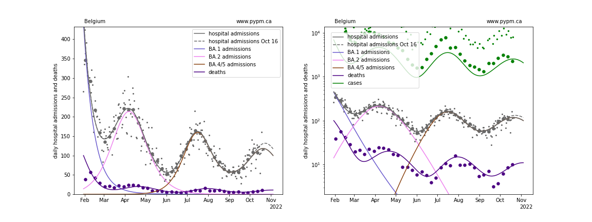
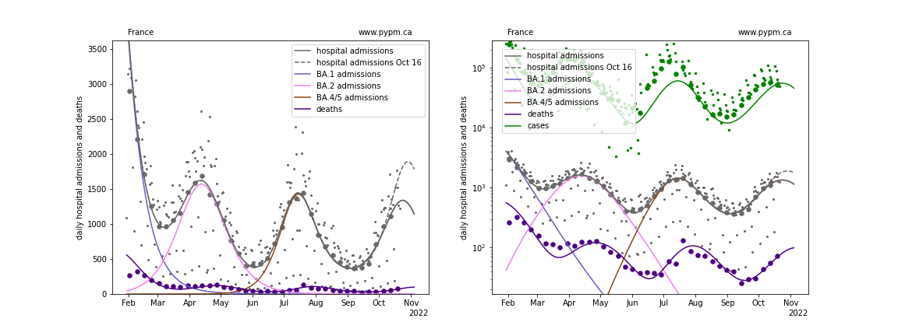
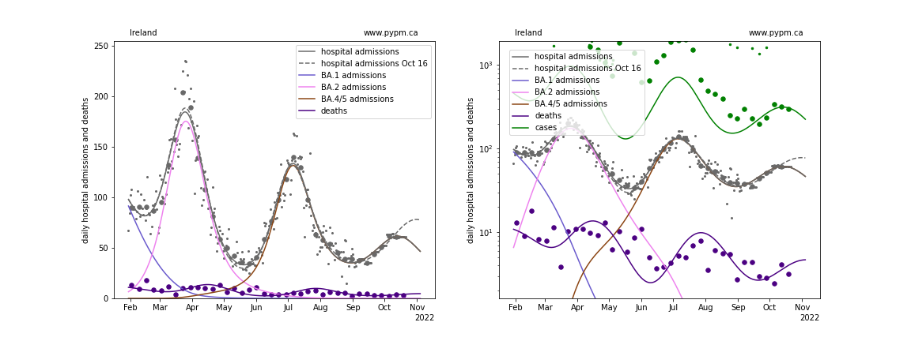
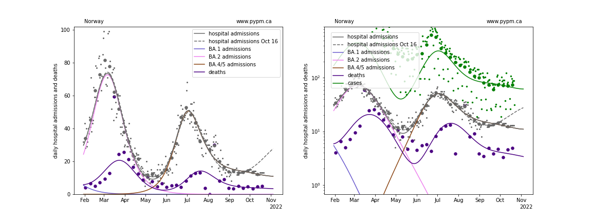
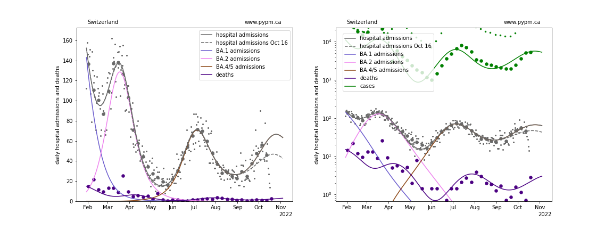
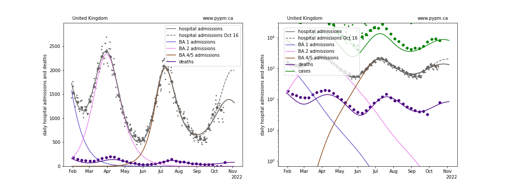
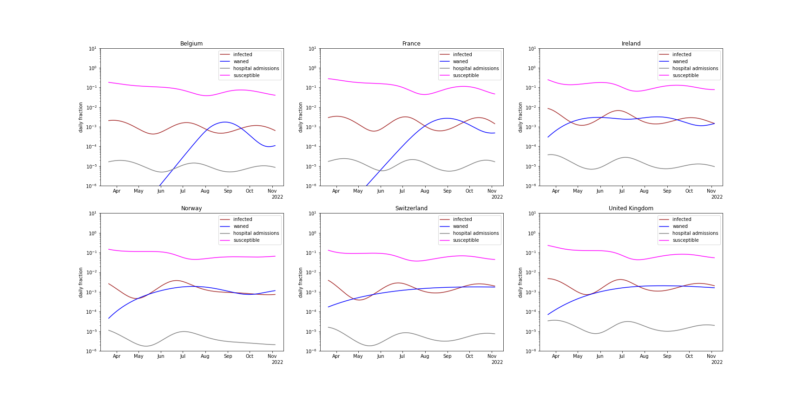

## October 23, 2022 Analysis of EU national data

This is an update to the analysis approach first used for the July 2022 analyses of European data.
See the descriptions from those pages for background about the analysis.
The method uses hospital admission data alone to estimate population-level immunity by the shape of the BA.2 wave.

## Model fits to data: waning of immunity is clearly established

The ECDC hospital admission data repository has stale data, so the
[OWID repository](https://github.com/owid/covid-19-data/blob/master/public/data/hospitalizations/covid-hospitalizations.csv) has been used to
supplement the ECDC data.

With this most recent data, projections show the next peak to come earlier and have lower magnitude than last week's projections, except for Switzerland.
The future trajectory depends on the rate of waning, and the approach that worked well at the beginning of the waning phase (3 parameters: fraction,
delay time mean, and delay time standard deviation) may not be sufficient to describe data well. The fit to UK data for past few weeks is poor.

### [Belgium](img/be_4_4_1023.pdf)

### [France](img/fr_4_4_1023.pdf)

### [Ireland](img/ie_4_4_1023.pdf)

### [Norway](img/no_4_4_1023.pdf)

### [Switzerland](img/ch_4_4_1023.pdf)

### [United Kingdom](img/gb_4_4_1023.pdf)

## waning parameter fit results

The model for Ireland was not adjusted this week: it is the same as fitted for the October 9 analysis.

Country| a_5 | escape frac | wane frac | wane delay | wane sigma 
--|--|--|--|--|--
Belgium| 2.8 | 0.055 | 0.101 | 254.8 | 6.6 
France| 2.1 | 0.1 | 0.218 | 244.8 | 16.7 
Ireland| 1.5 | 0.028 | 0.51 | 161.9 | 21.2 
Norway| 2.5 | 0.0 | 0.357 | 275.8 | 24.1 
Switzerland| 3.0 | 0.031 | 0.537 | 303.5 | 116.3 
United Kingdom| 2.4 | 0.03 | 0.464 | 252.9 | 62.2

* a_5: transmission rate for BA.5 variant
* escape frac: fraction of BA.1 and BA.2 infections that BA.4/5 infections escape
* wane frac: fraction of immunity that wanes with time after infection
* wane delay: time required for half of the immunity waning to take place
* wane sigma: standard deviation for time delay (gamma distribution)

## [comparison of waning and infection rates](img/eu_waning.pdf)

The figure below shows the daily waning and infection rates (as fractions of the entire populations).
The resurgance of BA.5 is due to waning immunity, and once new infection rates exceed waning rates, the growth rate becomes negative again.

## [return to case studies](../index.md)

