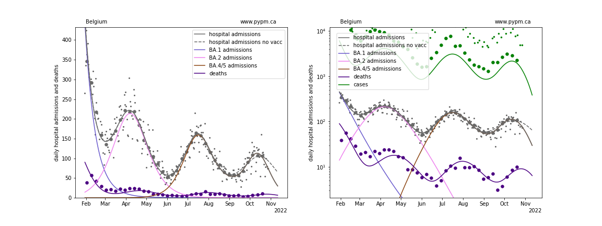
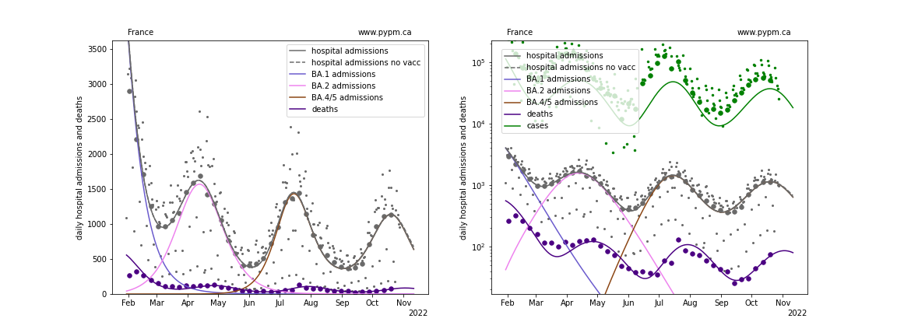
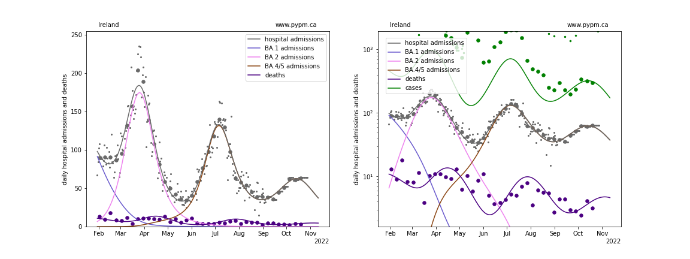
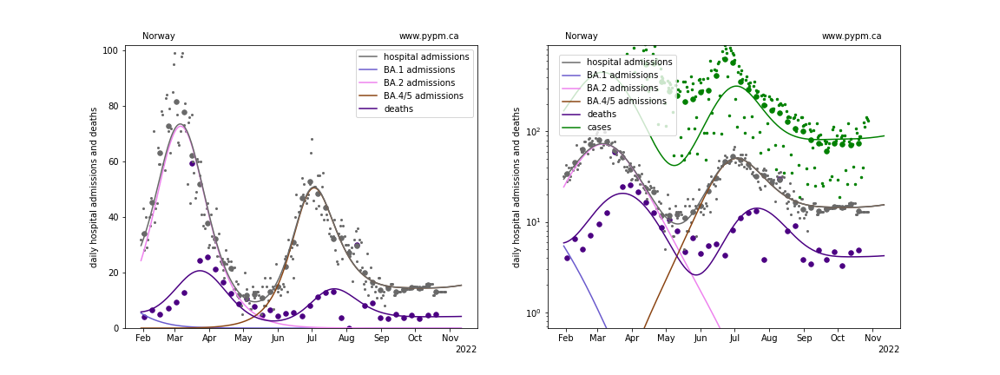
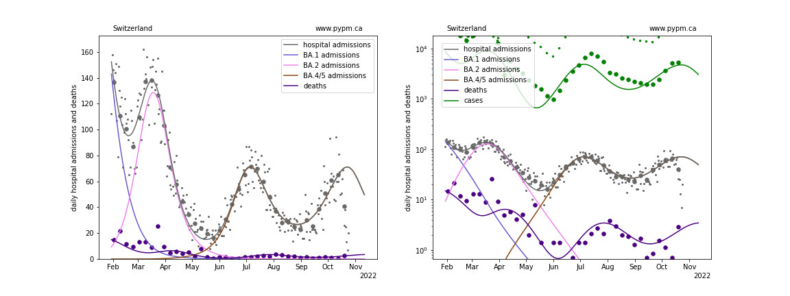
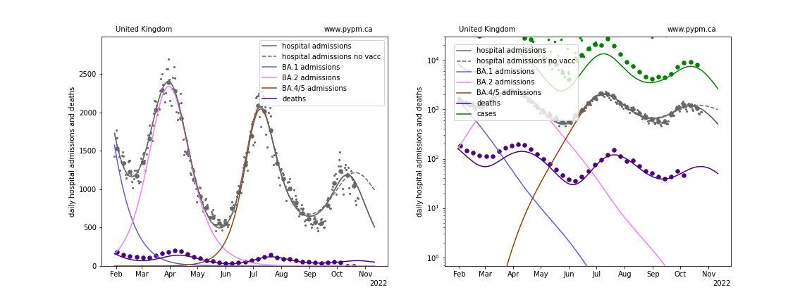

## October 30, 2022 Analysis of EU national data

This is an update to the analysis approach first used for the July 2022 analyses of European data.
See the descriptions from those pages for background about the analysis.
The method uses hospital admission data alone to estimate population-level immunity by the shape of the BA.2 wave.

## Model fits to data: waning of immunity is clearly established

The ECDC hospital admission data repository has stale data, so the
[OWID repository](https://github.com/owid/covid-19-data/blob/master/public/data/hospitalizations/covid-hospitalizations.csv) has been used to
supplement the ECDC data.

With this most recent data, projections show the next peak to come earlier and have lower magnitude than last week's projections, except for Switzerland.
The future trajectory depends on the rate of waning, and the approach that worked well at the beginning of the waning phase (3 parameters: fraction,
delay time mean, and delay time standard deviation) may not be sufficient to describe data well.

## effect of recent vaccination

In recent weeks, Belgium and UK have had significant vaccination rates (exceeding infection rates).
To investigate if this could explain the very rapid turn around in the BA.5 resurgance for those nations, vaccination was included for the recent
months, with the immunity being acquired followed a gamma delay distribution of mean 10 days and standard deviation 5 days.
Only a fraction of vaccations are effective, given the small susceptible fraction.
The fits to Belgium and UK data are improved with vaccination included. The plots below show the best fits with vaccination and without
vaccination for those nations having significant recent vaccination.

Note that the difference between these curves do not represent the effect of vaccination.
The other parameters are adjusted to improve fit when vaccination is not included, thus reducing the apparant impact of vaccination.

### [Belgium](img/be_4_4_1030.pdf)

### [France](img/fr_4_4_1030.pdf)

### [Ireland](img/ie_4_4_1030.pdf)

### [Norway](img/no_4_4_1030.pdf)

### [Switzerland](img/ch_4_4_1030.pdf)

### [United Kingdom](img/gb_4_4_1030.pdf)

## waning parameter fit results

The model for Ireland was not adjusted this week: it is the same as fitted for the October 9 analysis.

Country| a_5 | escape frac | wane frac | wane delay | wane sigma | vacc eff
--|--|--|--|--|--|--
Belgium| 2.8 | 0.055 | 0.219 | 278.0 | 23.3 | 0.42 
France| 2.1 | 0.101 | 0.205 | 240.9 | 10.5 | 0.4 
Ireland| 1.6 | 0.03 | 0.532 | 168.0 | 20.6 | 0.4 
Norway| 2.4 | 0.0 | 0.399 | 281.1 | 33.6 | 0.1 
Switzerland| 3.0 | 0.032 | 0.629 | 325.5 | 127.8 | 0.4 
United Kingdom| 2.3 | 0.037 | 0.53 | 268.1 | 70.5 | 0.4 

* a_5: transmission rate for BA.5 variant
* escape frac: fraction of BA.1 and BA.2 infections that BA.4/5 infections escape
* wane frac: fraction of immunity that wanes with time after infection
* wane delay: time required for half of the immunity waning to take place
* wane sigma: standard deviation for time delay (gamma distribution)
* vacc eff: the effectiveness of recent vaccinations (free parameter only for Belgium)

## [return to case studies](../index.md)

