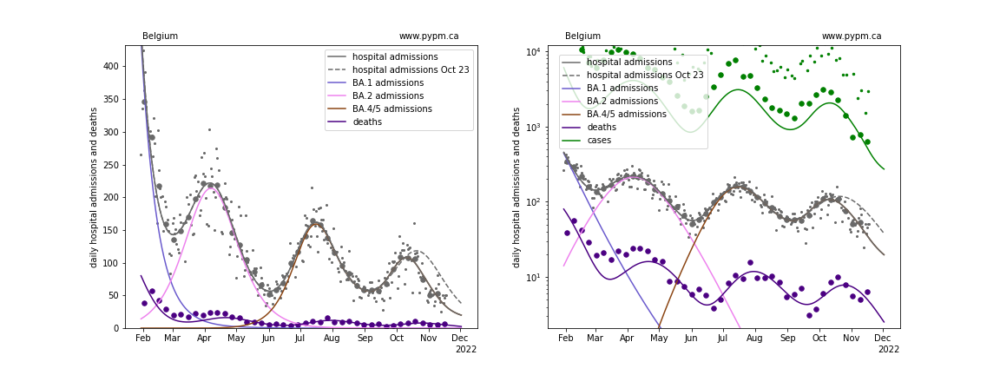
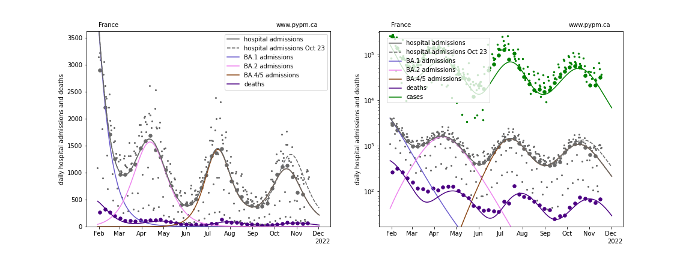
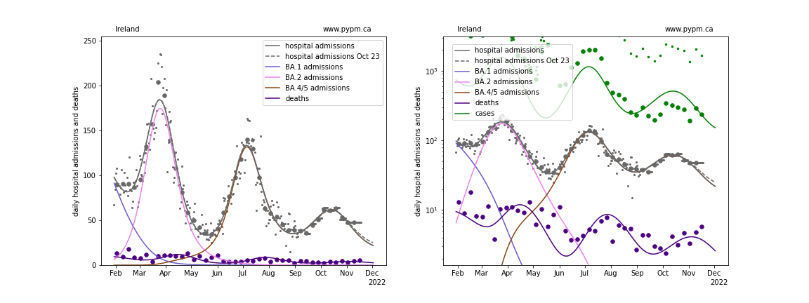
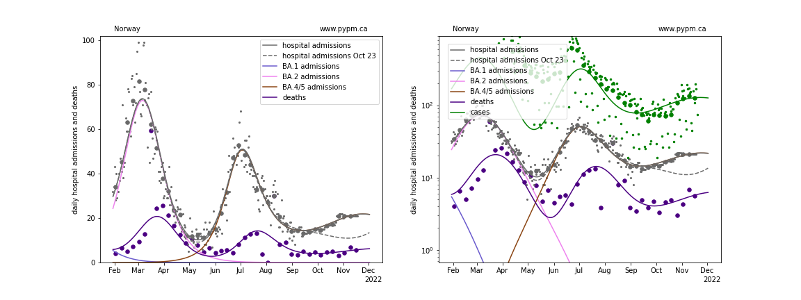
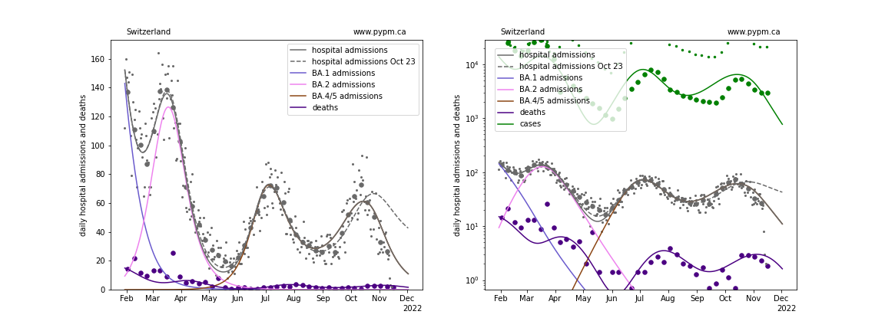
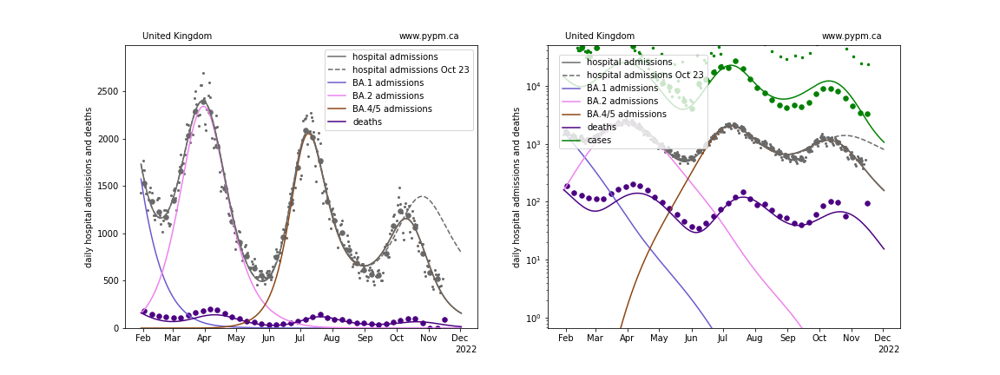
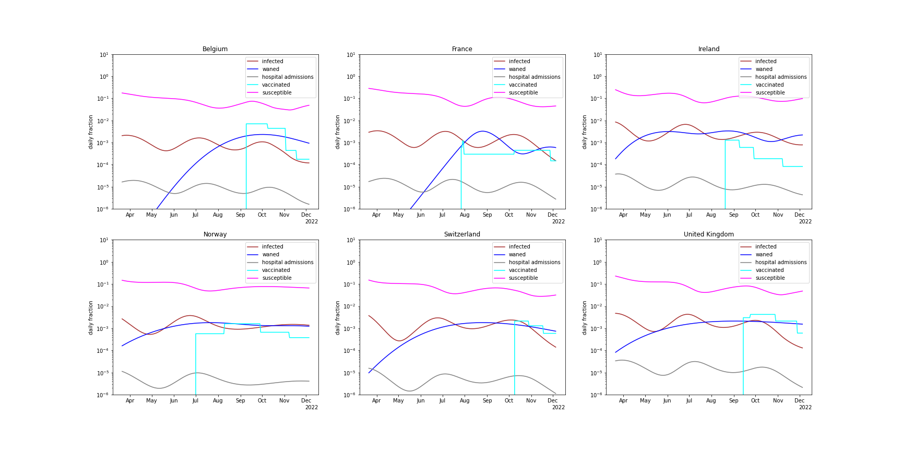
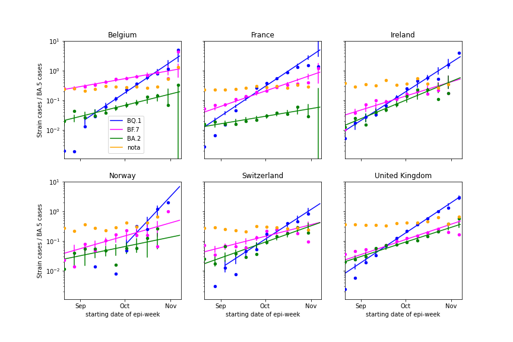
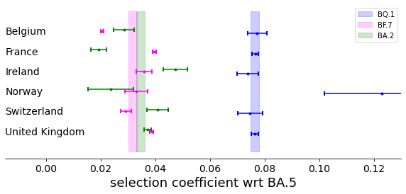

## November 20, 2022 Analysis of EU national data

This is an update to the analysis approach first used for the July 2022 analyses of European data.
See the descriptions from those pages for background about the analysis.
The method uses hospital admission data alone to estimate population-level immunity by the shape of the BA.2 wave.

The ECDC hospital admission data repository has stale data, so the
[OWID repository](https://github.com/owid/covid-19-data/blob/master/public/data/hospitalizations/covid-hospitalizations.csv) has been used to
supplement the ECDC data.

## effect of recent vaccination

In recent weeks, Belgium, Switzerland, and UK have had significant vaccination rates (exceeding infection rates).
Starting on October 30, the model included the effect of the recent vaccination programs in all 6 nations.
The most recent fits are compared to the fits from October 23, prior to introducing vaccination into the model.

### [Belgium](img/be_4_4_1120.pdf)

### [France](img/fr_4_4_1120.pdf)

### [Ireland](img/ie_4_4_1120.pdf)

### [Norway](img/no_4_4_1120.pdf)

### [Switzerland](img/ch_4_4_1120.pdf)

### [United Kingdom](img/gb_4_4_1120.pdf)

## [Immunity dynamics](img/eu_waning.pdf)

The figure below summarizes the changing immunity for the populations,
including the effects of infections, waning, and vaccination.

### waning parameter fit results

Country| a_5 | escape frac | wane frac | wane delay | wane sigma | vacc eff
--|--|--|--|--|--|--
Belgium| 3.0 | 0.047 | 0.287 | 291.5 | 35.7 | 0.4 
France| 2.1 | 0.103 | 0.198 | 239.6 | 7.9 | 0.4 
Ireland| 1.6 | 0.028 | 0.53 | 166.9 | 20.2 | 0.4 
Norway| 2.3 | 0.0 | 0.441 | 284.2 | 44.7 | 0.1 
Switzerland| 3.0 | 0.055 | 0.302 | 244.6 | 48.6 | 0.4 
United Kingdom| 2.5 | 0.027 | 0.5 | 259.9 | 67.5 | 0.4

* a_5: transmission rate for BA.5 variant
* escape frac: fraction of BA.1 and BA.2 infections that BA.4/5 infections escape
* wane frac: fraction of immunity that wanes with time after infection
* wane delay: time required for half of the immunity waning to take place
* wane sigma: standard deviation for time delay (gamma distribution)
* vacc eff: the effectiveness of recent vaccinations (fixed parameter)

## Emerging variants

During the resurgence wave of BA.5* due to waning, new variants emerged, with the BQ.1* exceeding
the prevalence of BA.5 by late October.

The figure below show the ratios of cases of the new variants to cases of BA.5*, as deduced
from whole genomic sequencing from the six nations under study.
Also shown are "nota" (none of the above) which indicates that other variants make up about 20-30% of total cases
and there appears to be no sign of a new emerging variant.

In 2020 and 2021, the susceptible fraction was large which lead to long periods of constant exponential growth.
When alpha and delta emerged, the ratio of the new-variant cases to prior-dominant-strain cases also grew
exponentially, with the exponential constant defined as the selection coefficient.

During the emergence of BQ.1*, immunity waning resulted in a resurgence of BA.5*, which was then followed
by growth in infections (and for some nations vaccinations) which turned the BA.5* resurgance around.
If BQ.1* substantially evaded immunity more than BA.5*, the growth rates for BQ.1* would be less affected
by the waning and reacquisition of immunity during the BA.5* resurgence wave.
With BA.5* growing and then declining during this period, the BQ.1* growth advantage would not be constant
in this circumstance.

It is therefore interesting to see that the BQ.1* cases to BA.5* cases continue to follow a model with a constant
difference between exponential growth coefficients, despite those coefficiencts changing significantly over
the period from September through November 2022.
Some laboratory tests suggested that the BQ.1* strains are able to evade immunity.
This population-level data analysis shows that this is not the case.

The selection coefficients are deduced by maximum likelihood assuming constant selection coefficients
(binomial) with the best fit curves shown in the figures below.

The table and figure show that the BQ.1* has a growth advantage (selecton coefficient) of about 7.6% per day with respect to BA.5*.
The other variants, BF.7* and BA.2* (that includes new variants compared to the April 2022 wave), show growth advantages of about
3.3% per day.

The selection coefficients are:

Nation | BQ.1* | BF.7* | BA.2*
--- | --- | --- | ---
BE | 0.077 +/- 0.004 | 0.02 +/- 0.001 | 0.029 +/- 0.004
FR | 0.077 +/- 0.001 | 0.04 +/- 0.001 | 0.019 +/- 0.003
IE | 0.074 +/- 0.004 | 0.036 +/- 0.003 | 0.047 +/- 0.004
NO | 0.123 +/- 0.021 | 0.033 +/- 0.004 | 0.024 +/- 0.008
CH | 0.075 +/- 0.005 | 0.029 +/- 0.002 | 0.041 +/- 0.004
GB | 0.076 +/- 0.001 | 0.039 +/- 0.001 | 0.037 +/- 0.001

## [return to case studies](../index.md)

