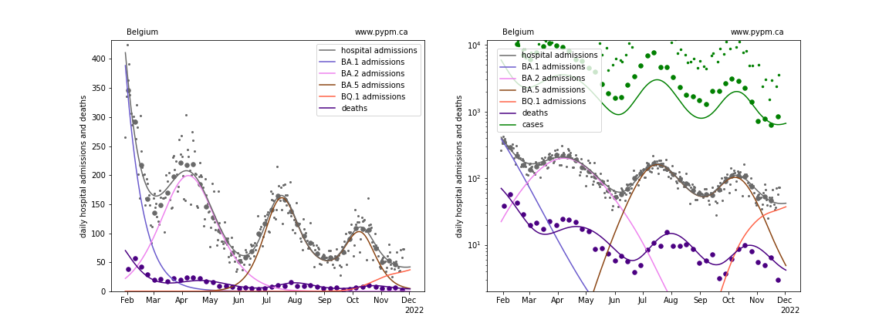
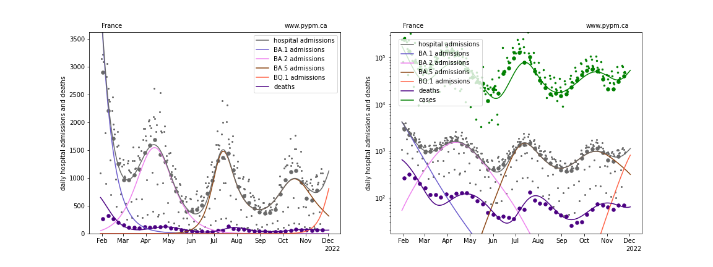
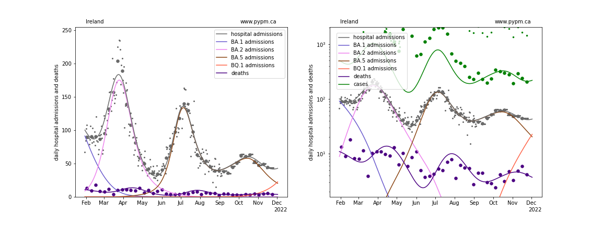
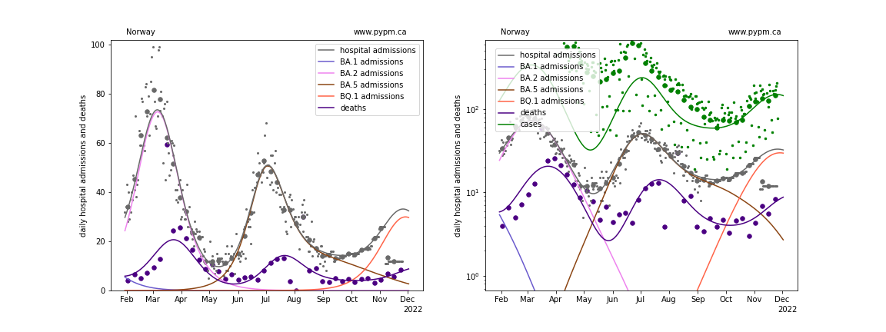
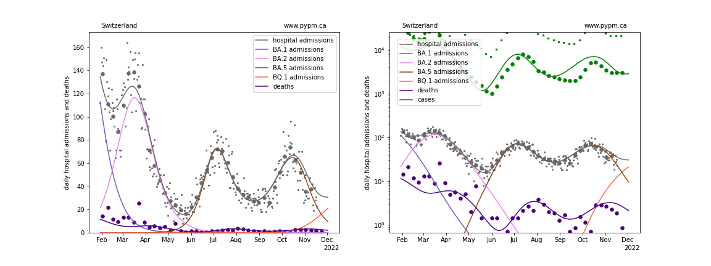
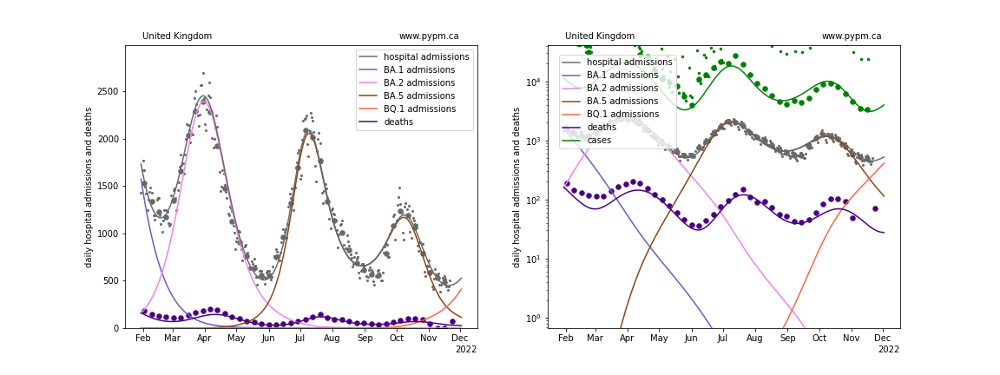
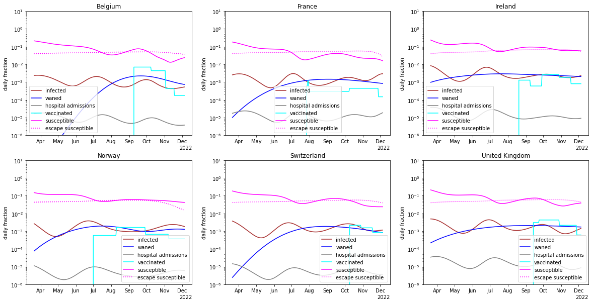
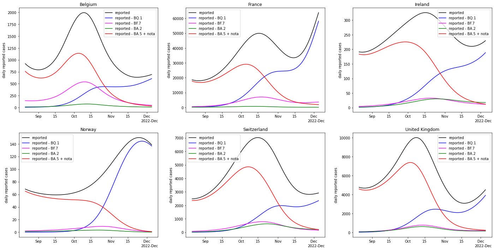

## November 27, 2022 Analysis of EU national data

This is an update to the analysis approach first used for the July 2022 analyses of European data.
See the descriptions from those pages for background about the analysis.
The method uses hospital admission data alone to estimate population-level immunity.

The ECDC hospital admission data repository has stale data, so the
[OWID repository](https://github.com/owid/covid-19-data/blob/master/public/data/hospitalizations/covid-hospitalizations.csv) has been used to
supplement the ECDC data.

## effect of recent variants BQ.1*

In the past week, hospital admissions appear to be growing faster than projected, likely caused by the rise of BQ.1 variant (as reported
in detail in the [November 20 EU report(../index.md)). It is possible that BQ.1 gains some of its advantage by partially escaping existing immunity.

The current pypm model (version 4.4) only has one escape susceptible population, previously used for BA.5. The population immunity model
was refit, with the BA.5 having no escape, in order to allow BQ.1 to benefit from partial escape. The figures below show the new fits.
Given that the influence of the BQ.1 is very recent, there is no opportunity to fit growth or escape parameters. The transmission rate is set
to be the same as BA.5 and the escape fraction is set to 0.05.

The poorly known waning of immunity introduces much uncertainty in these projections.

### [Belgium](img/be_4_4_1127.pdf)

### [France](img/fr_4_4_1127.pdf)

### [Ireland](img/ie_4_4_1127.pdf)

### [Norway](img/no_4_4_1127.pdf)

### [Switzerland](img/ch_4_4_1127.pdf)

### [United Kingdom](img/gb_4_4_1127.pdf)

## [Immunity dynamics](img/eu_waning.pdf)

The figure below summarizes the changing immunity for the populations,
including the effects of infections, waning, and vaccination.

## breakdown according to strains

By using the results of the genomic analysis from November 20 to determine the fraction of cases
attributed to each strain, the following figure illustrates those changing fractions multiplying
the recent case history.
It is apparant that BQ.1 is not continually growing - indicating that it is limited by population immunity.

## [return to case studies](../index.md)

