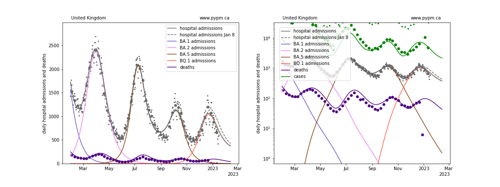

## January 22, 2023 Analysis of EU national data

This is an update to the analysis approach first used for the July 2022 analyses of European data.
See the descriptions from those pages for background about the analysis.
The method uses hospital admission data alone to estimate population-level immunity.

The ECDC hospital admission data repository has stale data, so the
[OWID repository](https://github.com/owid/covid-19-data/blob/master/public/data/hospitalizations/covid-hospitalizations.csv) has been used to
supplement the ECDC data.

Norway is no longer providing hospital admission data, so it is removed from this study.

## BQ.1* peaked

The BA.5 variant had two distinct peaks, the second arising from waning of natural immunity. In the last written report (November 27, 2022),
the effect of BQ.1 on hospital admissions was becoming apparant and so a new strain was added to the model.
It is possible that BQ.1 gains some of its advantage by partially escaping existing immunity, and this was included in the model.

The transmission rate and escape parameters were adjusted to match the data.
The continued decline suggests that the rate of immunity waning is not growing, and a second peak due to BQ.1 is not expected.

### [Belgium](img/be_4_4_0122.pdf)

### [France](img/fr_4_4_0122.pdf)

### [Ireland](img/ie_4_4_0122.pdf)

### [Switzerland](img/ch_4_4_0122.pdf)

### [United Kingdom](img/gb_4_4_0122.pdf)

## [Immunity dynamics](img/eu_waning.pdf)

The figure below summarizes the changing immunity for the populations,
including the effects of infections, waning, and vaccination.

## [return to case studies](../index.md)

