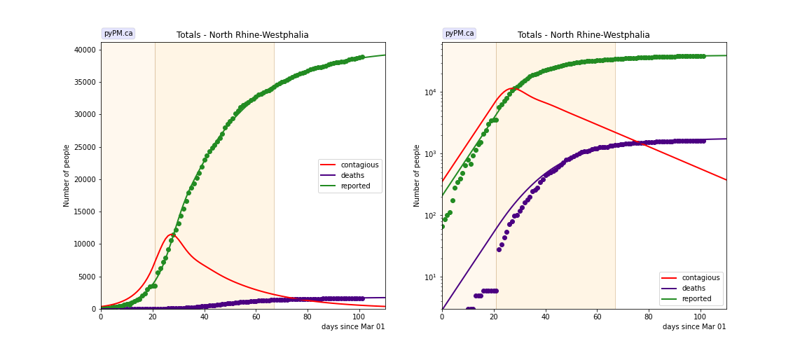
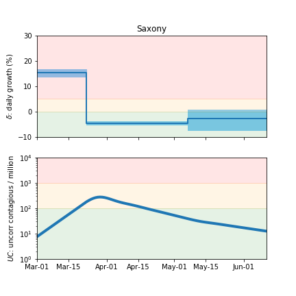

## June 17, 2020 Analysis of German state data

Data from March 1-June 10 were included in the analysis.
Strick lockdown in Germany started on March 22. The transition date for the
transmission rates were not fixed to that date: most fits found the transition to be
very close to March 22.

Relaxation of lockdown rules started on May 6.
To evaluate the effect on the spread of CoViD-19, a transition is transmission rate
was imposed on that date, and the transmission rates before and after were fit.

The results from the 16 German states are remarkably consistent
with similar values for &delta before and after the imposition of the lockdown rules.
There is no significant increase in &delta after the relaxation.

Below shows the case and deaths data for all 16 states
compares to the pypm model fit to the case data.

The red curves (contagious population) is the inferred contagious population.
Its shape is determined from the case data. Its scale is not well known.

Following are tables and figures comparing the different states as well
as the infection status plots, that summarize the growth and size of the epidemic.

### Baden-Warttemberg

### Bavaria

### Berlin

### Brandenburg

### Bremen

### Hamburg

### Hesse

### Lower Saxony

### Mecklenburg-Vorpommern

### North Rhine-Westphalia

### Rhineland-Palatinate

### Saarland

### Saxony

### Saxony-Anhalt

### Schleswig-Holstein

### Thuringia

## Tables

The tables below are results from the fits to reference model 2.3.
These are shown for purposes of comparison.

### daily growth/decline rates (&delta)

state| d_0 | trans | d_1 | d_2 | f_d | d_d 
---|---|---|---|---|---|---
bw|0.138 +/- 0.004|24|-0.050 +/- 0.001|-0.063 +/- 0.008|0.037|17.7
by|0.180 +/- 0.006|23|-0.049 +/- 0.002|-0.038 +/- 0.012|0.039|18.8
be|0.158 +/- 0.011|20|-0.039 +/- 0.002|-0.006 +/- 0.014|0.023|23.0
bb|0.109 +/- 0.012|28|-0.035 +/- 0.006|-0.118 +/- 0.045|0.037|18.4
hh|0.134 +/- 0.010|21|-0.044 +/- 0.003|-0.056 +/- 0.018|0.038|28.0
he|0.130 +/- 0.011|22|-0.031 +/- 0.004|-0.024 +/- 0.011|0.038|19.5
ni|0.195 +/- 0.014|20|-0.037 +/- 0.002|0.001 +/- 0.008|0.038|19.2
nw|0.155 +/- 0.007|21|-0.036 +/- 0.001|-0.036 +/- 0.007|0.033|18.9
rp|0.136 +/- 0.013|21|-0.044 +/- 0.004|-0.039 +/- 0.016|0.026|23.4
sl|0.141 +/- 0.014|27|-0.069 +/- 0.007|-0.050 +/- 0.025|0.044|19.0
sn|0.153 +/- 0.008|22|-0.044 +/- 0.004|-0.026 +/- 0.019|0.031|19.8
st|0.133 +/- 0.020|22|-0.042 +/- 0.010|-0.095 +/- 0.059|0.024|18.4
sh|0.162 +/- 0.027|21|-0.041 +/- 0.009|-0.052 +/- 0.032|0.035|21.0
th|0.174 +/- 0.028|20|-0.016 +/- 0.010|-0.030 +/- 0.019|0.046|24.4

* d_0: initial &delta, prior to lockdown
    * mean value= 0.150, RMS= 0.022, mean stat error= 0.013
* trans: fitted day of lockdown transition (actual date: 22)
    * mean value= 22.3, RMS= 2.4
* d_1: &delta after lockdown
    * mean value= -0.041, RMS= 0.011, mean stat error= 0.005
* d_2: &delta after relaxation on May 22
    * mean value= -0.045, RMS= 0.031, mean stat error= 0.021
* f_d: fatality rate
    * mean value= 0.035, RMS= 0.007
* d_d: mean time from contagious to death
    * mean value= 20.7, RMS= 2.8

## Infection status

### Baden-Warttemberg

### Bavaria

### Berlin

### Brandenburg

### Bremen

### Hamburg

### Hesse

### Lower Saxony

### Mecklenburg-Vorpommern

### North Rhine-Westphalia

### Rhineland-Palatinate

### Saarland

### Saxony

### Saxony-Anhalt

### Schleswig-Holstein

### Thuringia

## [return to case studies](../index.md)

