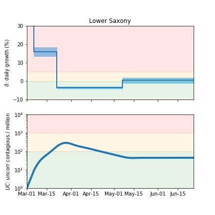

## June 25, 2020 Analysis of German state data

This shows the results of fits to data from the 13 German states with more than 2000 cases by the end of June 2020.
The study is described in detail as in the paper [Charaterizing the spread of CoViD-19](../index.md).

Below shows the case and deaths data for the 13 states
compared to the pypm model fit to the case data.

The red curves (contagious population) is the inferred contagious population.
Its shape is determined from the case data. Its scale is not well known.

Following are tables and figures comparing the different states as well
as the infection status plots, that summarize the growth and size of the epidemic.
PDF versions of plots are available by clicking on the titles

### [Baden-Warttemberg](img/bw_2_3_0617.pdf)

### [Bavaria](img/by_2_3_0617.pdf)

### [Berlin](img/be_2_3_0617.pdf)

### [Brandenburg](img/bb_2_3_0617.pdf)

### [Hamburg](img/hh_2_3_0617.pdf)

### [Hesse](img/he_2_3_0625.pdf)

### [Lower Saxony](img/ni_2_3_0625.pdf)

### [North Rhine-Westphalia](img/nw_2_3_0625.pdf)

### [Rhineland-Palatinate](img/rp_2_3_0625.pdf)

### [Saarland](img/sl_2_3_0625.pdf)

### [Saxony](img/sn_2_3_0625.pdf)

### [Schleswig-Holstein](img/sh_2_3_0625.pdf)

### [Thuringia](img/th_2_3_0625.pdf)

## Tables

The tables below are results from the fits to reference model 2.3.
These are shown for purposes of comparison.

### daily growth/decline rates (&delta;)

state| &delta;0 | d1 | &delta;1 | d2 | &delta;2 | &delta;3 
---|---|---|---|---|---|---
bw|0.288 +/- 0.024|12|0.105 +/- 0.007|24|-0.049 +/- 0.002|-0.060 +/- 0.009
by|0.256 +/- 0.022|14|0.16 +/- 0.011|23|-0.049 +/- 0.002|-0.041 +/- 0.01
be|0.402 +/- 0.036|7|0.131 +/- 0.013|20|-0.038 +/- 0.005|-0.021 +/- 0.036
bb|0.345 +/- 0.036|10|0.102 +/- 0.019|26|-0.031 +/- 0.007|-0.086 +/- 0.027
hh|0.41 +/- 0.029|9|0.122 +/- 0.016|20|-0.043 +/- 0.005|-0.061 +/- 0.031
he|0.354 +/- 0.039|11|0.078 +/- 0.013|23|-0.031 +/- 0.004|-0.026 +/- 0.01
ni|0.494 +/- 0.019|5|0.16 +/- 0.01|21|-0.039 +/- 0.003|0.002 +/- 0.007
nw|0.274 +/- 0.046|5|0.134 +/- 0.009|22|-0.038 +/- 0.002|-0.029 +/- 0.007
rp|0.483 +/- 0.023|9|0.075 +/- 0.011|23|-0.047 +/- 0.004|-0.028 +/- 0.021
sl|0.282 +/- 0.031|13|0.108 +/- 0.015|28|-0.073 +/- 0.009|-0.031 +/- 0.043
sn|0.426 +/- 0.031|10|0.108 +/- 0.015|23|-0.045 +/- 0.006|-0.033 +/- 0.022
sh|0.355 +/- 0.032|8|0.148 +/- 0.024|21|-0.041 +/- 0.007|-0.056 +/- 0.032
th|0.287 +/- 0.027|15|0.117 +/- 0.056|20|-0.017 +/- 0.006|-0.029 +/- 0.013

* &delta;0: initial &delta;
* &delta;1: &delta; prior to lockdown
* d2: fitted day of lockdown transition (actual date: 22)
    * mean value= 22.6, RMS= 2.4
* &delta;2: &delta; after relaxation on May 22

## Infection status

The following plots summarize the infection history.
The upper plot shows the daily growth/decline from the fit. Bands show approximate 95% CL intervals.
The lower plot shows the size of the infection: the uncorrected circulating contagious population per
million.

### [Baden-Warttemberg](img/bw-summary.pdf)

### [Bavaria](img/by-summary.pdf)

### [Berlin](img/be-summary.pdf)

### [Brandenburg](img/bb-summary.pdf)

### [Hamburg](img/hh-summary.pdf)

### [Hesse](img/he-summary.pdf)

### [Lower Saxony](img/ni-summary.pdf)

### [North Rhine-Westphalia](img/nw-summary.pdf)

### [Rhineland-Palatinate](img/rp-summary.pdf)

### [Saarland](img/sl-summary.pdf)

### [Saxony](img/sn-summary.pdf)

### [Schleswig-Holstein](img/sh-summary.pdf)

### [Thuringia](img/th-summary.pdf)

## [return to case studies](../index.md)

