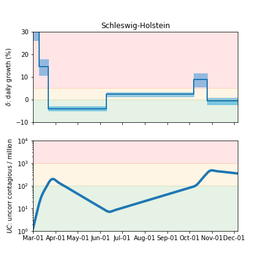

## December 6, 2020 Analysis of German state data

This shows the results of fits to data from the 16 German states.
This updates the earlier [study](../archive/germany20200625/index.md)
which described in detail as in the paper [Charaterizing the spread of CoViD-19](../index.md).

The left figures below, show the daily case history since August 1, 2020, on a log scale.
The points daily data, and the stars show the weekly average and
the pypm model is fit to this data to determine the infection trajectory.
That trajectory is itself defined by long periods of constant transmission rates.

The curves show the model predictions given the transmission rate parameters, as determined from the case data only.
The shaded regions indicate the periods having a constant transmission rate.

The right figures show the number of patients in ICU and on ventilators.

### [Baden-Wurttemberg](img/bw_2_6_1206.pdf)

### [Bavaria](img/by_2_6_1206.pdf)

### [Berlin](img/be_2_6_1206.pdf)

### [Brandenburg](img/bb_2_6_1206.pdf)

### [Bremen](img/hb_2_6_1206.pdf)

### [Hamburg](img/hh_2_6_1206.pdf)

### [Hesse](img/he_2_6_1206.pdf)

### [Lower Saxony](img/ni_2_6_1206.pdf)

### [Mecklenburg-Vorpommern](img/mv_2_6_1206.pdf)

### [North Rhine-Westphalia](img/nw_2_6_1206.pdf)

### [Rhineland-Palatinate](img/rp_2_6_1206.pdf)

### [Saarland](img/sl_2_6_1206.pdf)

### [Saxony](img/sn_2_6_1206.pdf)

### [Saxony-Anhalt](img/st_2_6_1206.pdf)

### [Schleswig-Holstein](img/sh_2_6_1206.pdf)

### [Thuringia](img/th_2_6_1206.pdf)

## Tables

### daily growth/decline rates (&delta;)

Shown are growth rates (% per day) since August 1, with the date of the transition. 68% confidence intervals shown.

state| &delta; | day | &delta; | day | &delta; | day | &delta;  
---|---|---|---|---|---|---
BW|-1.8 +/-  0.3|Sep 19| 7.6 +/-  0.2|Oct 24| 0.6 +/-  0.5
BY| 2.4 +/-  0.9|Aug 23| 0.4 +/-  0.4|Sep 30| 8.4 +/-  0.3|Oct 27| 0.7 +/-  0.5
BE| 3.8 +/-  1.2|Aug 08| 0.8 +/-  0.8|Sep 05| 5.1 +/-  0.2|Oct 29| 0.4 +/-  0.5
BB| 0.6 +/-  0.8|Aug 31| 7.2 +/-  0.7|Oct 24| 2.4 +/-  0.5
HB|-2.5 +/-  1.1|Sep 06| 6.5 +/-  0.5|Oct 26|-1.6 +/-  1.1
HH| 2.9 +/-  0.4|Oct 06| 6.8 +/-  0.9|Oct 29|-1.2 +/-  1.0
HE| 3.5 +/-  0.6|Aug 16|-1.5 +/-  0.9|Sep 16| 7.8 +/-  0.3|Oct 25| 0.2 +/-  0.6
NI| 3.6 +/-  0.8|Aug 10| 0.8 +/-  0.3|Sep 18| 6.2 +/-  0.2|Oct 30|-0.6 +/-  0.8
MV|-0.5 +/-  1.2|Sep 15| 8.8 +/-  1.1|Oct 22| 0.4 +/-  0.7
NW| 2.8 +/-  0.4|Aug 08|-0.8 +/-  0.2|Sep 13| 6.9 +/-  0.1|Oct 27|-0.3 +/-  0.7
RP| 3.8 +/-  0.6|Aug 16|-0.9 +/-  1.0|Sep 19| 7.8 +/-  0.3|Oct 27| 0.4 +/-  0.6
SL|-5.1 +/-  3.2|Sep 09| 10.7 +/-  8.4|Oct 22|-0.5 +/-  0.8
SN| 1.3 +/-  0.8|Sep 12| 8.8 +/-  0.4|Oct 25| 2.6 +/-  0.4
ST| 1.2 +/-  0.6|Sep 12| 7.3 +/-  0.9|Oct 24| 2.5 +/-  0.5
SH| 2.3 +/-  0.4|Oct 07| 8.9 +/-  1.5|Oct 25|-0.6 +/-  0.7
TH| 2.5 +/-  0.6|Sep 29| 8.8 +/-  0.6|Oct 23| 3.3 +/-  0.4

### hospitalization and death parameters

Some model parameters can be estimated with the data. 68% CL intervals are shown

state | rec. frac | death delay | icu frac | icu delay | vent delay 
---|---|---|---|---|---
BW | 0.984 +/- 0.002 | 35.4 +/- 3.7 | 0.011 +/- 0.002 | 8.4 +/- 2.1 | 3.5 +/- 1.1
BY | 0.985 +/- 0.002 | 30.7 +/- 5.8 | 0.011 +/- 0.003 | 10.6 +/- 0.9 | 3.2 +/- 1.8
BE | 0.986 +/- 0.004 | 35.7 +/- 7.4 | 0.016 +/- 0.006 | 4.6 +/- 2.8 | 3.1 +/- 3.1
BB | 0.972 +/- 0.007 | 35.0 +/- 2.4 | 0.014 +/- 0.006 |       -      |       -     
HB | 0.989 +/- 0.003 |       -      | 0.012 +/- 0.005 |       -      |       -     
HH | 0.990 +/- 0.003 | 35.0 +/- 1.6 | 0.013 +/- 0.005 | 9.6 +/- 2.5 | 4.3 +/- 1.3
HE | 0.984 +/- 0.004 | 31.5 +/- 3.9 | 0.012 +/- 0.006 | 9.4 +/- 1.3 | 5.3 +/- 2.3
NI | 0.988 +/- 0.002 | 27.4 +/- 5.8 | 0.011 +/- 0.004 | 4.4 +/- 2.0 | 1.2 +/- 0.8
MV | 0.982 +/- 0.003 |       -      | 0.015 +/- 0.005 |       -      |       -     
NW | 0.989 +/- 0.001 | 26.8 +/- 3.2 | 0.014 +/- 0.002 | 6.2 +/- 0.5 | 2.6 +/- 0.9
RP | 0.979 +/- 0.005 | 36.5 +/- 5.9 | 0.012 +/- 0.004 | 10.7 +/- 2.0 |       -     
SL | 0.987 +/- 0.003 | 30.0 +/- 1.6 | 0.017 +/- 0.004 |       -      |       -     
SN | 0.971 +/- 0.007 | 30.0 +/- 1.8 | 0.016 +/- 0.006 |       -      |       -     
ST | 0.981 +/- 0.006 |       -      | 0.012 +/- 0.006 |       -      |       -     
SH | 0.989 +/- 0.002 | 30.0 +/- 1.9 | 0.007 +/- 0.003 |       -      |       -     
TH | 0.973 +/- 0.006 | 30.0 +/- 4.0 | 0.013 +/- 0.005 |       -      |       -     

 * rec. frac: fraction of contagious who recover (for relative comparison only)
 * death delay: mean number of dates from infectious to death
 * icu frac: fraction of symptomatic who are admitted to ICU
 * icu delay: mean time from symptoms to ICU admission
 * vent delay: mean time from ICU admission to ventilator

## Infection status

The following plots summarize the infection history.
The upper plot shows the daily growth/decline from the fit. Bands show approximate 95% CL intervals.
The lower plot shows the size of the infection: the uncorrected circulating contagious population per
million.

### [Baden-Warttemberg](img/bw-summary.pdf)

### [Bavaria](img/by-summary.pdf)

### [Berlin](img/be-summary.pdf)

### [Brandenburg](img/bb-summary.pdf)

### [Bremen](img/hb-summary.pdf)

### [Hamburg](img/hh-summary.pdf)

### [Hesse](img/he-summary.pdf)

### [Lower Saxony](img/ni-summary.pdf)

### [Mecklenburg-Vorpommern](img/mv-summary.pdf)

### [North Rhine-Westphalia](img/nw-summary.pdf)

### [Rhineland-Palatinate](img/rp-summary.pdf)

### [Saarland](img/sl-summary.pdf)

### [Saxony](img/sn-summary.pdf)

### [Saxony-Anhalt](img/st-summary.pdf)

### [Schleswig-Holstein](img/sh-summary.pdf)

### [Thuringia](img/th-summary.pdf)

## [return to case studies](../index.md)

