## January 17, 2021 Analysis of German state data

This shows the results of fits to data from the 16 German states.
This updates the earlier [study](../archive/germany20200625/index.md)
which described in detail as in the paper [Charaterizing the spread of CoViD-19](../index.md),
and the more recent [study] (../archive/germany20201206/index.md)
which showed results prior to Christmas period, showing interesting results for different age groups.

In mid December new lockdown measures came into force.
Reporting issues over the Christmas period made it difficult to use case data (by age or by state) to
estimate the transition dates and new transmission rates.
For that reason, for the first time, this analysis primarily used hospitalization data to estimate
the transition date and new transmission rates.

The left figures below, show the daily case history since October 1, 2020, on a log scale.
The points daily data, and the stars show the weekly average and
the pypm model is fit to this data to determine the infection trajectory.
That trajectory is itself defined by long periods of constant transmission rates.
The last part of the trajectory (typically since mid-December) was determined from fits to the hospitalization data.
The shaded regions indicate the periods having a constant transmission rate.

The right figures show the number of patients in ICU and on ventilators.

### [Baden-Wurttemberg](img/bw_2_8_0117.pdf)

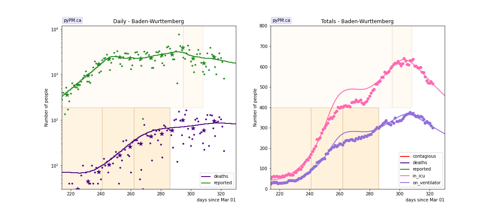

### [Bavaria](img/by_2_8_0117.pdf)

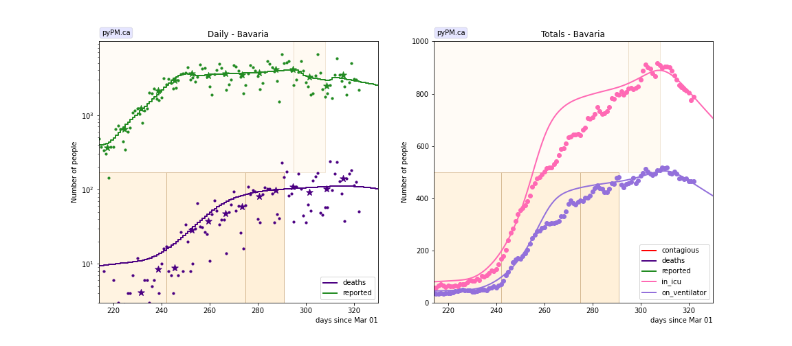

### [Berlin](img/be_2_8_0117.pdf)

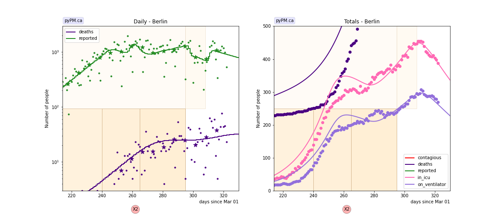

### [Brandenburg](img/bb_2_8_0117.pdf)

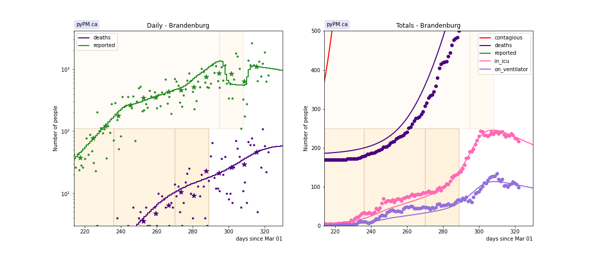

### [Bremen](img/hb_2_8_0117.pdf)

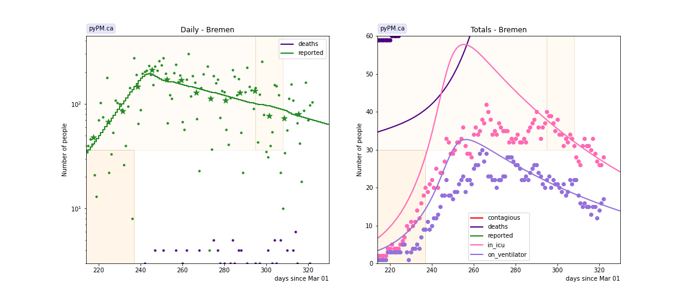

### [Hamburg](img/hh_2_8_0117.pdf)

### [Hesse](img/he_2_8_0117.pdf)

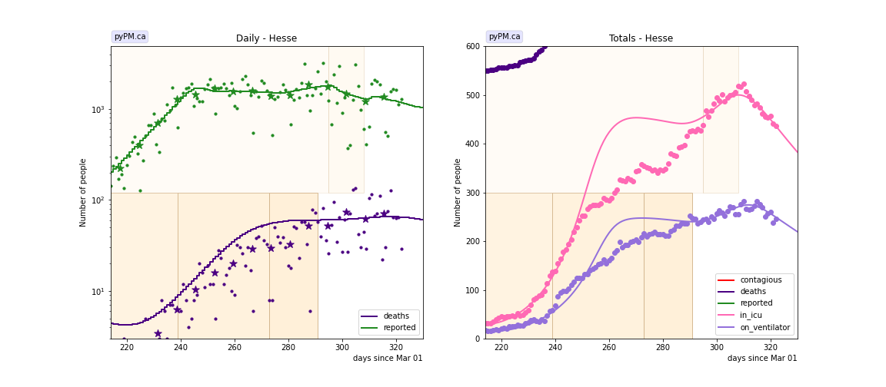

### [Lower Saxony](img/ni_2_8_0117.pdf)

### [Mecklenburg-Vorpommern](img/mv_2_8_0117.pdf)

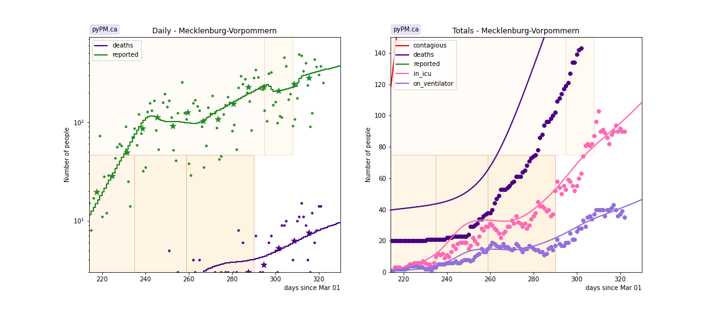

### [North Rhine-Westphalia](img/nw_2_8_0117.pdf)

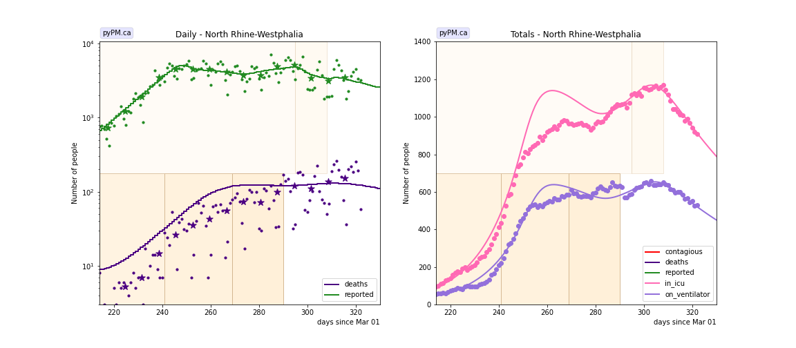

### [Rhineland-Palatinate](img/rp_2_8_0117.pdf)

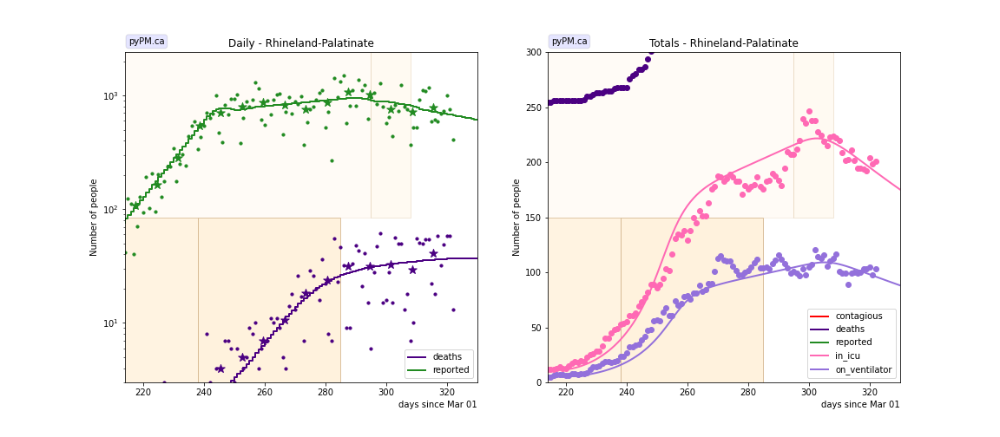

### [Saarland](img/sl_2_8_0117.pdf)

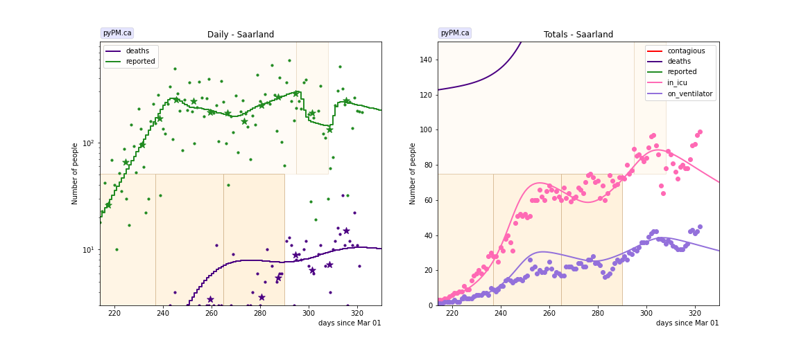

### [Saxony](img/sn_2_8_0117.pdf)

### [Saxony-Anhalt](img/st_2_8_0117.pdf)

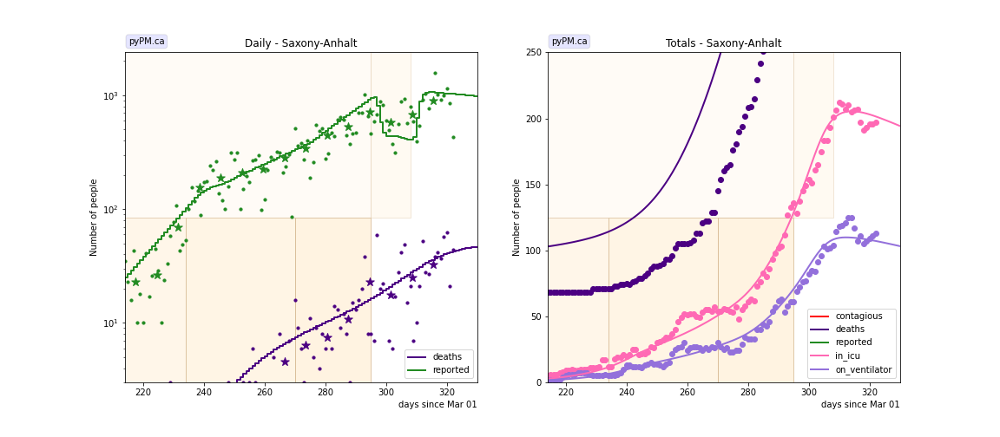

### [Schleswig-Holstein](img/sh_2_8_0117.pdf)

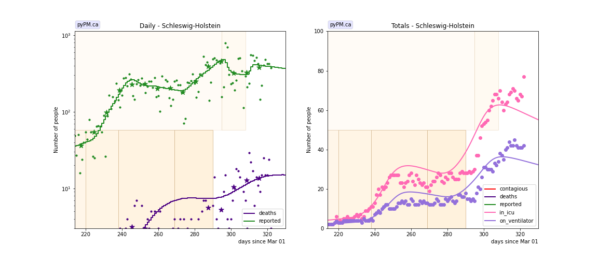

### [Thuringia](img/th_2_8_0117.pdf)

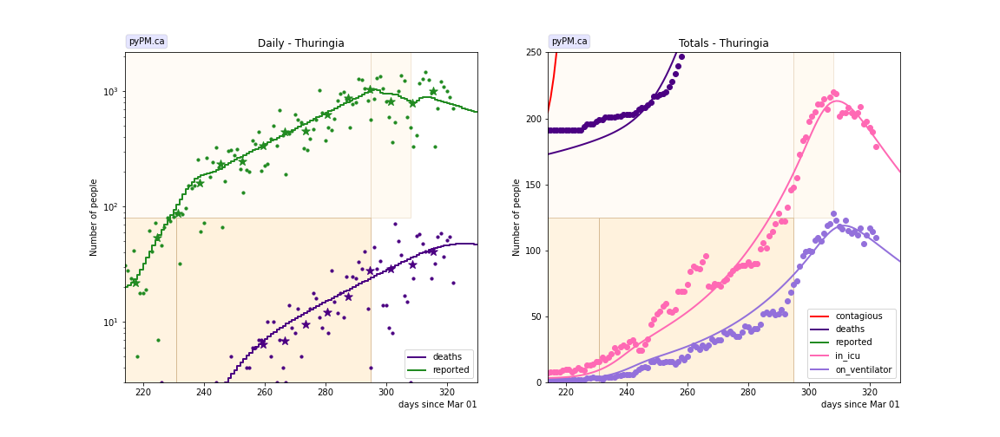

## Tables

### daily growth/decline rates (&delta;)

Shown are growth rates (% per day) since October 1, with the date of the transition. 68% confidence intervals shown.

state| &delta; | day | &delta; | day | &delta; | day | &delta;  
---|---|---|---|---|---|---
BW  | 6.7 +/-  0.2|Oct 28| 0.0 +/-  0.1|Nov 18| 1.7 +/-  0.3|Dec 12|-0.9 +/-  0.7
BY  | 7.6 +/-  0.3|Oct 29| 0.6 +/-  0.1|Dec 01| 1.1 +/-  1.2|Dec 17|-0.8 +/-  1.0
BE  | 5.4 +/-  0.3|Oct 27|-0.4 +/-  0.5|Nov 21| 1.9 +/-  0.6|Dec 21|-1.2 +/-  1.3
BB  | 7.5 +/-  0.7|Oct 23| 2.5 +/-  0.3|Nov 26| 5.4 +/-  1.2|Dec 15|-0.4 +/-  0.7
HB  | 6.6 +/-  0.6|Oct 24|-0.8 +/-  0.7
HH  | 2.9 +/-  0.4|Oct 06| 6.4 +/-  1.4|Oct 31|-1.7 +/-  0.4|Nov 27| 3.2 +/-  0.5|Dec 16|-0.5 +/-  0.5
HH_h| 2.9 +/-  0.4|Oct 06| 6.4 +/-  0.5|Oct 31|-2.0 +/-  0.2|Nov 27| 5.1 +/-  0.9|Dec 06|-0.9 +/-  1.0
HE  | 7.5 +/-  0.2|Oct 26| 0.1 +/-  0.1|Nov 29| 1.5 +/-  0.6|Dec 17|-1.1 +/-  1.4
NI  | 5.8 +/-  0.2|Nov 01|-0.8 +/-  0.2|Nov 27| 1.1 +/-  0.8
NI_h| 5.9 +/-  0.2|Nov 01|-1.0 +/-  0.2|Nov 27| 2.5 +/-  0.5|Dec 19| 0.8 +/-  0.6
MV  | 9.5 +/-  1.1|Oct 22|-0.3 +/-  0.4|Nov 15| 3.0 +/-  0.5|Dec 16| 1.6 +/-  0.4
NW  | 6.7 +/-  0.2|Oct 28|-0.5 +/-  0.1|Nov 25| 1.5 +/-  0.5|Dec 16|-1.3 +/-  0.8
RP  | 8.2 +/-  0.5|Oct 25| 0.9 +/-  0.4|Dec 11|-0.6 +/-  1.0
SL  | 9.8 +/-  1.1|Oct 24|-1.0 +/-  0.6|Nov 21| 2.5 +/-  0.4|Dec 16|-0.6 +/-  0.6
SN  | 8.1 +/-  2.1|Oct 26| 2.8 +/-  0.2|Dec 08|-0.5 +/-  0.4
ST  | 7.3 +/-  6.8|Oct 21| 3.0 +/-  0.2|Nov 26| 4.7 +/-  1.2|Dec 21| 0.1 +/-  1.1
SH  | 2.1 +/-  0.5|Oct 07| 9.9 +/-  2.0|Oct 25|-0.7 +/-  0.4|Nov 25| 4.6 +/-  0.4|Dec 16|-0.4 +/-  0.7
TH  | 11.0 +/-  0.5|Oct 18| 3.4 +/-  0.2|Dec 21|-1.2 +/-  1.8

The _h records indicate hospital/death model parameters separately, in the two cases where these were
incompatible with the case data.

### hospitalization and death parameters

Some model parameters can be estimated with these data. 68% CL intervals are shown.

state | rec. frac | icu frac | vent_frac 
---|---|---|---
BW | 0.979 +/- 0.003 | 0.012 +/- 0.002 | 0.78
BY | 0.979 +/- 0.004 | 0.013 +/- 0.005 | 0.76
BE | 0.981 +/- 0.005 | 0.021 +/- 0.008 | 0.87
BB | 0.965 +/- 0.017 | 0.012 +/- 0.006 | 0.61
HB | 0.988 +/- 0.003 | 0.020 +/- 0.005 | 0.74
HH | 0.985 +/- 0.004 | 0.013 +/- 0.005 | 0.89
HH_h | 0.975 +/- 0.004 | 0.017 +/- 0.006 | 0.89
HE | 0.972 +/- 0.009 | 0.015 +/- 0.007 | 0.82
NI | 0.988 +/- 0.002 | 0.011 +/- 0.004 | 0.68
NI_h | 0.980 +/- 0.005 | 0.011 +/- 0.004 | 0.61
MV | 0.972 +/- 0.012 | 0.019 +/- 0.005 | 0.62
NW | 0.971 +/- 0.004 | 0.016 +/- 0.002 | 0.72
RP | 0.971 +/- 0.009 | 0.014 +/- 0.008 | 0.69
SL | 0.972 +/- 0.008 | 0.018 +/- 0.004 | 0.61
SN | 0.957 +/- 0.006 | 0.014 +/- 0.005 | 0.70
ST | 0.967 +/- 0.014 | 0.013 +/- 0.005 | 0.62
SH | 0.975 +/- 0.008 | 0.008 +/- 0.003 | 0.81
TH | 0.965 +/- 0.014 | 0.012 +/- 0.005 | 0.77

 * *rec. frac*: fraction of contagious who recover (for relative comparison only)
 * *icu frac*: fraction of symptomatic who are admitted to ICU
 * *vent frac*: fraction of icu patients who are intubated

Notes:

 * The following parameter values were assumed:

   * Mean time in ICU: 14 days
   * Mean time on ventillator: 10 days

 * Changing these parameter values would affect the estimates for *icu frac*, since the current
number of patients in the ICU depends on the length of time patients stay in the ICU.

 * Also, the fraction of the infected population that were tested is not well established, which
means that the absolute fraction of contagious who die is not well known.
The *rec. frac* is therefore useful only for relative comparison only.

## Infection status

The following plots summarize the infection history.
The upper plot shows the daily growth/decline from the fit. Bands show approximate 95% CL intervals.
The lower plot shows the size of the infection: the uncorrected circulating contagious population per
million.

### [Baden-Warttemberg](img/bw-summary.pdf)

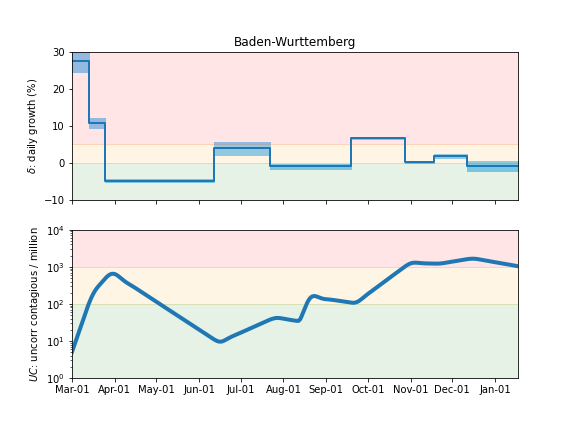

### [Bavaria](img/by-summary.pdf)

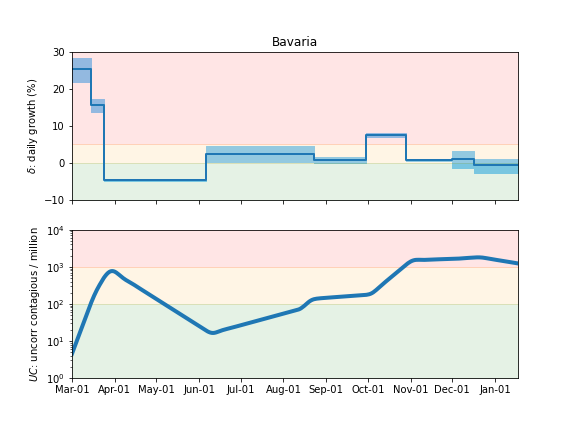

### [Berlin](img/be-summary.pdf)

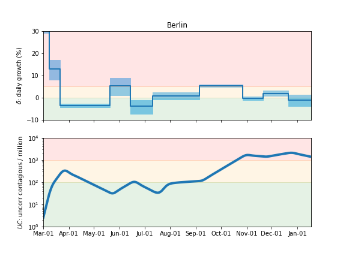

### [Brandenburg](img/bb-summary.pdf)

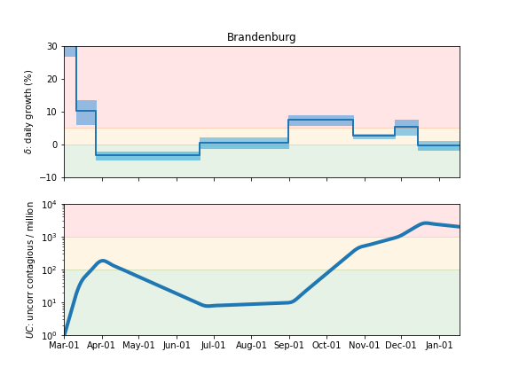

### [Bremen](img/hb-summary.pdf)

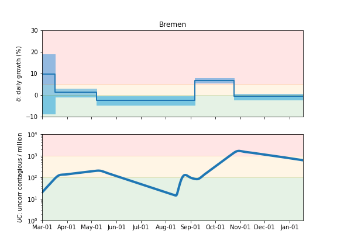

### [Hamburg](img/hh-summary.pdf)

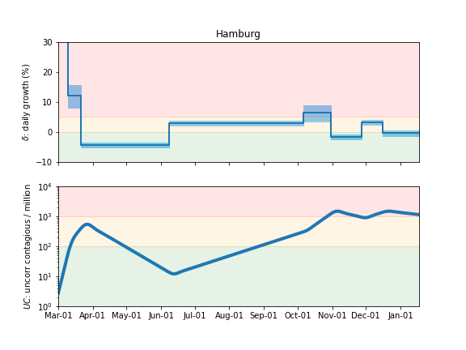

### [Hesse](img/he-summary.pdf)

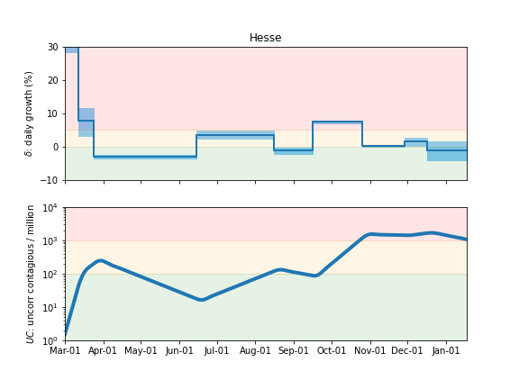

### [Lower Saxony](img/ni-summary.pdf)

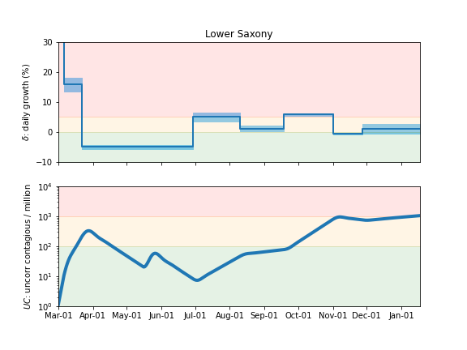

### [Mecklenburg-Vorpommern](img/mv-summary.pdf)

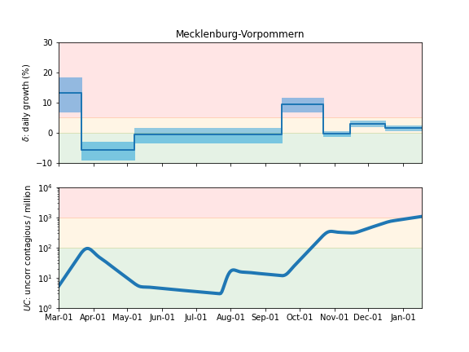

### [North Rhine-Westphalia](img/nw-summary.pdf)

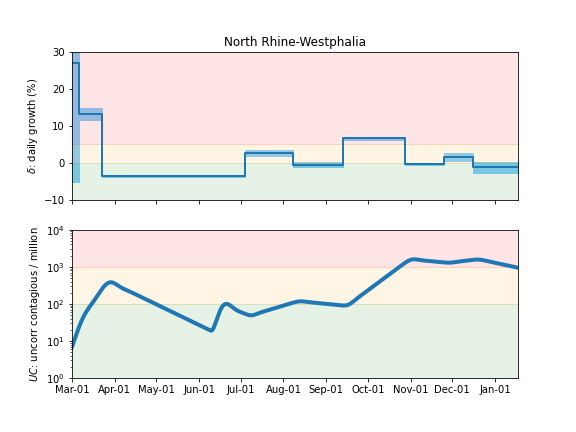

### [Rhineland-Palatinate](img/rp-summary.pdf)

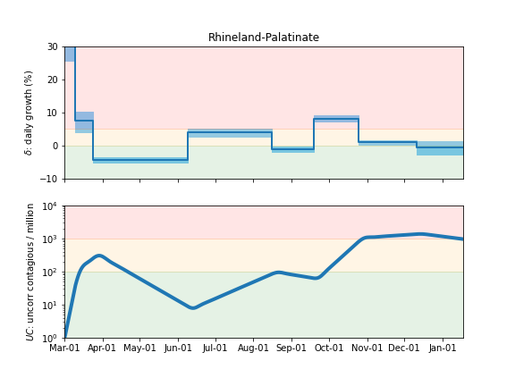

### [Saarland](img/sl-summary.pdf)

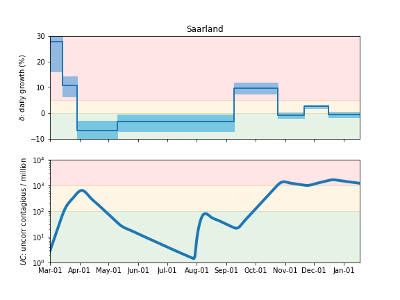

### [Saxony](img/sn-summary.pdf)

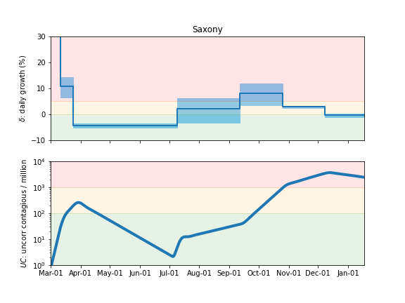

### [Saxony-Anhalt](img/st-summary.pdf)

### [Schleswig-Holstein](img/sh-summary.pdf)

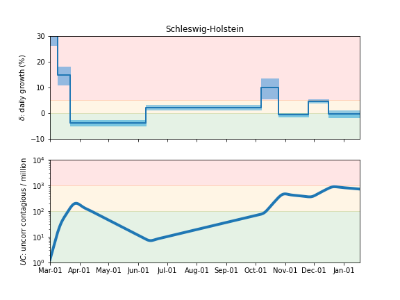

### [Thuringia](img/th-summary.pdf)

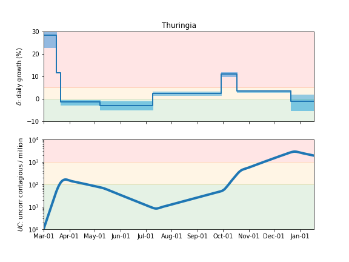

## [return to case studies](../index.md)

