## February 21, 2021 Analysis of German state data

This shows the results of fits to data from the 16 German states.
A much earlier [study](../archive/germany20200625/index.md)
is described in detail as in the paper [Charaterizing the spread of CoViD-19](../index.md),
and the more recent [study](../archive/germany20201206/index.md)
which showed results prior to Christmas period, showing interesting results for different age groups.

The figures below show the daily cases and deaths since August 2020 on a log scale.
The green and indico points show the weekly average cases and deaths.
The pypm model is fit to the case data to determine the infection trajectory.
That trajectory is itself defined by long periods of constant transmission rates,
and the vetical lines show where the transmission rate is changed in the model.
Constant transmission rate leads to steady exponential growth or decline for the infection trajectory,
which appear as straight lines on these log-scale plots.

A two week period of lower than normal case reporting rate is assumed for late December.
The reduction is a free parameter in the fits to case data.

### [Baden-Wurttemberg](img/bw_2_8_0221.pdf)

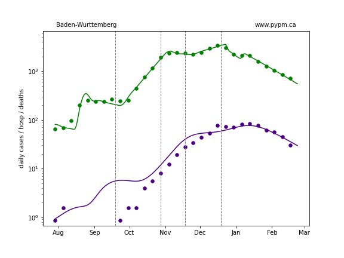

### [Bavaria](img/by_2_8_0221.pdf)

### [Berlin](img/be_2_8_0221.pdf)

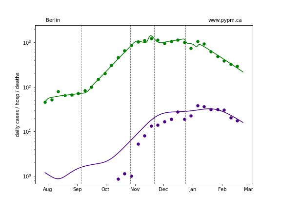

### [Brandenburg](img/bb_2_8_0221.pdf)

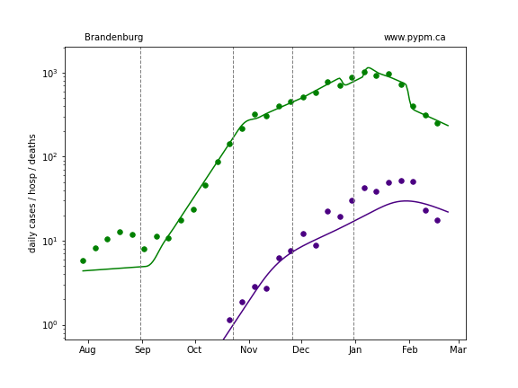

### [Bremen](img/hb_2_8_0221.pdf)

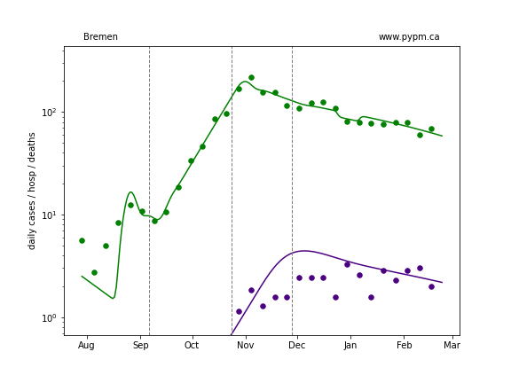

### [Hamburg](img/hh_2_8_0221_h.pdf)

### [Hesse](img/he_2_8_0221.pdf)

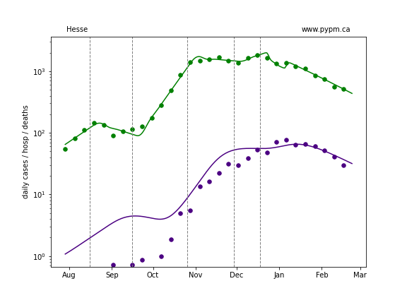

### [Lower Saxony](img/ni_2_8_0221_h.pdf)

### [Mecklenburg-Vorpommern](img/mv_2_8_0221.pdf)

### [North Rhine-Westphalia](img/nw_2_8_0221.pdf)

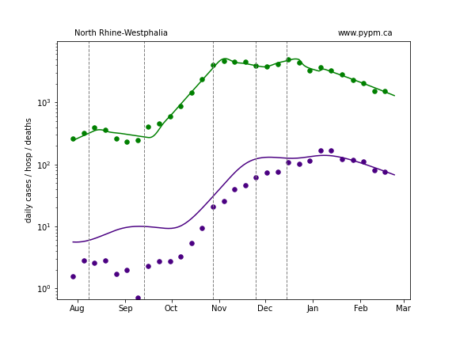

### [Rhineland-Palatinate](img/rp_2_8_0221.pdf)

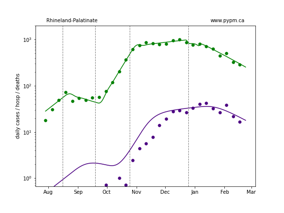

### [Saarland](img/sl_2_8_0221.pdf)

### [Saxony](img/sn_2_8_0221.pdf)

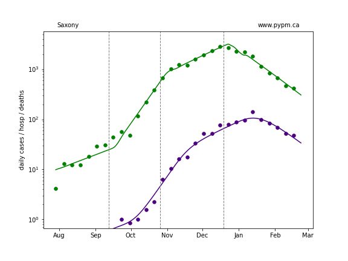

### [Saxony-Anhalt](img/st_2_8_0221.pdf)

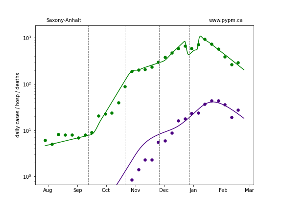

### [Schleswig-Holstein](img/sh_2_8_0221.pdf)

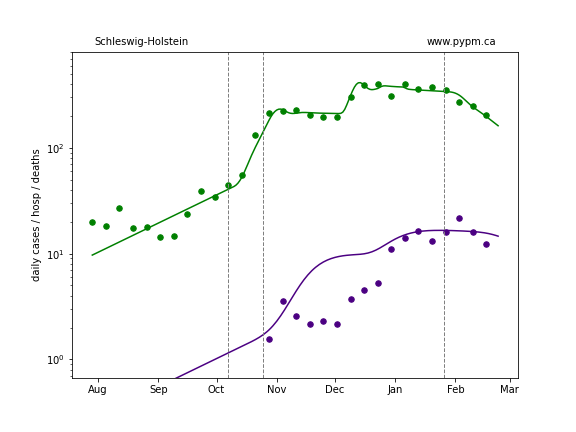

### [Thuringia](img/th_2_8_0221.pdf)

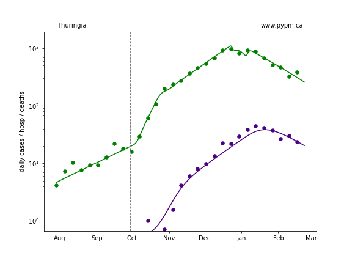

## Summary of growth rates (with and without immunity)

The following plots summarize the infection history.
The upper plot shows the daily growth/decline of infections (% per day).
The dashed curve are the growths that would have been experienced in absense of immunity.
As immunity builds up, primarily through vaccination, it will help reduce infections.

The lower plot shows an estimate of the contagious fraction of the population as a function of time.

### [Baden-Warttemberg](img/bw-growth.pdf)

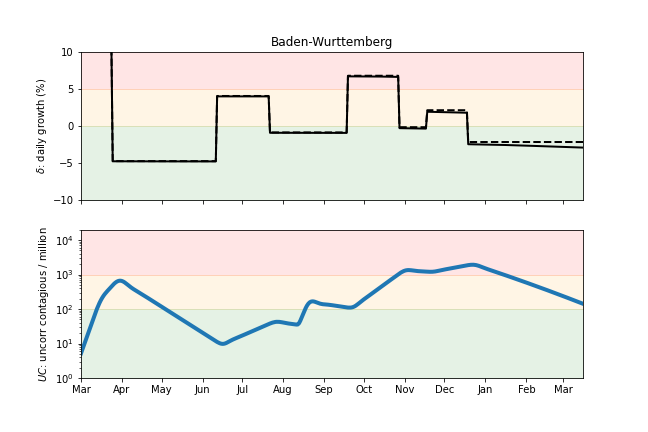

### [Bavaria](img/by-growth.pdf)

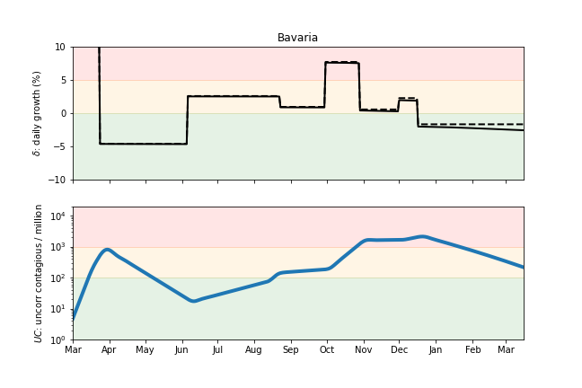

### [Berlin](img/be-growth.pdf)

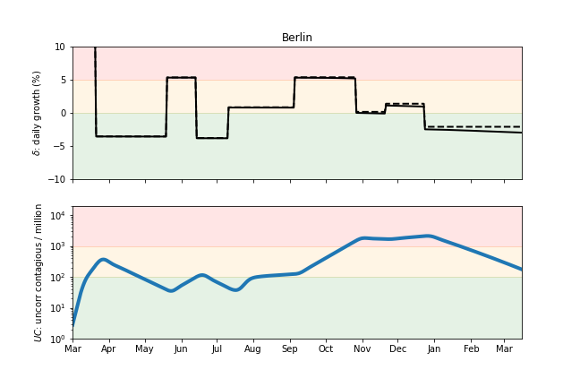

### [Brandenburg](img/bb-growth.pdf)

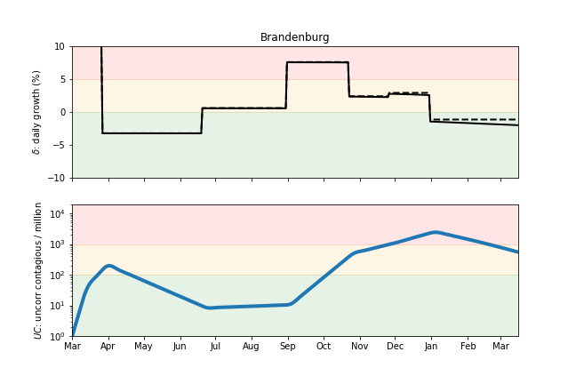

### [Bremen](img/hb-growth.pdf)

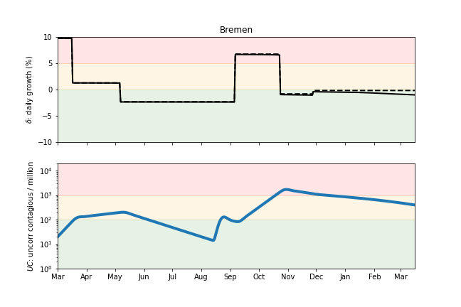

### [Hamburg](img/hh-growth.pdf)

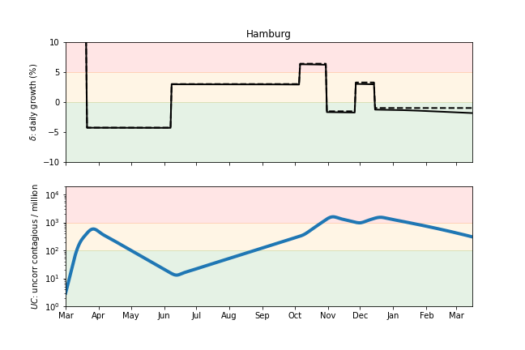

### [Hesse](img/he-growth.pdf)

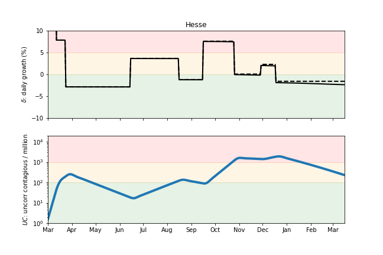

### [Lower Saxony](img/ni-growth.pdf)

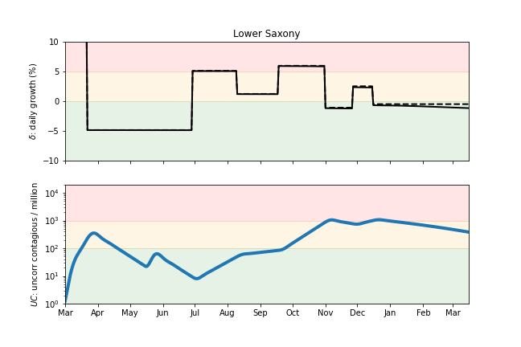

### [Mecklenburg-Vorpommern](img/mv-growth.pdf)

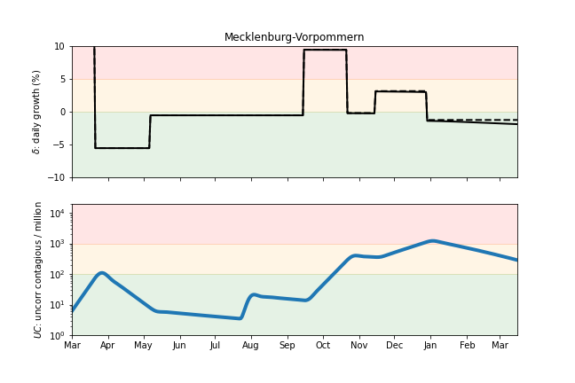

### [North Rhine-Westphalia](img/nw-growth.pdf)

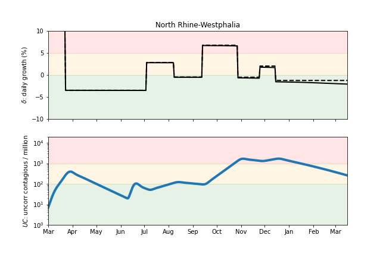

### [Rhineland-Palatinate](img/rp-growth.pdf)

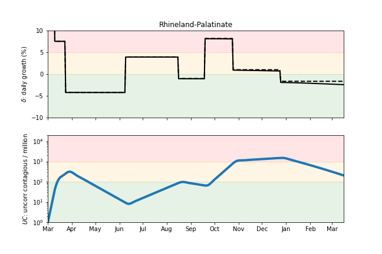

### [Saarland](img/sl-growth.pdf)

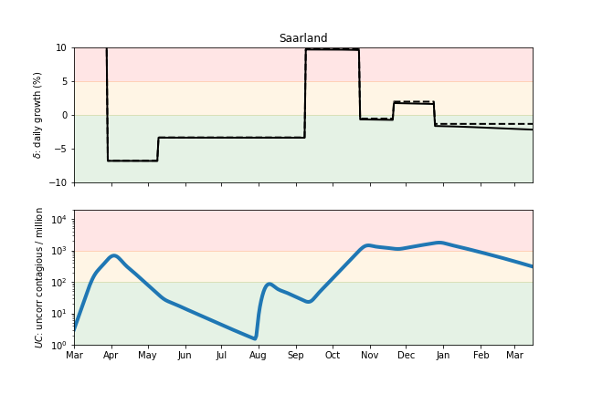

### [Saxony](img/sn-growth.pdf)

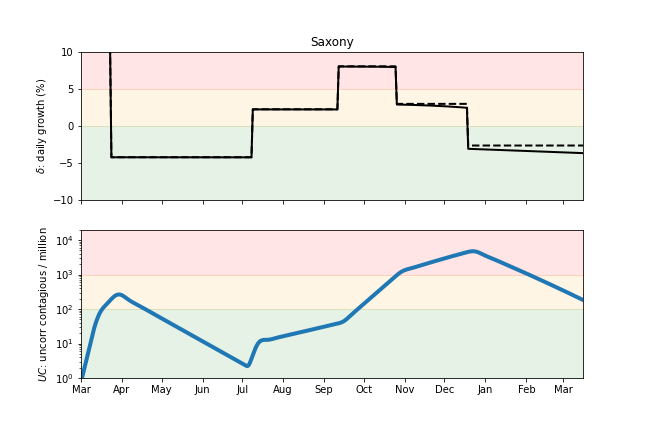

### [Saxony-Anhalt](img/st-growth.pdf)

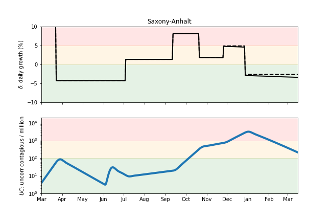

### [Schleswig-Holstein](img/sh-growth.pdf)

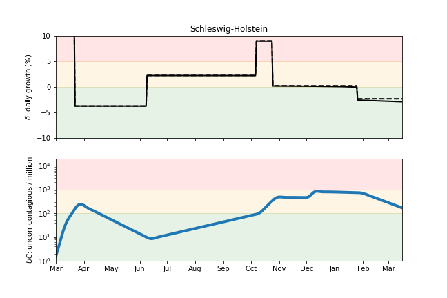

### [Thuringia](img/th-growth.pdf)

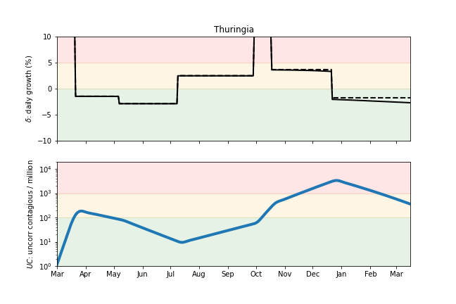

## [return to case studies](../index.md)

