## May 30, 2021 Analysis of German state data

This shows the results of fits to data from the 16 German states.
A much earlier [study](../archive/germany20200625/index.md)
is described in detail as in the paper [Charaterizing the spread of CoViD-19](../index.md),
and the more recent [study](../archive/germany20201206/index.md)
which showed results prior to Christmas period, showing interesting results for different age groups.

The figures below show the daily cases and deaths since October 2020 on linear and log scales.
The green and indico points show the weekly average cases and deaths.
The pypm model is fit to the case data to determine the infection trajectory.
That trajectory is itself defined by long periods of constant transmission rates,
and the vetical lines show where the transmission rate is changed in the model.
Constant transmission rate leads to steady exponential growth or decline for the infection trajectory,
which appear as straight lines on these log-scale plots.
Once the population gains significant immunity (primarily through vaccination) the
trajectories curve downward and no longer follow straight lines.
This effect is becomming evident in the model projections in May 2021.

A two week period of lower than normal case reporting rate is assumed for late December.
The reduction is a free parameter in the fits to case data.
A similar period occured at the beginning of April, due to Easter - this has not
yet been incorporated as a free parameter.

A second infection cycle is included to model the B.1.1.7 variant
now responsible for essentially all cases in the model.
The cases attributed to the variant are shown in olive-green below. 

A third infection cycle is introduced starting at the end of May to model the B.1.617.2 variant.
That variant has a daily growth advantage (selection coefficient) of about 0.07 +/- 0.02, as estimated
using GISAID data from several countries.
The prevalence is set at 4% at the end of May in the models for all states, and has little effect on
near term forecasts, but could be important if transmission rates increase significantly, due to
relaxation of health measures.

### [Baden-Wurttemberg](img/bw_2_9_0530.pdf)

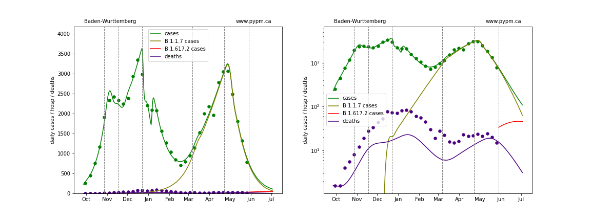

### [Bavaria](img/by_2_9_0530.pdf)

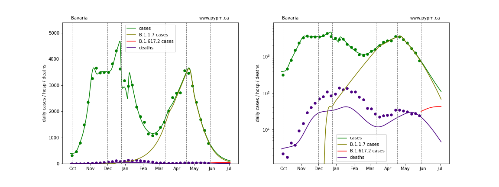

### [Berlin](img/be_2_9_0530.pdf)

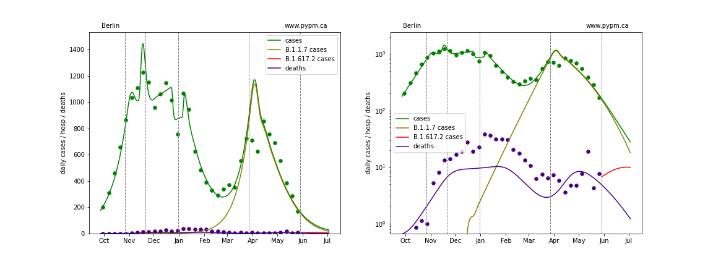

### [Brandenburg](img/bb_2_9_0530.pdf)

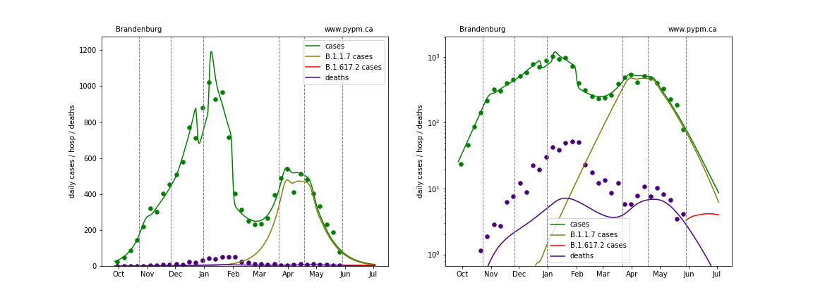

### [Bremen](img/hb_2_9_0530.pdf)

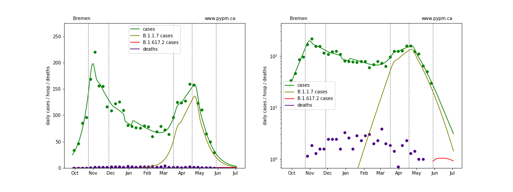

### [Hamburg](img/hh_2_9_0530.pdf)

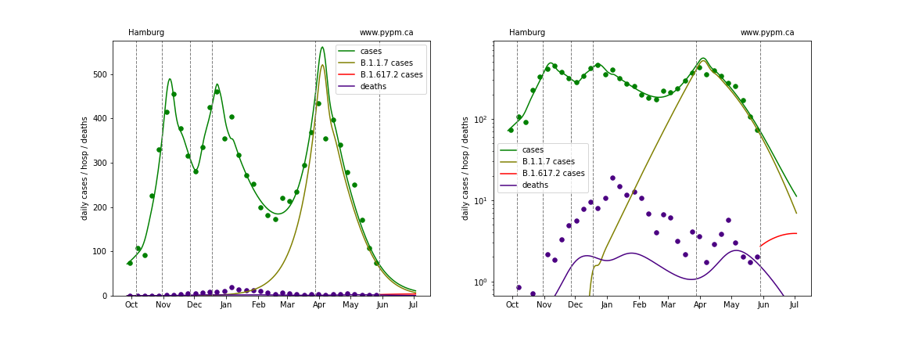

### [Hesse](img/he_2_9_0530.pdf)

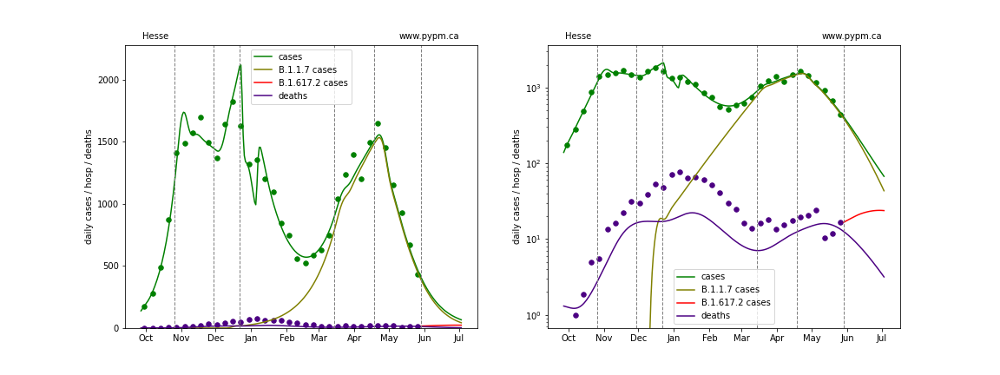

### [Lower Saxony](img/ni_2_9_0530.pdf)

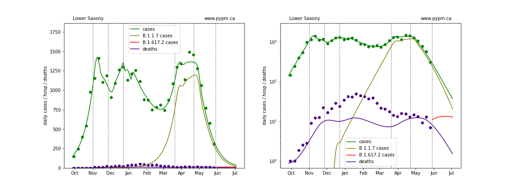

### [Mecklenburg-Vorpommern](img/mv_2_9_0530.pdf)

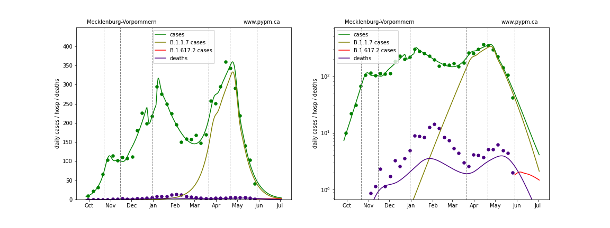

### [North Rhine-Westphalia](img/nw_2_9_0530.pdf)

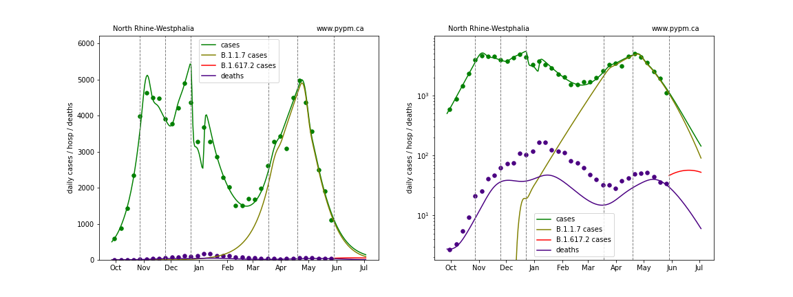

### [Rhineland-Palatinate](img/rp_2_9_0530.pdf)

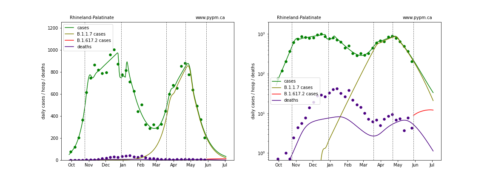

### [Saarland](img/sl_2_9_0530.pdf)

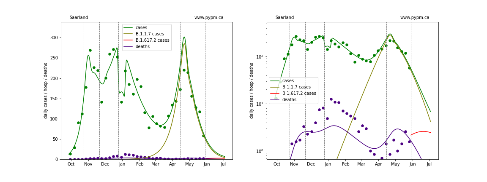

### [Saxony](img/sn_2_9_0530.pdf)

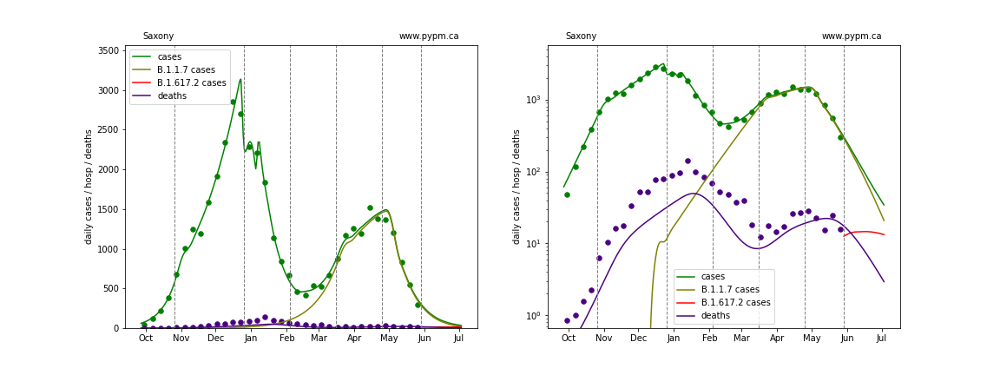

### [Saxony-Anhalt](img/st_2_9_0530.pdf)

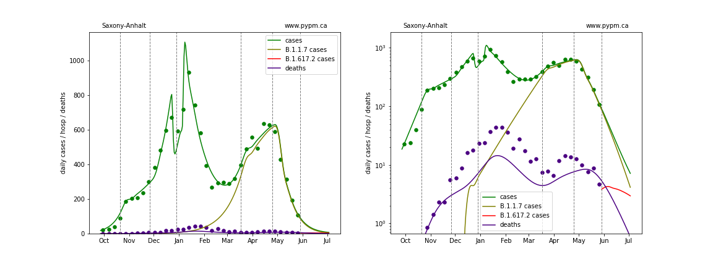

### [Schleswig-Holstein](img/sh_2_9_0530.pdf)

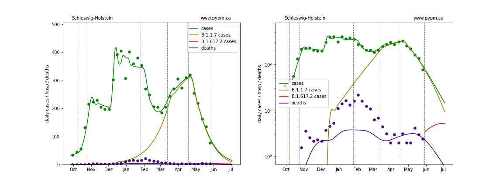

### [Thuringia](img/th_2_9_0530.pdf)

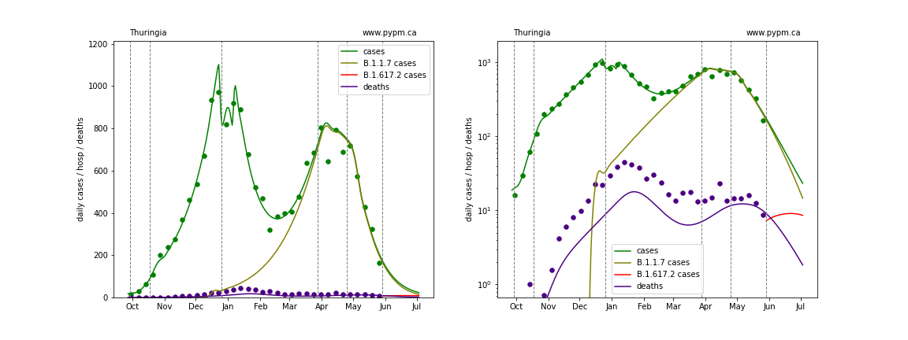

## [return to case studies](../index.md)

