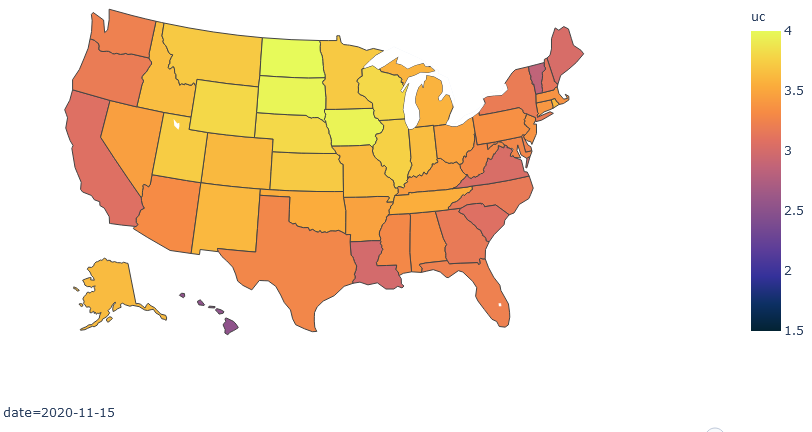

# Case studies and reports

## Reports

* Paper: [Characterizing the spread of CoViD-19](reports/Characterizing_spread.pdf), D. Karlen, July 13, 2020.
    * introduces the pypm framework and describes methods to define comparitive statistics with weak model dependence
    and estimate their uncertainties

## Case studies

Click on the titles below to see detailed results from the studies.

### April 18, 2021: [16 German states](germany20210418/index.md)

This study was prepared for inclusion in the [German forecast-hub](https://kitmetricslab.github.io/forecasthub/forecast), led
by  researchers at the Karlsruhe Institute of Technology and the Heidelberg Institute for Theoretical Studies.

Data is provided by [Robert Koch Institut](https://npgeo-corona-npgeo-de.hub.arcgis.com/datasets/dd4580c810204019a7b8eb3e0b329dd6_0)

The model fits include a second infection cycle for the B.1.1.7 variant.
Model fits to the case data appear to be consistent with variant fraction currently responsible for almost all cases.

### April 13, 2021: [BC by health region](bc20210413/index.md)

Variants of concern are responsible for the recent growth in daily cases across BC, and now the dominant strain.

### April 6, 2021: [5 provinces](prov20210406/index.md)

Model fits to data from BC, Alberta, Saskatchewan, Manitoba, Ontario and Quebec are shown.
A second infection cycle is included in the model to represent the B.1.1.7 variant.
Forecasts for the coming weeks and months are highly uncertain since
genomic screening data are not publicly available to estimate
the variant prevelance and growth advantage.

### April 18, 2021: [USA by state](usa20210418/index.md)
#### April 11, 2021: [USA by state](usa20210411/index.md) - for comparison
#### April 4, 2021: [USA by state](usa20210404/index.md) - for comparison
#### March 28, 2021: [USA by state](usa20210328/index.md) - for comparison
#### March 21, 2021: [USA by state](usa20210321/index.md) - for comparison

These show results from analyses prepared for
the [COVID-19 Forecast Hub](https://covid19forecasthub.org/), in coordination with the US CDC.

Following a period of steady decline in cases, most states now show a plateau or the start of a growth phase.

Vaccination is well underway.
Plots for each state show how natural and vaccination immunity is playing a role to bring infections down.

The analysis accounts for the rapid growth of the B117 variant, having an advantage
in growth rate of about 8% per day.
The future growth of cases in states depends on a race between vaccination and the B117 variant and
on the social distancing measures in force.
Assuming future behaviour remains the same as current behaviour, a return to growth is likely in most
states in the coming weeks.
For those states with genomic screening data, the forecasts are much better established.

Click on the above image to see a time lapse animation of how COVID-19 spread through the USA. The colors indicate the
fraction of the population in each state who are contagious. The scale is logrithmic: a difference of 1 unit
corresponds to a factor of 10 in the contagious fraction. The above still image is the snapshot for November 15.

### March 24, 2021: [BC by health region](bc20210324/index.md)

The B.1.1.7 variant is likely responsible for the recent growth in daily cases across BC.

The province does not make public the data necessary to estimate the critical parameters for B.1.1.7 in the province, so
useful forecasts cannot be provided at this time.

This study illustrates possible levels of B.1.1.7 and growth advantage, to give an indication how quickly the situation
could change.

### March 9, 2021: [BC by health region](bc20210309/index.md)

The BC government makes [available](http://www.bccdc.ca/health-info/diseases-conditions/covid-19/data)
the number of cases each day, divided into sex, age, and health region.
The data differs somewhat from that used in the Canada-wide studies, possibly due to corrections in
the dates assigned to each positive case.

In October the province saw COVID-19 growth in all regions with the strongest growth in the two Vancouver
health regons.
At the beginning of November, new restrictions came into force in Vancouver, which reduced the rate of growth.

The Fraser Health region had see declining daily cases, since mid-November, unlike the other regions
which had steady or growing case numbers.
Starting in January, cases started growing again in the Fraser HA, at about 2 % per day.
Only the Interior region is showing significant decline.

Forecasts for the next 4 weeks are provided. Comparisons of recent data
and a forecast from last month are shown.

### February 5, 2021: [Israel during vaccine deployment](https://nbviewer.jupyter.org/github/pypm/quickstart/blob/master/misc/israel_vaccination_study_20210204/israel_20210204.ipynb)

Israel currently has the highest rate of vaccinations per capita, with more than 40% of the population having received their first dose by early February.
The case and vaccination time-series data from Israel are analyzed and
amongst the older population, being nearly 90% vaccinated, the decline
in cases is consistent with expectations from vaccination immunity.

This represents the first quantitative demonstration of the herd-effect to COVID-19 at a national scale.

### November 22, 2020: [USA by state](usa_hhs_20201122/index.md)

This is a analysis that uses data on hospitalizations recently made available by the US HHS.
Prior to this analysis, hospitalization data from the Covid Tracking Project has been used.

### October 5, 2020: [California by age](california20201005/index.md)

California provides daily case, hospitalization, and death data by age group.
This provides useful data to study how to model a non-homogenous population.

### June 24, 2020: [Brazil states](brazil20200624/index.md)

An initial study of Brazil data: fitting to death data only.

## [Archive of older studies](archive/index.md)

## [return to pyPM.ca documentation home page](../..)
