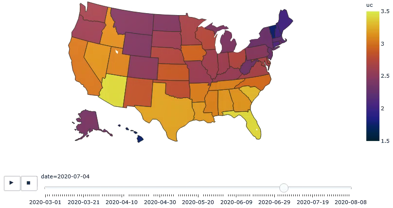

# Case studies and reports

## Reports

* Paper: [Characterizing the spread of CoViD-19](reports/Characterizing_spread.pdf), D. Karlen, July 13, 2020.
    * introduces the pypm framework and describes methods to define comparitive statistics with weak model dependence
    and estimate their uncertainties

* Presentation: [Characterizing the spread of CoViD-19](reports/pims_karlen20200622.pdf), D. Karlen, June 22, 2020.
    * presentation at the [CAIMS-PIMS Coronavirus Modelling Conference](https://www.pims.math.ca/scientific-event/200622-cpcmc)

## Case studies

Click on the titles below to see detailed results from the studies.

### September 6, 2020: [USA by state](usa20200906/index.md)

Many states have reduced growth over the past few weeks and
cases, hospitalizations and deaths are stabalizing overall.
A summary of total US cases and deaths is shown along with a forecast that assumes no change to current practice.

Click on the above image to see a time lapse animation of how COVID-19 spread through the USA. The colors indicate the
fraction of the population in each state who are contagious. The scale is logrithmic: a difference of 1 unit
corresponds to a factor of 10 in the contagious fraction. The above still image is the snapshot for July 4.

### August 24, 2020: [BC health region](bc20200824/index.md)

The BC government makes [available](http://www.bccdc.ca/health-info/diseases-conditions/covid-19/data)
the number of cases each day, divided into sex, age, and health region.
The data differs somewhat from that used in the Canada-wide studies, possibly due to corrections in
the dates assigned to each positive case. Sundays do not have zero cases in these data.

Localized outbreaks seen in Interior and Vancouver Coastal health regions. As a whole it appears that
growth is positive.
Models are fit to data broken down by age groups.

### August 16, 2020: [9 provinces](prov20200816/index.md)

This is an update of the previous provincial analysis, now using data from March 1 - August 15.

To characterize the observed case histories, it is necessary to include the following transitory
effects:
* changes to transmission rate: most notably starting in mid-March. For most provinces this is described
sufficiently by a single transition
* outbreaks: in Alberta and Saskatchewan large outbreaks have occured. These are accounted for by
injecting batches of new infections, sufficient to account for the effect observed in the case data
* reporting anomalies: Quebec released a large number of cases due to a backlog, and BC
reported a change in test reporting policy on April 21. These are accounted for by
injecting batches of additional positive test results.

The agreement between the model and the provincial case data is good, considering
the relatively small number of parameters used. Click on the link above to see the results.

### July 29, 2020: [California by age](california20200729/index.md)

California provides daily case and death data by age group.
This provides useful data
to study how to model a non-homogenous population.

### June 25, 2020: [13 German states](germany20200625/index.md)

This study was used to demonstrate the methods to characterize the spread of CoViD-19 in the paper shown at the top of this page.
Data from 13 states that reported at lease 2000 cases by the end of June 2020 were included.
This is an excellent sample for confirming the statistical treatment, since all the states were subject to the same
public health measures and testing policies.
For more information about the findings, please refer to the paper.

### June 24, 2020: [Brazil states](brazil20200624/index.md)

An initial study of Brazil data: fitting to death data only.

### Possible future studies

* Reporting noise, due to the process by which reports are collected, greatly affect the
variation seen in daily case numbers. These have strong negative correlation between neighboring
days (as missed reports and included in the subsequent day's reports).
A simple model for reporting noise is included in ``pyPM.ca``, with a single parameter.
Tests of the reporting noise model will be shown.

* Negative binomial parameter: It is common to not treat infections as independent events (which
would lead to treating the number of cases on a day as an outcome of a Poisson random variable).
Instead, it is common to use a negative binomial distribution.
The choice of the single additional parameter is studied.

* Projections for growth resulting from relaxation of social distancing. Choose some
modified transmission rates, show the expectations, and consider how much time is required to
detect changes for a given significance.

* Consider the effect of contact tracing (included in reference model 2.)

## [Archive of older studies](archive/index.md)

## [return to pyPM.ca documentation home page](../..)
