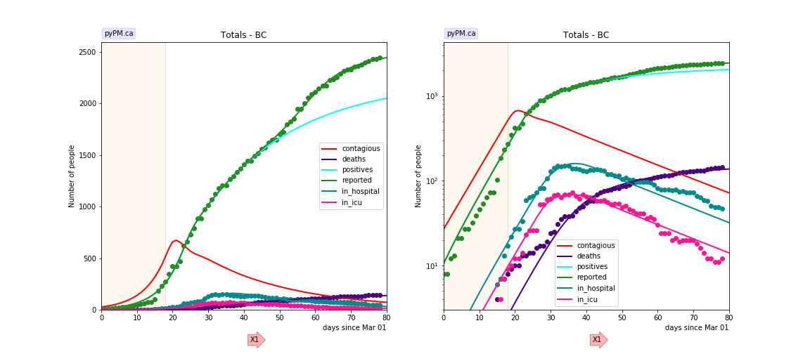
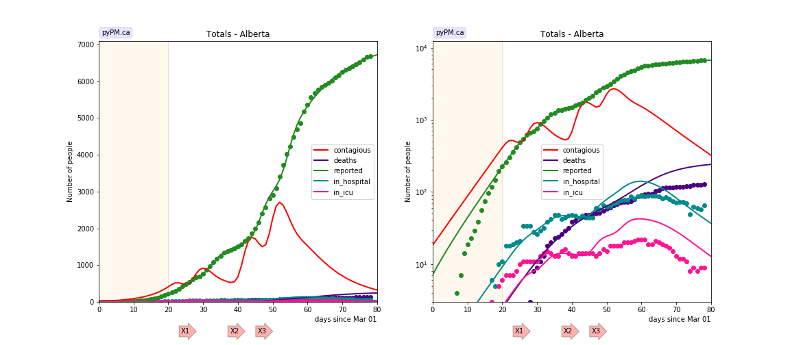
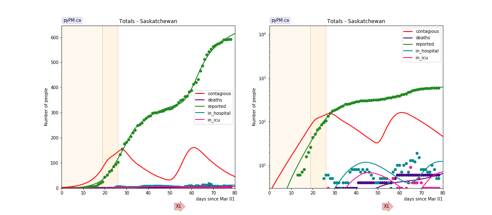
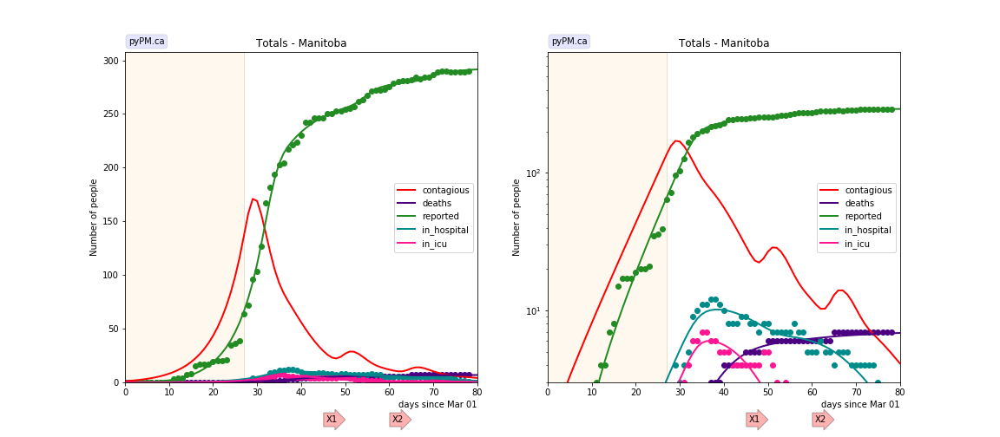
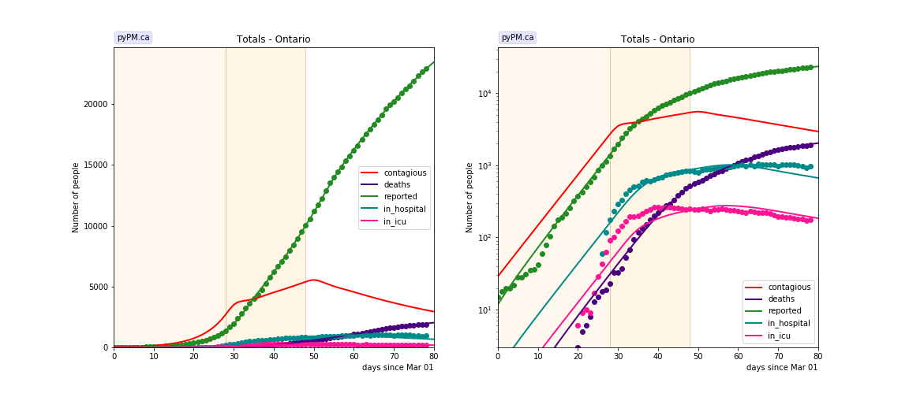
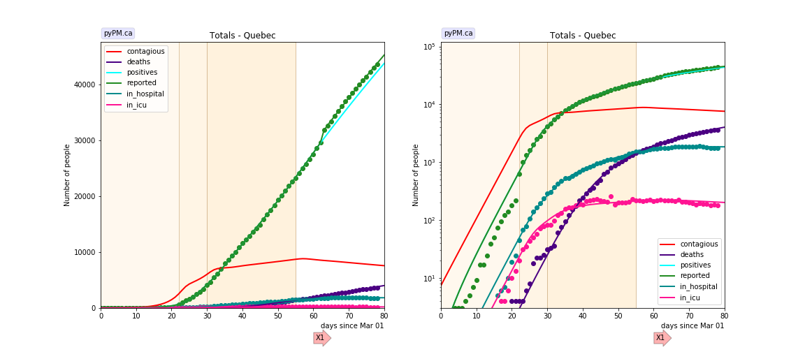
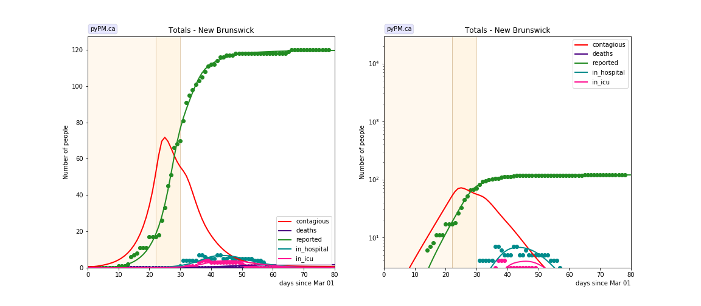
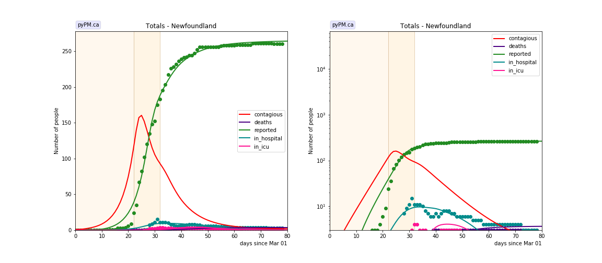
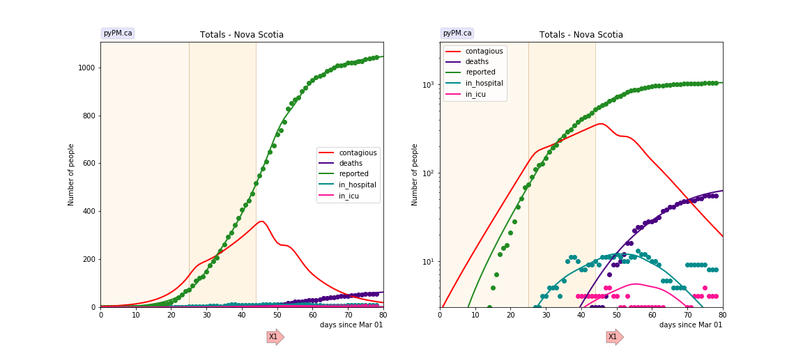

## [return to case studies](../index.md)

## May 18, 2020 Analysis of provincial data

As relaxation is getting underway, it is important to have a good fit to the
data prior to the onset of changes due to relaxation.

All provinces except PEI (which has very few cases) are fit to the reference model 2.1.
Reporting anomalies are included for BC and Quebec.

The following shows graphs followed by tables...

### BC

### Alberta

### Saskatchewan

### Manitoba

### Ontario

### Quebec

### New Brunswick

### Newfoundland

### Nova Scotia

## Tables

### Reproduction numbers

prov|cont_0 | R_0 | t_1 | R_1 | t2 | R_2 | t3 | R_3
---|---|---|---|---|---|---|---|---
bc|26.8|2.80|18|0.73
ab|18.3|2.67|20|0.51
sk|2.3|3.02|19|1.45|26|0.50
mb|1.1|2.79|27|0.29
on|28.9|2.78|28|1.18|48|0.84
qc|7.3|4.64|22|1.66|30|1.07|55|0.95
nb|0.6|3.44|22|0.67|30|0.20
nl|1.0|3.66|22|0.48|32|0.34
ns|2.6|2.59|25|1.34|44|0.40

* cont_0: size of contagious population on March 1, 2020
* reproduction values, R_i, for different periods, separated by the times t_i (days)
* for refence model 2, R = 6.58 * alpha. (Scale factor found empirically)

### hospitalization

prov|f_n | d_n | f_i | d_i | f_d | d_d 
---|---|---|---|---|---|---
bcc|0.12|11.25|0.07|7.39|0.05|18.50
ab|0.04|4.38|0.01|3.36|0.03|14.66
mb|0.02|3.74|0.03|3.39|0.02|12.77
on|0.11|5.43|0.03|3.00|0.07|16.32
qc|0.05|5.66|0.01|0.00|0.09|20.63
ns|0.02|0.00|0.01|7.00|0.05|24.09

* f_n: fraction of symptomatic getting non-icu hospitalization
* d_n: mean days after symptoms entering hospital
* f_i: fraction of symptomatic getting icu hospitalization
* d_i: mean days after symptoms entering icu
* f_d: fraction of contagious that die
* d_d: mean days between becoming contagious and death 