## September 11, 2020 Analysis of provincial data

All provinces except PEI (which has very few cases) are fit to the reference model 2.3.
Reporting anomalies are included for BC and Quebec.

The following shows graphs followed by tables.
To download a pdf version of a plot, click on the title.
The models and data used to produce these
are available through the [ipypm](../../ipypm) user interface.

### [BC](img/bcc_2_3_0911.pdf)

The data is consistent with a single transition in the transmission rate and about 300 cases
added in late April. The anomalous cases are seen in all health regions and are
due to a change in test/reporting policy.

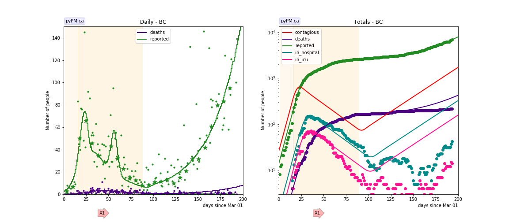

### [Alberta](img/ab_2_3_0911.pdf)

The data is consistent with one change in transmission rate in mid March and 3 separate
large outbreaks. These have been reported in the media to be due to meat packing plants.
The data is consistent with each outbreaks taking place over a very short period of time.
Only two parameters are used to characterize each outbreak: date and number of infections.
The shapes of the case (and contagious populations) are outcomes of the other model parameters
which were not tuned.

The hospitalization and death rates from these outbreaks appear to be smaller than the
cases from March.

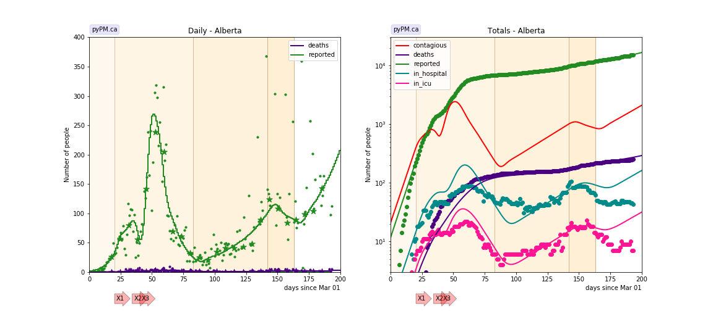

### [Saskatchewan](img/sk_2_3_0911.pdf)

The data is consistent with two transitions in transmission rates, three outbreaks
(the first two from far northern communities).
The data suggests that the first outbreak took place over a period of about 10 days.
The second outbreak seen in the previous study (../archive/prov20200620) is confirmed.

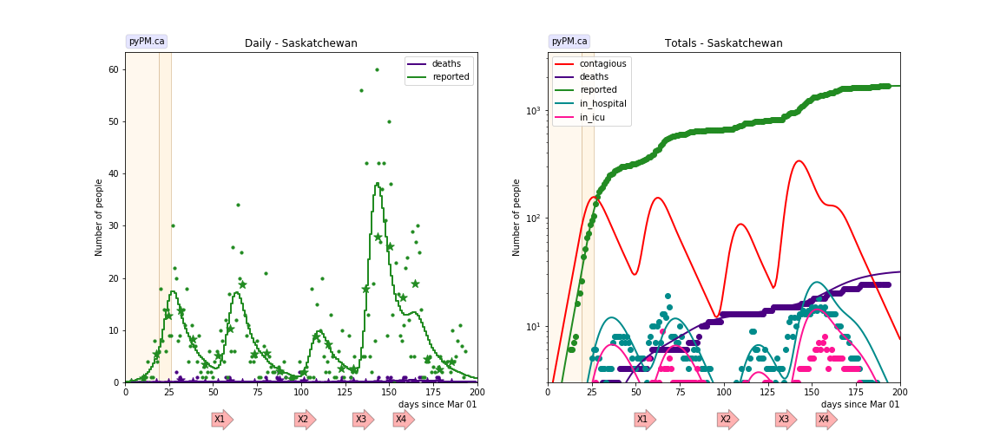

### [Manitoba](img/mb_2_3_0911.pdf)

The data is consistent with one change to the transmission rate.
Small deviations from exponential decline seen - used a reporting anomaly and an outbreak as
examples.

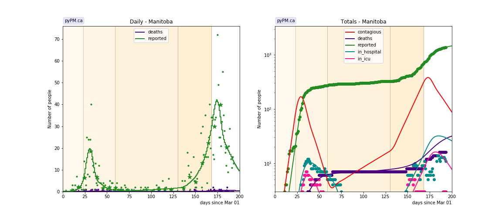

### [Ontario](img/on_2_3_0911.pdf)

The data is consistent with 2 changes in tranmission rate. A third transition is added for May 19
to measure the new transmission rate.

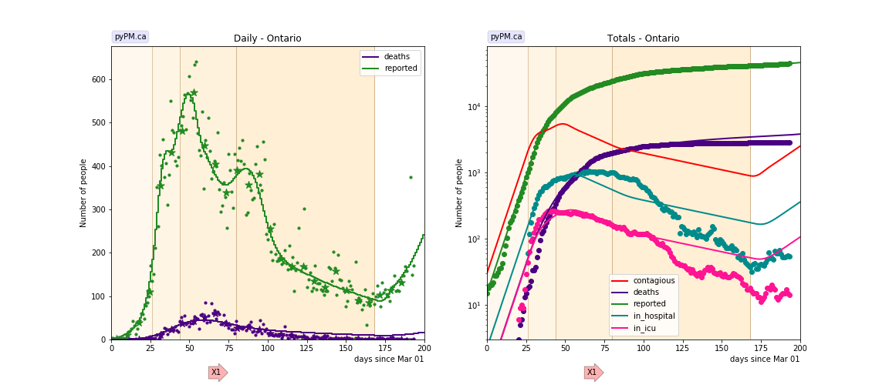

### [Quebec](img/qc_2_3_0911.pdf)

Six changes in transmission rate are necessary to fit the data.
A large backlog of case reports were released on May 3.
A significant reduction in transmission in May.
The best fit for the transition date is May 18.
A fifth transition in transmission rate was added and
the growth parameter has increased significantly.

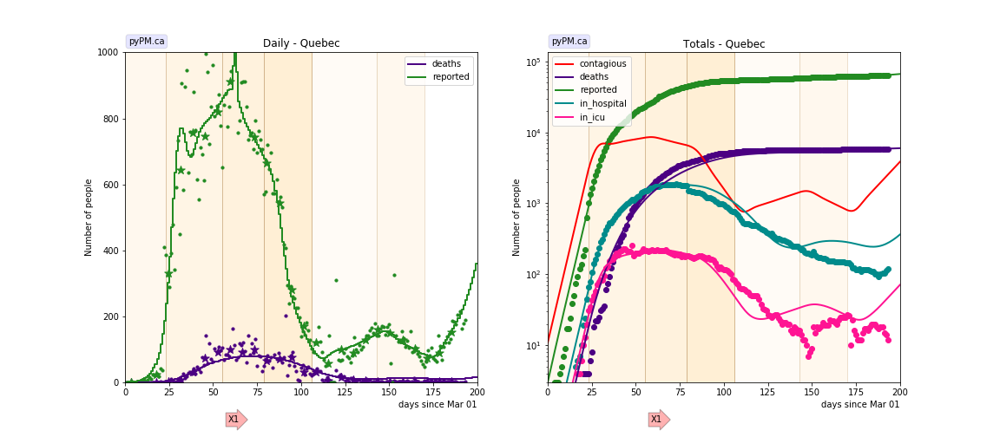

### [New Brunswick](img/nb_2_3_0911.pdf)

The data is consistent with two changes in transmission rates and
outbreaks in late May (in Campbellton region).

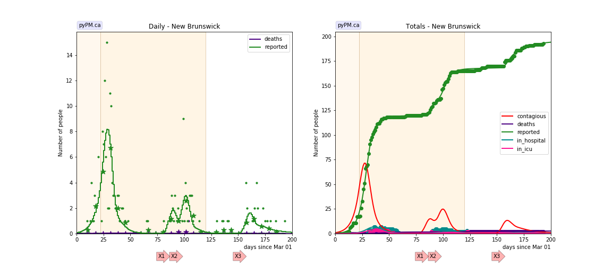

### [Newfoundland](img/nl_2_3_0911.pdf)

The data is consistent with one change in transmission rate.

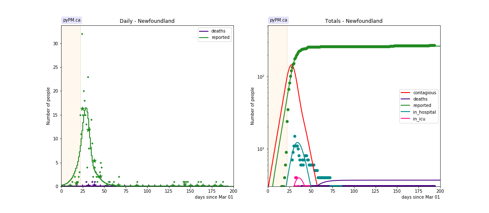

### [Nova Scotia](img/ns_2_3_0911.pdf)

The data is consistent with two changes in transmission rates.

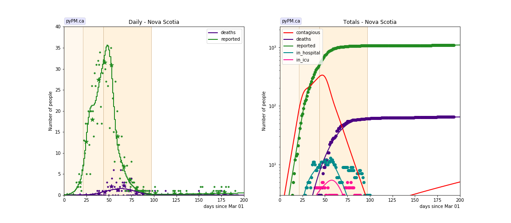

## Tables

The tables below are results from the fits to reference model 2.3.

### Daily fractional growth rates (&delta;)

prov| &delta;0 | day 1 | &delta;1 | day 2 | &delta;2 | day 3 | &delta;3 | day 4 | &delta;4 | day 5 | &delta;5 
---|---|---|---|---|---|---|---|---|---|---|---
bcc|19.5 +/- 4.3|16|-4.5 +/- 0.7|88|2.5 +/- 1.5
bc*|10.6 +/- 1.1|18|-2.4 +/- 0.8|92|2.6 +/- 0.8
ab|15.8 +/- 1.4|20|-6.9 +/- 0.5|83|3.2 +/- 0.8|142|-1.3 +/- 0.7|163|3.0 +/- 1.7
sk|22.5 +/- 2.9|19|-1.8 +/- 10.0|26|-7.4 +/- 1.5
mb|20.6 +/- 2.5|24|-10.5 +/- 2.8|59|2.3 +/- 2.0|130|8.5 +/- 1.2|168|-5.0 +/- 2.4
on|17.6 +/- 1.0|26|2.8 +/- 0.5|44|-2.1 +/- 0.5|80|-0.9 +/- 0.3|168|3.8 +/- 0.8
qc|27.4 +/- 0.8|23|1.2 +/- 0.2|55|-1.1 +/- 0.2|79|-7.1 +/- 0.5|106|2.1 +/- 0.5|143|-2.4 +/- 0.4|170|6.5 +/- 1.3
ns|23.0 +/- 1.0|21|3.7 +/- 2.0|44|-9.1 +/- 3.1|97|0.8 +/- 1.8

* bcc: fit results using data from daily reporting (no weekend reports, no corrections)
* bc*: fit results using data from corrected reports (see BC provincial study here)
* &delta;0: initial daily fractional growth parameter (in percent)
* day 1: days after March 1, 2020 for first transmission rate changed
* &delta;1: daily fractional growth parameter after day 1 (in percent)

## Infection status

The following plots summarize the infection history.
The upper plot shows the daily growth/decline from the fit. Bands show approximate 95% CL intervals.
The lower plot shows the size of the infection: the uncorrected circulating contagious population per
million.
Only regions with sufficient statistics to properly analyze uncertainty in &delta; are shown.

### [BC](img/bcc-summary.pdf)

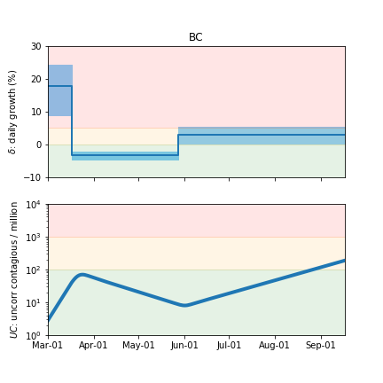

### [Alberta](img/ab-summary.pdf)

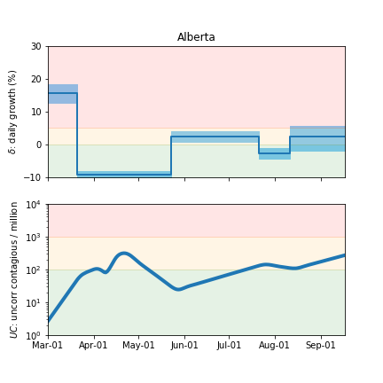

### [Saskatchewan](img/sk-summary.pdf)

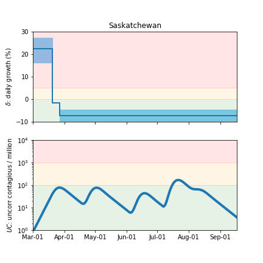

### [Manitoba](img/mb-summary.pdf)

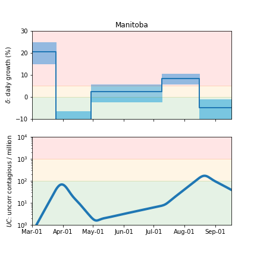

### [Ontario](img/on-summary.pdf)

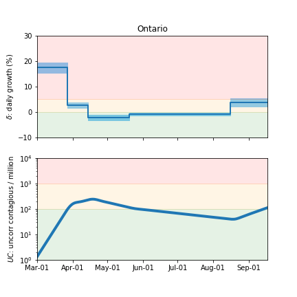

### [Quebec](img/qc-summary.pdf)

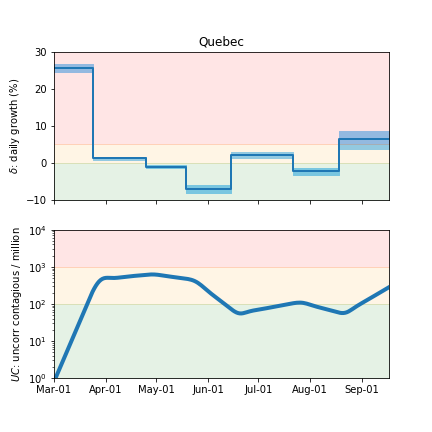

### [Nova Scotia](img/ns-summary.pdf)

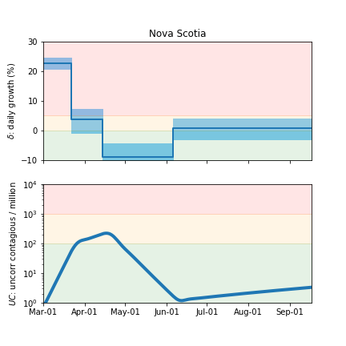

## [return to case studies](../index.md)

