## October 4, 2020 Analysis of provincial data

All provinces except PEI (which has very few cases) are fit to the reference model 2.3.
Reporting anomalies are included for BC and Quebec.

The following shows graphs followed by tables.
To download a pdf version of a plot, click on the title.
The models and data used to produce these
are available through the [ipypm](../../ipypm) user interface.

### [BC](img/bcc_2_3_1004.pdf)

A model with two transitions in the transmission rate. Growth has continued for the past
several months at about 2.5% per day.
Daily case counts are at the highest level of the epidemic.
Contact tracing in recent months may be resulting in a larger fraction of infected individuals being tested.

About 300 cases are added in late April: Theses anomalous cases are seen in all health regions and are
due to a change in test/reporting policy.

Note that this data are from the uncorrected weekday reports.
A better analysis [here](../bc20200929) uses corrected data (including Saturday and Sunday numbers) and shows
the breakdowns by health region and age groups.
That data more clearly shows localized outbreaks in some of the regions and age groups, and those outbreaks are
included in the models used to fit that data.

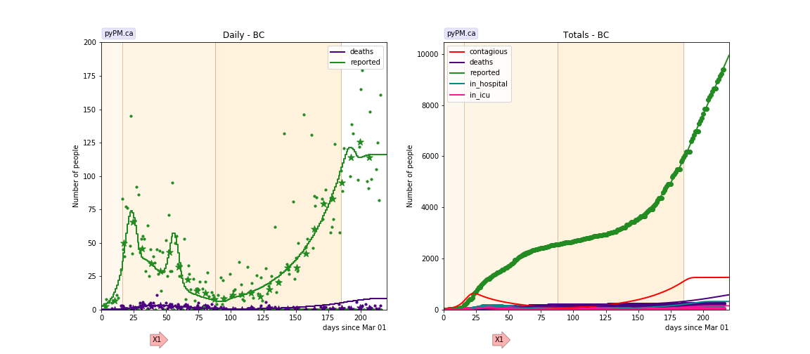

### [Alberta](img/ab_2_3_1004.pdf)

The data is fit with a model that includes 3 outbreaks in March/April (meat packing plants).
Only two parameters are used to characterize each outbreak: date and number of infections.

consistent with one change in transmission rate in mid March and 3 separate
large outbreaks. These have been reported in the media to be due to meat packing plants.
The data is consistent with each outbreaks taking place over a very short period of time.
The growth and decline in June/July is modelled by transitions in transmission rates.
The current growth rate is estimated to be about 3% per day.

The growth/decline trends in hospitalization show transitions that follow somewhat the rises
and falls predicted by the model (hospitalization parameters not adjusted).

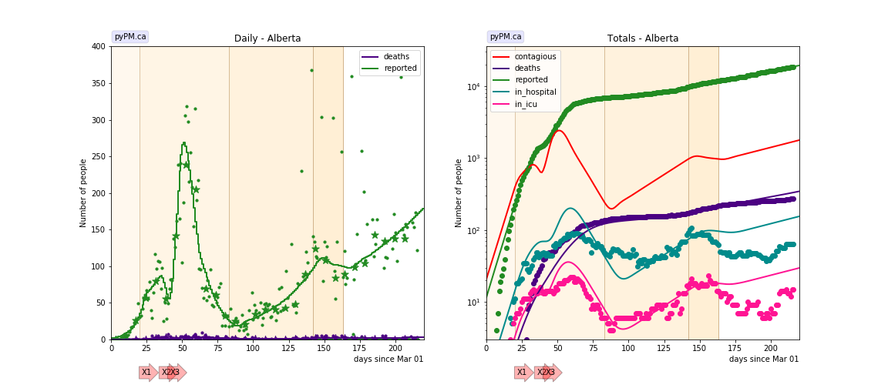

### [Saskatchewan](img/sk_2_3_1004.pdf)

Following initial rapid growth in mid-March and decline after lockdown measures,
there have been several outbreaks (some of these being in the far northern communities).
Peaks in hospitalization occur at roughly the expected times from the model (no adjustment of hospitalization parameters).
Throughout the period the general community transmission rate appears was low, until last few weeks where it has increased.

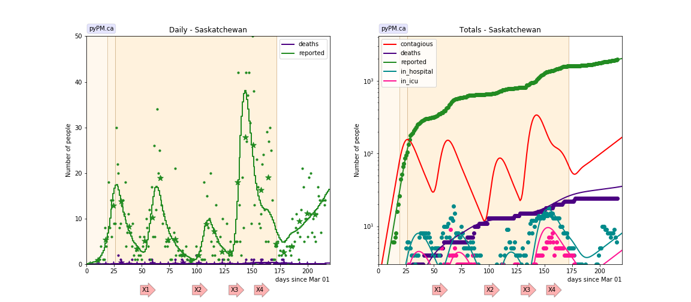

### [Manitoba](img/mb_2_3_1004.pdf)

Following initial rapid growth in mid-March and decline after lockdown measures,
community transmission appears to have remained low, until July.
The daily case rates grew in July at 5+/3 % per day, followed by decline in August and an outbreak in September.

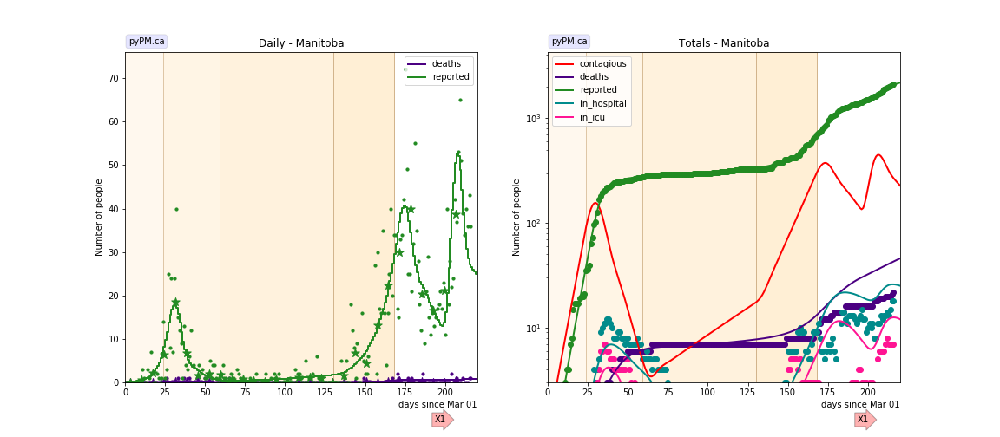

### [Ontario](img/on_2_3_1004.pdf)

Community transmission declined enough by mid April to allow the infection rate to decline.
A reporting anomaly is added to the model for the broad bump in daily cases in May.
Transmission increased again starting in mid-August,
leading to growth in infections of about 5% per day.

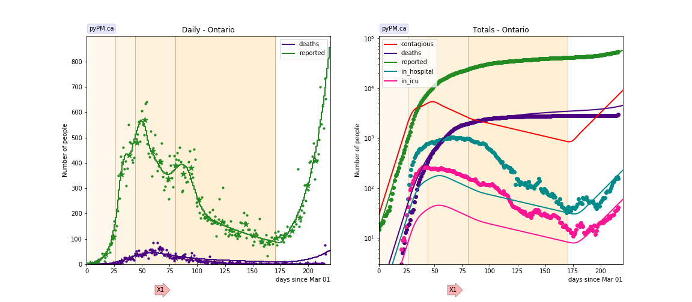

### [Quebec](img/qc_2_3_1004.pdf)

Six changes in transmission rate are necessary to fit the data.
A large backlog of case reports were released on May 3.
A significant reduction in transmission was seen starting on May 18.
Growth followed by decline was seen mid-June through mid-August.
Just as in Ontario, transmission starting in mid-August has led to growth in infections, but at 7% per day.

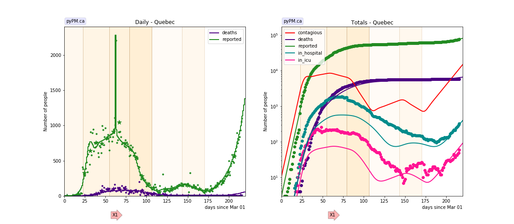

### [New Brunswick](img/nb_2_3_1004.pdf)

The data is consistent with two changes in transmission rates and
outbreaks in late May (in Campbellton region) and August (Moncton/Fredricton).

### [Newfoundland](img/nl_2_3_1004.pdf)

The data is consistent with one change in transmission rate.

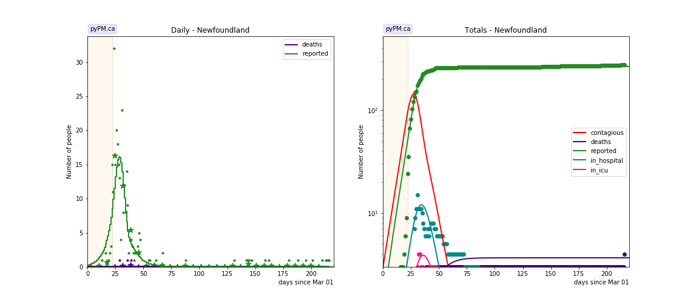

### [Nova Scotia](img/ns_2_3_1004.pdf)

The data is consistent with three changes in transmission rates.

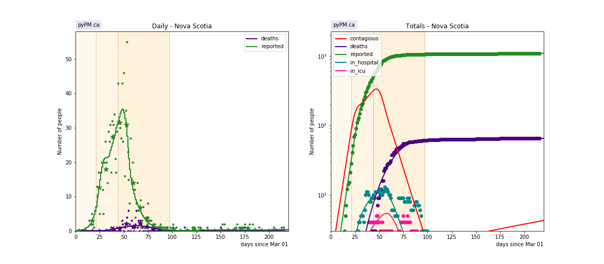

## Tables

The tables below are results from the fits to reference model 2.3.

### Daily fractional growth rates (&delta;)

prov| &delta;0 | day 1 | &delta;1 | day 2 | &delta;2 | day 3 | &delta;3 | day 4 | &delta;4 | day 5 | &delta;5 | day 6 | &delta;6 
---|---|---|---|---|---|---|---|---|---|---|---
bcc|19.5 +/- 4.3|16|-4.6 +/- 0.9|88|2.5 +/- 0.4|185|-0.9 +/- 2.1
ab|15.8 +/- 1.4|20|-6.7 +/- 0.4|83|3.0 +/- 0.2|142|-0.4 +/- 0.9|163|1.3 +/- 0.3
sk|22.5 +/- 2.9|19|-1.5 +/- 7.1|26|-7.5 +/- 1.5|172|2.8 +/- 1.0
mb|20.6 +/- 2.1|24|-10.7 +/- 2.7|59|2.4 +/- 2.1|130|8.2 +/- 0.9|168|-4.2 +/- 1.3
on|17.6 +/- 1.0|26|2.7 +/- 0.2|44|-2.1 +/- 0.3|80|-1.0 +/- 0.2|170|5.3 +/- 0.2
qc|27.4 +/- 0.8|23|1.2 +/- 0.1|55|-1.1 +/- 0.2|79|-7.1 +/- 0.2|106|2.2 +/- 0.3|143|-2.8 +/- 0.2|170|6.9 +/- 0.2
ns|23.0 +/- 1.0|21|3.7 +/- 2.4|44|-9.0 +/- 2.8|97|0.5 +/- 1.2

* bcc: fit results using data from daily reporting (no weekend reports, no corrections)
* &delta;0: initial daily fractional growth parameter (in percent)
* day 1: days after March 1, 2020 for first transmission rate changed
* &delta;1: daily fractional growth parameter after day 1 (in percent)

## Infection status

The following plots summarize the infection history.
The upper plot shows the daily growth/decline from the fit. Bands show approximate 95% CL intervals.
The lower plot shows the size of the infection: the uncorrected circulating contagious population per
million.
Only regions with sufficient statistics to properly analyze uncertainty in &delta; are shown.

### [BC](img/bcc-summary.pdf)

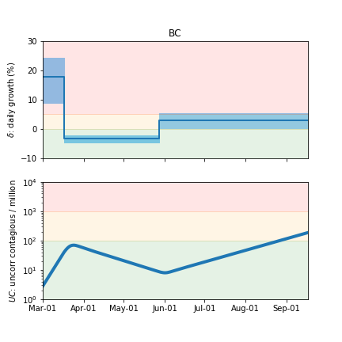

### [Alberta](img/ab-summary.pdf)

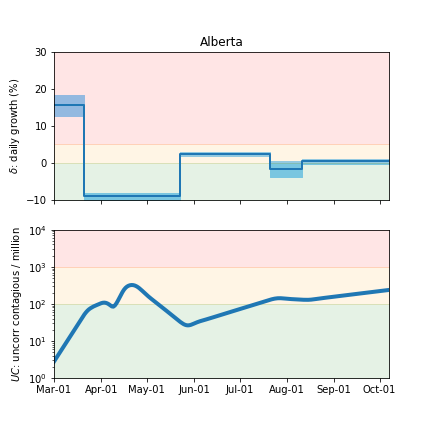

### [Saskatchewan](img/sk-summary.pdf)

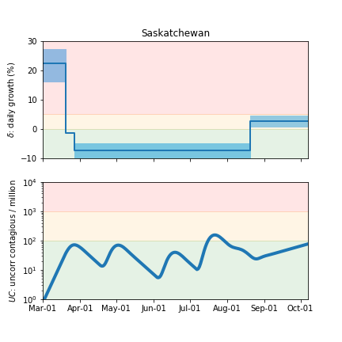

### [Manitoba](img/mb-summary.pdf)

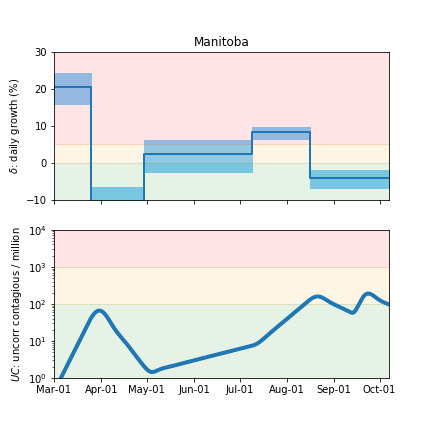

### [Ontario](img/on-summary.pdf)

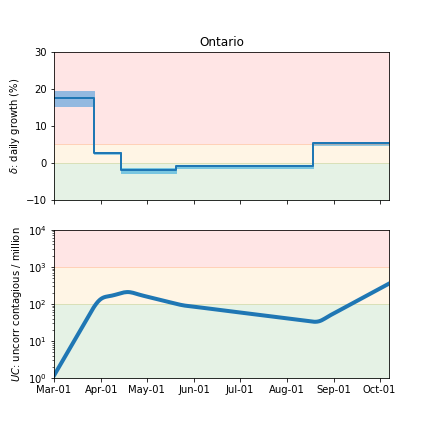

### [Quebec](img/qc-summary.pdf)

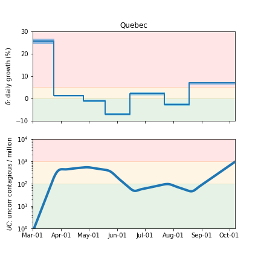

### [Nova Scotia](img/ns-summary.pdf)

## [return to case studies](../index.md)

