## December 10, 2020 Analysis of Canadian provincial data

All provinces except PEI (which has very few cases) are fit to the reference model 2.6.

The following shows graphs followed by tables.
To download a pdf version of a plot, click on the title.
The models and data used to produce these
are available through the [ipypm](../../ipypm) user interface.

Most plots start on August 1 and run through mid-December.

### [BC](img/bcc_2_6_1210.pdf)

The trajectory in BC appears to have improved recently, requiring accurate recent data.
A better analysis [here](../bc20201209) uses corrected data (including Saturday and Sunday numbers) and shows
the breakdowns by health region.

[bc](img/bcc_2_6_1210.png)

### [Alberta](img/ab_2_6_1210.pdf)

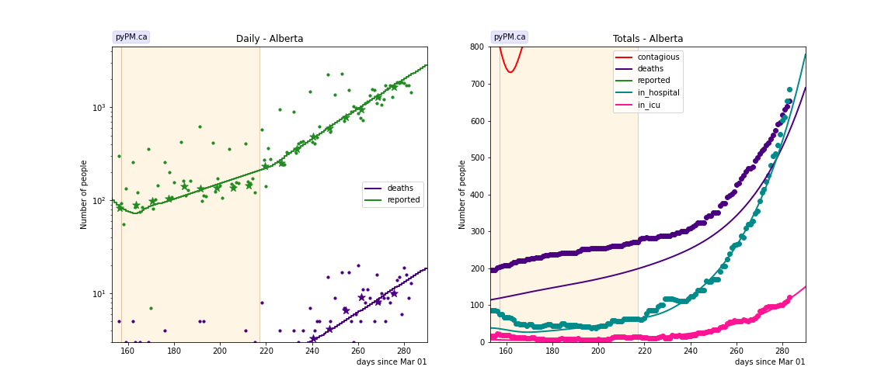

### [Saskatchewan](img/sk_2_6_1210.pdf)

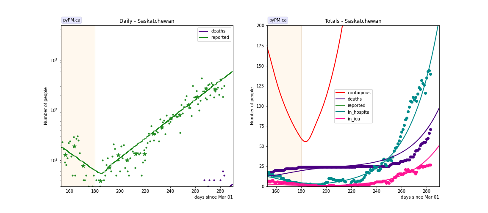

### [Manitoba](img/mb_2_6_1210.pdf)

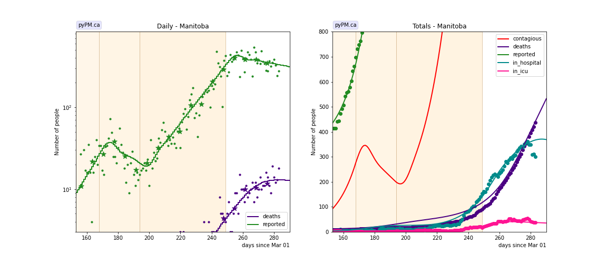

### [Ontario](img/on_2_6_1210.pdf)

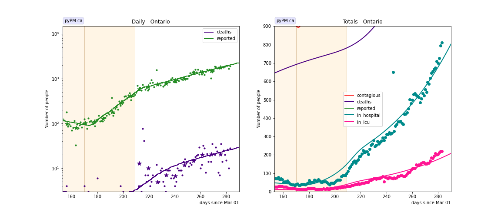

### [Quebec](img/qc_2_6_1210.pdf)

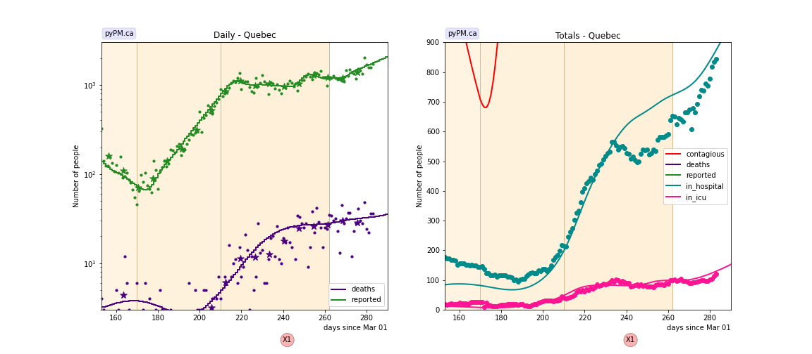

### [New Brunswick](img/nb_2_6_1210.pdf)

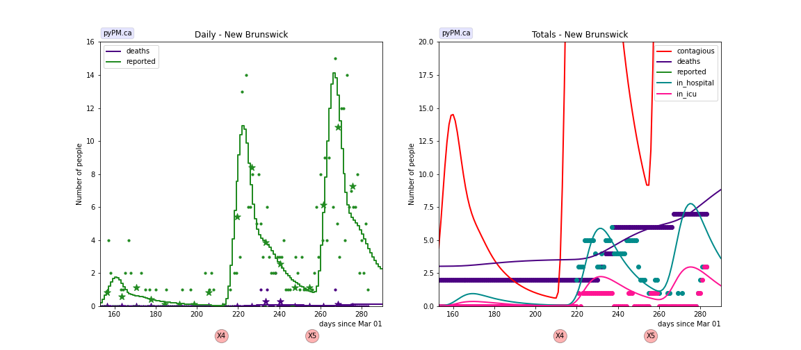

### [Newfoundland](img/nl_2_6_1210.pdf)

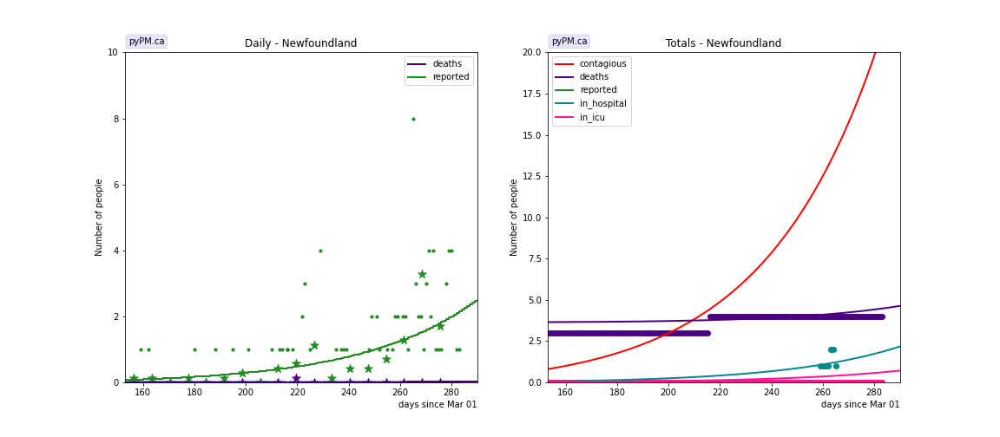

### [Nova Scotia](img/ns_2_6_1210.pdf)

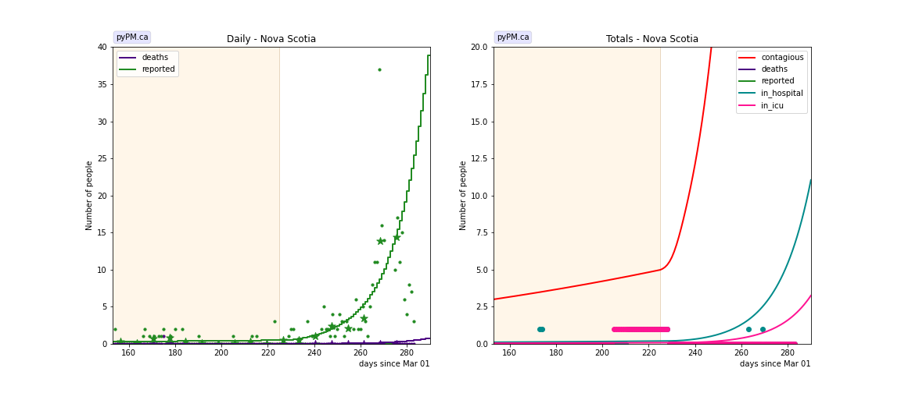

## Tables

The tables below are results from the fits to reference model 2.6.

### Recent growth rates (&delta; : percent per day)

prov| &delta; | day | &delta; | day | &delta; | day | &delta;  
---|---|---|---|---|---|---
bcc| 2.3 +/-  0.2|Sep 02|-0.2 +/-  0.2|Oct 11| 4.8 +/-  0.2|Nov 12|-0.2 +/-  0.9
ab| 3.5 +/-  0.3|Jul 21|-3.5 +/-  0.7|Aug 05| 2.0 +/-  0.2|Oct 04| 4.0 +/-  0.1
sk|-3.6 +/-  0.8|Aug 28| 4.6 +/-  0.2
mb| 2.4 +/-  0.4|Jul 09| 7.6 +/-  0.6|Aug 16|-2.4 +/-  0.7|Sep 11| 5.8 +/-  0.2|Nov 05|-0.4 +/-  0.9
on|-1.0 +/-  0.2|Aug 18| 5.0 +/-  0.2|Sep 26| 1.9 +/-  0.1
qc| 2.3 +/-  0.2|Jul 22|-3.1 +/-  0.5|Aug 18| 7.2 +/-  0.1|Sep 27|-0.0 +/-  0.1|Nov 18| 2.8 +/-  1.2
ns| 0.6 +/-  0.8|Oct 12| 7.4 +/-  1.8

* bcc: fit results using data from daily reporting (no weekend reports, no corrections)
* &delta; : daily fractional growth parameter (in percent)
* day: day of transition to new transmission rate

## Infection status

The following plots summarize the infection history.
The upper plot shows the daily growth/decline from the fit. Bands show approximate 95% CL intervals.
The lower plot shows the size of the infection: the uncorrected circulating contagious population per
million.
Only regions with sufficient statistics to properly analyze uncertainty in &delta; are shown.

### [BC](img/bcc-summary.pdf)

### [Alberta](img/ab-summary.pdf)

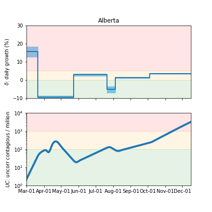

### [Saskatchewan](img/sk-summary.pdf)

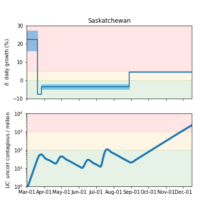

### [Manitoba](img/mb-summary.pdf)

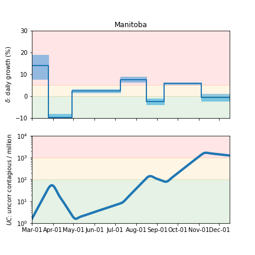

### [Ontario](img/on-summary.pdf)

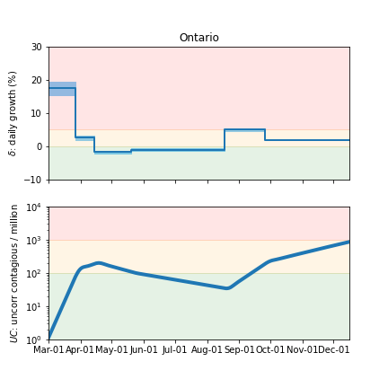

### [Quebec](img/qc-summary.pdf)

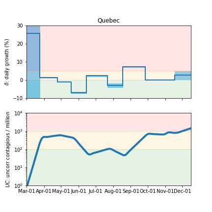

### [Nova Scotia](img/ns-summary.pdf)

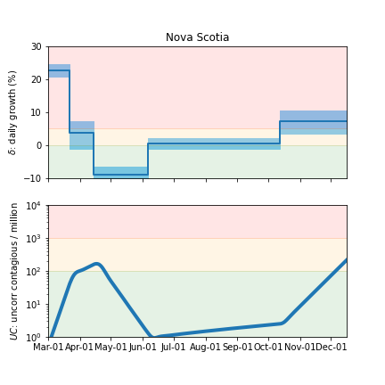

## Forecasts

The following plots show the forecasts for weekly cases and deaths. The shaded regions show the 50%, 80%, and 95% CL intervals.

### [BC](img/bc-forecast.pdf)

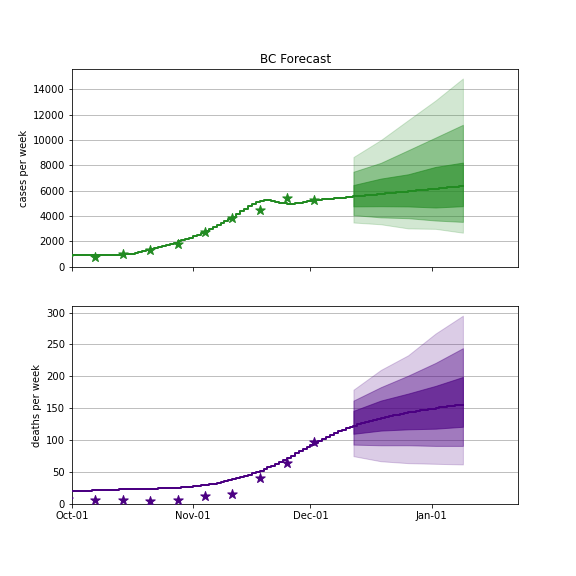

### [Alberta](img/ab-forecast.pdf)

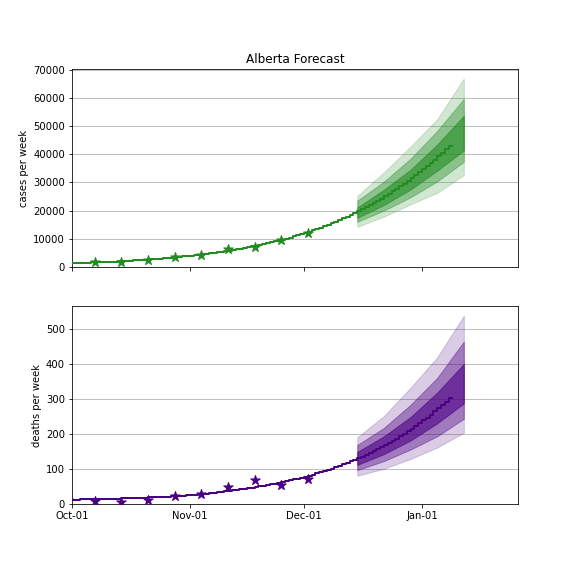

### [Saskatchewan](img/sk-forecast.pdf)

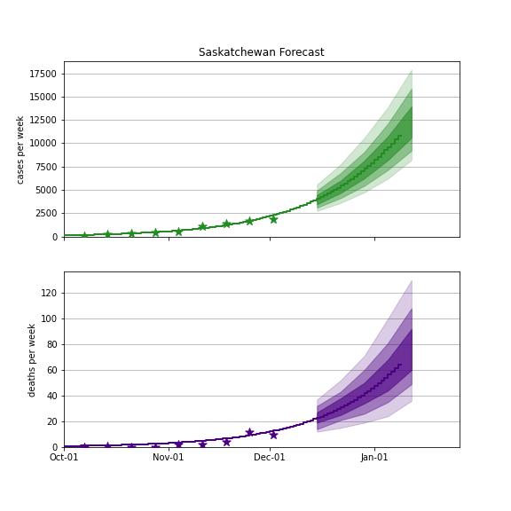

### [Manitoba](img/mb-forecast.pdf)

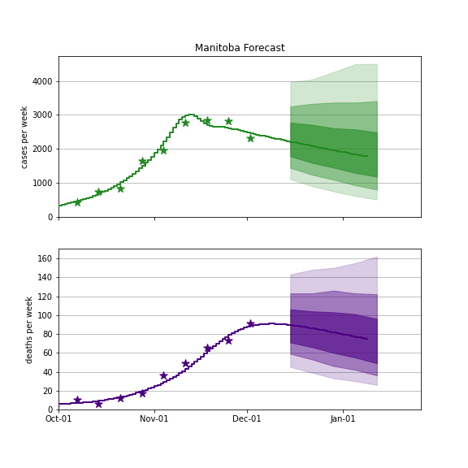

### [Ontario](img/on-forecast.pdf)

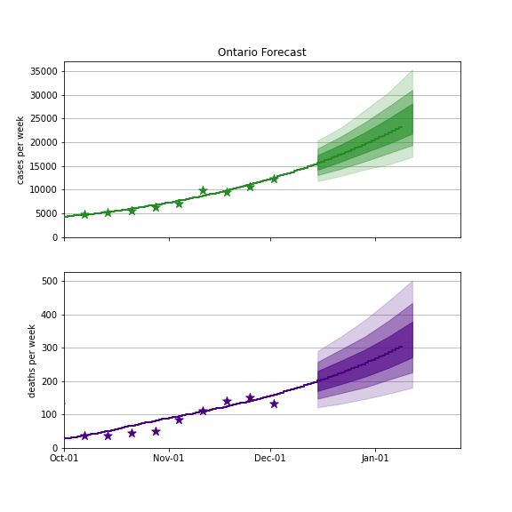

### [Quebec](img/qc-forecast.pdf)

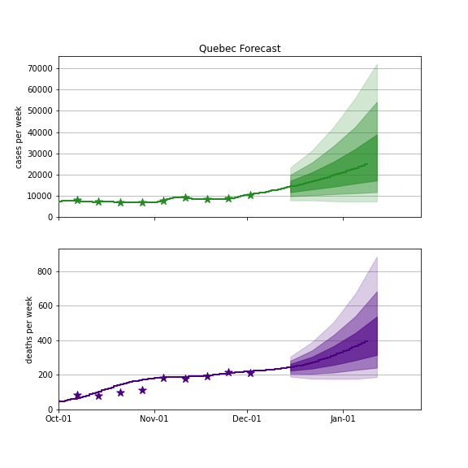

## [return to case studies](../index.md)

