## December 24, 2020 Analysis of Canadian provincial data

All provinces except PEI (which has very few cases) are fit to the reference model 2.6.
The plots show the trajectory of the epidemic since September 1.
The plots on the left show the daily case numbers (green points) and deaths (purple points) along with
the weekly averages (stars) on a log scale.
The plots on the right show the number of people in hospital on a linear scale.

The trajectory of hospitalization in Alberta continues to grow, while the daily cases have started to diminish.
Death rate forecasts use the infection trajectory estimated with hospitalization data for Alberta, BC, and Ontario.

Forecasts for the coming month are provided, assuming no general change in behaviour.
Ontario will bring in additional measures into force on Dec 26, which may substantially change the trajectory.
The shaded regions show the 50%, 80%, and 95% CL intervals.

### [BC](img/bcc_2_6_1224.pdf)

The trajectory in BC has improved recently.
A better analysis [here](../bc20201224) uses corrected data (including Saturday and Sunday numbers) and shows
the breakdowns by health region.

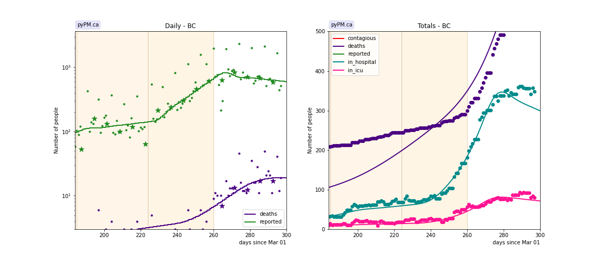

### [Alberta](img/ab_2_6_1224.pdf)

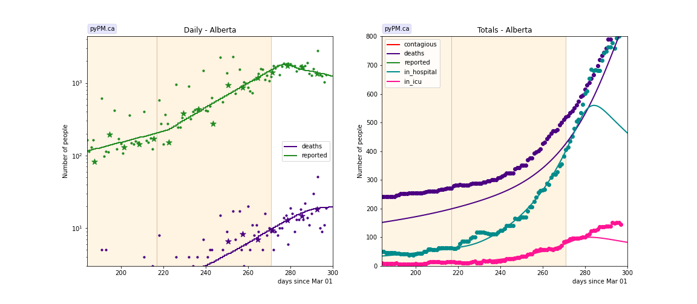

### [Saskatchewan](img/sk_2_6_1224.pdf)

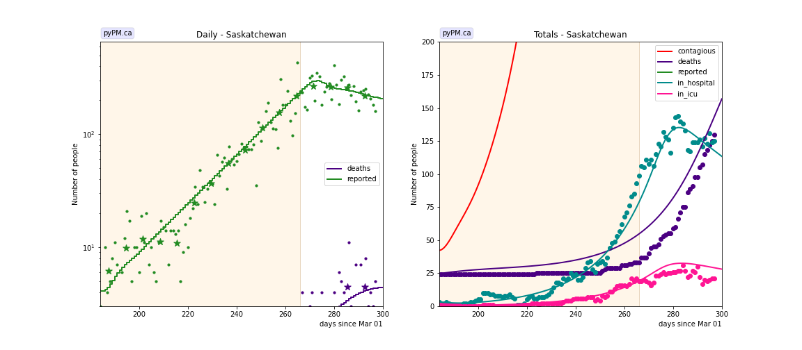

### [Manitoba](img/mb_2_6_1224.pdf)

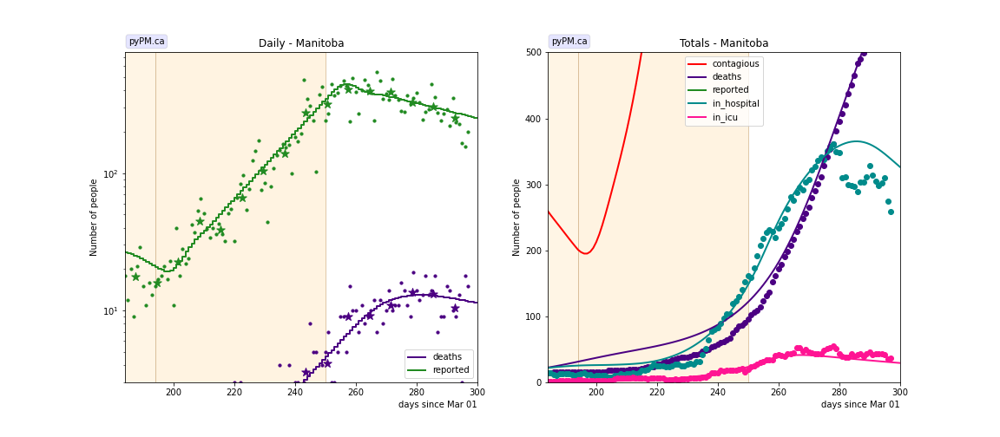

### [Ontario](img/on_2_6_1224.pdf)

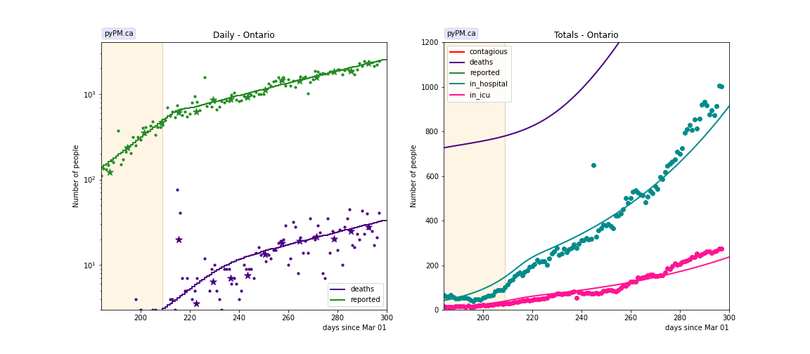

### [Quebec](img/qc_2_6_1224.pdf)

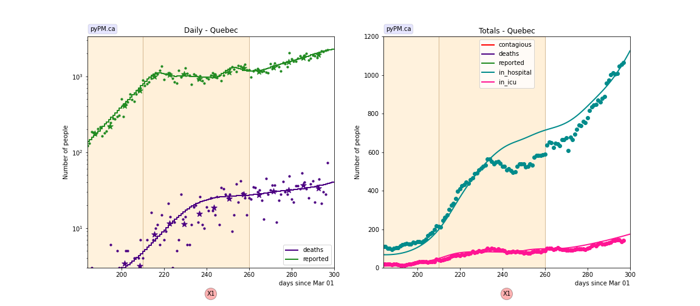

### [New Brunswick](img/nb_2_6_1224.pdf)

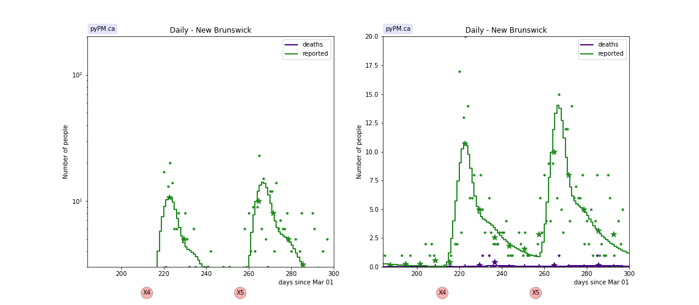

### [Newfoundland](img/nl_2_6_1224.pdf)

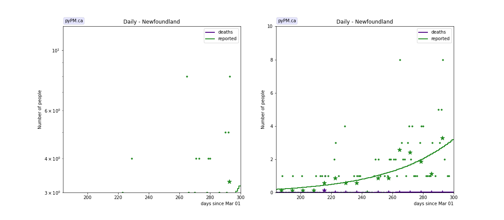

### [Nova Scotia](img/ns_2_6_1224.pdf)

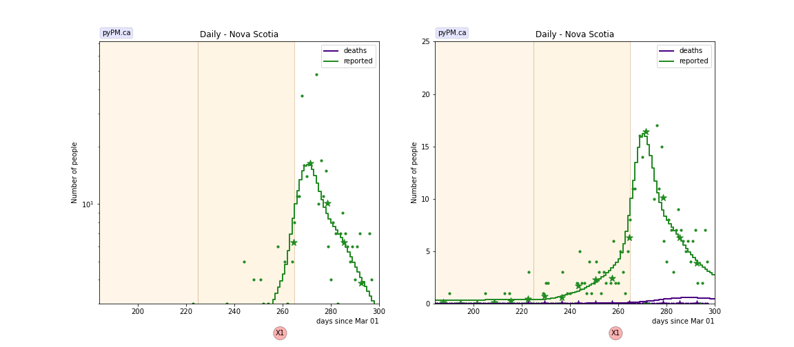

## Tables

The tables below are results from the fits to reference model 2.6.

### Recent growth rates (&delta; : percent per day)

prov| &delta; | day | &delta; | day | &delta; | day | &delta;  
---|---|---|---|---|---|---
bcc| 2.2 +/-  0.2|Sep 02|-0.0 +/-  0.3|Oct 11| 4.5 +/-  0.2|Nov 16|-1.6 +/-  0.7
ab|-2.9 +/-  0.7|Aug 05| 1.9 +/-  0.2|Oct 04| 4.1 +/-  0.1|Nov 27|-1.0 +/-  1.5
sk|-4.6 +/-  0.7|Aug 28| 5.1 +/-  0.3|Nov 22|-0.9 +/-  1.2
mb| 7.6 +/-  0.6|Aug 16|-2.4 +/-  0.5|Sep 11| 5.8 +/-  0.2|Nov 06|-0.8 +/-  0.5
on|-1.1 +/-  0.2|Aug 18| 5.3 +/-  0.2|Sep 26| 1.9 +/-  0.1
qc|-3.0 +/-  0.8|Aug 18| 7.2 +/-  0.4|Sep 27|-0.0 +/-  0.2|Nov 16| 2.3 +/-  0.4
ns| 0.4 +/-  1.4|Oct 12| 7.6 +/-  5.2|Nov 21|-5.2 +/-  1.8

* bcc: fit results using data from daily reporting (no weekend reports, no corrections)
* &delta; : daily fractional growth parameter (in percent)
* day: day of transition to new transmission rate

## Infection status

The following plots summarize the infection history.
The upper plot shows the daily growth/decline from the fit. Bands show approximate 95% CL intervals.
The lower plot shows the size of the infection: the uncorrected circulating contagious population per
million.
Only regions with sufficient statistics to properly analyze uncertainty in &delta; are shown.

### [BC](img/bcc-summary.pdf)

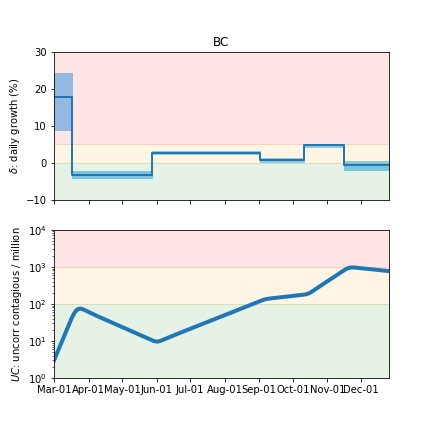

### [Alberta](img/ab-summary.pdf)

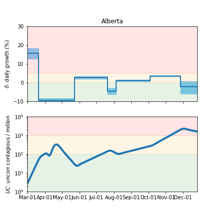

### [Saskatchewan](img/sk-summary.pdf)

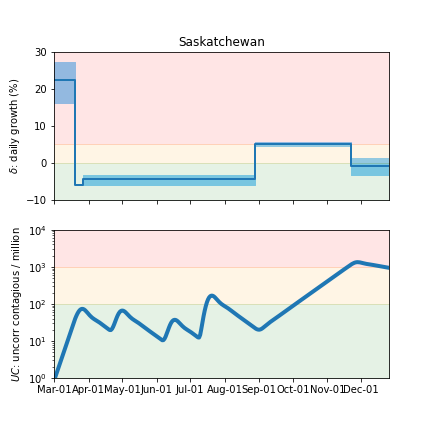

### [Manitoba](img/mb-summary.pdf)

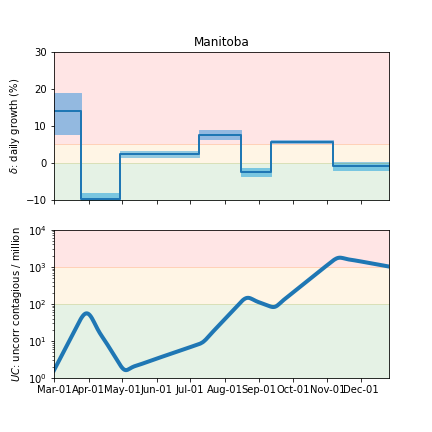

### [Ontario](img/on-summary.pdf)

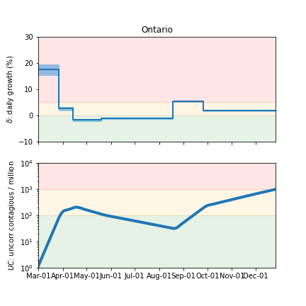

### [Quebec](img/qc-summary.pdf)

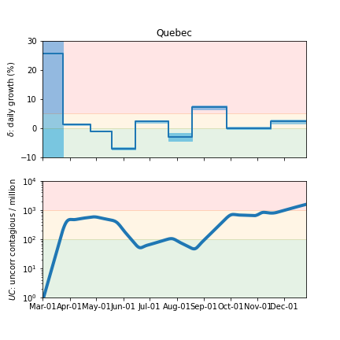

### [Nova Scotia](img/ns-summary.pdf)

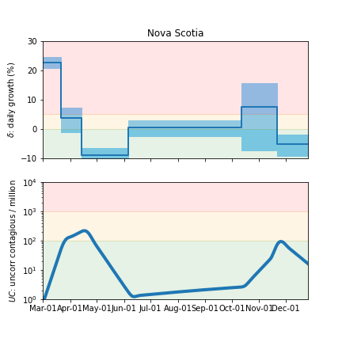

## Forecasts

The following plots show the forecasts for weekly cases and deaths. The shaded regions show the 50%, 80%, and 95% CL intervals.

### [Canada](img/canada-forecast.pdf)

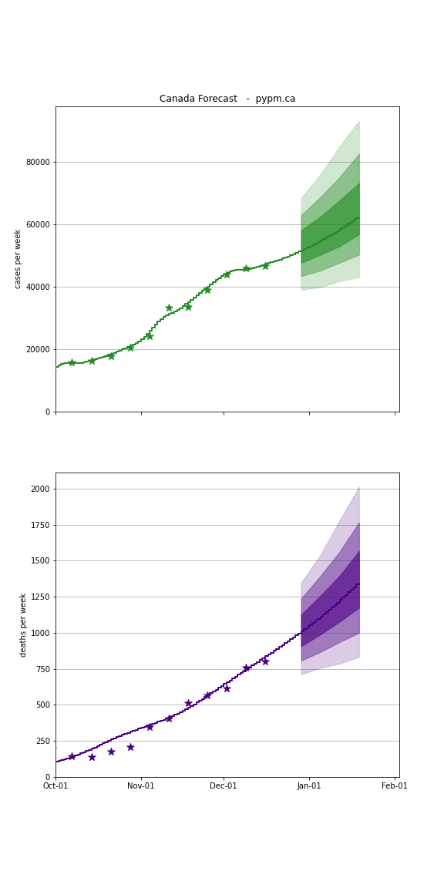

### [BC](img/bc-forecast.pdf)

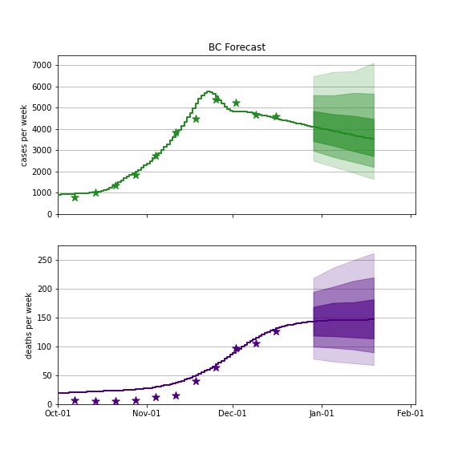

### [Alberta](img/ab-forecast.pdf)

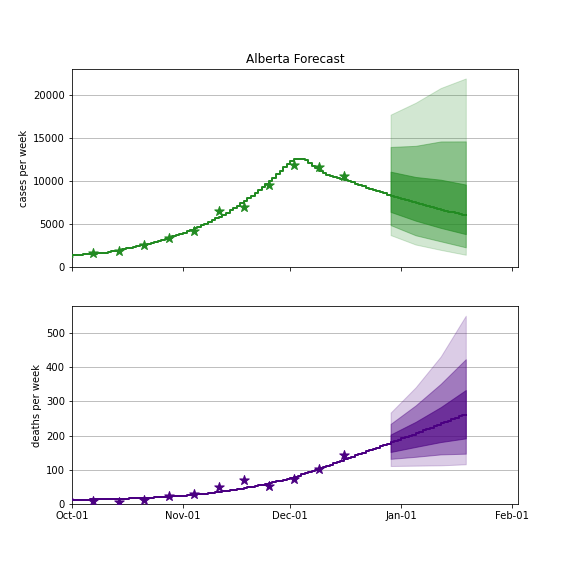

### [Saskatchewan](img/sk-forecast.pdf)

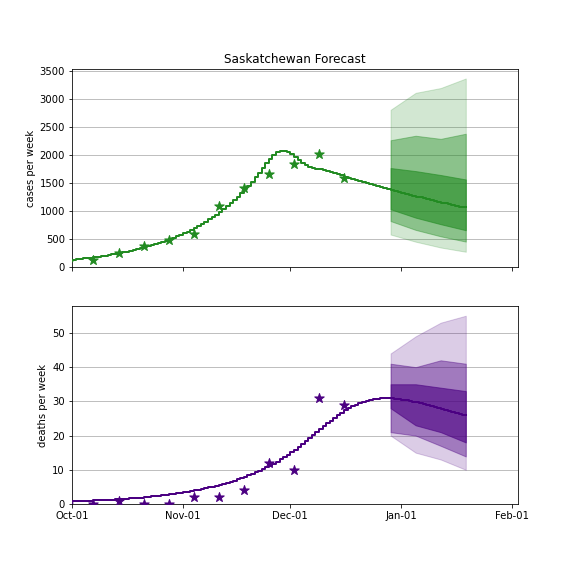

### [Manitoba](img/mb-forecast.pdf)

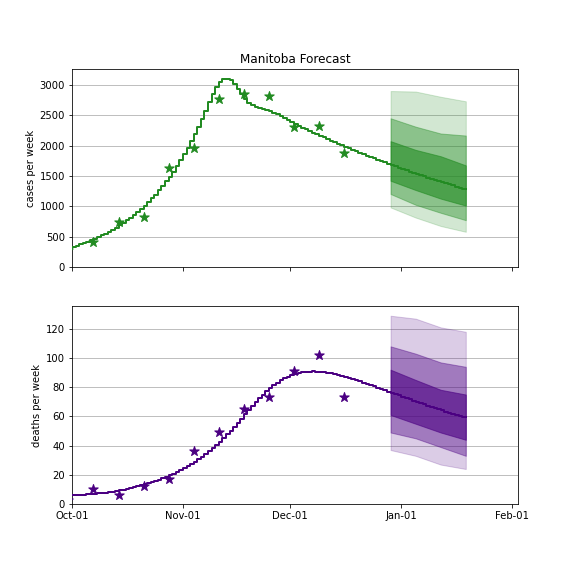

### [Ontario](img/on-forecast.pdf)

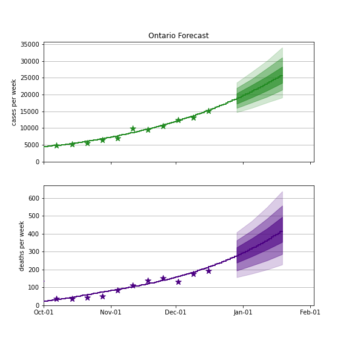

### [Quebec](img/qc-forecast.pdf)

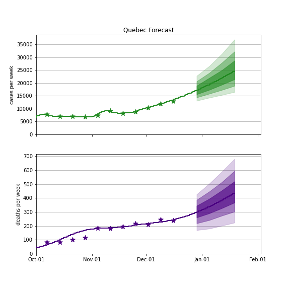

## [return to case studies](../index.md)

