## January 19, 2021 Analysis of Canadian provincial data

All provinces except PEI (which has very few cases) are fit to the reference model 2.6.
The plots show the trajectory of the epidemic since October 1.
The plots on the left show the daily case numbers (green points) and deaths (purple points) along with
the weekly averages (stars) on a log scale.
The plots on the right show the number of people in hospital on a linear scale.

The trajectory of hospitalization in Alberta continued to grow for several weekas after the daily cases started to diminish,
not following the typical behaviour seen in many US states.

Forecasts for the coming month are provided, assuming no general change in behaviour.
Ontario brought in additional measures into force on Dec 26, which may substantially change its trajectory.
A transition has not been added to account for that possibility.
The shaded regions show the 50%, 80%, and 95% CL intervals.

Forecasts from a previous analysis in December, is compared with the most recent data.

### [BC](img/bcc_2_6_0119.pdf)

A better analysis [here](../bc20210119) uses corrected data (including Saturday and Sunday numbers) and shows
the breakdowns by health region.

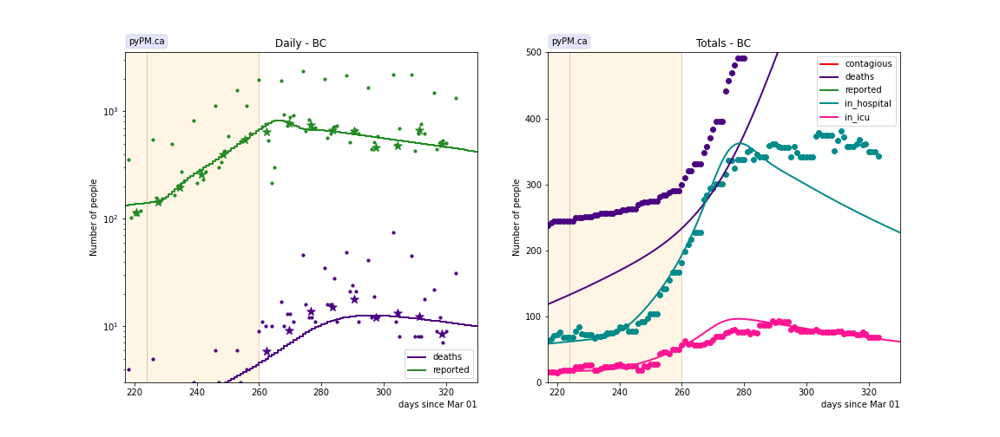

### [Alberta](img/ab_2_6_0119.pdf)

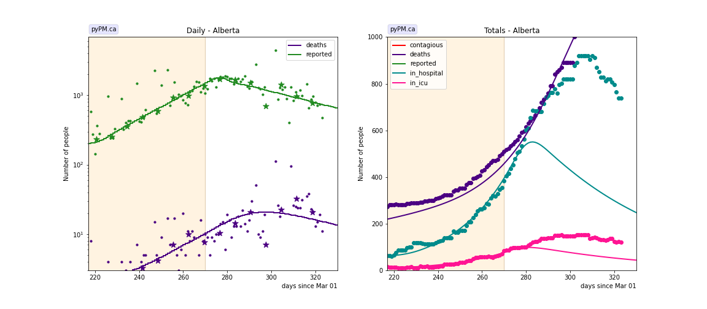

### [Saskatchewan](img/sk_2_6_0119.pdf)

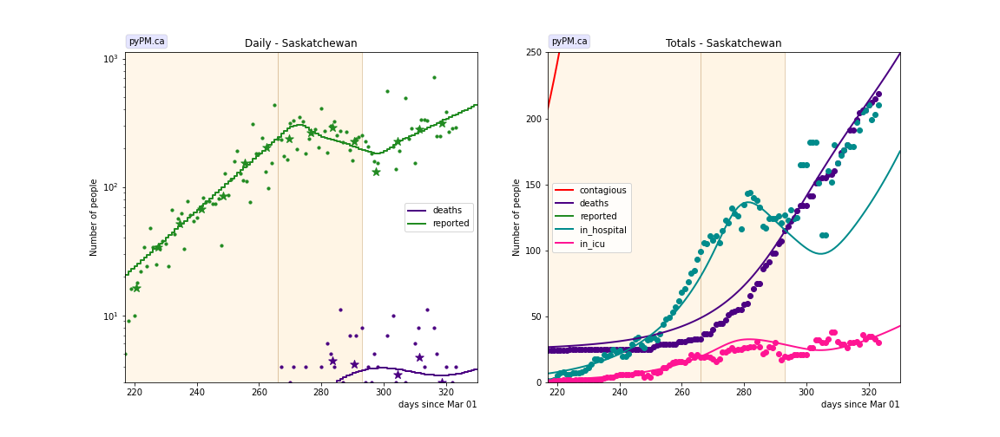

### [Manitoba](img/mb_2_6_0119.pdf)

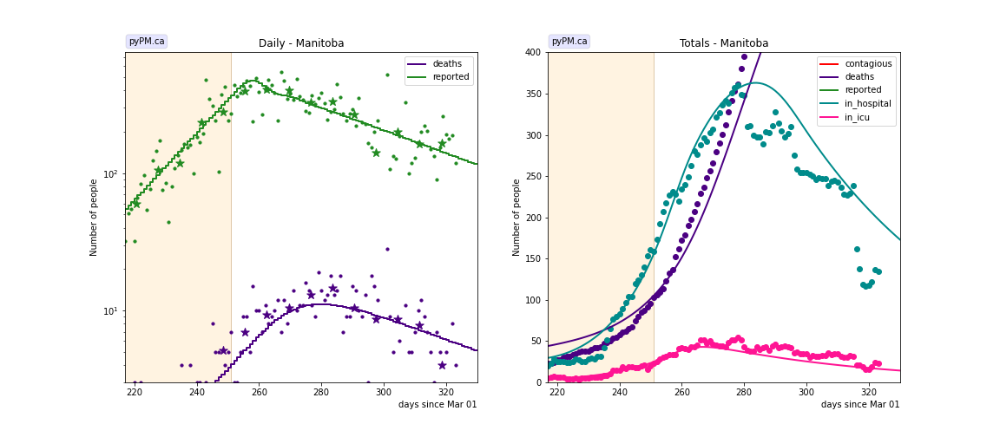

### [Ontario](img/on_2_6_0119.pdf)

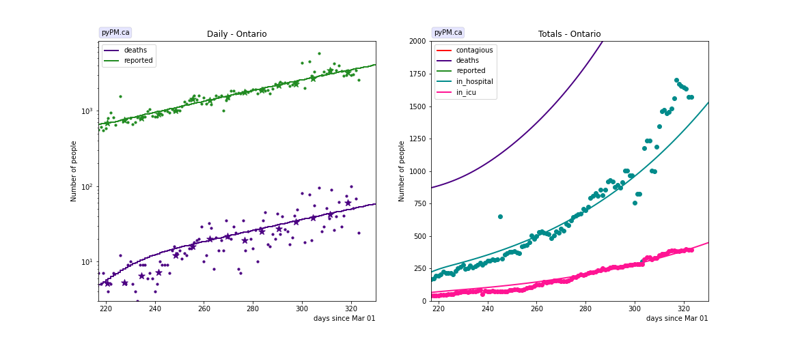

### [Quebec](img/qc_2_6_0119.pdf)

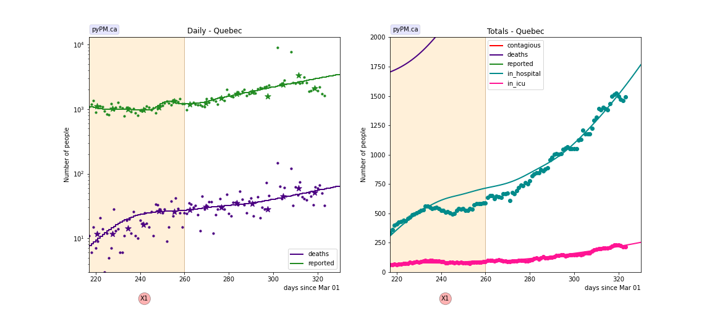

### [New Brunswick](img/nb_2_6_0119.pdf)

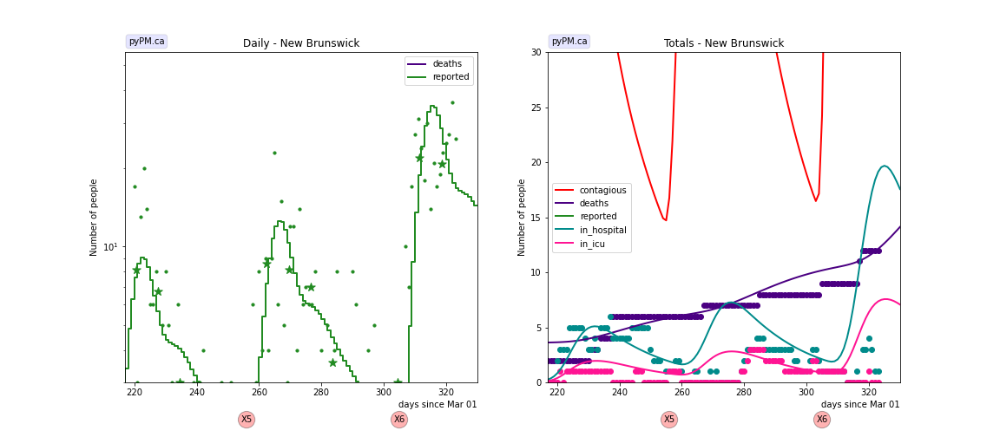

### [Newfoundland](img/nl_2_6_0119.pdf)

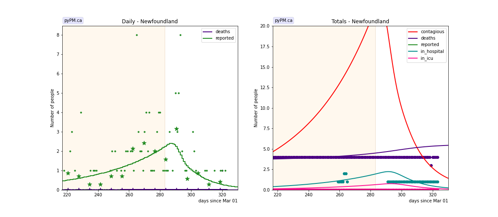

### [Nova Scotia](img/ns_2_6_0119.pdf)

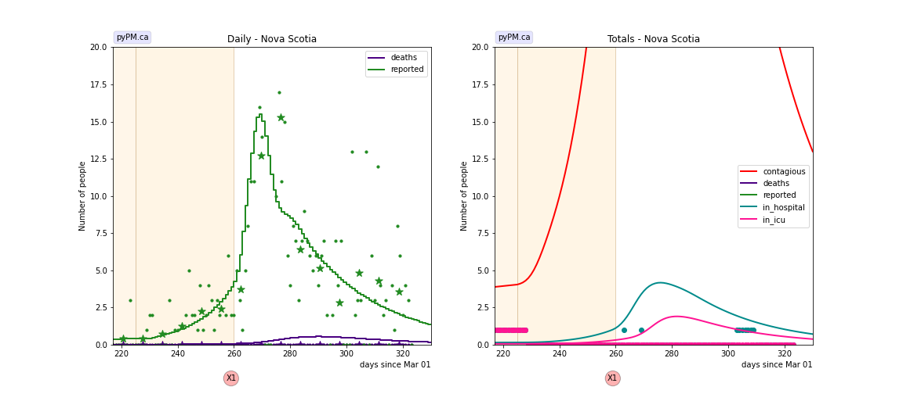

## Tables

The tables below are results from the fits to reference model 2.6.

### Recent growth rates (&delta; : percent per day)

prov| &delta; | day | &delta; | day | &delta; | day | &delta;  
---|---|---|---|---|---|---
bcc|-0.0 +/-  0.2|Oct 11| 4.5 +/-  0.2|Nov 16|-1.8 +/-  0.3
ab| 1.8 +/-  0.2|Oct 04| 4.2 +/-  0.1|Nov 26|-1.3 +/-  0.5
sk| 5.3 +/-  0.2|Nov 22|-1.6 +/-  0.2|Dec 19| 3.1 +/-  1.0
mb| 5.9 +/-  0.2|Nov 07|-1.4 +/-  0.3
on| 5.2 +/-  0.2|Sep 26| 1.9 +/-  0.1
qc| 7.1 +/-  0.4|Sep 27| 0.1 +/-  0.2|Nov 16| 2.1 +/-  0.4
ns| 0.4 +/-  0.7|Oct 12| 7.5 +/-  3.5|Nov 16|-3.3 +/-  0.9

* bcc: fit results using data from daily reporting (no weekend reports, no corrections)
* &delta; : daily fractional growth parameter (in percent)
* day: day of transition to new transmission rate

## Infection status

The following plots summarize the infection history.
The upper plot shows the daily growth/decline from the fit. Bands show approximate 95% CL intervals.
The lower plot shows the size of the infection: the uncorrected circulating contagious population per
million.
Only regions with sufficient statistics to properly analyze uncertainty in &delta; are shown.

### [BC](img/bcc-summary.pdf)

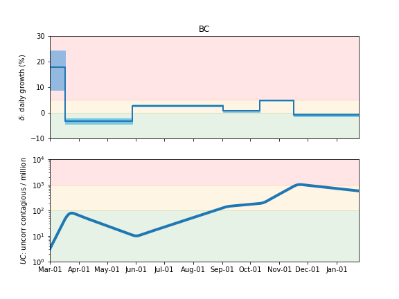

### [Alberta](img/ab-summary.pdf)

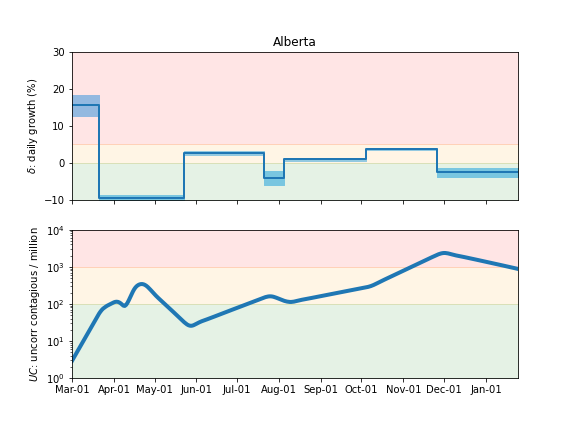

### [Saskatchewan](img/sk-summary.pdf)

### [Manitoba](img/mb-summary.pdf)

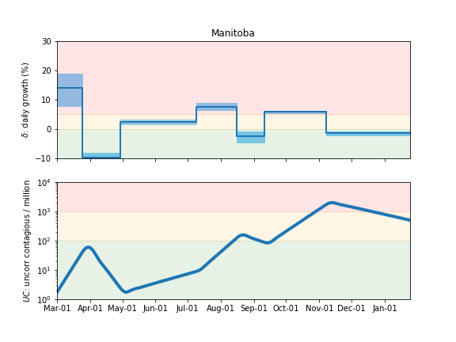

### [Ontario](img/on-summary.pdf)

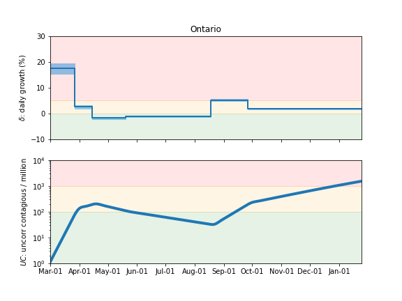

### [Quebec](img/qc-summary.pdf)

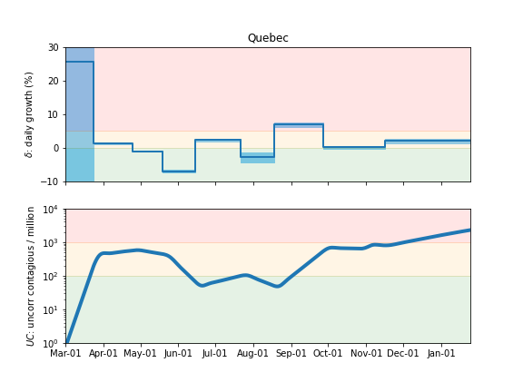

### [Nova Scotia](img/ns-summary.pdf)

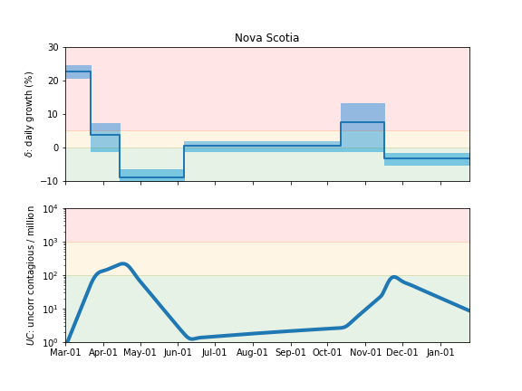

## Forecasts

The following plots show the forecasts for weekly cases and deaths. The shaded regions show the 50%, 80%, and 95% CL intervals.

Also shown are the forecasts made on Dec 24, 2020.
For those plots, the recent data (not available at the time of the forecast) are overlayed as black stars.

### [Canada](img/canada-forecast.pdf)

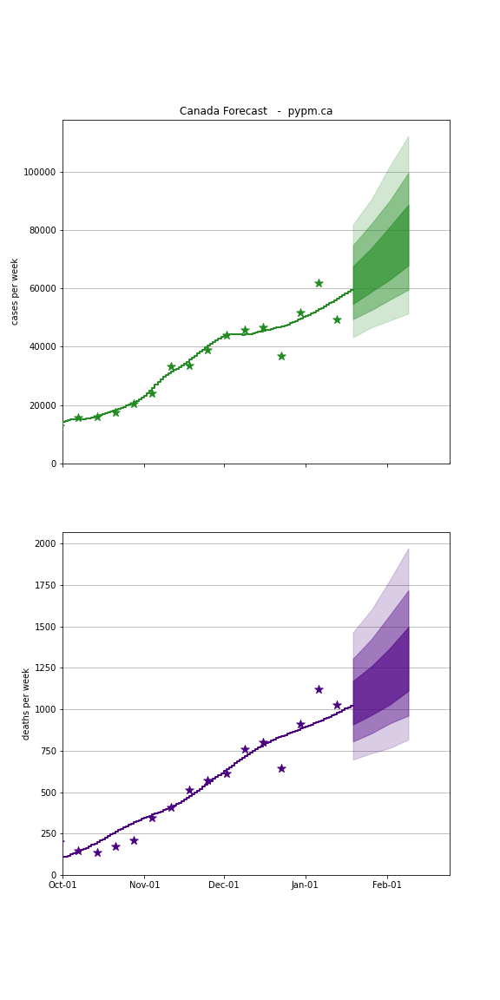

### [BC](img/bc-forecast.pdf)

current forecast

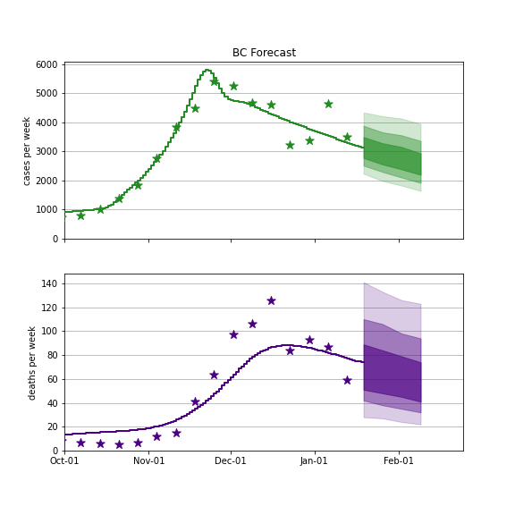

Dec 24 forecast

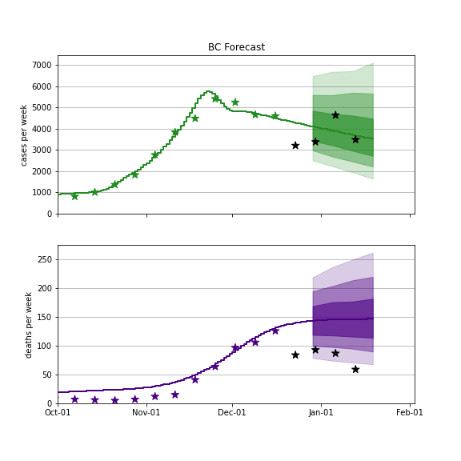

### [Alberta](img/ab-forecast.pdf)

current forecast

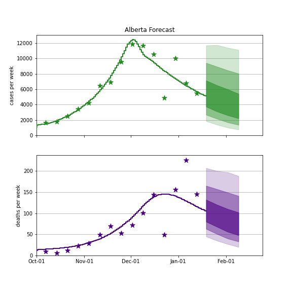

Dec 24 forecast

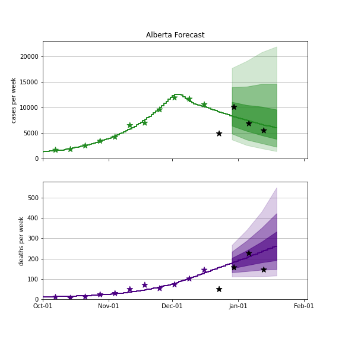

### [Saskatchewan](img/sk-forecast.pdf)

current forecast

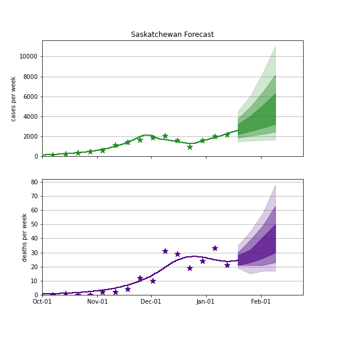

Dec 24 forecast

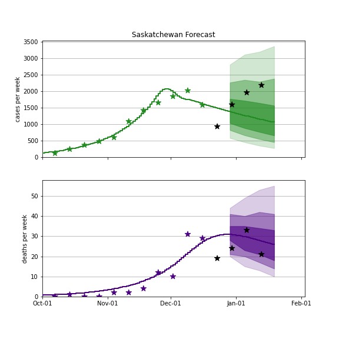

### [Manitoba](img/mb-forecast.pdf)

current forecast

Dec 24 forecast

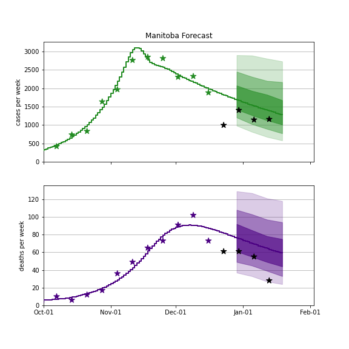

### [Ontario](img/on-forecast.pdf)

current forecast

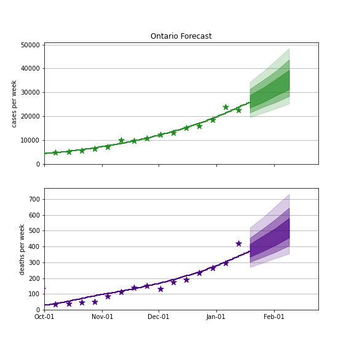

Dec 24 forecast

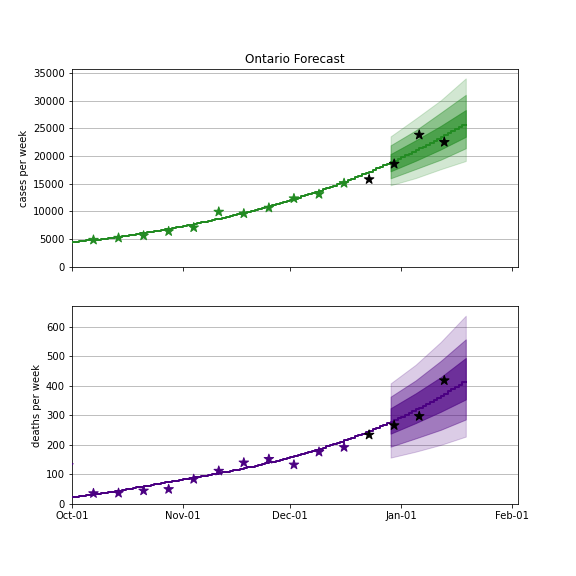

### [Quebec](img/qc-forecast.pdf)

current forecast

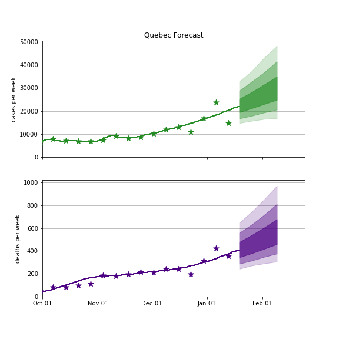

Dec 24 forecast

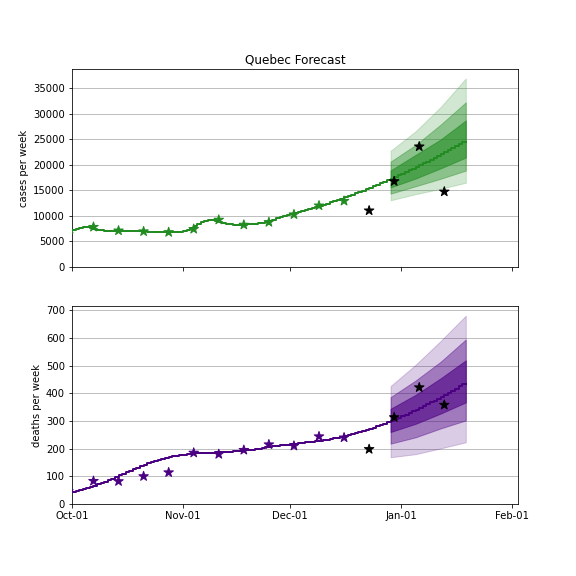

## [return to case studies](../index.md)

