## February 7, 2021 Analysis of Canadian provincial data

All provinces except PEI (which has very few cases) are fit to the reference model 2.8.
The plots show the trajectory of the epidemic since October 1.
The plots on the left show the daily case numbers (green points) and deaths (purple points) along with
the weekly averages (stars) on a log scale.
The plots on the right show the number of people in hospital on a linear scale.

The trajectory of hospitalization in several provinces departed from the expected trends at the beginning of December. 
This is in stark contrast to
the behaviour seen in most German and US states (posted in this area).

Forecasts for the coming month are provided, assuming no general change in behaviour.
For example, Ontario brought in additional measures into force on Dec 26, and a major change in the infection trajectory
followed.
The shaded regions show the 50%, 80%, and 95% CL intervals.

Forecasts from a previous analysis in January is compared with the most recent data.

### [BC](img/bcc_2_8_0207.pdf)

A better analysis [here](../bc20210119) uses corrected data (including Saturday and Sunday numbers) and shows
the breakdowns by health region.

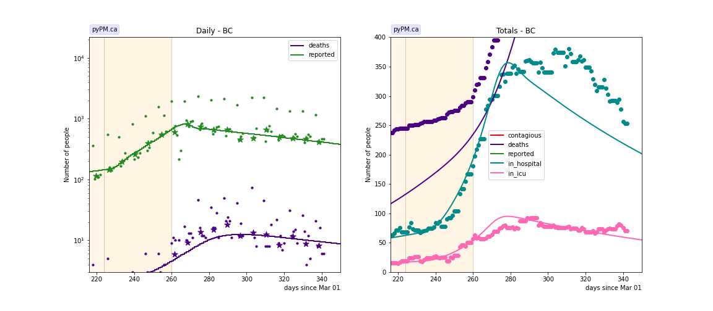

### [Alberta](img/ab_2_8_0207.pdf)

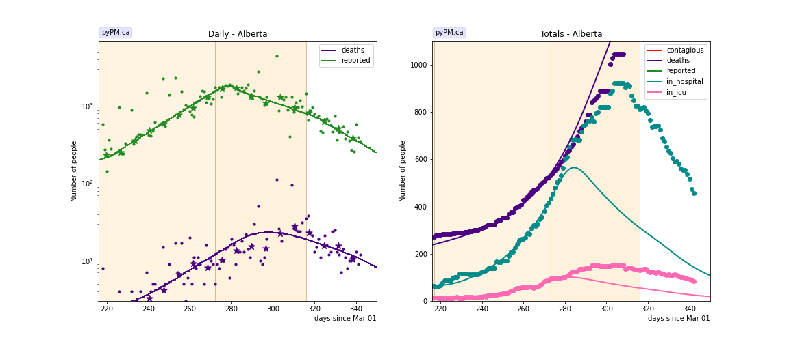

### [Saskatchewan](img/sk_2_8_0207.pdf)

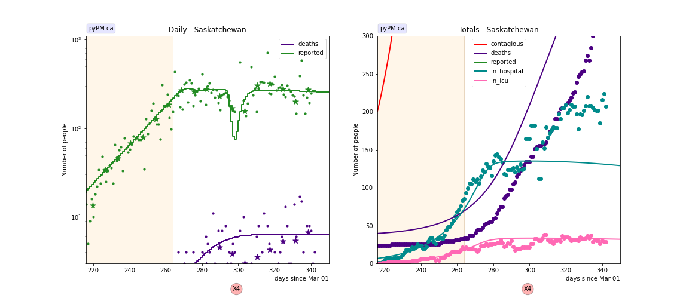

### [Manitoba](img/mb_2_8_0207.pdf)

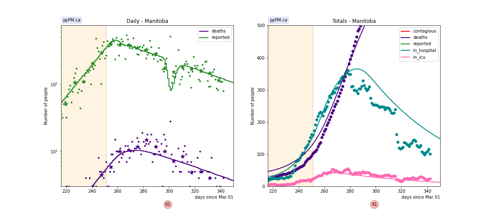

### [Ontario](img/on_2_8_0207.pdf)

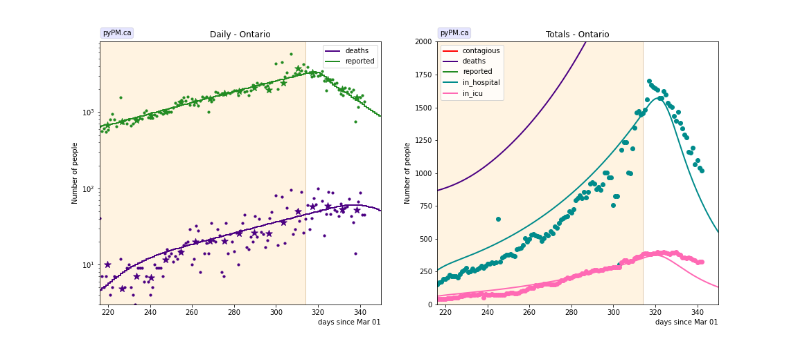

### [Quebec](img/qc_2_8_0207.pdf)

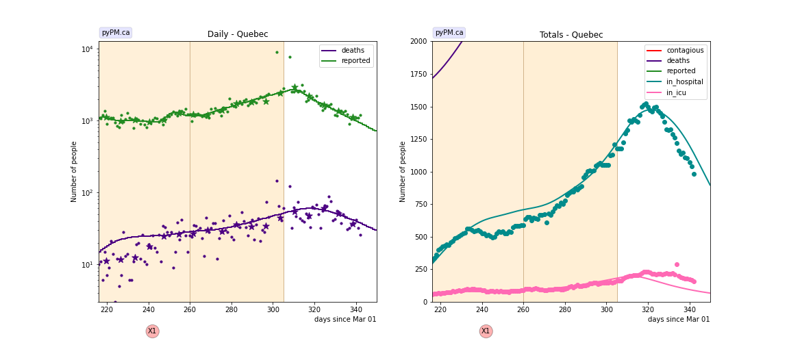

### [New Brunswick](img/nb_2_8_0207.pdf)

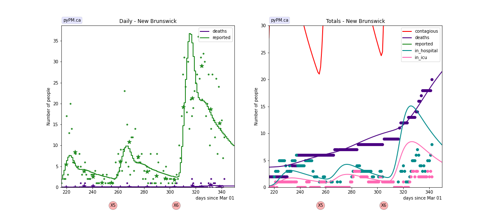

### [Newfoundland](img/nl_2_8_0207.pdf)

### [Nova Scotia](img/ns_2_8_0207.pdf)

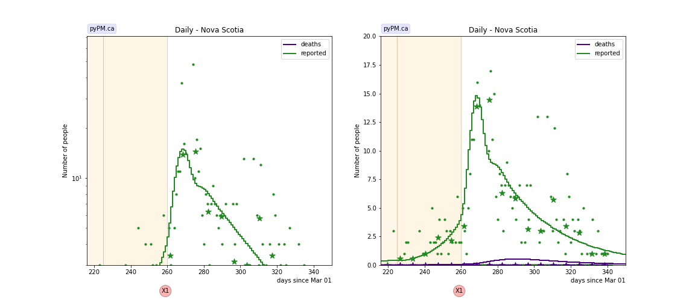

## Tables

The tables below are results from the fits to reference model 2.6.

### Recent growth rates (&delta; : percent per day)

prov| &delta; | day | &delta; | day | &delta; | day | &delta;  
---|---|---|---|---|---|---
bcc| 0.1 +/-  0.3|Oct 11| 4.3 +/-  0.2|Nov 16|-1.7 +/-  0.2
ab| 1.9 +/-  0.3|Oct 04| 4.1 +/-  0.0|Nov 28|-1.6 +/-  0.1|Jan 11|-2.9 +/-  0.8
sk| 5.2 +/-  0.3|Nov 20| 0.3 +/-  0.2
mb| 5.7 +/-  0.2|Nov 07|-1.1 +/-  0.3
on| 5.2 +/-  0.3|Sep 26| 1.9 +/-  0.0|Jan 09|-3.7 +/-  2.2
qc| 7.3 +/-  0.6|Sep 27|-0.1 +/-  0.2|Nov 16| 2.3 +/-  0.1|Dec 31|-2.6 +/-  1.0
ns| 0.4 +/-  0.7|Oct 12| 7.5 +/-  3.6|Nov 16|-2.9 +/-  0.9

* bcc: fit results using data from daily reporting (no weekend reports, no corrections)
* &delta; : daily fractional growth parameter (in percent)
* day: day of transition to new transmission rate

## Infection status

The following plots summarize the infection history.
The upper plot shows the daily growth/decline from the fit. Bands show approximate 95% CL intervals.
The lower plot shows the size of the infection: the uncorrected circulating contagious population per
million.
Only regions with sufficient statistics to properly analyze uncertainty in &delta; are shown.

### [BC](img/bcc-summary.pdf)

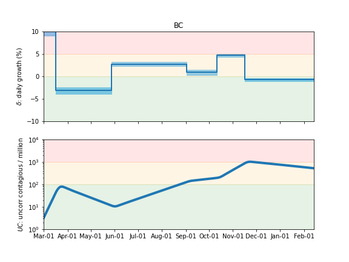

### [Alberta](img/ab-summary.pdf)

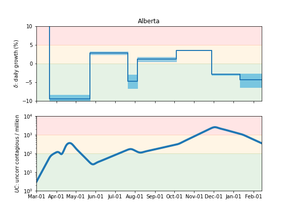

### [Saskatchewan](img/sk-summary.pdf)

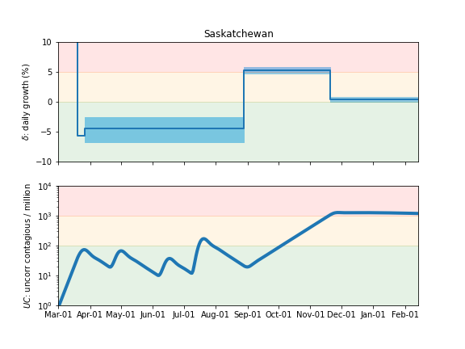

### [Manitoba](img/mb-summary.pdf)

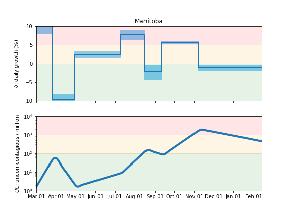

### [Ontario](img/on-summary.pdf)

### [Quebec](img/qc-summary.pdf)

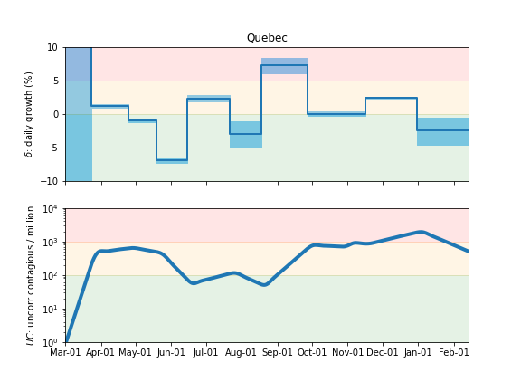

### [Nova Scotia](img/ns-summary.pdf)

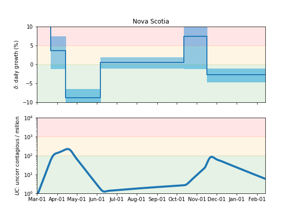

## Forecasts

The following plots show the forecasts for weekly cases and deaths. The shaded regions show the 50%, 80%, and 95% CL intervals.

Also shown are the forecasts made on Jan 19, 2021.
For those plots, the recent data (not available at the time of the forecast) are overlayed as black stars.

### [Canada](img/canada-forecast.pdf)

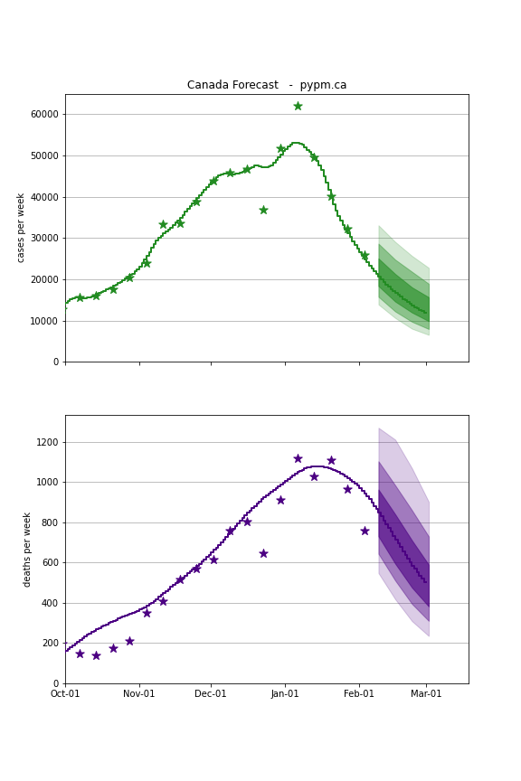

### [BC](img/bc-forecast.pdf)

current forecast

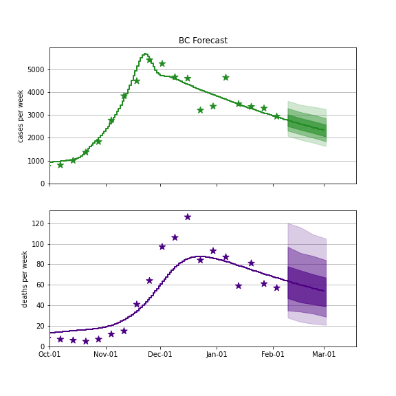

Jan 19 forecast

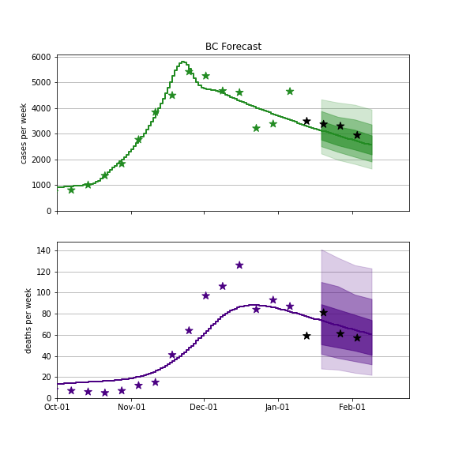

### [Alberta](img/ab-forecast.pdf)

current forecast

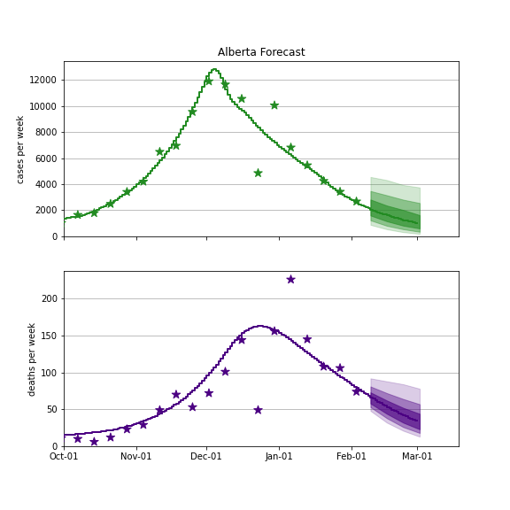

Jan 19 forecast

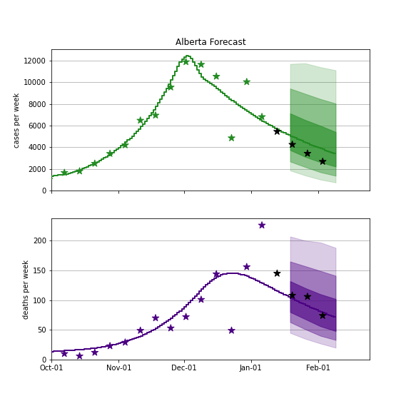

### [Saskatchewan](img/sk-forecast.pdf)

current forecast

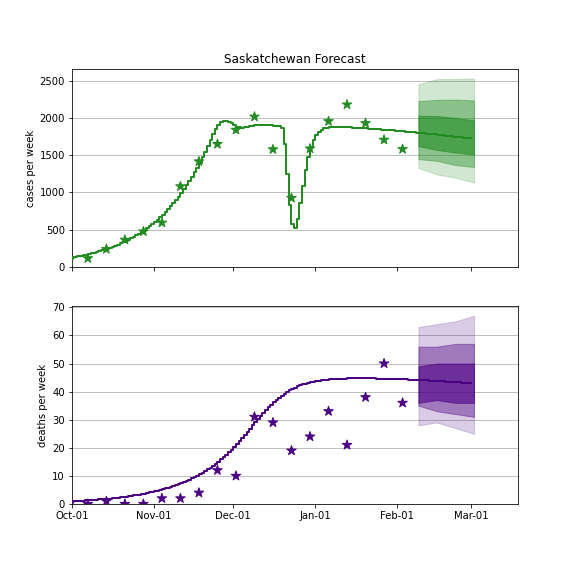

Jan 19 forecast

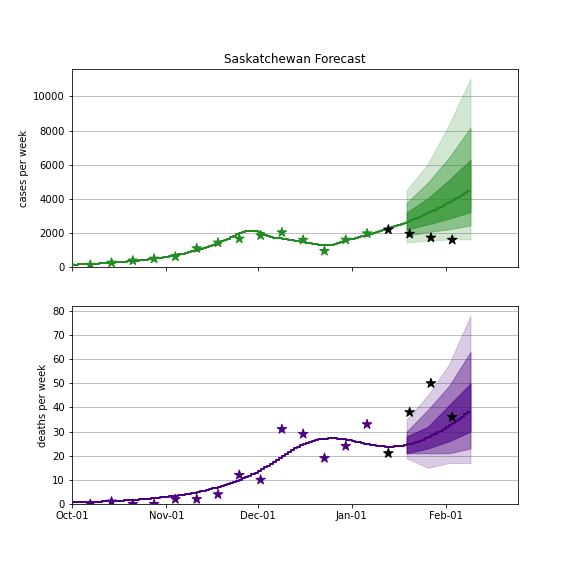

### [Manitoba](img/mb-forecast.pdf)

current forecast

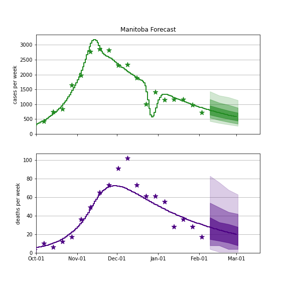

Jan 19 forecast

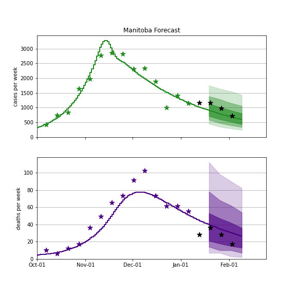

### [Ontario](img/on-forecast.pdf)

current forecast

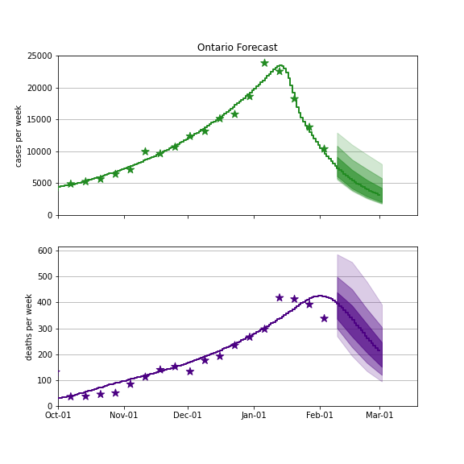

Jan 19 forecast

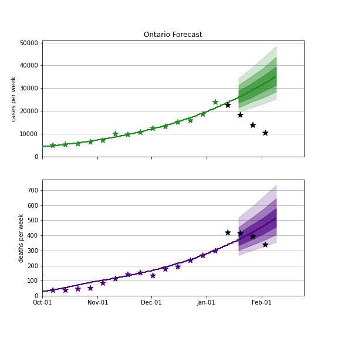

### [Quebec](img/qc-forecast.pdf)

current forecast

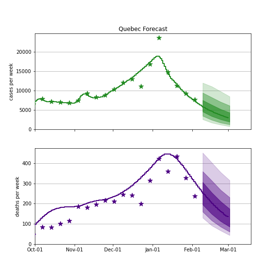

Jan 19 forecast

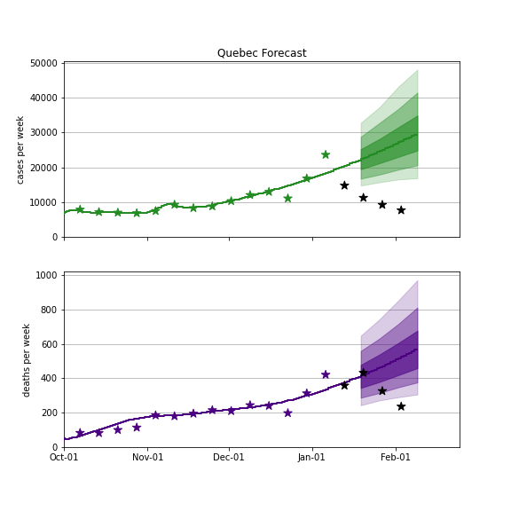

## [return to case studies](../index.md)

