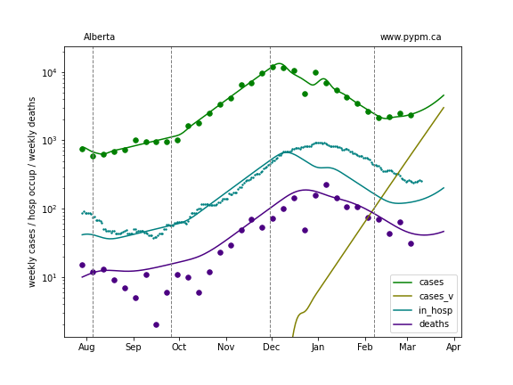
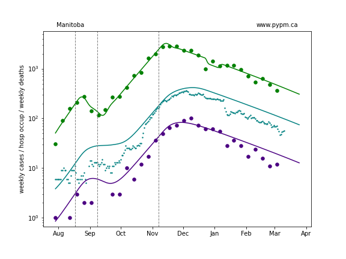
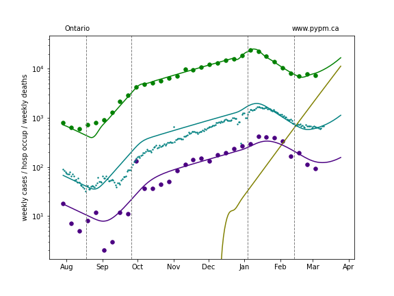
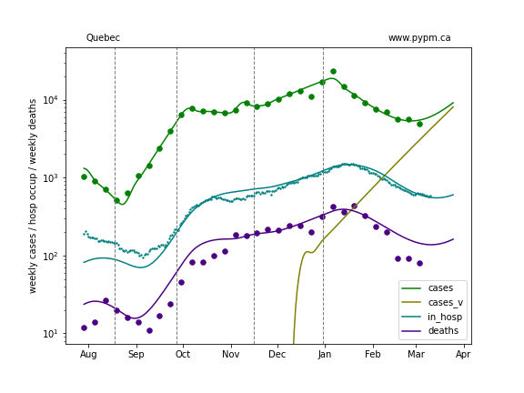

## March 11, 2021 Analysis of Canadian provincial data

Reference model 2.8 is fit to data from the Canadian provinces with substantial cases.
The model includes a second infection cycle to represent the B.1.1.7 variant, assuming a growth
advantage of about 9% per day, as estimated from Ontario genomic screening data.
The fractions of cases arising from B.1.1.7 are not well measured, except for Ontario, where
it is estimated to be 30-40%.
The unknown prevalence and growth advantage leads to significant uncertainty in forecasting growth in the
coming weeks.

Vaccination is included, but given the limited number of vaccinations, immunity is not yet having a significant impact on
the infection trajectories.

The plots show the weekly case numbers (green points)
hospital occupancy (teal) and weekly deaths (purple points).
The curves are the model expectations after fitting to the case data.
The vertical dashed lines shown where transmission rates are changed in the model, in order to match the case data.

The rapidly rising lines (olive) show the growth of cases due to B.1.1.7.
The contribution is not yet well established, except for Ontario.

### [BC](img/bcc_2_8_0311.pdf)

A better analysis [here](../bc20210309) uses corrected data (including Saturday and Sunday numbers) and shows
the breakdowns by health region.

### [Alberta](img/ab_2_8_0311.pdf)

### [Saskatchewan](img/sk_2_8_0311.pdf)

### [Manitoba](img/mb_2_8_0311.pdf)

### [Ontario](img/on_2_8_0311.pdf)

### [Quebec](img/qc_2_8_0311.pdf)

## [return to case studies](../index.md)

