## April 6, 2021 Analysis of Canadian provincial data

Reference model 2.8 is fit to data from the Canadian provinces with substantial cases.
The model includes a second infection cycle to represent the B.1.1.7 variant, assuming a growth
advantage of about 8% per day.
The fractions of cases arising from B.1.1.7 are not well measured.
The unknown prevalence and growth advantage leads to significant uncertainty in forecasting growth in the
coming weeks.

Vaccination is included in the models.

The plots show the weekly case numbers (green points),
hospital occupancy (teal), icu occupancy (magenta), and weekly deaths (purple points).
The curves are the model expectations after fitting to the case data.
The vertical dashed lines shown where transmission rates are changed in the model, in order to match the case data.

The rapidly rising lines (olive) show the growth of cases due to B.1.1.7.

Some provinces have increased restrictions at the end of March.
Plots are provided to show projections for 3 scenarios: no change, changes that reduce growth by 2% per day, and
changes that reduce growth by 4% per day (instituted on March 29).

### [BC](img/bc_2_8_0406.pdf)

A better analysis [here](../bc20210413) uses corrected data (including Saturday and Sunday numbers) and shows
the breakdowns by health region.

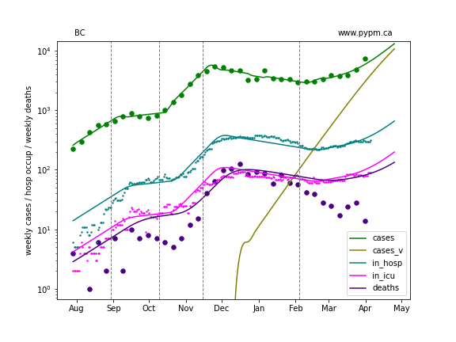

### [Alberta](img/ab_2_8_0406.pdf)

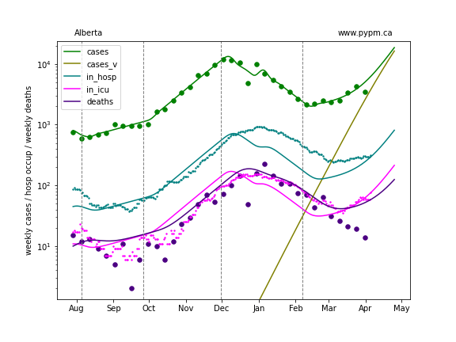

### [Saskatchewan](img/sk_2_8_0406.pdf)

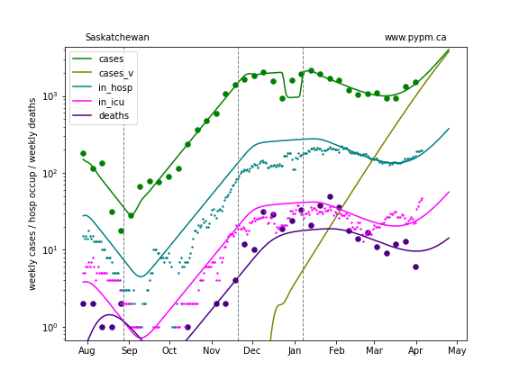

### [Manitoba](img/mb_2_8_0406.pdf)

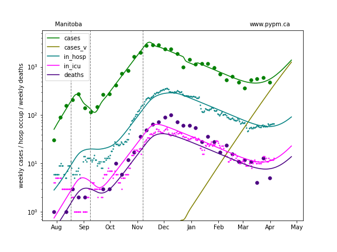

### [Ontario](img/on_2_8_0406.pdf)

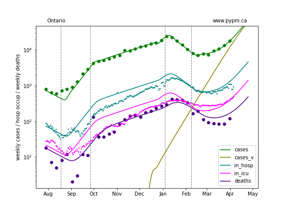

### [Quebec](img/qc_2_8_0406.pdf)

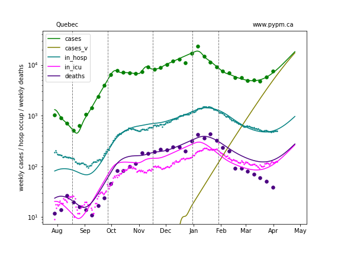

## Projections with additional restrictions

Some provinces have increased restrictions at the end of March.
The following  show projections for 3 scenarios: no change, changes that reduce growth by 2% per day, and
changes that reduce growth by 4% per day (instituted on March 29).

### [BC](img/bc_2_8_0406_proj.pdf)

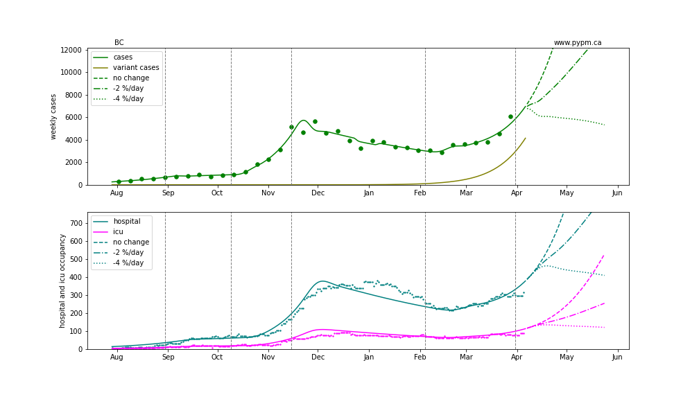

### [Alberta](img/ab_2_8_0406_proj.pdf)

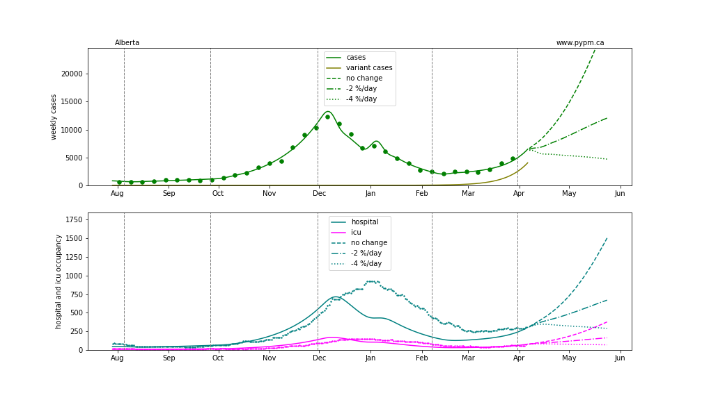

### [Saskatchewan](img/sk_2_8_0406_proj.pdf)

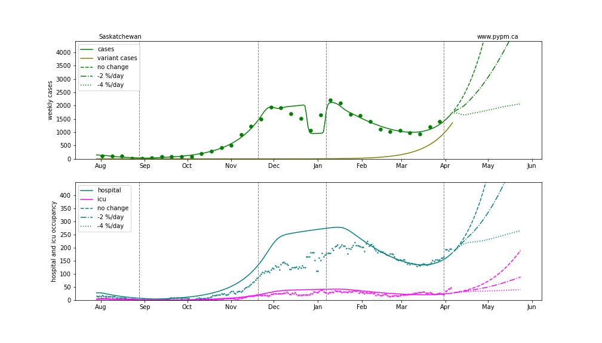

### [Manitoba](img/mb_2_8_0406_proj.pdf)

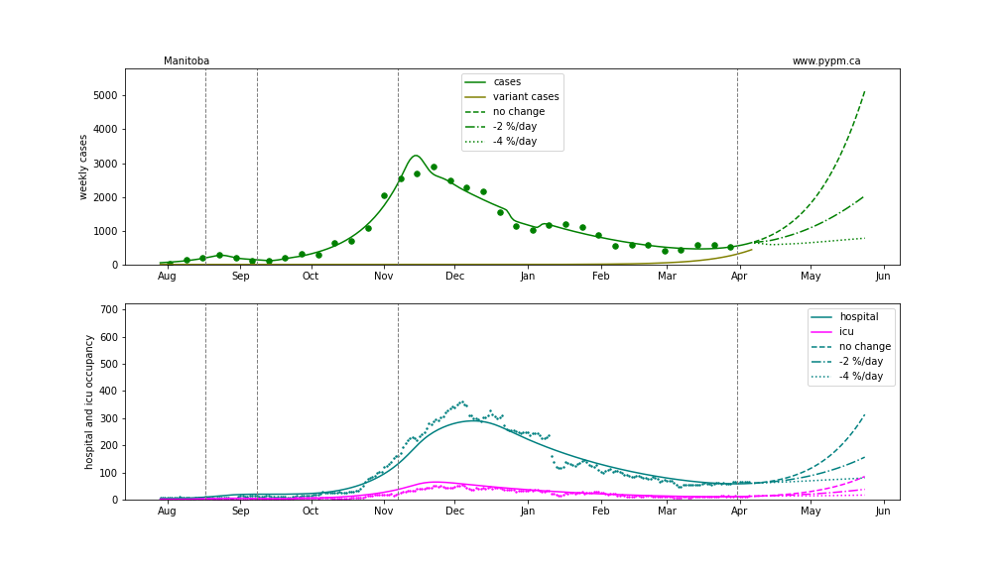

### [Ontario](img/on_2_8_0406_proj.pdf)

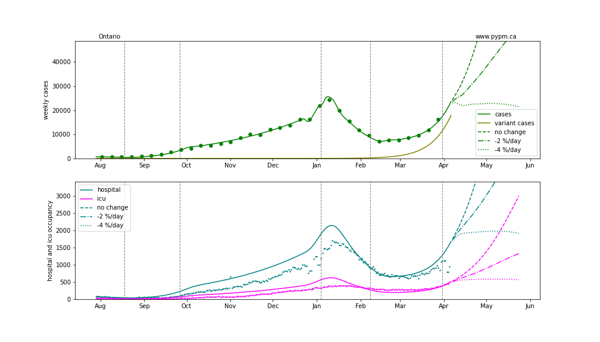

### [Quebec](img/qc_2_8_0406_proj.pdf)

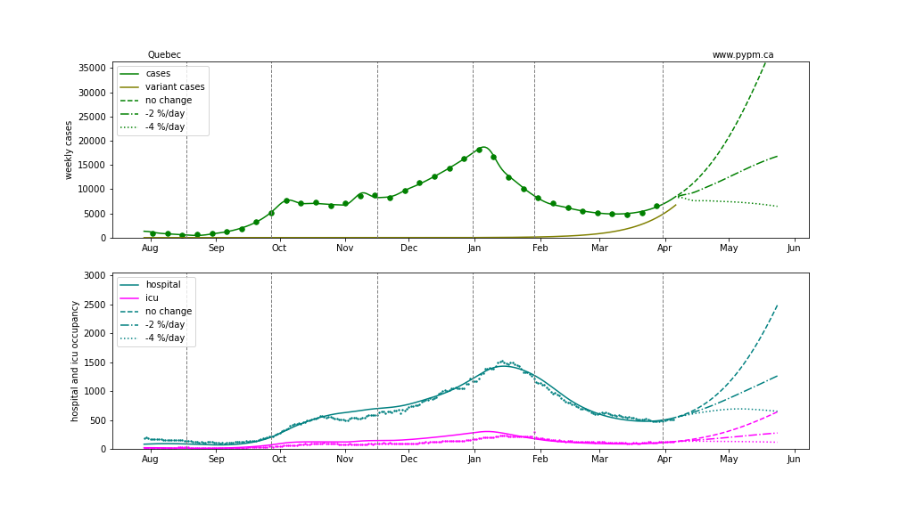

## [return to case studies](../index.md)

