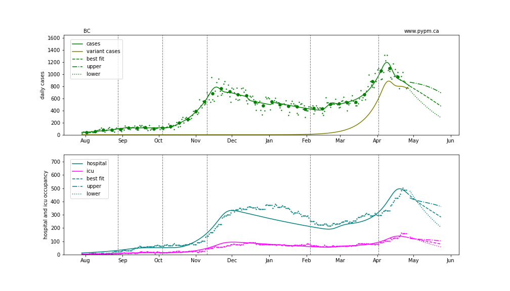
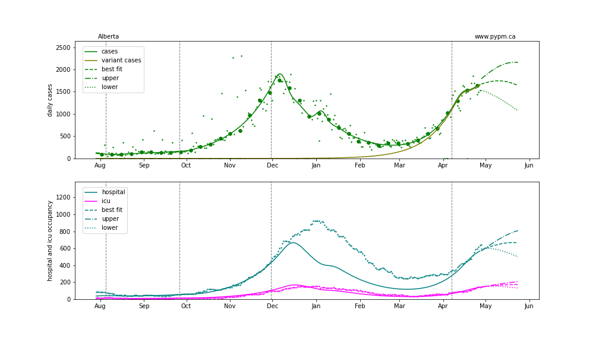
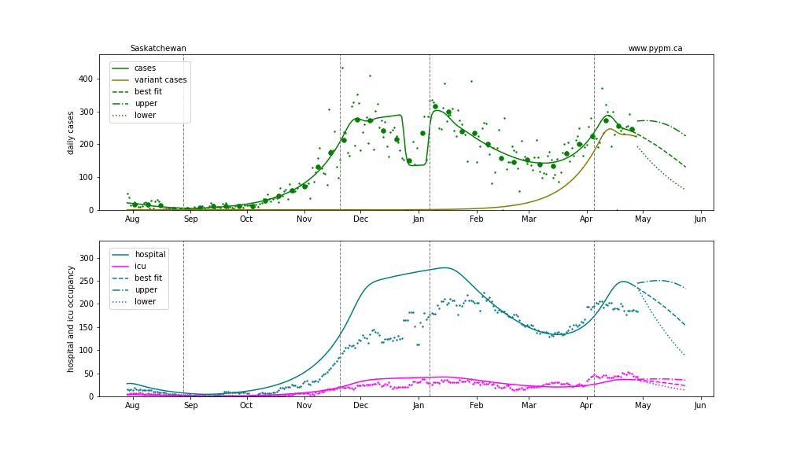
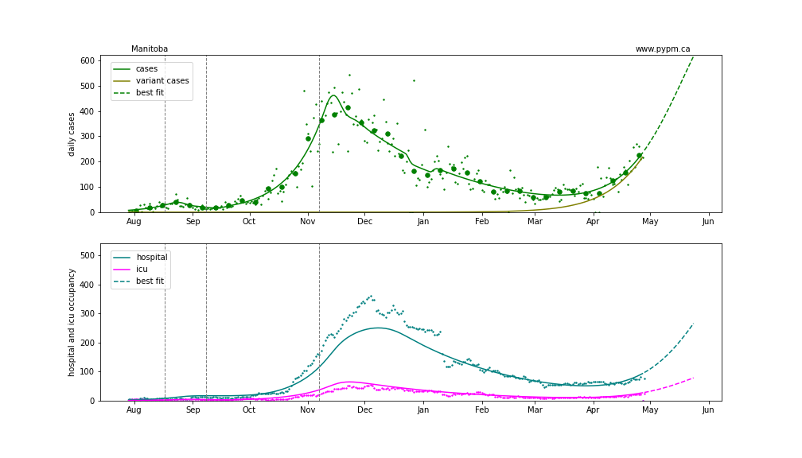
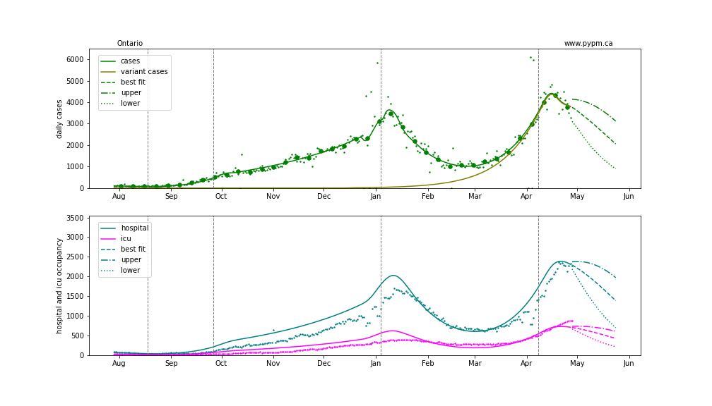

## April 29, 2021 Analysis of Canadian provincial data

Reference model 2.8 is fit to data from the Canadian provinces with substantial cases.
The model includes a second infection cycle to represent the B.1.1.7 variant.

Vaccination is included in the models.

The plots show the weekly case numbers (green points), hospital occupancy (teal), and icu occupancy (magenta).
The curves are the model expectations after fitting to the case data.
The vertical dashed lines shown where transmission rates are changed in the model, in order to match the case data.

The rapidly rising lines (olive) show the growth of cases due to B.1.1.7.

Most provinces increased restrictions at the end of March and as a result,
cases are declining in BC, Saskatchewan, Ontario, and Quebec.
Projections into May are shown, assuming current public health measures are maintained.
The upper and lower curves indicate the range of possible trajectories consistent with case data (68% CL).

### [BC](img/bc_2_8_0429_proj.pdf)

### [Alberta](img/ab_2_8_0429_proj.pdf)

### [Saskatchewan](img/sk_2_8_0429_proj.pdf)

### [Manitoba](img/mb_2_8_0429_proj.pdf)

### [Ontario](img/on_2_8_0429_proj.pdf)

### [Quebec](img/qc_2_8_0429_proj.pdf)

## [return to case studies](../index.md)

