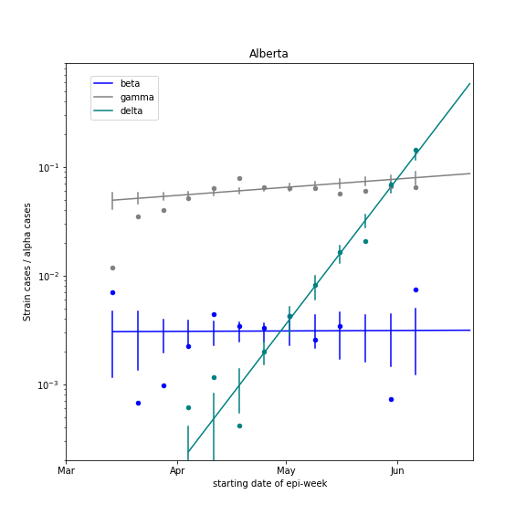

## June 14, 2021 Analysis of Canadian provincial data

Reference model 2.9 is fit to data from the Canadian provinces with substantial cases.
The model includes a second infection cycle to represent the alpha and gamma variants of concern and a
third infection cycle to represent the delta.
Vaccination is included in the models.

### Genomic data for delta

Currently, only genomic data from Alberta is publicly available to estimate the growth advantage of delta
and its current prevalence.
The figure below shows the ratio of cases for three variants to the alpha variant.

 *  beta:  prev/prev_alpha = 0.0031 +/- 0.0007,  s = 0.0003 +/- 0.0047
 *  gamma:  prev/prev_alpha = 0.0796 +/- 0.0041,  s = 0.0057 +/- 0.0011
 *  delta:  prev/prev_alpha = 0.1300 +/- 0.0099,  s = 0.1000 +/- 0.0040

### Provincial case and hospitalizations

The plots show the weekly case numbers (green points), hospital occupancy (teal), and icu occupancy (magenta).
The curves are the model expectations after fitting to the case data.
The vertical dashed lines shown where transmission rates are changed in the model, in order to match the case data.

Provinces increased restrictions in order to reduce transmission, and cases began to decline.
Projections into July are shown, assuming current public health measures are maintained.

The olive and red curves show the cases due to the alpha and delta variants of concern.
The growth advantage for delta is assumed to be 7% per day, except in Alberta, where
it is measured to be 10% per day (see above).

### BC

Detailed BC analyses are reported in the [BC file](../index.md).

### [Alberta](img/ab_2_8_0614_proj.pdf)

### [Saskatchewan](img/sk_2_8_0614_proj.pdf)

### [Manitoba](img/mb_2_8_0614_proj.pdf)

### [Ontario](img/on_2_8_0614_proj.pdf)

### [Quebec](img/qc_2_8_0614_proj.pdf)

## [return to case studies](../index.md)

