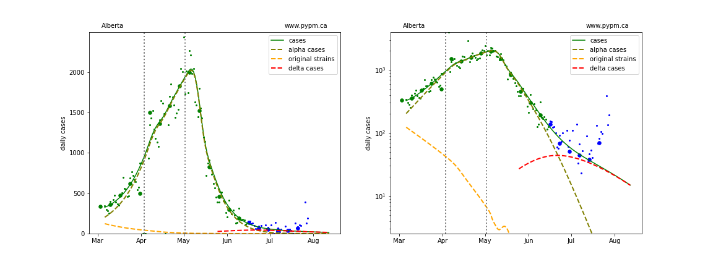
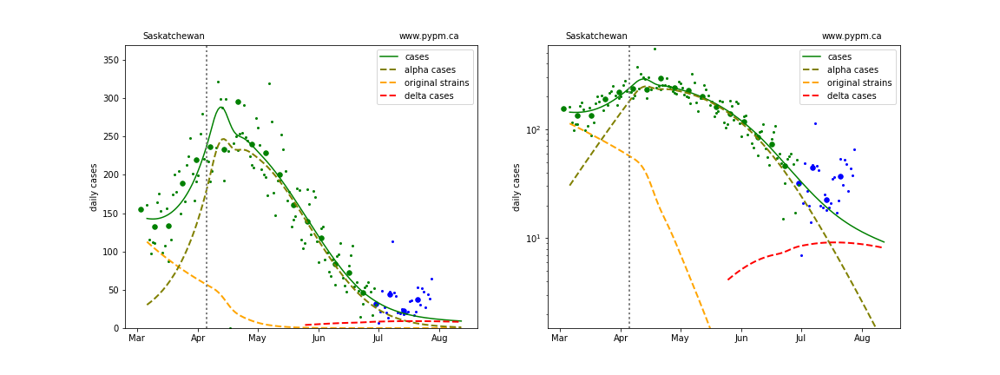
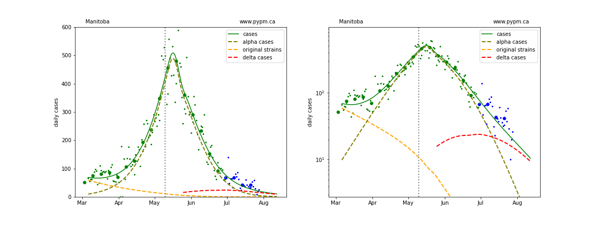
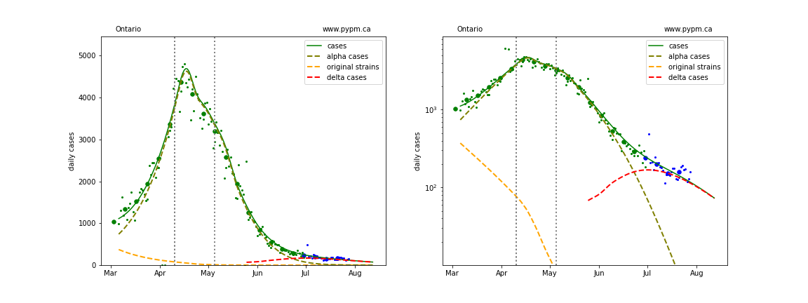
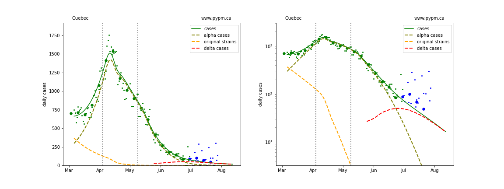
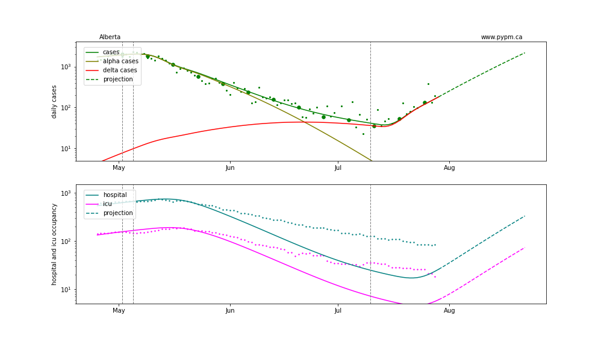
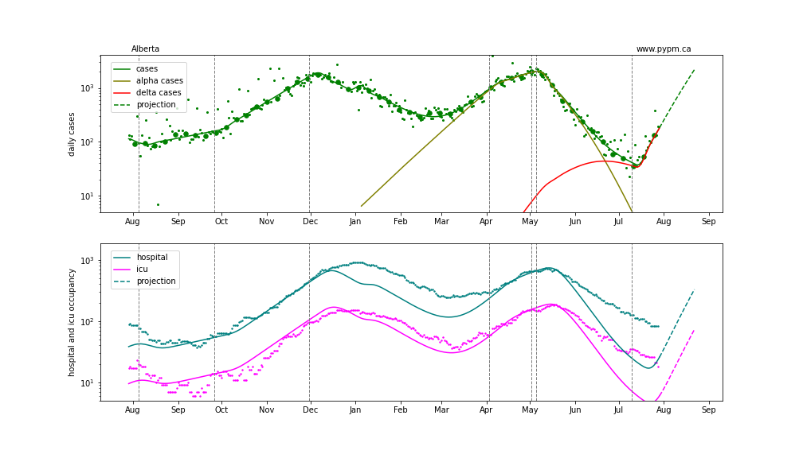

## July 29, 2021 Analysis of Canadian provincial data

Reference model 2.9 is fit to data from the Canadian provinces with substantial cases.
The model includes additional infection cycles to represent the alpha and delta variants of concern.
Past vaccination rates are included in the models.

### Recent case history

Until recently, case rates in the large provinces were in steady decline, following closely forecasts made in mid-June or early July.
In the past few weeks, the situation has changed, with case rates exceeding the forecasts.

The plots show the daily case numbers (small green points) and the weekly averages of the daily rates (large green dots) for the data
used in fitting the model forecast, shown by the smooth green curves. The dashed curves show how the model attributes cases to
the original, alpha, and delta variants. The blue points and dots are data collected after the model fit/forecast was made.
The vertical lines indicate the dates in which transmission rates were changed in the model in order to fit case data.

The left graphs are a linear scale and right graphs are log-scale, that are better to reveal the recent trends in case rates.

#### BC

Detailed BC analyses are reported in the [BC analysis page](../index.md).

#### [Alberta](img/ab_2_9_0720_cases_x.pdf)

#### [Saskatchewan](img/sk_2_9_0720_cases_x.pdf)

#### [Manitoba](img/mb_2_9_0720_cases_x.pdf)

#### [Ontario](img/on_2_9_0720_cases_x.pdf)

#### [Quebec](img/qc_2_9_0720_cases_x.pdf)

### New model fits with transition to rapid growth

In recent weeks many European nations have experienced similar transitions to rapid growth
and several have been able to reduce or turn the growth around.
In the US, most states had recently been in a long period of steady decline,
but now all states are currently experiencing rapid growth.
Model fits to EU and US states can be found [here](../index.md).

Given that the transition to higher growth is just getting underway, there is uncertainty in estimating the new
growth rate.
Below are model fits to Alberta and Saskatchewan data including a transition to higher transmission rates for the delta variant.
With more data, the trend will be more firmly understood.
Also ahown are the model projections for hospital and icu occupancy, which has not always tracked cases in the past.
Currently, hospital occupancy is higher than predicted in the model, given the recent history of cases.
In the US, hospitalization/case ratios have increased in the past month, as compared to earlier in the epidemic.

A 4-month and 12-month summary are shown. Log-scale is used to better see the effects of the early stages in growth.

#### Alberta

#### Saskatchewan

## [return to case studies](../index.md)

