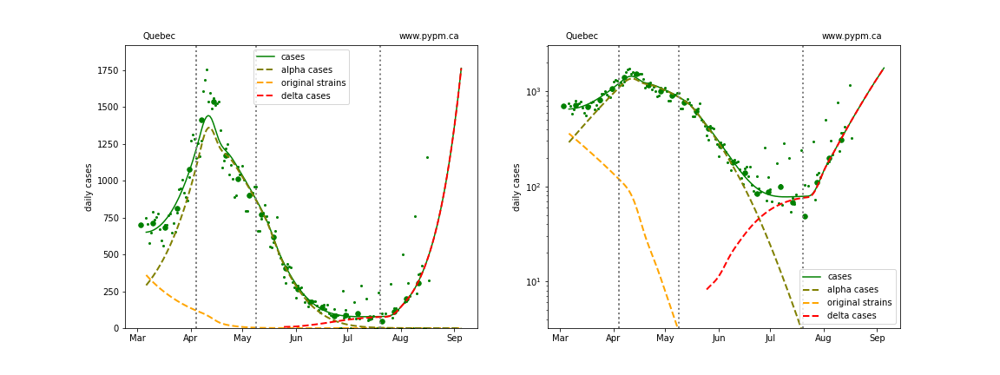

## August 18, 2021 Analysis of Canadian provincial data

Reference model 2.9 is fit to data from the Canadian provinces with substantial cases.
The model includes additional infection cycles to represent the alpha and delta variants of concern.
Past vaccination rates are included in the models.

### Case history compared to June forecasts

Until mid-July, case rates in the large provinces were in steady decline,
following closely forecasts made from mid- to late-June.
The situation changed, with case rates significantly exceeding the forecasts except in Manitoba.

The plots show the daily case numbers (small green points) and the weekly averages of the daily rates (large green dots) for the data
used in fitting the model forecast, shown by the smooth green curves. The dashed curves show how the model attributes cases to
the original, alpha, and delta variants.

The blue points and dots are data collected after the model fit and forecast was made.
The vertical lines indicate the dates in which transmission rates were changed in the model in order to fit case data.

The left graphs are a linear scale and right graphs are log-scale. The log-scale plots
better reveal recent trends in case rates.

#### BC

Detailed BC analyses are reported in the [BC analysis page](../index.md).

#### [Alberta](img/ab_2_9_0720_cases_x.pdf)

#### [Saskatchewan](img/sk_2_9_0720_cases_x.pdf)

#### [Manitoba](img/mb_2_9_0720_cases_x.pdf)

#### [Ontario](img/on_2_9_0720_cases_x.pdf)

#### [Quebec](img/qc_2_9_0720_cases_x.pdf)

### New model fits including transitions to rapid growth

European nations have experienced similar transitions to rapid growth due to delta
and several have been able to reduce or turn the growth around.
The rapid growth was also seen in all US states, and the growth has continued for a longer
period of time, with signs of slowing growth coming only recently in some states.
Model fits to EU and US states can be found [here](../index.md).

New model fits to provincial data including transition to rapid growth are shown below on linear and log-scale:

#### [Alberta](img/ab_2_9_0818_cases.pdf)

#### [Saskatchewan](img/sk_2_9_0818_cases.pdf)

#### [Manitoba](img/mb_2_9_0818_cases.pdf)

#### [Ontario](img/on_2_9_0818_cases.pdf)

#### [Quebec](img/qc_2_9_0818_cases.pdf)

### Provincial histories and projections with hospital occupancy

#### [Alberta](img/ab_2_9_0818_linear_proj.pdf)

#### [Saskatchewan](img/sk_2_9_0818_linear_proj.pdf)

#### [Manitoba](img/mb_2_9_0818_linear_proj.pdf)

#### [Ontario](img/on_2_9_0818_linear_proj.pdf)

#### [Quebec](img/qc_2_9_0818_linear_proj.pdf)

## [return to case studies](../index.md)

