## September 7, 2021 Analysis of Canadian provincial data

This summarizes analyses of data from the Canadian provinces with substantial cases.
The model includes additional infection cycles to represent the alpha and delta variants of concern.
Past vaccination rates are included in the models.

Manitoba experienced a brief burst of cases two weeks ago, which complicates the analysis.
As a result, Manitoba does not appear in the analyses for this week.

### Current fits to data

Apart from BC and Manitoba, all of the other large provinces are currently experiencing rapid growth in cases.

European nations have experienced similar transitions to rapid growth due to delta
and several have been able to reduce or turn the growth around.
The rapid growth was also seen in all US states, and the growth continued for a long
period of time, before recently subsiding.
Model fits to EU and US states can be found [here](../index.md).

Updated model fits to provincial data are shown below on linear and log-scale:

#### BC

Detailed BC analyses are reported in the [BC analysis page](../index.md).

#### [Alberta](img/ab_2_9_0907_cases.pdf)

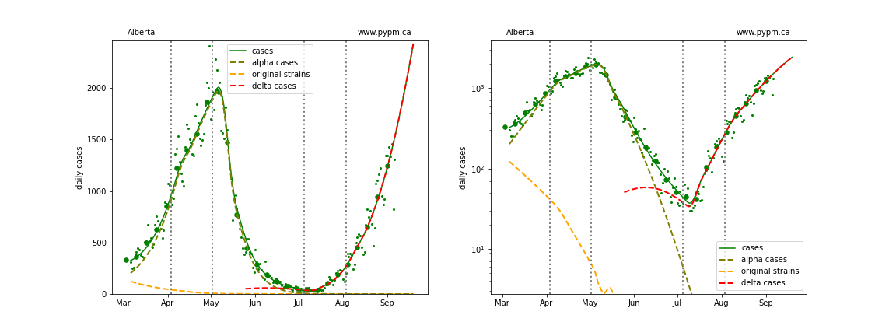

#### [Saskatchewan](img/sk_2_9_0907_cases.pdf)

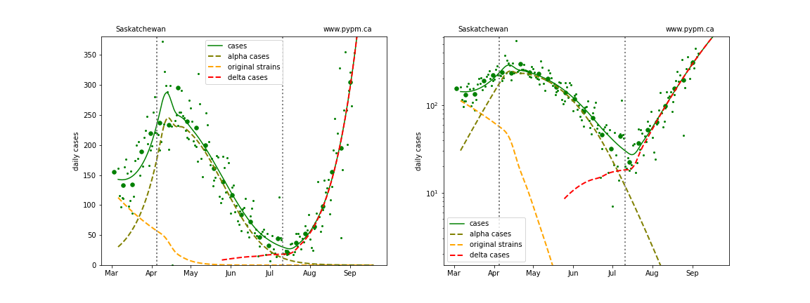

#### [Ontario](img/on_2_9_0907_cases.pdf)

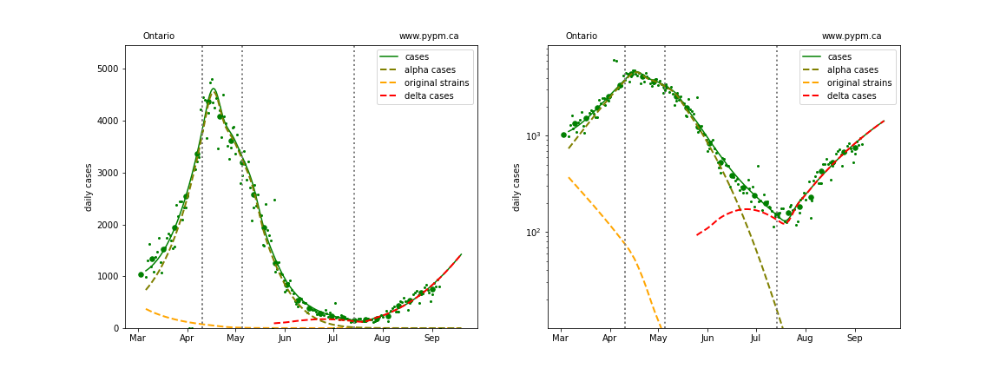

#### [Quebec](img/qc_2_9_0907_cases.pdf)

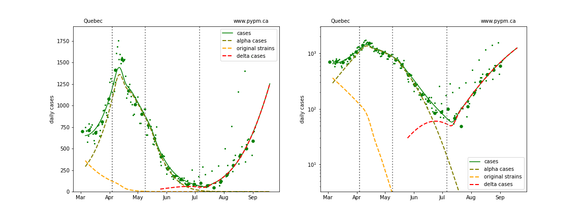

### Current growth rate

The table below indicates the growth rates for each region for recent analyses

Rpovince | Aug 30 | Sept 7
---|---
BC | +2% / day | +1% / day
Alberta | +6% / day | +4% / day
Saskatchewan | +5% / day | +5% / day
Ontario | +4% / day | +3% / day
Quebec | +4% / day | +4% / day

### Provincial histories and projections with hospital occupancy

Linear and log scale are shown to see details.
Generally, hospitalization is rising in accord with the model projection
that assumes the fraction of cases that lead to hospitalization is
constant throughout the year.

#### [Alberta](img/ab_2_9_0907_linear_proj.pdf)

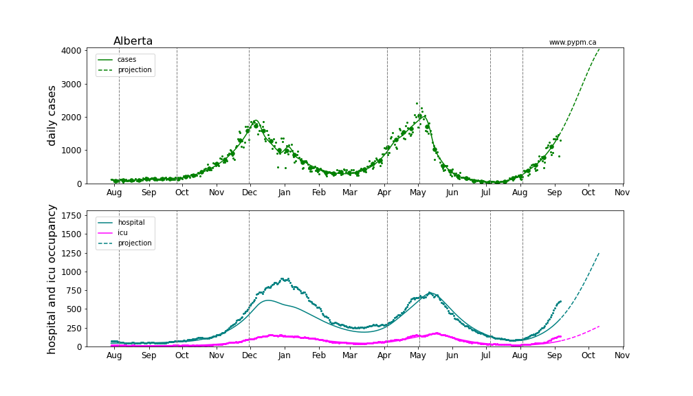
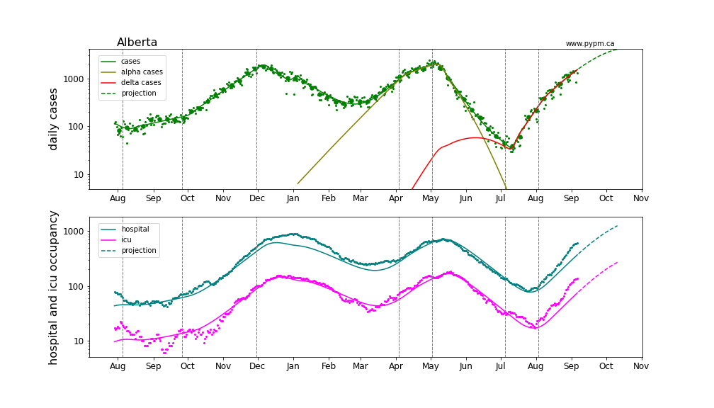

#### [Saskatchewan](img/sk_2_9_0907_linear_proj.pdf)

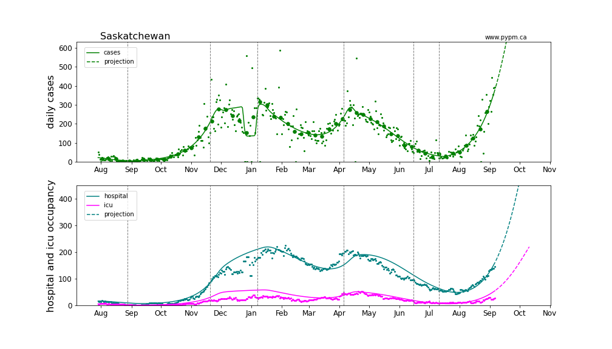

#### [Ontario](img/on_2_9_0907_linear_proj.pdf)

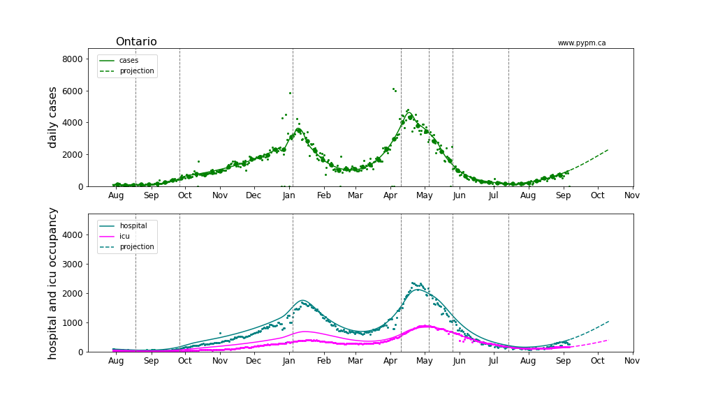
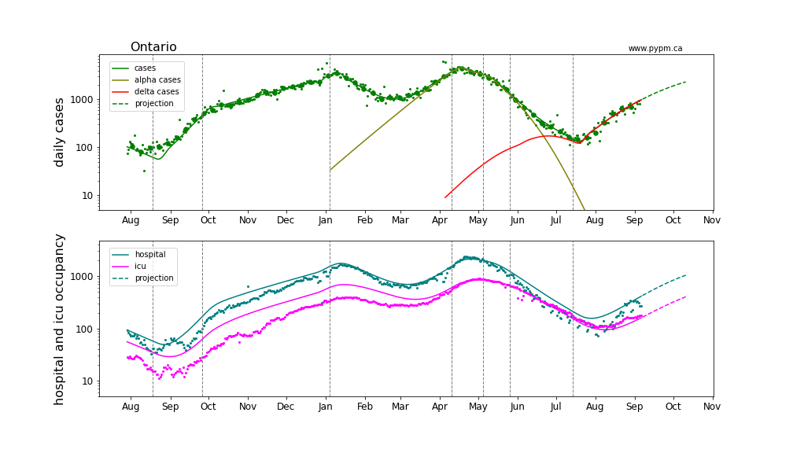

#### [Quebec](img/qc_2_9_0907_linear_proj.pdf)

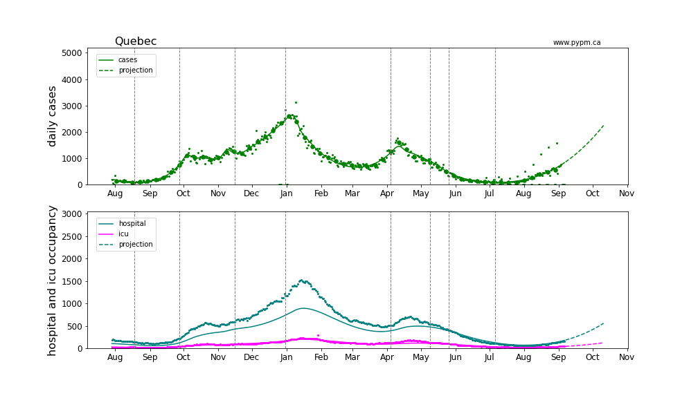
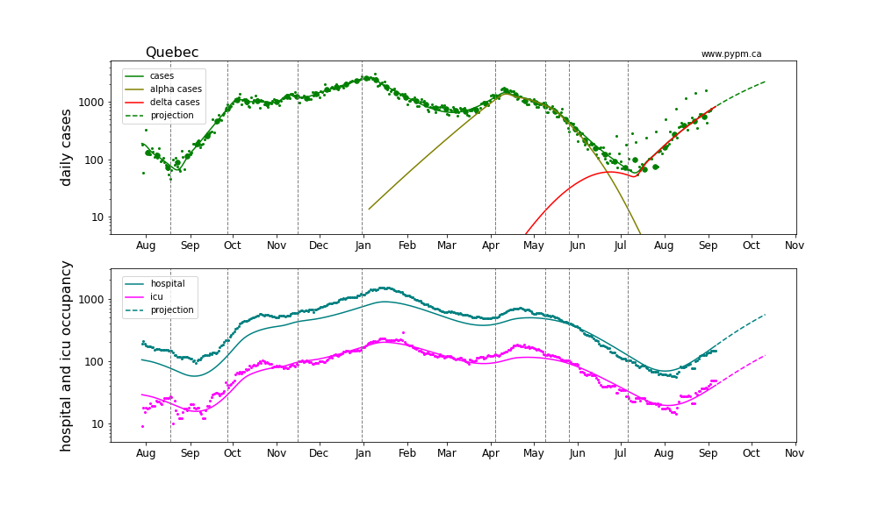

### Comparison with Alberta Covernment model update of September 3

The following plots overlay the model update results released from the Alberta Government on September 3.
The three scenarios are shown by orange lines.
Underlying these (and the pypm projections) are that current behavior continues forward.
It is not clear what would cause the rapid decline in the growth rate (from 5%/day to 0%/day over a period of
a few weeks) seen in the Alberta Government forecast.

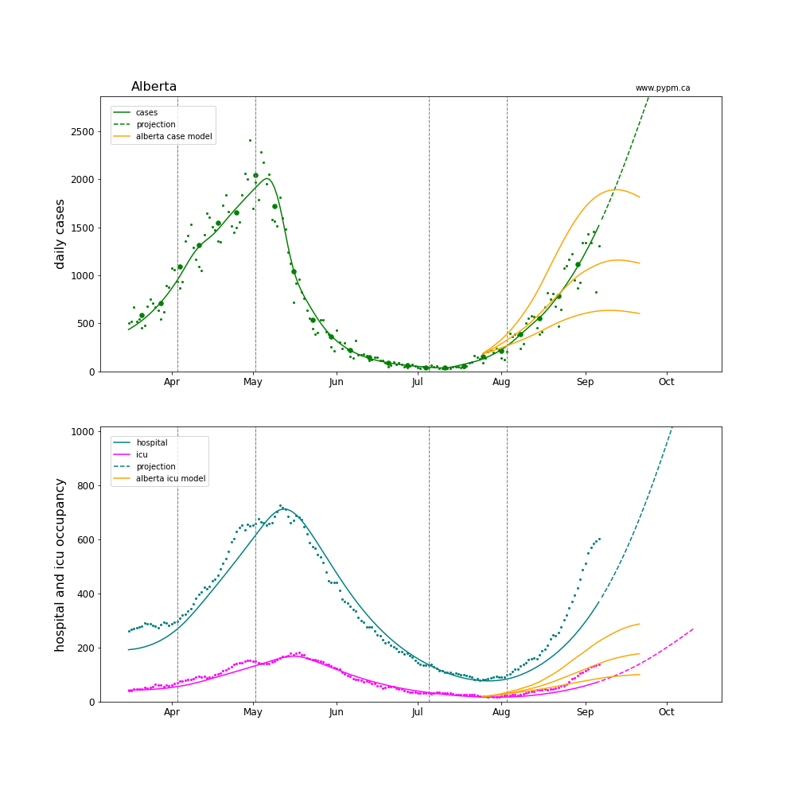
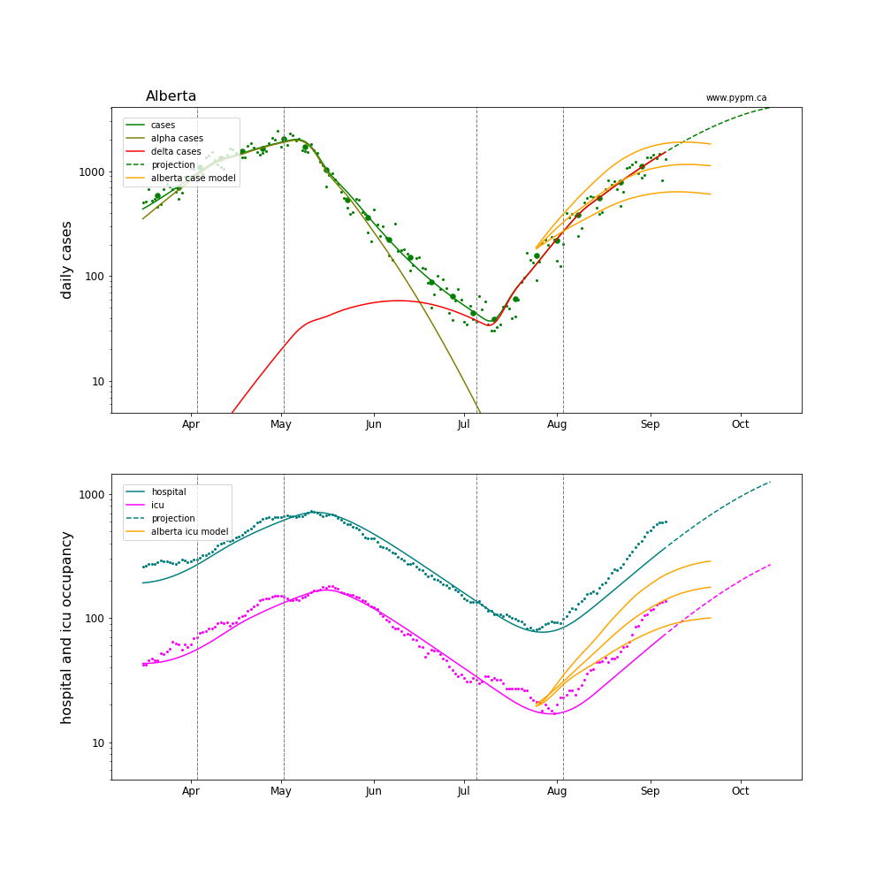

## [return to case studies](../index.md)

