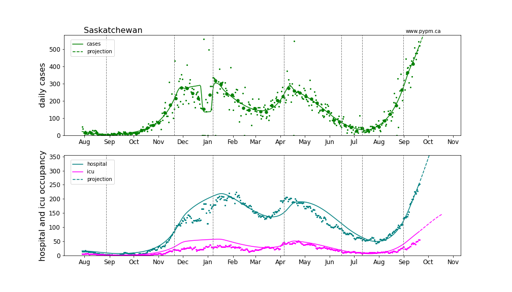

## September 21, 2021 Analysis of Canadian provincial data

This summarizes analyses of data from the Canadian provinces with substantial cases.
The model includes additional infection cycles to represent the alpha and delta variants of concern.
Past vaccination rates are included in the models.

### Current fits to data

Apart from BC and Manitoba, the other large provinces were recently experiencing rapid growth in cases.
Growth rates (measured in % per day) are slowly declining in all provinces.

European nations have experienced similar transitions to rapid growth due to delta
and several have been able to reduce or turn the growth around.
The rapid growth was also seen in all US states, and the growth continued for a long
period of time, before recently subsiding.
Model fits to EU and US states can be found [here](../index.md).

Updated model fits to provincial data are shown below on linear and log-scale:

#### BC

Detailed BC analyses are reported in the [BC analysis page](../index.md).

#### [Alberta](img/ab_2_9_0921_cases.pdf)

#### [Saskatchewan](img/sk_2_9_0921_cases.pdf)

#### [Manitoba](img/mb_2_9_0921_cases.pdf)

#### [Ontario](img/on_2_9_0921_cases.pdf)

#### [Quebec](img/qc_2_9_0921_cases.pdf)

### Current growth rate

The table below indicates the growth rates (% per day) for each province for recent analyses

Rpovince | Aug 30 | Sep 7 | Sep 13 | Sep 21
---|---|---|---|---
BC | +2% | +1% | +1% | 0%
Alberta | +6% | +4% | +2% | +2%
Saskatchewan | +5% | +5% | +4% | +2%
Manitoba | - | - | +2% | +1%
Ontario | +4% | +3% | +1% | 0%
Quebec | +4% | +4% | +2% | +1%

### Provincial histories and projections with hospital occupancy

Linear and log scale are shown to see details.
Generally, hospitalization is rising in accord with the model projection
that assumes the fraction of cases that lead to hospitalization is
constant throughout the year.

#### [Alberta](img/ab_2_9_0921_linear_proj.pdf)

#### [Saskatchewan](img/sk_2_9_0921_linear_proj.pdf)

#### [Manitoba](img/mb_2_9_0921_linear_proj.pdf)

#### [Ontario](img/on_2_9_0921_linear_proj.pdf)

#### [Quebec](img/qc_2_9_0921_linear_proj.pdf)

## [return to case studies](../index.md)

