# November 22, 2021 Analysis of Canadian provincial data

This summarizes analyses of data from the Canadian provinces with substantial cases.
The model includes additional infection cycles to represent the alpha and delta variants of concern.
Past vaccination rates are included in the models.

### Summary

In a previous summary ([October 25](../prov20211025/index.md)), 
daily growth rates for cases for all provinces
were negative, meaning that infection rates are in decline.
Furthermore, the daily growth rates themselves were trending
more negative consistent
with the effect of increasing immunity in the population.
That situation was markedly different than in Europe,
where most countries have transitioned to anoth rapid growth phase.

In the past few weeks, the situation has changed significantly for 
Manitoba, Ontario, Quebec, New Brunswick, and Nova Scotia.
Infection rates are again on the rise.
The transitions are recent, so additional data will be
useful to verify the trends and more accurately measure the growth rates.

### Current fits to data

Generally cases are used to define the infection model, since they have the highest statistics and are
widely available.
Starting August 2021, it appears that testing policy has
significantly affected the fraction of infections that are
reported as cases.
The study establishing that connection is shown in the reports dated October 4 and September 28.
For Alberta, after August 1 2021, daily hospital admission data are used in place of cases.

Updated model fits to provincial data are shown below on linear and log-scale:

#### BC

Detailed BC analyses are reported in the [BC analysis page](../index.md).

#### [Alberta](img/ab_2_9_1122_cases.pdf)

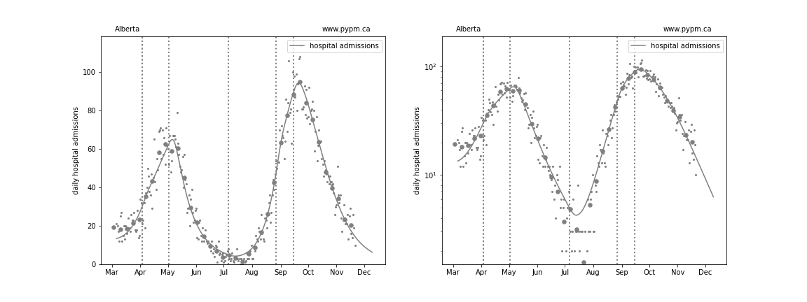

#### [Saskatchewan](img/sk_2_9_1122_cases.pdf)

#### [Manitoba](img/mb_2_9_1122_cases.pdf)

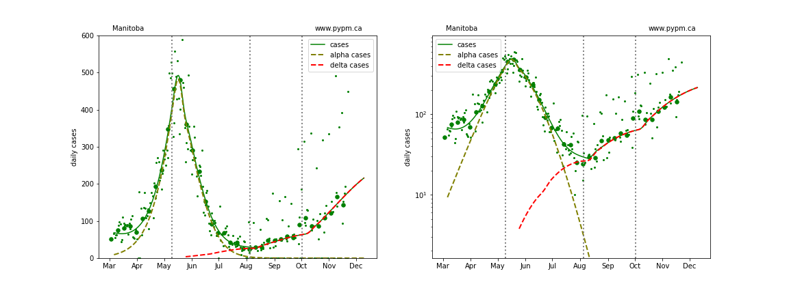

#### [Ontario](img/on_2_9_1122_cases.pdf)

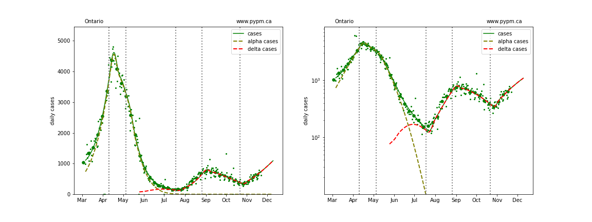

#### [Quebec](img/qc_2_9_1122_cases.pdf)

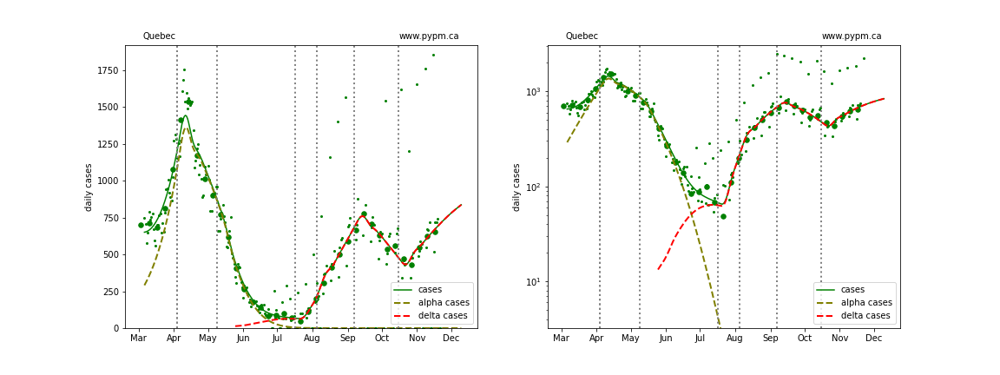

#### [New Brunswick](img/nb_2_9_1122_cases.pdf)

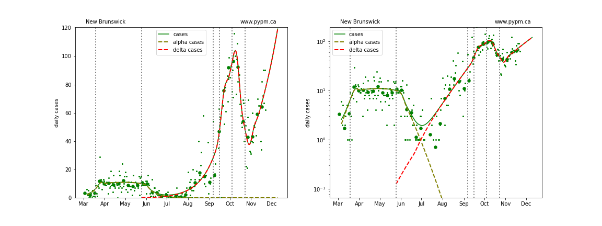

#### [Nova Scotia](img/ns_2_9_1122_cases.pdf)

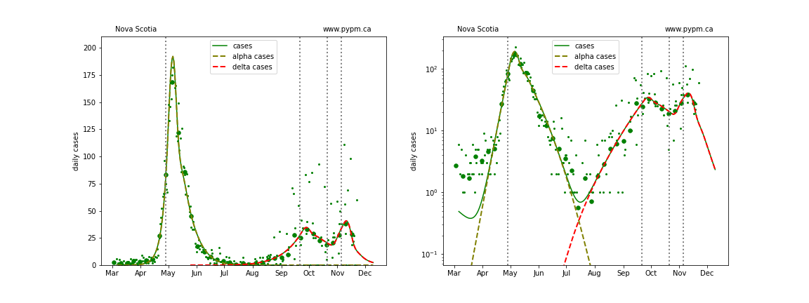

### Current growth rate

The table below indicates the growth rates (% per day) for each province for recent analyses

Province | Sep 7 | Sep 13 | Sep 21 | Sep 28 | Oct 4 | Oct 13 | Oct 25 | Nov 10 | Nov 22
---|---|---|---|---|---|---|---|---|---
BC | +1% | +1% | 0% | -1% | -1% | -1% | -2% | -3% | -3%
Alberta | +4% | +2% | +2% | +1% | -7 +/- 3% | -4% | -5% | -6% | -6%
Saskatchewan | +5% | +4% | +2% | +1% | 0% | -1% | -4% | -5% | -5%
Manitoba | - | +2% | +1% | +1% | +1% | +1% | 0% | +2% | +1%
Ontario | +3% | +1% | 0% | -1% | -1% | -2% | -2% | +4% | +2%
Quebec | +4% | +2% | +1% | +1% | -2% | -3% | -2% | +1% | +1%
New Brunswick | - | - | - | +5% | +5% | +2% | -5% | +1% | +3%
Nova Scotia | - | - | - | +5% | +4% | -3% | -3% | +6+/-3% | -8+/-3%%

The plot below compares the daily cases as a proportion of population, indicating the serious situations
in Alberta and Saskatchewan.
The Alberta calculation uses hospital admissions, and the curve corresponds to the expected number of cases
had testing not be changed in Alberta in August 2021.

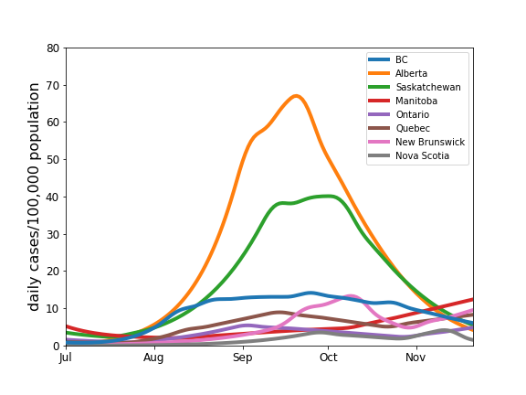

### Provincial histories and projections with hospital occupancy

Linear and log scale are shown to see details.
Generally, hospitalization is rising in accord with the model projection
that assumes the fraction of cases that lead to hospitalization is
constant throughout the year.
The hospitalization projections for the Atlantic provinces are hampered by low statistics.

#### [Alberta](img/ab_2_9_1122_linear_proj.pdf)

The Alberta analysis uses hospital admission data to estimate the growth of infections after August 1, 2021.
The case projection exceeds the number of observed cases, with the difference being cases that were
missed in Alberta due to changes in testing policy.

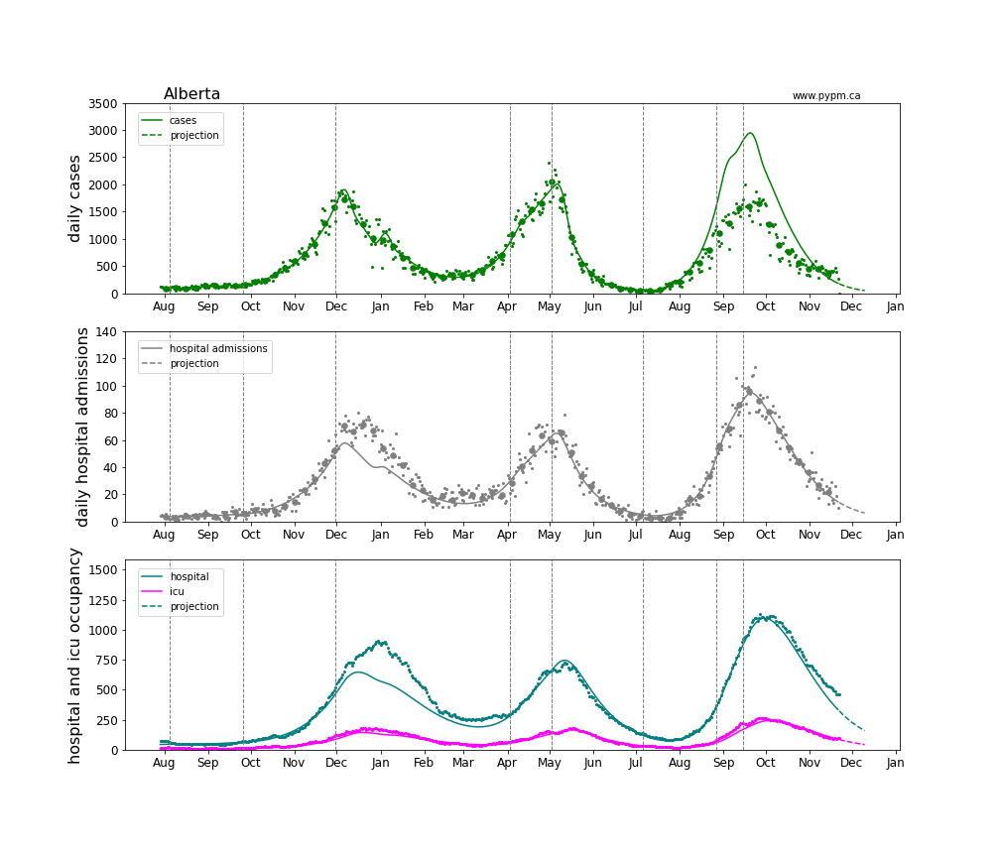

#### [Saskatchewan](img/sk_2_9_1122_linear_proj.pdf)

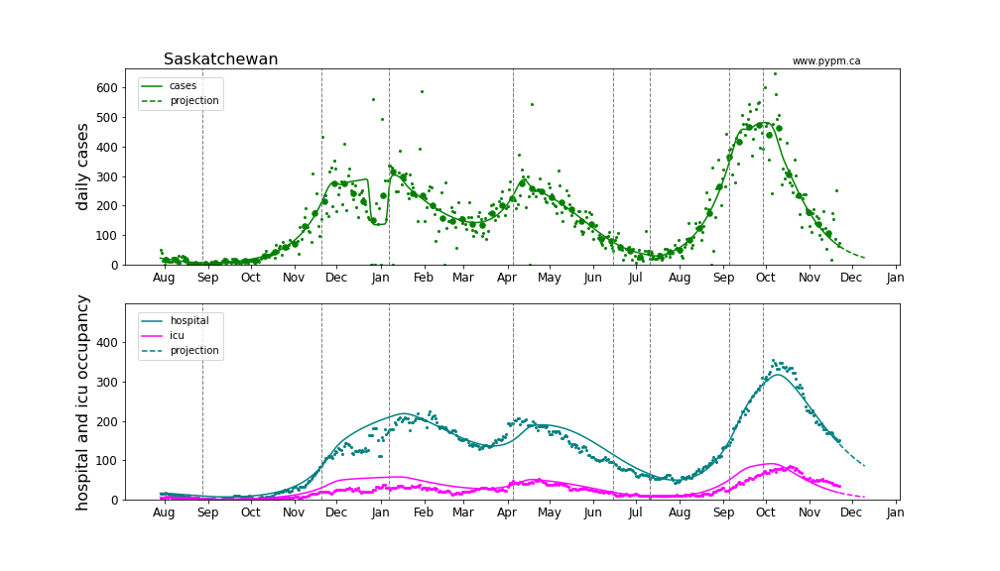

#### [Manitoba](img/mb_2_9_1122_linear_proj.pdf)

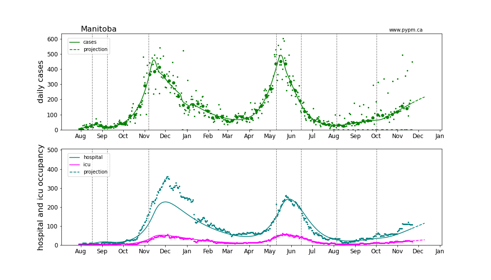
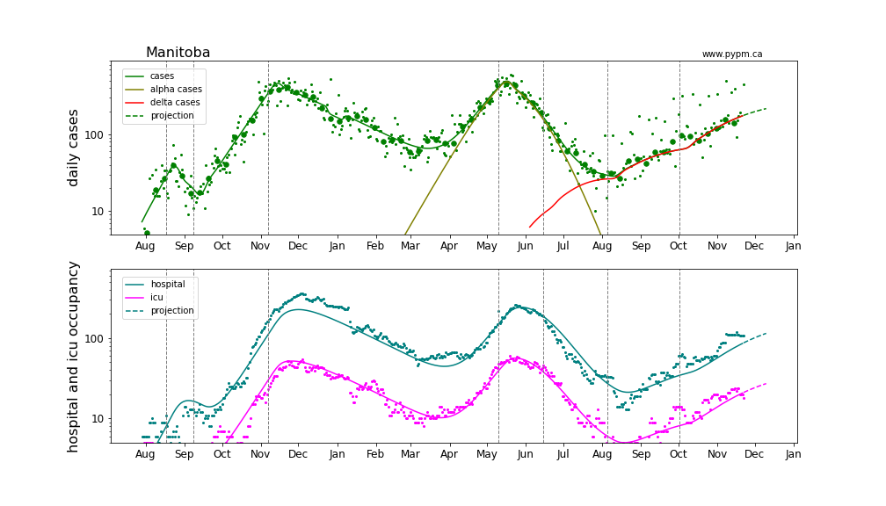

#### [Ontario](img/on_2_9_1122_linear_proj.pdf)

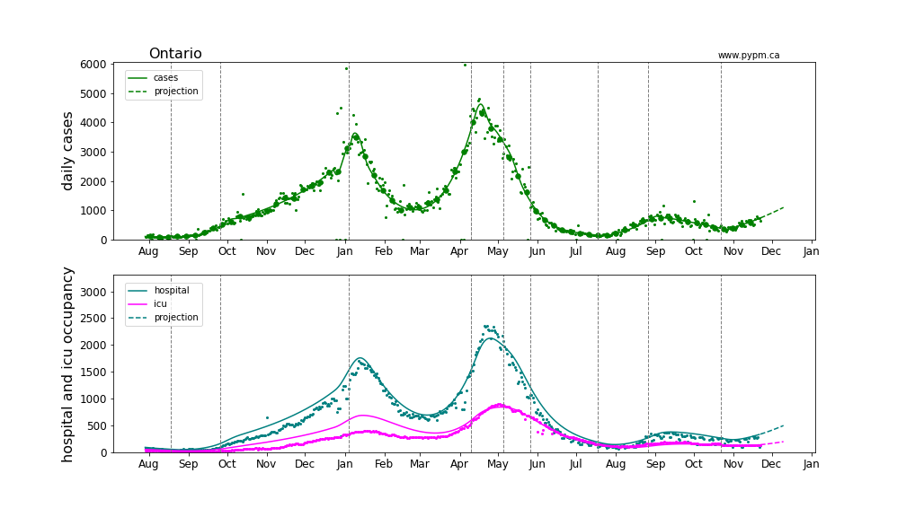

#### [Quebec](img/qc_2_9_1122_linear_proj.pdf)

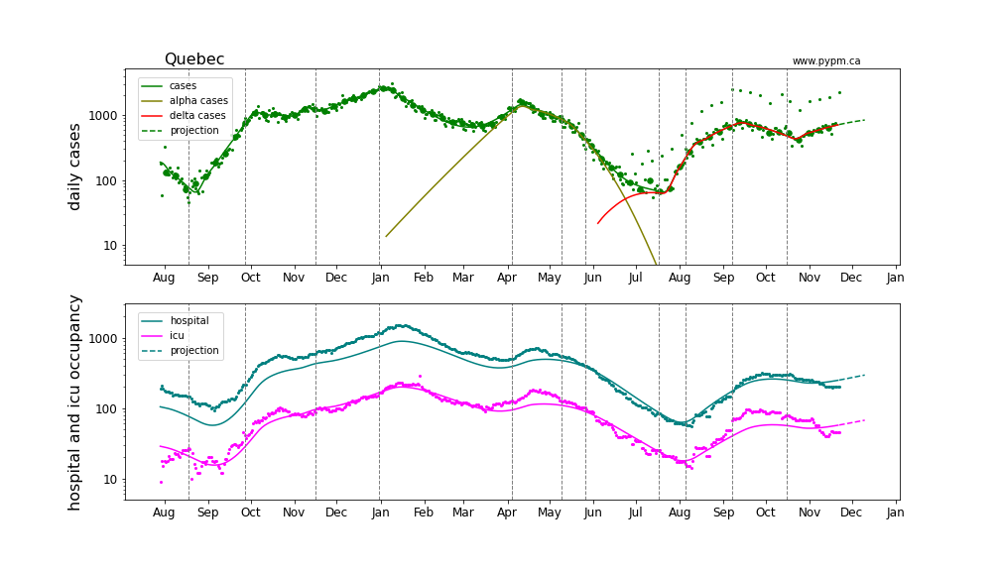

#### [New Brunswick](img/nb_2_9_1122_linear_proj.pdf)

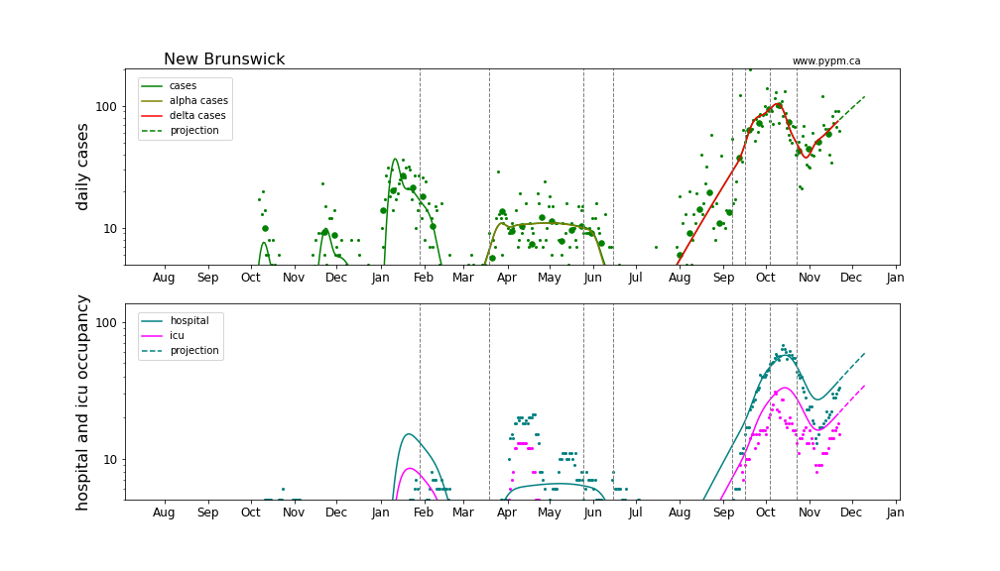

#### [Nova Scotia](img/ns_2_9_1122_linear_proj.pdf)

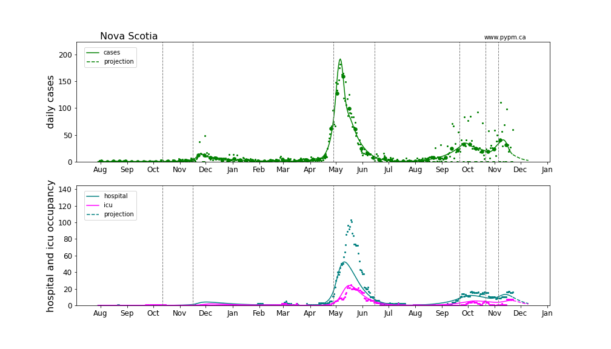
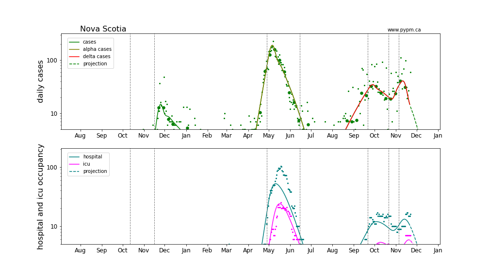

## [return to case studies](../index.md)

