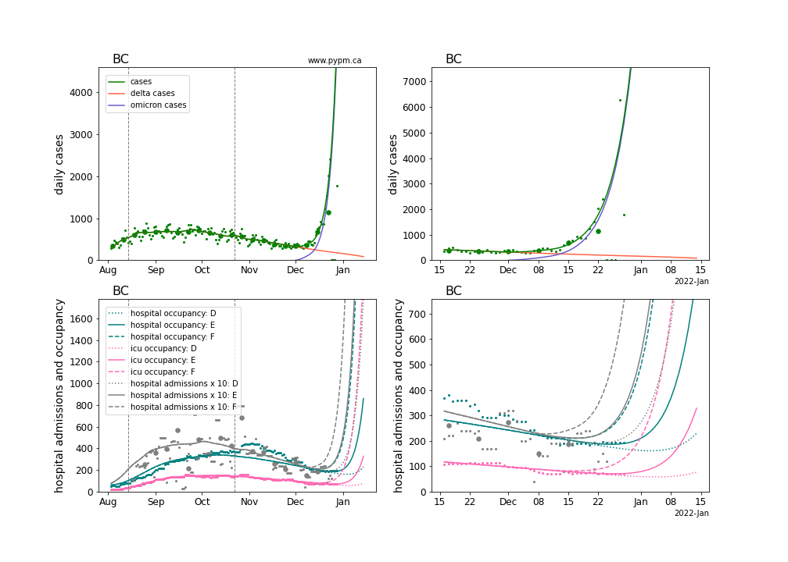

# December 29, 2021 Analysis of Canadian provincial data: Omicron projections

This summarizes analyses of data from the Canadian provinces with substantial cases.
The model includes additional infection cycles to represent the alpha, delta, and omicron variants of concern.
Past vaccination rates are included in the models.

Vaccine and natural immunity are evaded to some extent by omicron. The projections assume a substantial
loss in immunity combined with higher transmission rates result in the observed growth advantage of omicron
over delta.

Case data collected after December 20 is no longer considered reliable, due to testing capacity and
holiday closures.
Fits to case data have not been updated to use more recent data, except for Saskatchewan and Nova Scotia.

### Summary

Projections show that the very rapid rise in infections due to omicron will pose a serious challenge to
health care across the country.

The severity of omicron is still not well understood. The projections shown here use very optimistic reductions in
severity. Both the probability of severe infection and the time spent in hospital are multiplied by a factor 
according to the severity scenario label (D: 0.1, E:0.3, F:1.).
Even with these reductions in severity, hospital demands will soon exceed previous record highs, and will continue
to rise into the New Year.

### Current fits to data including omicron

The pypm model has been [extended](reports/pypm_changes_3_1.pdf) 
by including an additional strain representing omicron, and additional
susceptible populations, representing those whose immunity is ineffective against omicron. 

Omicron is dominant in all provinces analyzed as of December 29. 
For Saskatchewan, a growth rate of 25% per day is assumed for omicron, because there is insufficent data to estimate that parameter.

Generally cases are used to define the infection model, since they have the highest statistics and are
widely available.
The history of infections is characterized by long periods of constant transmission rates.
In the plots below, vertical dashed lines show where changes to transmission rates are found by fitting the
model to the case data.
These change points often correspond with announced lifting or imposition of measures to reduce transmission.

Reporting and hospitalization follows from the infections, with probabilities and delay times estimated
by calibrating to past data.
This approach has performed well until recently, without the need to adjust parametrizations for the different variants.
Recently there have been some departures from the hospitalization projections, not yet understood.

Three severity levels are considered:
* **D**: Probability for an omicron infected person to need hospitalization is reduced by the multiplicative factor of 0.1 
and the probability of death is reduced by that factor squared. The length of hospital stays for all infected by 
omicron are reduced by the same factor of 0.1.
* **E**: The severity factor is 0.3, instead of 0.1.
* **F**: The severity factor is 1. In other words, there is no reduction in severity as compared to delta infections.
It is too soon to judge which, if any, of these severities are supported by data. All except "D" scenerio lead 
to rapid growth in hospital demands, far in excess of capacity.

The plots below show daily values as small points, and weekly averages as larger circles.
Solid curves show the model expectations, using fit parameters, and the dashed line show projections
of hospitalization demands assuming no change to model parameters. No capacity limits are imposed on those
projections.

The projections assume no change in social behaviour in the coming 4 weeks - it represents a status-quo scenario; 
one that demonstrates **it is essential to reduce transmission rates immediately**.

#### [BC](img/bc_4_1_1229_linear_omicron_alt.pdf)

The model fit to case data finds that omicron is producing about 83% of case on December 20, 
and growing at a rate of 23% per day.
Analysis for each Health authority are reported in the [BC analysis page](../index.md).

#### [Alberta](img/ab_4_1_1229_linear_omicron_alt.pdf)

Starting August 2021, the change in testing policy, by nearly eliminating contact tracing,
significantly affected the fraction of infections that are
reported as cases.
After August 1 2021, daily hospital admission data are used in place of cases to define the
infection model for the province.
The model curve for cases, shows the expected number of cases that would have been reported
had contact tracing remained.
Hospital admission data are in too low numbers to use to estimate omicron parameters.
The growth rate is estimated using case data, and found to be 29% per day with the current case fraction
also at 83%.

#### [Saskatchewan](img/sk_4_1_1229_linear_omicron_alt.pdf)

Omicron has not yet reached a proportion of cases in Saskatchewan to measure its parameters.
An omicron growth rate of 25%/day is assumed and the current fraction of cases is assumed to be 10%

#### [Manitoba](img/mb_4_1_1229_linear_omicron_alt.pdf)

The recent upward departure from the previous trend of cases in Manitoba may be due to omicron.
The model fit to the case data estimate the omicron growth rate and current fraction to be 37% per day and 52%, respectively. 
Given the limited data, omicron parameter estimates have significant uncertainty.

#### [Ontario](img/on_4_1_1229_linear_omicron_alt.pdf)

The model fit to Ontario data shows omicron currently
growing at 30% per day and producing 74% of cases.

#### [Quebec](img/qc_4_1_1229_linear_omicron_alt.pdf)

The interpretation of recent Quebec data is difficult, due to a recent outbreak followed by
what appears to be a rise in cases from omicron.
The omicron growth rate is found to be smaller than the other provinces, at 22% per day and omicron
producing 75% of cases.

#### [New Brunswick](img/nb_4_1_1229_linear_omicron_alt.pdf)

The effect of omicron appears to be significant, but with limited case numbers, only the current
fraction is estimated from the case data, at 26%.

#### [Nova Scotia](img/ns_4_1_1229_linear_omicron_alt.pdf)

The model fit finds that omicron is producing 63% of cases. The growth rate is fixed at 25%/day.

### Comparison of omicron parameters in Canada

The table below indicates the omicron growth rates (% per day) and current fraction for each province.
Values in parenthesis are not estimated from data, but instead indicate the assumed values.
Uncertainties in these estimates are relatively large - no attempt to assess them, given the rapidly changing
situation.

Province | growth (%/day), fraction (%)
---|---
BC | 22, 97
Alberta | 28, 99
Saskatchewan | (25), 87
Manitoba | 36, 95
Ontario | 29, 96
Quebec | 21, 95
New Brunswick | 19, 58
Nova Scotia | 21, 99 

## [return to case studies](../index.md)

