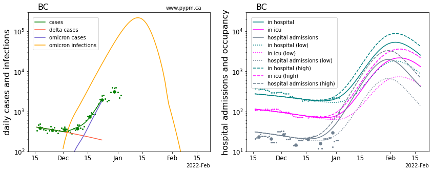
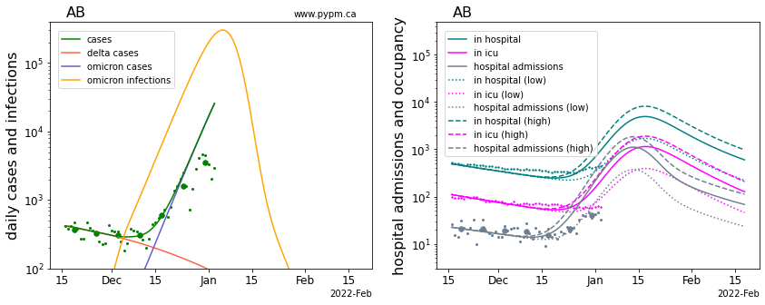
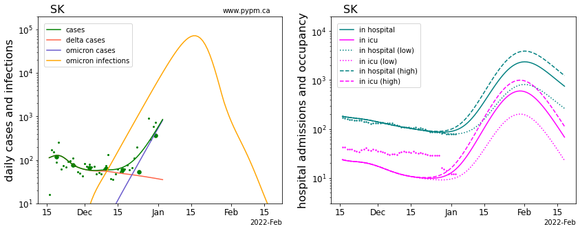
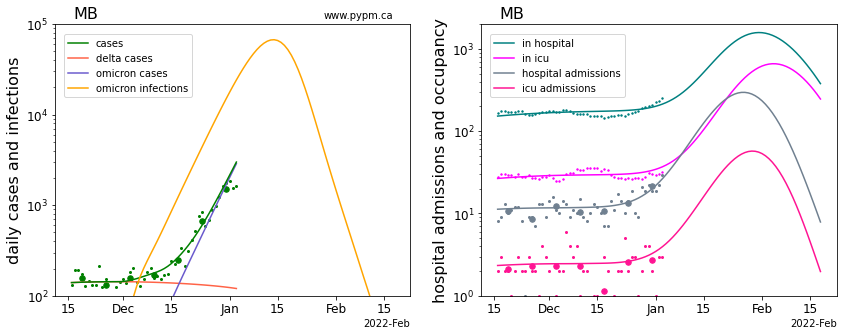
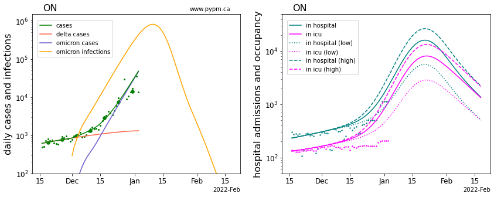
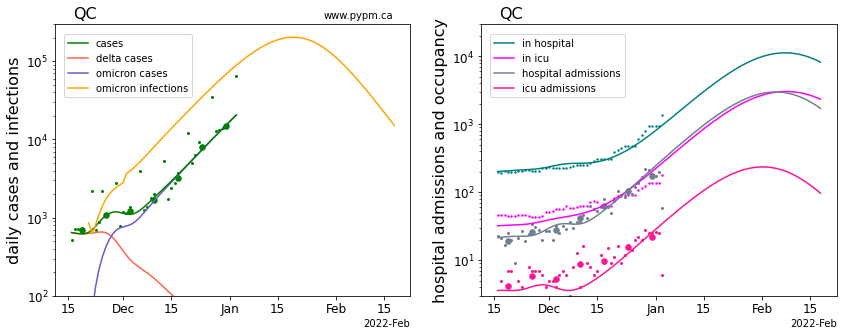
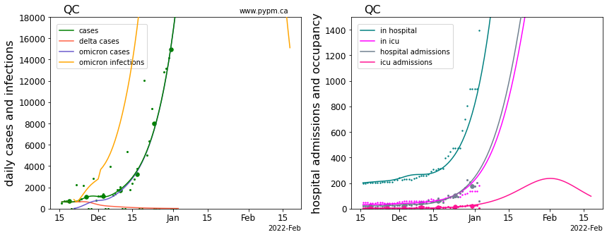
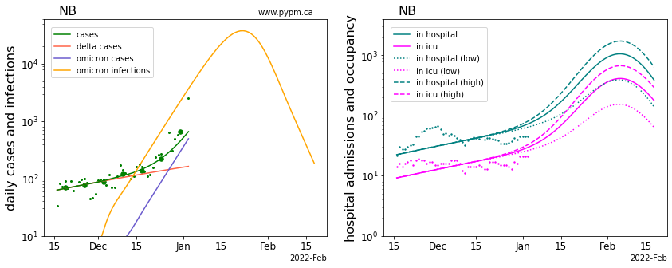
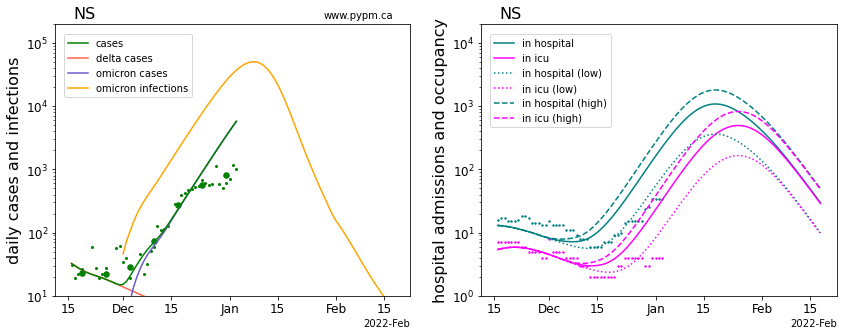

# January 4, 2022 Analysis of Canadian provincial data: Longer term Omicron projections

This report 6-week projections for Omicron infections and hospitalization demands for the larger Canadian provinces.

Generally case data collected after about December 20 is no longer considered reliable, due to testing capacity and
holiday closures.
Projections show that the very rapid rise in infections due to omicron will pose a serious challenge to
health care across the country.
Quebec and Ontario are the first provinces to experience rapid growth in hospital demands due to Omicron.
Hospital admission and census data (broken down by
ICU and non-ICU care) allows the growth to be monitored and projected more accurately, in absense of reliable case data.

### Projections

Case data until late December 2021 is used to estimate the growth rate of Omicron infections
and that rate of growth is assumed to continue for the coming weeks.
Since the reporting fraction is no longer stable, the projections show infections instead of cases to characterize the
overall trajectory of the epidemic.
While the growth rate of infections can be estimated from the earlier case data, the absolute number of infections each day
is uncertain, and detecting changes to growth rate is more challenging.
The uncertain immunity of the population against Omicron further complicates matters.
With a rapid growth in infections that build population immunity, will soon lead to herd immunity as seen in the
projections of infection rates.
Heterogeneity (not present in these homogeneous models) may result in an earlier onset of herd immunity.

Translating infections to hospitalizations relies on understanding the severity of Omicron infections, for
which there remains considerable uncertainty.
While the severity of Omicron infection appears to be smaller than for Delta infections, the reduction in
severity is not well established, so a range of severity factors are considered.
For provinces with insufficient data to estimate Omicron severity, the 
nominal assumption is that the fraction of Omicron infections requiring hospitalization is 0.3 times smaller than for Delta infections,
and hospital stay duration is 0.4 times smaller than for the Delta hospitalizations.
Hospital projections do not include hospitalization capacity limits or changes to admission policies.

A more detailed look at the effect of many of the unknown factors is found in this week's [report](https://bccovid-19group.ca/post/2022-01-06-report/)
from the BC-COVID-19 modelling group and from the pypm BC analysis posted [here](https://pypm.github.io/home/docs/studies/bc20220104/).

The plots below show daily values as small points, and weekly averages as larger circles.
Solid curves show the model projections.
The projections assume no change in social behaviour in the coming 4 weeks, and therefore represents a status-quo scenario. 

#### [BC](img/bc_4_1_1231_severity.pdf)

The case data until Decemeber 23 is used to estimate the growth rate of Omicron infections.
If that rate continues, daily infections peak in mid-January and then rapidly decline.
Projections for resulting hospital demand shows a growth in hospital admissions starting now, and
in the days ahead hospital occupancy will start to rapidly increase.

The peak hospital demand is directly related to the assumed Omicron severity.
The solid curve shows the nominal severity assumption (0.3 times that of Delta) and the dotted and dashed curves show the
projections for 0.1 and 0.5 times that of Delta. In all cases, hospital duration is assumbe to be 0.4 times that of Delta.

As projected, hospital admissions has begun to increase in the last days.
To better monitor the situation, accurate and timely hospital admission data (ICU and non-ICU) needs to be reported.
It is critical that admission dates be accurately assigned to admissions, and not have blocks of admissions be reported
from time to time.

More information, including studies of sources of uncertainty are found [here](https://pypm.github.io/home/docs/studies/bc20220104/).

#### [Alberta](img/ab_4_1_0104_severity_log.pdf)

While growth in hospital admissions is seen, the growth is less than expected for the lowest Omicron severity factor shown (0.1).
Hospital occupancy is also not growing as fast as the projections.
This may indicate that the infection growth rate is slower than estimated using case data from early December.
For future analyses, hospital admission data will be used to estimate growth rate directly.

#### [Saskatchewan](img/sk_4_1_0104_severity_log.pdf)

Hospital admission data is not publicly available, so it will be more difficult to project hospital demands going forward.
Hospital occupancy is not yet showing growth, but it is not expected to be seen. ICU occupancy data has shown an unusual
drop in the past week.

#### [Manitoba](img/mb_4_1_0104_severity_log.pdf)

The case data does not appear to show the problems seen in other provinces arising from test capacity limits.

Manitoba provides both ICU and non-ICU admission data, so projecting hospital demands will be more reliable.
As projected, the hospital admissions has started to rise.
From these data, the Omicron severity is estimated to be 0.12. 

#### [Ontario](img/on_4_1_0104_severity_log.pdf)

Ontario is experiencing rapid growth in hospital occupancy (with severity between 0.1 and 0.3), but not in ICU occupancy.
Hospital admission data is not publicly available, so projecting hospital demands is more difficult.

#### [Quebec](img/qc_4_1_0104_severity_log.pdf)

Quebec data shows rapid growth in admissions and occupancy.
The inferred Omicron severity is quite high: 0.85 for non-ICU hospital and 0.4 for ICU hospital.

The measured growth rate (11%/day) may be lower than the true growth rate of infections, which
would result in over-estimates for the Omicron severity factors.

The use of log scale is convenient to show the wide range of infection and hospitalization.
The figure below shows the same data on a linear scale, to give a better impression for the
rate of growth in hospital demands.

#### [New Brunswick](img/nb_4_1_0104_severity_log.pdf)

Hospital occupancy is not yet showing a clear signal of growth due to Omicron infections.

#### [Nova Scotia](img/ns_4_1_0104_severity_log.pdf)

Hospital occupancy is growing, but at a rate somewhat below that expected for the lowest
assumed Omicron severity.
The growth rate of infections may now be slower than estimated from early December case data.

### Comparison of omicron parameters in Canada

The table below indicates the omicron growth rates (% per day) for each province, using
case data from early December.
Uncertainties in these estimates are relatively large - no attempt to assess them, given the rapidly changing
situation.

Province | growth (%/day)
---|---
BC | 21
Alberta | 28
Saskatchewan | 25
Manitoba | 20
Ontario | 23
Quebec | 11
New Brunswick | 19
Nova Scotia | 21

## [return to case studies](../index.md)

