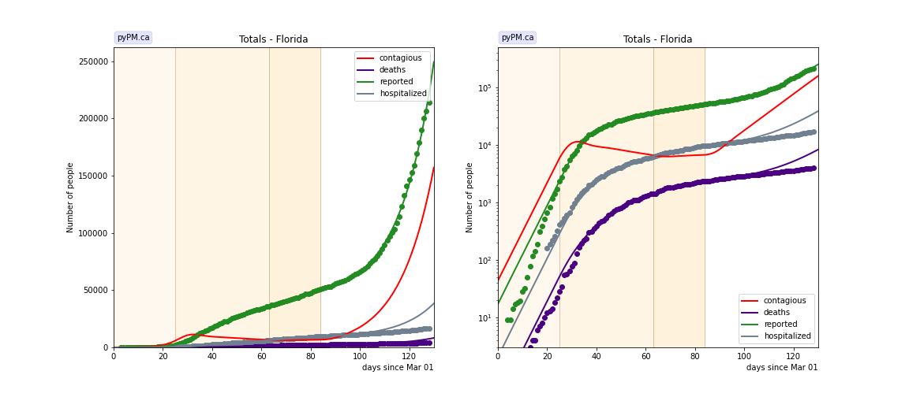
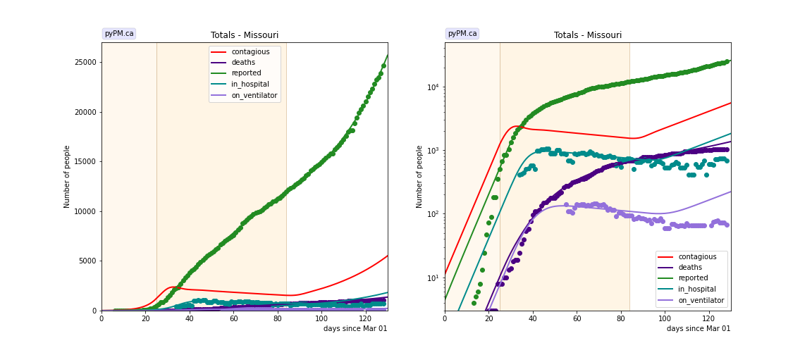
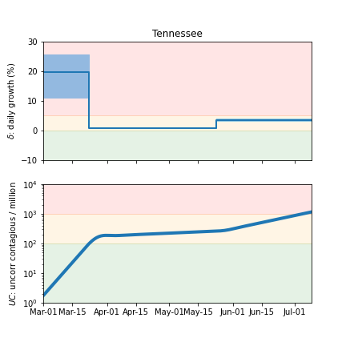
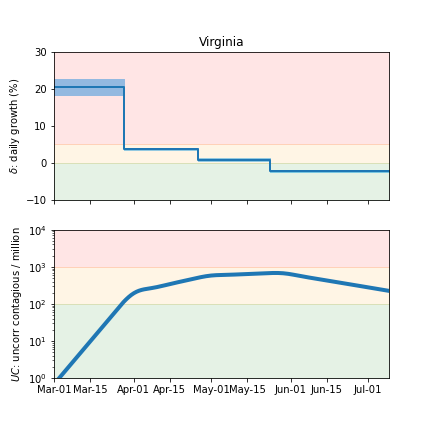

## July 8, 2020 Analysis of USA state data

Below shows the case / hospitalization / deaths data for all 50 states and DC.
The infection trajectory is determined by fits to the cumulative
case data.

The red curves (contagious population) is the inferred contagious population.
Its shape is determined from the case data. Its scale is not well known.

The data fits were done using data up until July 7.

### [Alaska](img/ak_2_3_0708.pdf)

### [Alabama](img/al_2_3_0708.pdf)

### [Arkansas](img/ar_2_3_0708.pdf)

### [Arizona](img/az_2_3_0708.pdf)

### [California](img/ca_2_3_0708.pdf)

### [Colorado](img/co_2_3_0708.pdf)

### [Connecticut](img/ct_2_3_0708.pdf)

### [District Of Columbia](img/dc_2_3_0708.pdf)

### [Delaware](img/de_2_3_0708.pdf)

### [Florida](img/fl_2_3_0708.pdf)

### [Georgia](img/ga_2_3_0708.pdf)

### [Hawaii](img/hi_2_3_0708.pdf)

### [Iowa](img/ia_2_3_0708.pdf)

### [Idaho](img/id_2_3_0708.pdf)

### [Illinois](img/il_2_3_0708.pdf)

### [Indiana](img/in_2_3_0708.pdf)

### [Kansas](img/ks_2_3_0708.pdf)

### [Kentucky](img/ky_2_3_0708.pdf)

### [Louisiana](img/la_2_3_0708.pdf)

### [Massachusetts](img/ma_2_3_0708.pdf)

### [Maryland](img/md_2_3_0708.pdf)

### [Maine](img/me_2_3_0708.pdf)

### [Michigan](img/mi_2_3_0708.pdf)

### [Minnesota](img/mn_2_3_0708.pdf)

### [Missouri](img/mo_2_3_0708.pdf)

### [Mississippi](img/ms_2_3_0708.pdf)

### [Montana](img/mt_2_3_0708.pdf)

### [North Carolina](img/nc_2_3_0708.pdf)

### [North Dakota](img/nd_2_3_0708.pdf)

### [Nebraska](img/ne_2_3_0708.pdf)

### [New Hampshire](img/nh_2_3_0708.pdf)

### [New Jersey](img/nj_2_3_0708.pdf)

### [New Mexico](img/nm_2_3_0708.pdf)

### [Nevada](img/nv_2_3_0708.pdf)

### [New York](img/ny_2_3_0708.pdf)

### [Ohio](img/oh_2_3_0708.pdf)

### [Oklahoma](img/ok_2_3_0708.pdf)

### [Oregon](img/or_2_3_0708.pdf)

### [Pennsylvania](img/pa_2_3_0708.pdf)

### [Rhode Island](img/ri_2_3_0708.pdf)

### [South Carolina](img/sc_2_3_0708.pdf)

### [South Dakota](img/sd_2_3_0708.pdf)

### [Tennessee](img/tn_2_3_0708.pdf)

### [Texas](img/tx_2_3_0708.pdf)

### [Utah](img/ut_2_3_0708.pdf)

### [Virginia](img/va_2_3_0708.pdf)

### [Vermont](img/vt_2_3_0708.pdf)

### [Washington](img/wa_2_3_0708.pdf)

### [Wisconsin](img/wi_2_3_0708.pdf)

### [West Virginia](img/wv_2_3_0708.pdf)

### [Wyoming](img/wy_2_3_0708.pdf)

## Tables

The tables below are results from the fits to reference model 2.3.
These are shown for purposes of comparison.

### Daily fractional growth rates (&delta;)

state| &delta;0 | day 1 | &delta;1 | day 2 | &delta;2 | day 3 | &delta;3 | day 4 | &delta;4 
---|---|---|---|---|---|---|---|---|---
AL|0.102 +/- 0.009|32|0.007 +/- 0.002|84|0.030 +/- 0.002
AR|0.090 +/- 0.010|34|-0.041 +/- 0.014|84|0.028 +/- 0.003
AZ|0.051 +/- 0.008|26|0.034 +/- 0.002|84|0.056 +/- 0.003
CA|0.172 +/- 0.011|27|0.010 +/- 0.001|84|0.035 +/- 0.001
CO|0.151 +/- 0.014|24|0.011 +/- 0.006|44|-0.020 +/- 0.004|74|-0.021 +/- 0.006|84|-0.004 +/- 0.004
CT|0.254 +/- 0.019|24|0.056 +/- 0.005|38|-0.021 +/- 0.001|84|-0.053 +/- 0.004
DC|0.185 +/- 0.019|27|0.016 +/- 0.006|50|-0.020 +/- 0.002|84|-0.035 +/- 0.002
DE|0.205 +/- 0.012|29|0.033 +/- 0.004|49|-0.001 +/- 0.003|71|-0.044 +/- 0.008|99|0.053 +/- 0.008
FL|0.217 +/- 0.015|25|-0.014 +/- 0.002|63|0.006 +/- 0.003|84|0.077 +/- 0.002
GA|0.228 +/- 0.015|27|-0.006 +/- 0.001|84|0.043 +/- 0.002
HI|0.159 +/- 0.021|26|-0.074 +/- 0.015|84|0.048 +/- 0.015
IA|0.232 +/- 0.009|22|0.069 +/- 0.004|55|-0.019 +/- 0.001|84|0.010 +/- 0.002
ID|0.259 +/- 0.018|24|-0.044 +/- 0.008|49|-0.008 +/- 0.007|84|0.080 +/- 0.004
IL|0.162 +/- 0.010|26|0.032 +/- 0.002|60|-0.016 +/- 0.001|84|-0.077 +/- 0.004|95|0.006 +/- 0.003
IN|0.230 +/- 0.022|25|0.011 +/- 0.002|55|-0.014 +/- 0.002|84|-0.003 +/- 0.003
KS|0.154 +/- 0.020|25|0.035 +/- 0.016|41|-0.000 +/- 0.008|84|0.035 +/- 0.008
KY|0.235 +/- 0.021|22|0.058 +/- 0.007|40|0.004 +/- 0.003|84|0.007 +/- 0.004
LA|0.267 +/- 0.013|26|-0.047 +/- 0.004|50|0.013 +/- 0.004|84|0.052 +/- 0.003
MA|0.159 +/- 0.014|28|0.033 +/- 0.004|46|-0.028 +/- 0.002|84|-0.045 +/- 0.002
MD|0.131 +/- 0.006|34|0.015 +/- 0.001|74|-0.027 +/- 0.002|110|0.003 +/- 0.016
ME|0.221 +/- 0.073|16|0.011 +/- 0.005|84|-0.012 +/- 0.005
MI|0.112 +/- 0.005|20|-0.012 +/- 0.001|71|-0.054 +/- 0.005|94|0.044 +/- 0.005
MN|0.101 +/- 0.016|19|0.053 +/- 0.006|47|0.014 +/- 0.002|76|-0.052 +/- 0.003|95|0.025 +/- 0.003
MO|0.207 +/- 0.032|25|-0.006 +/- 0.004|84|0.032 +/- 0.003
MS|0.118 +/- 0.008|34|0.004 +/- 0.004|84|0.027 +/- 0.002
MT|0.179 +/- 0.033|23|-0.054 +/- 0.020|37|-0.097 +/- 0.045|84|0.080 +/- 0.013
NC|0.122 +/- 0.017|24|0.027 +/- 0.001|84|0.021 +/- 0.001
ND|0.289 +/- 0.108|22|-0.040 +/- 0.004|84|0.001 +/- 0.004
NE|0.196 +/- 0.024|25|0.094 +/- 0.034|53|-0.015 +/- 0.005|84|-0.016 +/- 0.004
NH|0.168 +/- 0.029|28|0.007 +/- 0.010|84|-0.044 +/- 0.020
NJ|0.217 +/- 0.006|25|-0.001 +/- 0.001|49|-0.038 +/- 0.001|84|-0.025 +/- 0.002
NM|0.153 +/- 0.024|30|0.025 +/- 0.009|59|-0.010 +/- 0.005|84|0.011 +/- 0.005
NV|0.318 +/- 0.042|21|-0.004 +/- 0.004|84|0.060 +/- 0.003
NY|0.243 +/- 0.008|20|0.020 +/- 0.002|36|-0.039 +/- 0.000|84|-0.016 +/- 0.002
OH|0.267 +/- 0.031|23|-0.005 +/- 0.008|50|-0.011 +/- 0.002|84|0.019 +/- 0.002
OK|0.226 +/- 0.039|24|-0.002 +/- 0.003|84|0.053 +/- 0.003
OR|0.096 +/- 0.022|25|0.000 +/- 0.006|84|0.048 +/- 0.003
PA|0.343 +/- 0.017|22|0.088 +/- 0.012|32|-0.014 +/- 0.001|84|-0.042 +/- 0.005|98|0.030 +/- 0.004
RI|0.170 +/- 0.008|34|0.028 +/- 0.009|48|-0.024 +/- 0.005|84|-0.039 +/- 0.009
SC|0.266 +/- 0.031|22|0.012 +/- 0.002|84|0.060 +/- 0.002
SD|0.175 +/- 0.022|38|-0.063 +/- 0.025|49|0.001 +/- 0.012|84|-0.005 +/- 0.029
TN|0.199 +/- 0.038|22|0.008 +/- 0.001|84|0.036 +/- 0.002
TX|0.149 +/- 0.008|29|0.007 +/- 0.001|84|0.057 +/- 0.001
UT|0.135 +/- 0.019|25|0.010 +/- 0.005|73|0.031 +/- 0.002
VA|0.208 +/- 0.011|27|0.037 +/- 0.002|56|0.008 +/- 0.002|84|-0.023 +/- 0.002
VT|0.142 +/- 0.028|25|-0.067 +/- 0.015|84|0.078 +/- 0.036
WA|0.098 +/- 0.011|11|-0.005 +/- 0.001|84|0.024 +/- 0.004
WI|0.208 +/- 0.019|24|-0.027 +/- 0.003|84|0.008 +/- 0.002
WV|0.216 +/- 0.045|25|-0.021 +/- 0.010|84|0.049 +/- 0.014
WY|0.179 +/- 0.045|23|-0.031 +/- 0.057|51|-0.026 +/- 0.020|84|0.042 +/- 0.011

* &delta;0: initial daily fractional growth parameter
* day 1: days after March 1, 2020 when transmission rate changed
* transition day 84 (May 23) forced: used to estimate growth following Memorial day weekend

## Infection status

The following plots summarize the infection history.
The upper plot shows the daily growth/decline from the fit. Bands show approximate 95% CL intervals.
The lower plot shows the size of the infection: the uncorrected circulating contagious population per
million.

### [Alabama](img/al-summary.pdf)

### [Arkansas](img/ar-summary.pdf)

### [Arizona](img/az-summary.pdf)

### [California](img/ca-summary.pdf)

### [Colorado](img/co-summary.pdf)

### [Connecticut](img/ct-summary.pdf)

### [District Of Columbia](img/dc-summary.pdf)

### [Delaware](img/de-summary.pdf)

### [Florida](img/fl-summary.pdf)

### [Georgia](img/ga-summary.pdf)

### [Hawaii](img/hi-summary.pdf)

### [Iowa](img/ia-summary.pdf)

### [Idaho](img/id-summary.pdf)

### [Illinois](img/il-summary.pdf)

### [Indiana](img/in-summary.pdf)

### [Kansas](img/ks-summary.pdf)

### [Kentucky](img/ky-summary.pdf)

### [Louisiana](img/la-summary.pdf)

### [Massachusetts](img/ma-summary.pdf)

### [Maryland](img/md-summary.pdf)

### [Maine](img/me-summary.pdf)

### [Michigan](img/mi-summary.pdf)

### [Minnesota](img/mn-summary.pdf)

### [Missouri](img/mo-summary.pdf)

### [Mississippi](img/ms-summary.pdf)

### [Montana](img/mt-summary.pdf)

### [North Carolina](img/nc-summary.pdf)

### [North Dakota](img/nd-summary.pdf)

### [Nebraska](img/ne-summary.pdf)

### [New Hampshire](img/nh-summary.pdf)

### [New Jersey](img/nj-summary.pdf)

### [New Mexico](img/nm-summary.pdf)

### [Nevada](img/nv-summary.pdf)

### [New York](img/ny-summary.pdf)

### [Ohio](img/oh-summary.pdf)

### [Oklahoma](img/ok-summary.pdf)

### [Oregon](img/or-summary.pdf)

### [Pennsylvania](img/pa-summary.pdf)

### [Rhode Island](img/ri-summary.pdf)

### [South Carolina](img/sc-summary.pdf)

### [South Dakota](img/sd-summary.pdf)

### [Tennessee](img/tn-summary.pdf)

### [Texas](img/tx-summary.pdf)

### [Utah](img/ut-summary.pdf)

### [Vermont](img/vt-summary.pdf)

### [Virginia](img/va-summary.pdf)

### [Washington](img/wa-summary.pdf)

### [Wisconsin](img/wi-summary.pdf)

### [West Virginia](img/wv-summary.pdf)

### [Wyoming](img/wy-summary.pdf)

## [return to case studies](../index.md)

