## December 6, 2020 Analysis of USA state data

## [Summary: Cases](img/usa_summary_1206.pdf)

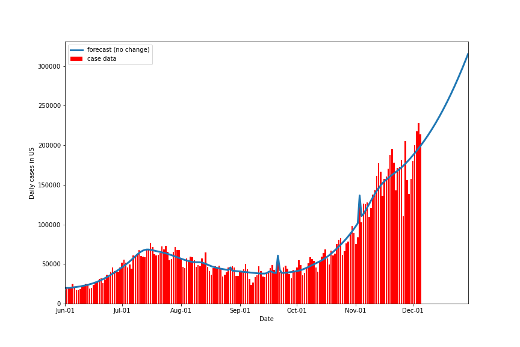

The histogram shows the daily cases for the 50 states, DC and PR.
The curve labelled "forecast (no change)" shows the expected daily
cases by adding the expectations from all of the individual state
models fit to the state data, as shown below.

## [Summary: Deaths](img/usa_summary_deaths_1206.pdf)

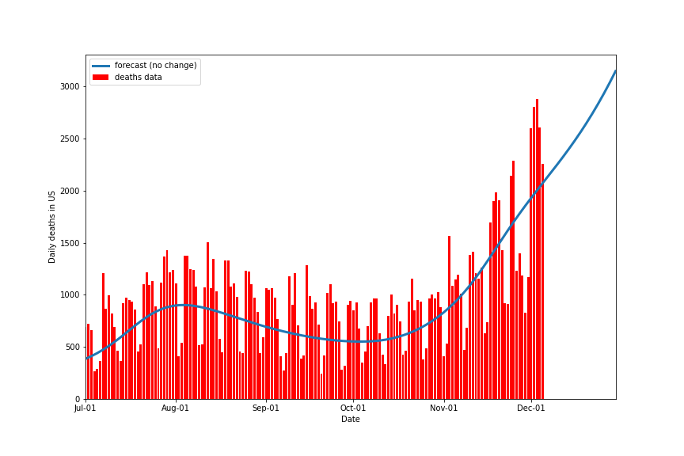

This plot uses the same convention as the previous one: this time for daily deaths.

## Individual state fits

The plots below show the case / hospitalization / deaths data for all 50 states, DC, and PR.
The infection trajectory is determined by fits to the cumulative case data.
The data fits were done using data up until December 5. 

The left figures show the daily cases and new hospitalizations and deaths on a log scale.
The green points are the case data, the stars show the
weekly average, and the green curve is the fit of the model to the case data.
The right figures show the same data on a linear scale.
Note that the recent rapid growth in the in-hospital numbers follows the trajectory determined from the
case data, indicating that the case data is a useful predictor for the infection trajectory.

### [Alaska](img/ak_2_5_1206.pdf)

### [Alabama](img/al_2_5_1206.pdf)

### [Arkansas](img/ar_2_5_1206.pdf)

### [Arizona](img/az_2_5_1206.pdf)

### [California](img/ca_2_5_1206.pdf)

### [Colorado](img/co_2_5_1206.pdf)

### [Connecticut](img/ct_2_5_1206.pdf)

### [District Of Columbia](img/dc_2_5_1206.pdf)

### [Delaware](img/de_2_5_1206.pdf)

### [Florida](img/fl_2_5_1206.pdf)

### [Georgia](img/ga_2_5_1206.pdf)

### [Hawaii](img/hi_2_5_1206.pdf)

### [Iowa](img/ia_2_5_1206.pdf)

### [Idaho](img/id_2_5_1206.pdf)

### [Illinois](img/il_2_5_1206.pdf)

### [Indiana](img/in_2_5_1206.pdf)

### [Kansas](img/ks_2_5_1206.pdf)

### [Kentucky](img/ky_2_5_1206.pdf)

### [Louisiana](img/la_2_5_1206.pdf)

### [Massachusetts](img/ma_2_5_1206.pdf)

### [Maryland](img/md_2_5_1206.pdf)

### [Maine](img/me_2_5_1206.pdf)

### [Michigan](img/mi_2_5_1206.pdf)

### [Minnesota](img/mn_2_5_1206.pdf)

### [Missouri](img/mo_2_5_1206.pdf)

### [Mississippi](img/ms_2_5_1206.pdf)

### [Montana](img/mt_2_5_1206.pdf)

### [North Carolina](img/nc_2_5_1206.pdf)

### [North Dakota](img/nd_2_5_1206.pdf)

### [Nebraska](img/ne_2_5_1206.pdf)

### [New Hampshire](img/nh_2_5_1206.pdf)

### [New Jersey](img/nj_2_5_1206.pdf)

### [New Mexico](img/nm_2_5_1206.pdf)

### [Nevada](img/nv_2_5_1206.pdf)

### [New York](img/ny_2_5_1206.pdf)

### [Ohio](img/oh_2_5_1206.pdf)

### [Oklahoma](img/ok_2_5_1206.pdf)

### [Oregon](img/or_2_5_1206.pdf)

### [Pennsylvania](img/pa_2_5_1206.pdf)

### [Puerto Rico](img/pr_2_5_1206.pdf)

### [Rhode Island](img/ri_2_5_1206.pdf)

### [South Carolina](img/sc_2_5_1206.pdf)

### [South Dakota](img/sd_2_5_1206.pdf)

### [Tennessee](img/tn_2_5_1206.pdf)

### [Texas](img/tx_2_5_1206.pdf)

### [Utah](img/ut_2_5_1206.pdf)

### [Virginia](img/va_2_5_1206.pdf)

### [Vermont](img/vt_2_5_1206.pdf)

### [Washington](img/wa_2_5_1206.pdf)

### [Wisconsin](img/wi_2_5_1206.pdf)

### [West Virginia](img/wv_2_5_1206.pdf)

### [Wyoming](img/wy_2_5_1206.pdf)

## Tables

The tables below are results from the fits to reference model 2.3.
These are shown for purposes of comparison.

### Daily fractional growth rates (&delta;)

state| &delta; | day | &delta; | day | &delta; | day | &delta;  
---|---|---|---|---|---|---
AK|-1.0 +/-  0.3|Sep 06| 4.0 +/-  0.2|Nov 04| 1.7 +/-  0.5
AL|-0.8 +/-  0.1|Sep 12| 2.1 +/-  0.1|Nov 16| 4.8 +/-  1.6
AR|-2.8 +/-  0.3|Aug 09| 1.4 +/-  0.1|Oct 21| 2.8 +/-  0.3
AZ|-4.3 +/-  0.1|Sep 08| 4.7 +/-  0.2
CA|-1.1 +/-  0.0|Oct 08| 4.6 +/-  0.4
CO|-1.2 +/-  0.1|Sep 24| 5.5 +/-  0.1|Nov 11|-0.4 +/-  1.8
CT| 1.7 +/-  0.2|Sep 06| 4.2 +/-  0.2
DC|-0.3 +/-  0.2|Oct 02| 3.6 +/-  0.4
DE|-0.2 +/-  0.5|Aug 18| 1.2 +/-  0.3|Oct 18| 4.5 +/-  0.4
FL|-2.1 +/-  0.1|Sep 02| 0.5 +/-  0.1|Oct 08| 3.5 +/-  0.2
GA|-0.9 +/-  0.1|Oct 13| 4.5 +/-  0.2|Nov 11| 2.3 +/-  0.9
HI| 8.0 +/-  0.5|Aug 06|-2.8 +/-  0.3|Sep 24| 0.5 +/-  0.5
IA| 1.4 +/-  0.1|Oct 12| 7.3 +/-  0.3|Nov 05|-2.1 +/-  1.9
ID|-1.0 +/-  0.1|Sep 03| 3.1 +/-  0.1|Oct 31| 1.7 +/-  0.3
IL| 2.1 +/-  0.0|Aug 18|-0.2 +/-  0.1|Sep 26| 5.5 +/-  0.1|Nov 06|-0.3 +/-  1.4
IN| 0.4 +/-  0.1|Sep 26| 4.9 +/-  0.1|Nov 06| 1.8 +/-  0.7
KS| 1.0 +/-  0.1|Oct 06| 4.5 +/-  0.2|Nov 13|-1.0 +/-  2.2
KY| 0.4 +/-  0.1|Sep 15| 2.8 +/-  0.1
LA|-1.5 +/-  0.2|Aug 18| 0.3 +/-  0.4|Sep 13| 2.7 +/-  0.2|Oct 24| 6.8 +/-  0.4
MA| 1.5 +/-  0.1|Sep 30| 4.0 +/-  0.1
MD|-1.3 +/-  0.1|Sep 23| 2.2 +/-  0.2|Oct 27| 10.9 +/-  0.8|Nov 02| 2.6 +/-  0.5
ME| 0.8 +/-  0.2|Oct 13| 9.6 +/-  0.8|Oct 28| 2.1 +/-  0.5
MI| 0.3 +/-  0.1|Sep 21| 5.1 +/-  0.1|Nov 09| 1.0 +/-  1.1
MN| 0.7 +/-  0.1|Sep 29| 5.5 +/-  0.1|Nov 11|-0.0 +/-  1.8
MO| 0.5 +/-  0.1|Oct 03| 3.9 +/-  0.1|Nov 08| 0.0 +/-  1.2
MS|-1.0 +/-  0.1|Sep 22| 2.7 +/-  0.2
MT| 0.6 +/-  0.5|Sep 07| 2.7 +/-  0.2|Nov 11|-0.7 +/-  1.4
NC|-0.3 +/-  0.1|Oct 22| 2.8 +/-  0.5
ND| 2.7 +/-  0.1|Oct 10| 4.6 +/-  0.3|Nov 06|-1.9 +/-  1.7
NE| 1.2 +/-  0.2|Sep 21| 4.3 +/-  0.1|Nov 08| 0.4 +/-  1.2
NH|-2.4 +/-  0.9|Aug 20| 0.1 +/-  1.5|Sep 14| 4.5 +/-  0.3
NJ| 1.0 +/-  0.1|Sep 25| 5.0 +/-  0.1|Nov 07| 2.6 +/-  0.6
NM|-1.2 +/-  0.4|Sep 10| 5.0 +/-  0.2|Nov 15|-0.5 +/-  2.9
NV|-1.6 +/-  0.1|Sep 18| 3.9 +/-  0.3
NY| 0.6 +/-  0.1|Sep 11| 2.9 +/-  0.2|Oct 20| 4.6 +/-  0.2
OH|-0.1 +/-  0.1|Sep 26| 4.9 +/-  0.1|Nov 13| 1.4 +/-  1.3
OK|-2.0 +/-  0.3|Aug 06| 1.4 +/-  0.1|Oct 24| 2.1 +/-  0.5
OR|-0.8 +/-  0.1|Sep 07| 2.1 +/-  0.2|Oct 21| 3.8 +/-  0.2
PA| 0.7 +/-  0.1|Oct 03| 4.5 +/-  0.2
PR|-2.5 +/-  0.2|Oct 01| 2.0 +/-  0.2
RI| 0.9 +/-  0.2|Sep 14| 4.2 +/-  0.3
SC|-1.5 +/-  0.1|Aug 18| 0.8 +/-  0.1|Oct 28| 2.9 +/-  0.5
SD| 1.9 +/-  0.2|Sep 22| 4.1 +/-  0.1|Nov 01|-0.0 +/-  0.8
TN|-1.3 +/-  0.1|Sep 17| 2.8 +/-  0.2
TX|-1.0 +/-  0.0|Sep 23| 3.1 +/-  0.1|Oct 30| 2.3 +/-  0.2
UT|-1.1 +/-  0.1|Aug 17| 1.4 +/-  0.1|Oct 17| 5.7 +/-  0.2|Nov 02| 1.3 +/-  0.6
VA| 0.2 +/-  0.0|Oct 12| 2.9 +/-  0.3
VT|-1.5 +/-  0.9|Sep 08| 4.9 +/-  0.3
WA|-1.2 +/-  0.2|Sep 09|-7.7 +/-  1.2|Oct 02| 4.5 +/-  0.1|Nov 16| 0.8 +/-  2.1
WI|-0.5 +/-  0.1|Aug 26| 5.2 +/-  0.3|Sep 14| 3.3 +/-  0.1|Nov 06|-0.7 +/-  1.1
WV| 0.5 +/-  0.2|Oct 01| 3.7 +/-  0.3
WY|-0.2 +/-  0.4|Aug 29| 4.7 +/-  0.1|Nov 13|-2.9 +/-  3.5

* &delta: daily fractional growth parameter (in percent)
* day: transition date for new growth parameter

## Infection status

The following plots summarize the infection history.
The upper plot shows the daily growth/decline from the fit. Bands show approximate 95% CL intervals.
The lower plot shows the size of the infection: the uncorrected circulating contagious population per
million.

### [Alabama](img/al-summary.pdf)

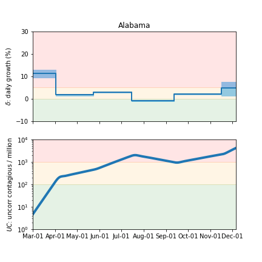

### [Alaska](img/ak-summary.pdf)

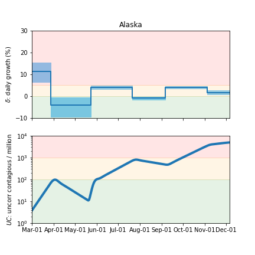

### [Arkansas](img/ar-summary.pdf)

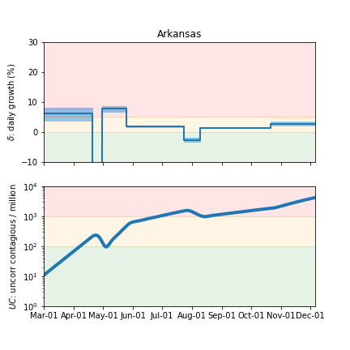

### [Arizona](img/az-summary.pdf)

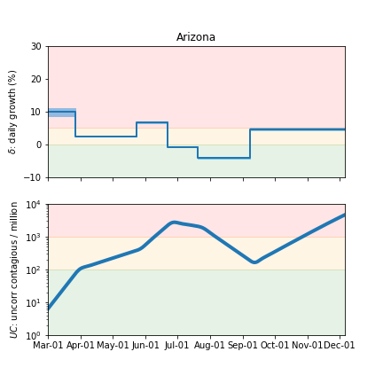

### [California](img/ca-summary.pdf)

### [Colorado](img/co-summary.pdf)

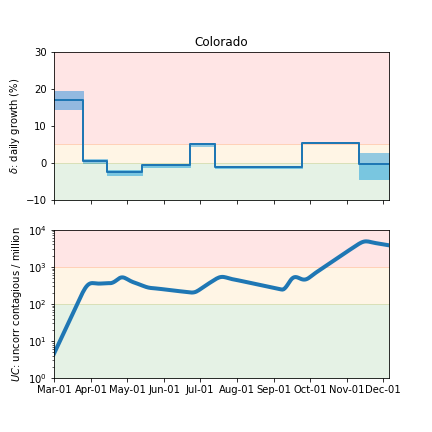

### [Connecticut](img/ct-summary.pdf)

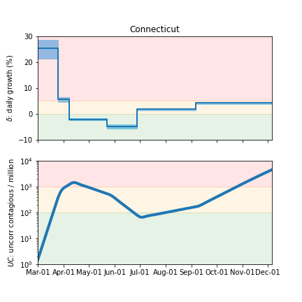

### [District Of Columbia](img/dc-summary.pdf)

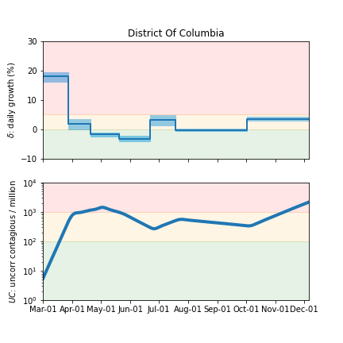

### [Delaware](img/de-summary.pdf)

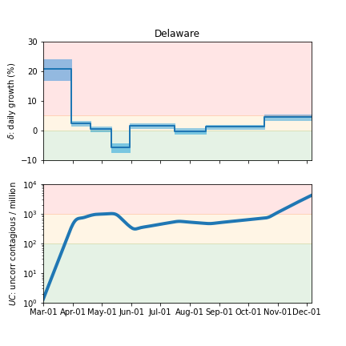

### [Florida](img/fl-summary.pdf)

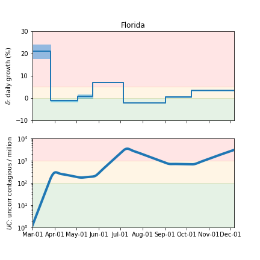

### [Georgia](img/ga-summary.pdf)

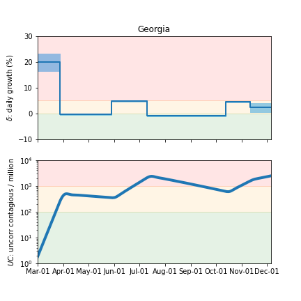

### [Hawaii](img/hi-summary.pdf)

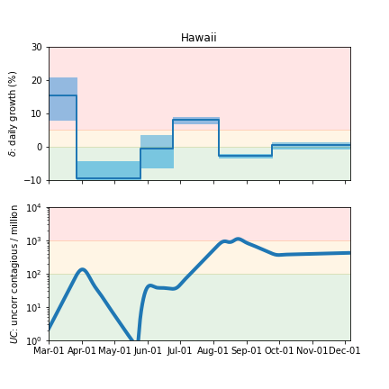

### [Iowa](img/ia-summary.pdf)

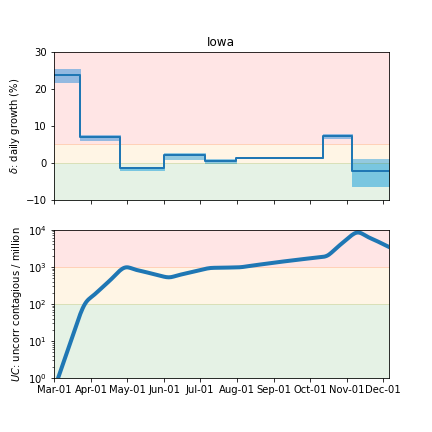

### [Idaho](img/id-summary.pdf)

### [Illinois](img/il-summary.pdf)

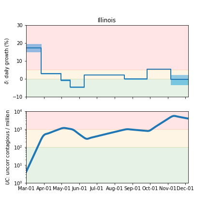

### [Indiana](img/in-summary.pdf)

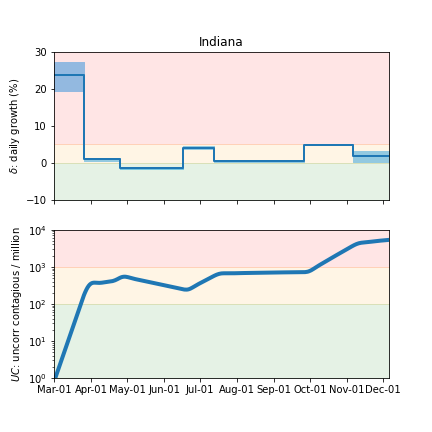

### [Kansas](img/ks-summary.pdf)

### [Kentucky](img/ky-summary.pdf)

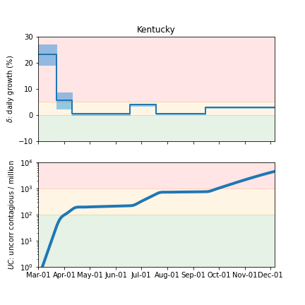

### [Louisiana](img/la-summary.pdf)

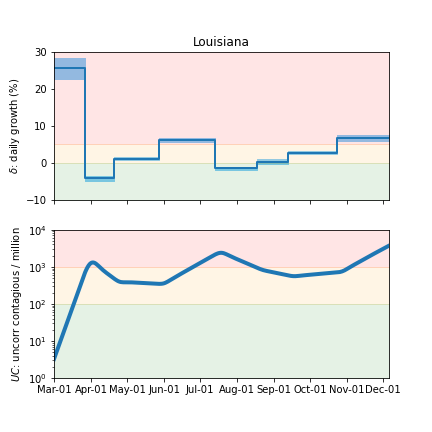

### [Massachusetts](img/ma-summary.pdf)

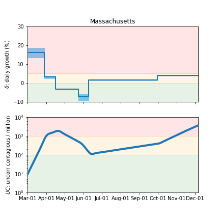

### [Maryland](img/md-summary.pdf)

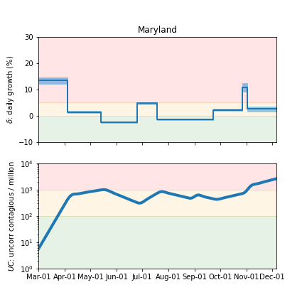

### [Maine](img/me-summary.pdf)

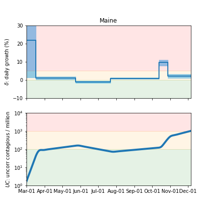

### [Michigan](img/mi-summary.pdf)

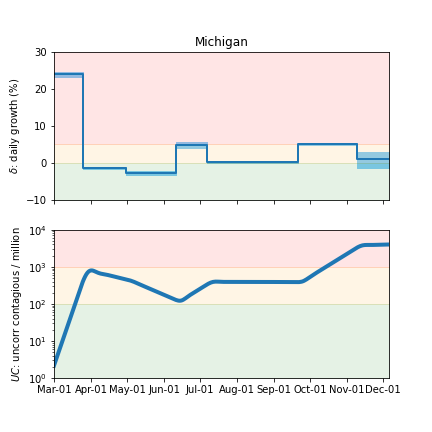

### [Minnesota](img/mn-summary.pdf)

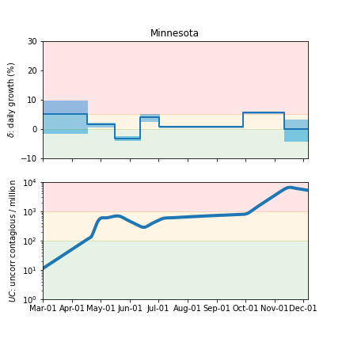

### [Missouri](img/mo-summary.pdf)

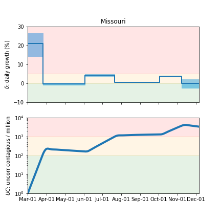

### [Mississippi](img/ms-summary.pdf)

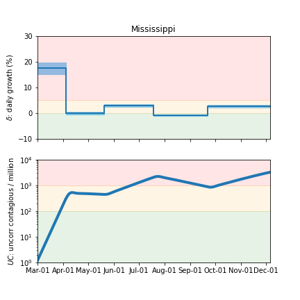

### [Montana](img/mt-summary.pdf)

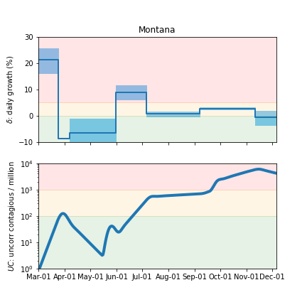

### [North Carolina](img/nc-summary.pdf)

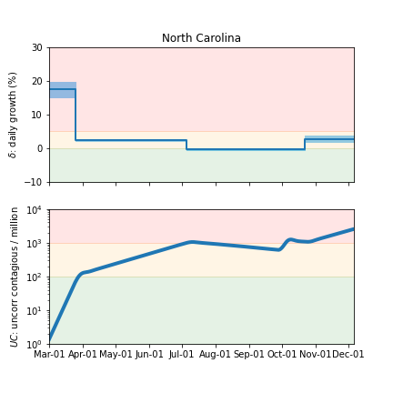

### [North Dakota](img/nd-summary.pdf)

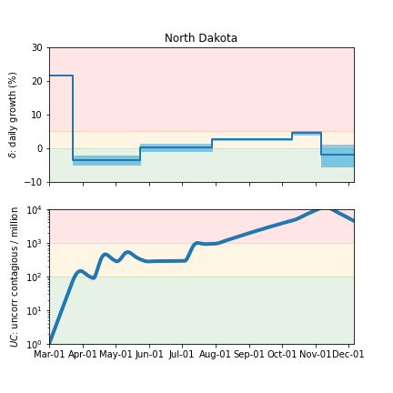

### [Nebraska](img/ne-summary.pdf)

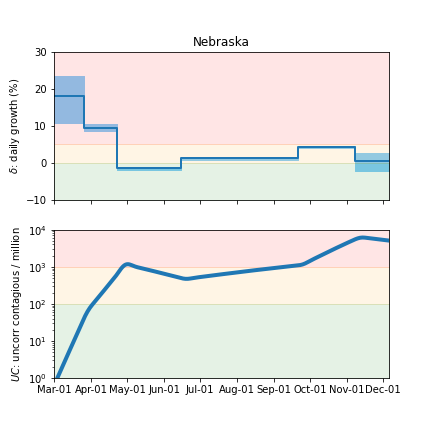

### [New Hampshire](img/nh-summary.pdf)

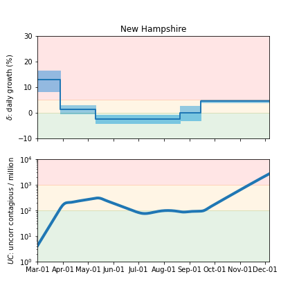

### [New Jersey](img/nj-summary.pdf)

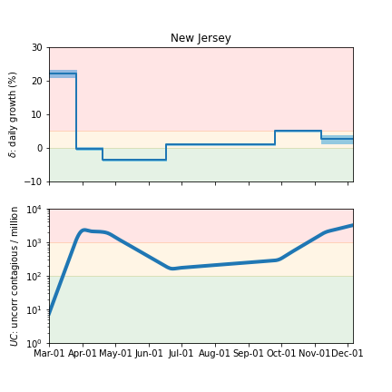

### [New Mexico](img/nm-summary.pdf)

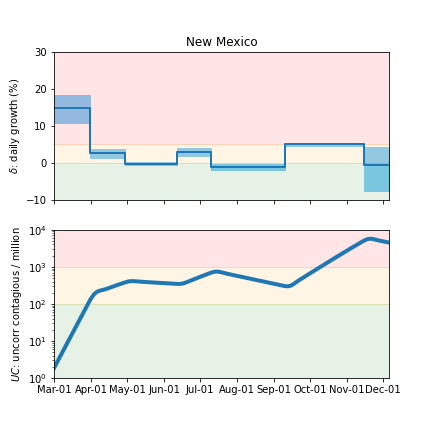

### [Nevada](img/nv-summary.pdf)

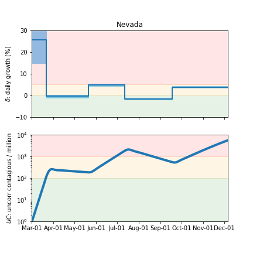

### [New York](img/ny-summary.pdf)

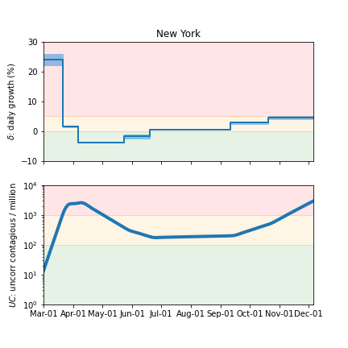

### [Ohio](img/oh-summary.pdf)

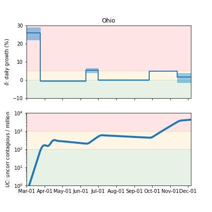

### [Oklahoma](img/ok-summary.pdf)

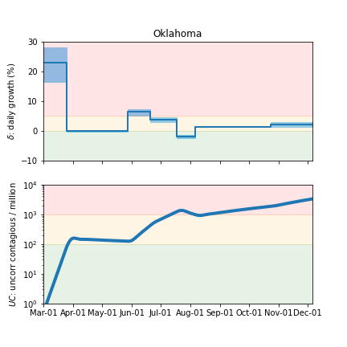

### [Oregon](img/or-summary.pdf)

### [Pennsylvania](img/pa-summary.pdf)

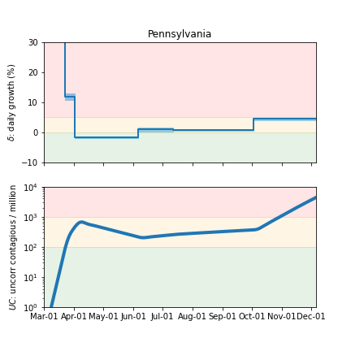

### [Puerto Rico](img/pr-summary.pdf)

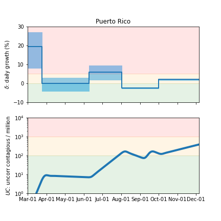

### [Rhode Island](img/ri-summary.pdf)

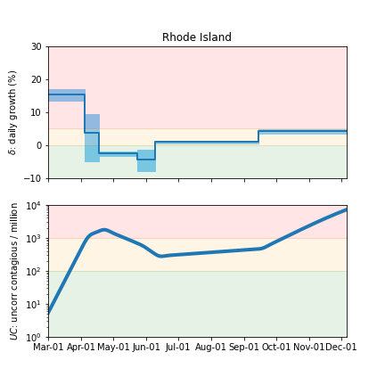

### [South Carolina](img/sc-summary.pdf)

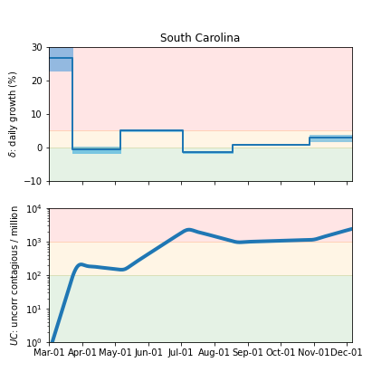

### [South Dakota](img/sd-summary.pdf)

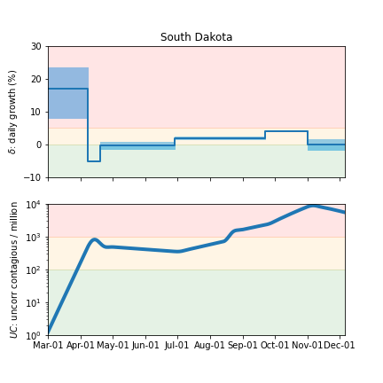

### [Tennessee](img/tn-summary.pdf)

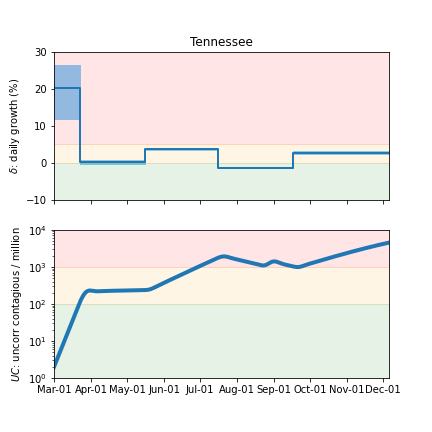

### [Texas](img/tx-summary.pdf)

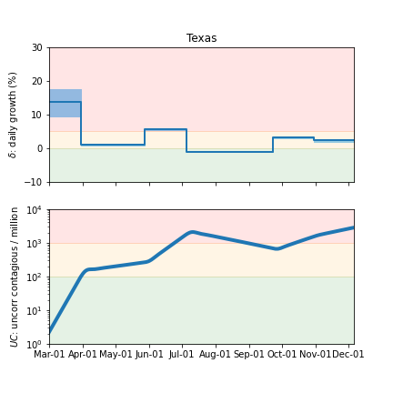

### [Utah](img/ut-summary.pdf)

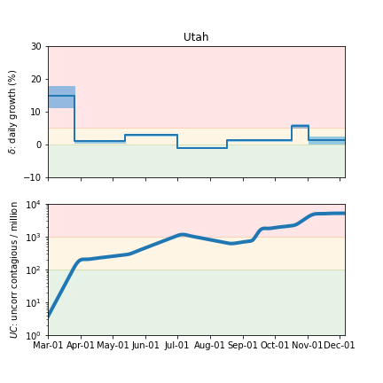

### [Vermont](img/vt-summary.pdf)

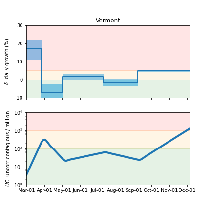

### [Virginia](img/va-summary.pdf)

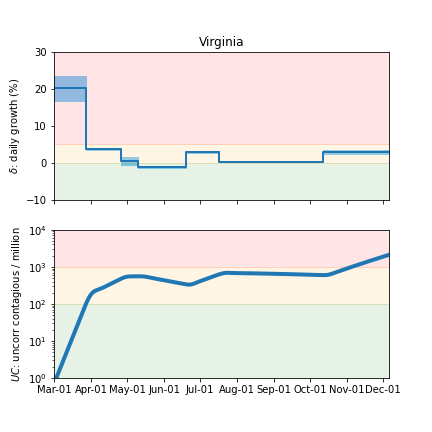

### [Washington](img/wa-summary.pdf)

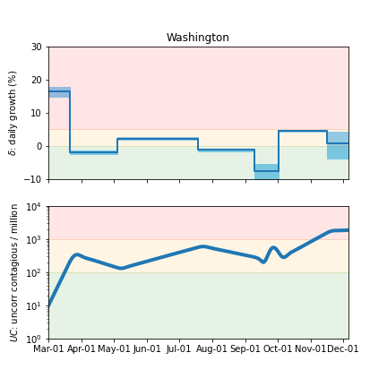

### [Wisconsin](img/wi-summary.pdf)

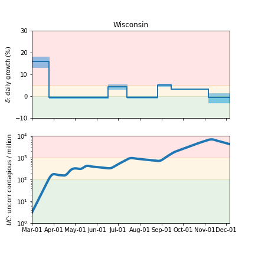

### [West Virginia](img/wv-summary.pdf)

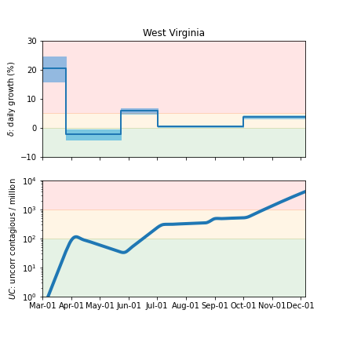

### [Wyoming](img/wy-summary.pdf)

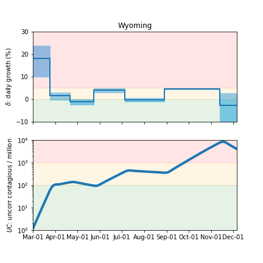

## Forecasts

The following plots show the forecasts for cases, hospitalizations, and deaths.
The shaded regions show the 50%, 80%, and 95% CL intervals.

### [Alabama](img/al-summary.pdf)

### [Alaska](img/ak-summary.pdf)

### [Arkansas](img/ar-summary.pdf)

### [Arizona](img/az-summary.pdf)

### [California](img/ca-summary.pdf)

### [Colorado](img/co-summary.pdf)

### [Connecticut](img/ct-summary.pdf)

### [District Of Columbia](img/dc-summary.pdf)

### [Delaware](img/de-summary.pdf)

### [Florida](img/fl-summary.pdf)

### [Georgia](img/ga-summary.pdf)

### [Hawaii](img/hi-summary.pdf)

### [Iowa](img/ia-summary.pdf)

### [Idaho](img/id-summary.pdf)

### [Illinois](img/il-summary.pdf)

### [Indiana](img/in-summary.pdf)

### [Kansas](img/ks-summary.pdf)

### [Kentucky](img/ky-summary.pdf)

### [Louisiana](img/la-summary.pdf)

### [Massachusetts](img/ma-summary.pdf)

### [Maryland](img/md-summary.pdf)

### [Maine](img/me-summary.pdf)

### [Michigan](img/mi-summary.pdf)

### [Minnesota](img/mn-summary.pdf)

### [Missouri](img/mo-summary.pdf)

### [Mississippi](img/ms-summary.pdf)

### [Montana](img/mt-summary.pdf)

### [North Carolina](img/nc-summary.pdf)

### [North Dakota](img/nd-summary.pdf)

### [Nebraska](img/ne-summary.pdf)

### [New Hampshire](img/nh-summary.pdf)

### [New Jersey](img/nj-summary.pdf)

### [New Mexico](img/nm-summary.pdf)

### [Nevada](img/nv-summary.pdf)

### [New York](img/ny-summary.pdf)

### [Ohio](img/oh-summary.pdf)

### [Oklahoma](img/ok-summary.pdf)

### [Oregon](img/or-summary.pdf)

### [Pennsylvania](img/pa-summary.pdf)

### [Puerto Rico](img/pr-summary.pdf)

### [Rhode Island](img/ri-summary.pdf)

### [South Carolina](img/sc-summary.pdf)

### [South Dakota](img/sd-summary.pdf)

### [Tennessee](img/tn-summary.pdf)

### [Texas](img/tx-summary.pdf)

### [Utah](img/ut-summary.pdf)

### [Vermont](img/vt-summary.pdf)

### [Virginia](img/va-summary.pdf)

### [Washington](img/wa-summary.pdf)

### [Wisconsin](img/wi-summary.pdf)

### [West Virginia](img/wv-summary.pdf)

### [Wyoming](img/wy-summary.pdf)

## [return to case studies](../index.md)

