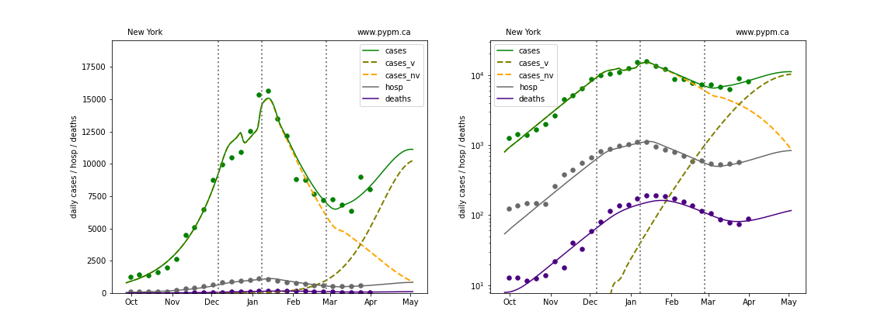
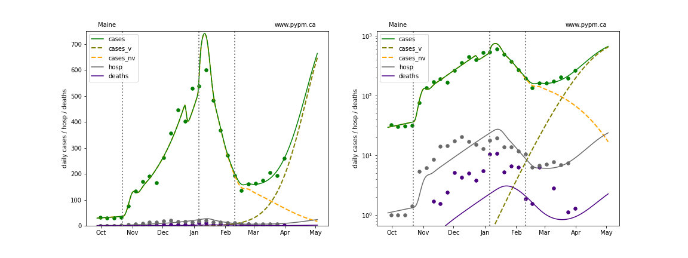
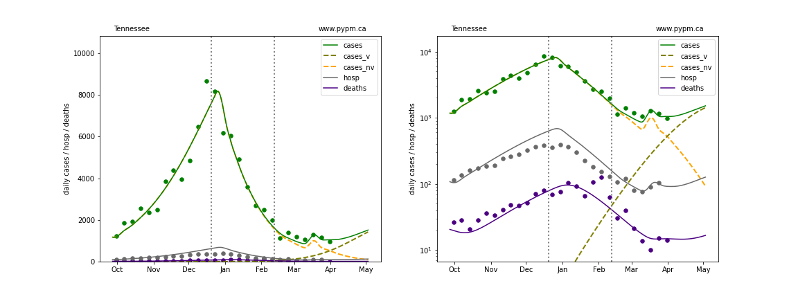
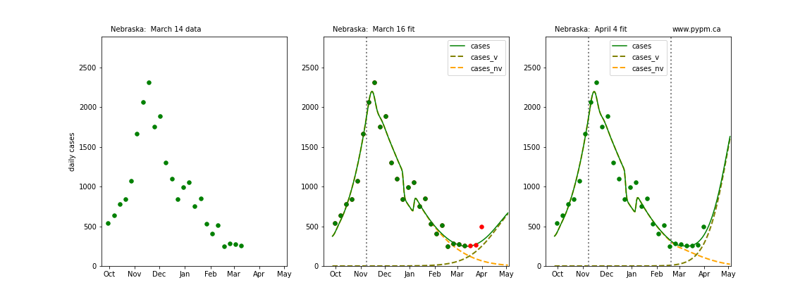

## April 4, 2021 Analysis of USA state data

## Individual state histories

The plots below show the case / hospitalization / deaths data for all 50 states, DC, and PR.
The data fits were done using data up until March 27, 2021.

The green points are the daily cases, the grey points the daily hospitalizations, and
indigo points are the daily deaths (each averaged over a week).
The case data are used to define the periods for which transmission rate appears to be constant.
The vertical lines show where the transmission rate is changed.
In absence of immunity, constant transmission rates
lead to steady exponential growth or decline during, which appear as straight lines on
these log-scale plots.
With immunity growing, these lines are no longer straight - bending downwards due to the herd effect.
The curves are the model expectations for cases, hospitalizations, and deaths, as determined from
the case data.
The dashed curves separately show the reported cases from the original variant and the B117 variant.

Below the set of individual state plots, summary plots are provided that indicate the degree that
natural and vaccination immunization is helping to bring down infections.

The final set of plots show the 4 week forecast for the USA and for each state.

## Genomic data

For some staes, genomic screening [data](https://github.com/myhelix/helix-covid19db)
is available to estimate the growth advantage (aka selection coefficient, s)
of the B117 variant as well as the current fraction of cases dues to that variant.

Note that the last week fraction for several states is lower than expected. This could happen
if the samples are from an outbreak of non-SGTF cases, for example.

Below is a figure showing fits to
the ratio of the SGTF cases to non-SGTF cases used to estimate the selection coefficient
and current "frequency" of these cases.

State | s | w |f_v (April 3)
---|---|---|---
Arizona|0.080 +/- 0.005|0.000 +/- 0.000|0.622 +/- 0.048
California|0.063 +/- 0.001|0.001 +/- 0.000|0.640 +/- 0.015
Florida|0.059 +/- 0.001|0.005 +/- 0.000|0.810 +/- 0.006
Georgia|0.087 +/- 0.002|0.001 +/- 0.000|0.891 +/- 0.008
Illinois|0.068 +/- 0.006|0.000 +/- 0.001|0.603 +/- 0.048
Indiana|0.093 +/- 0.004|0.001 +/- 0.000|0.766 +/- 0.020
Louisiana|0.103 +/- 0.013|0.002 +/- 0.001|0.882 +/- 0.044
Massachusetts|0.078 +/- 0.004|0.029 +/- 0.002|0.708 +/- 0.019
Michigan|0.083 +/- 0.003|0.000 +/- 0.000|0.882 +/- 0.008
Minnesota|0.082 +/- 0.006|0.001 +/- 0.000|0.875 +/- 0.020
North Carolina|0.082 +/- 0.003|0.000 +/- 0.000|0.672 +/- 0.022
New Jersey|0.062 +/- 0.007|0.000 +/- 0.001|0.622 +/- 0.057
New York|0.060 +/- 0.008|0.002 +/- 0.003|0.723 +/- 0.061
Pennsylvania|0.075 +/- 0.002|0.003 +/- 0.000|0.699 +/- 0.012
Texas|0.084 +/- 0.002|0.000 +/- 0.000|0.866 +/- 0.011

 * s: selection coefficient
 * w: SGTF false identification probability
 * f_v: fraction of cases due to the variant on March 27, 2021

## States with genomic data

The states with independent genomic data allow for better constraint on the growth advantage and current
case fraction.
With the variant potentially causing growth in the weeks to come, predictions for these states
are much better established.

### [Arizona](img/az_2_8_0404.pdf)

### [California](img/ca_2_8_0404.pdf)

### [Florida](img/fl_2_8_0404.pdf)

### [Georgia](img/ga_2_8_0404.pdf)

### [Illinois](img/il_2_8_0404.pdf)

### [Indiana](img/in_2_8_0404.pdf)

### [Louisiana](img/la_2_8_0404.pdf)

### [Massachusetts](img/ma_2_8_0404.pdf)

### [Michigan](img/mi_2_8_0404.pdf)

### [Minnesota](img/mn_2_8_0404.pdf)

### [North Carolina](img/nc_2_8_0404.pdf)

### [New Jersey](img/nj_2_8_0404.pdf)

### [New York](img/ny_2_8_0404.pdf)

### [Pennsylvania](img/pa_2_8_0404.pdf)

### [Texas](img/tx_2_8_0404.pdf)

## States without genomic data

In absence of genomic data, the growth advantage s = 0.08 is assumed. The current strength of the B117
is estimated from the fit to case data.
Essentially this is derived by how fare the case data deviate from the expected trajectory for the original
strain model (orange dashed curve).
For states where the deviation is just beginning, there will be significant uncertainty on the
timing of the next peak.

These model fits assume that there is no change to NPI (non-pharmiceutical intervention) between the
vertical dotted lines.
Such NPI changes can lead to large changes in the projections for the future growth of the variant.

### [Alaska](img/ak_2_8_0404.pdf)

### [Alabama](img/al_2_8_0404.pdf)

### [Arkansas](img/ar_2_8_0404.pdf)

### [Colorado](img/co_2_8_0404.pdf)

### [Connecticut](img/ct_2_8_0404.pdf)

### [District Of Columbia](img/dc_2_8_0404.pdf)

### [Delaware](img/de_2_8_0404.pdf)

### [Hawaii](img/hi_2_8_0404.pdf)

### [Iowa](img/ia_2_8_0404.pdf)

### [Idaho](img/id_2_8_0404.pdf)

### [Kansas](img/ks_2_8_0404.pdf)

### [Kentucky](img/ky_2_8_0404.pdf)

### [Maryland](img/md_2_8_0404.pdf)

### [Maine](img/me_2_8_0404.pdf)

### [Missouri](img/mo_2_8_0404.pdf)

### [Mississippi](img/ms_2_8_0404.pdf)

### [Montana](img/mt_2_8_0404.pdf)

### [North Dakota](img/nd_2_8_0404.pdf)

### [Nebraska](img/ne_2_8_0404.pdf)

### [New Hampshire](img/nh_2_8_0404.pdf)

### [New Mexico](img/nm_2_8_0404.pdf)

### [Nevada](img/nv_2_8_0404.pdf)

### [Ohio](img/oh_2_8_0404.pdf)

### [Oklahoma](img/ok_2_8_0404.pdf)

### [Oregon](img/or_2_8_0404.pdf)

### [Puerto Rico](img/pr_2_8_0404.pdf)

### [Rhode Island](img/ri_2_8_0404.pdf)

### [South Carolina](img/sc_2_8_0404.pdf)

### [South Dakota](img/sd_2_8_0404.pdf)

### [Tennessee](img/tn_2_8_0404.pdf)

### [Utah](img/ut_2_8_0404.pdf)

### [Virginia](img/va_2_8_0404.pdf)

### [Vermont](img/vt_2_8_0404.pdf)

### [Washington](img/wa_2_8_0404.pdf)

### [Wisconsin](img/wi_2_8_0404.pdf)

### [West Virginia](img/wv_2_8_0404.pdf)

### [Wyoming](img/wy_2_8_0404.pdf)

## Forecasts

The following plots show the combined US 4 week forecast. The shaded areas are 50%, 80%, and 95% intervals.

### [USA](img/usa-forecast.pdf)

## Comparison with model fit to case data from 3 weeks ago

The following plots show 3 figures for each state
 * Left: case data available until March 14
 * Middle: case data fit on March 16. Red points show data collected after model fit
 * Right: case data fit on April 4.

For many states, the 2 strain model correctly predicted the rise following the plateau.
In several cases, the rise was predicted to come earlier than obsevered.
Without genomic data, the fraction of cases arising from B.1.1.7 is unknown before
observing the rise in cases.

### [Alabama](img/al_2_8_0404_cmp.pdf)

### [Alaska](img/ak_2_8_0404_cmp.pdf)

### [Arkansas](img/ar_2_8_0404_cmp.pdf)

### [Arizona](img/az_2_8_0404_cmp.pdf)

### [California](img/ca_2_8_0404_cmp.pdf)

### [Colorado](img/co_2_8_0404_cmp.pdf)

### [Connecticut](img/ct_2_8_0404_cmp.pdf)

### [District Of Columbia](img/dc_2_8_0404_cmp.pdf)

### [Delaware](img/de_2_8_0404_cmp.pdf)

### [Florida](img/fl_2_8_0404_cmp.pdf)

### [Georgia](img/ga_2_8_0404_cmp.pdf)

### [Hawaii](img/hi_2_8_0404_cmp.pdf)

### [Iowa](img/ia_2_8_0404_cmp.pdf)

### [Idaho](img/id_2_8_0404_cmp.pdf)

### [Illinois](img/il_2_8_0404_cmp.pdf)

### [Indiana](img/in_2_8_0404_cmp.pdf)

### [Kansas](img/ks_2_8_0404_cmp.pdf)

### [Kentucky](img/ky_2_8_0404_cmp.pdf)

### [Louisiana](img/la_2_8_0404_cmp.pdf)

### [Massachusetts](img/ma_2_8_0404_cmp.pdf)

### [Maryland](img/md_2_8_0404_cmp.pdf)

### [Maine](img/me_2_8_0404_cmp.pdf)

### [Michigan](img/mi_2_8_0404_cmp.pdf)

### [Minnesota](img/mn_2_8_0404_cmp.pdf)

### [Missouri](img/mo_2_8_0404_cmp.pdf)

### [Mississippi](img/ms_2_8_0404_cmp.pdf)

### [Montana](img/mt_2_8_0404_cmp.pdf)

### [North Carolina](img/nc_2_8_0404_cmp.pdf)

### [North Dakota](img/nd_2_8_0404_cmp.pdf)

### [Nebraska](img/ne_2_8_0404_cmp.pdf)

### [New Hampshire](img/nh_2_8_0404_cmp.pdf)

### [New Jersey](img/nj_2_8_0404_cmp.pdf)

### [New Mexico](img/nm_2_8_0404_cmp.pdf)

### [Nevada](img/nv_2_8_0404_cmp.pdf)

### [New York](img/ny_2_8_0404_cmp.pdf)

### [Ohio](img/oh_2_8_0404_cmp.pdf)

### [Oklahoma](img/ok_2_8_0404_cmp.pdf)

### [Oregon](img/or_2_8_0404_cmp.pdf)

### [Pennsylvania](img/pa_2_8_0404_cmp.pdf)

### [Puerto Rico](img/pr_2_8_0404_cmp.pdf)

### [Rhode Island](img/ri_2_8_0404_cmp.pdf)

### [South Carolina](img/sc_2_8_0404_cmp.pdf)

### [South Dakota](img/sd_2_8_0404_cmp.pdf)

### [Tennessee](img/tn_2_8_0404_cmp.pdf)

### [Texas](img/tx_2_8_0404_cmp.pdf)

### [Utah](img/ut_2_8_0404_cmp.pdf)

### [Vermont](img/vt_2_8_0404_cmp.pdf)

### [Virginia](img/va_2_8_0404_cmp.pdf)

### [Washington](img/wa_2_8_0404_cmp.pdf)

### [Wisconsin](img/wi_2_8_0404_cmp.pdf)

### [West Virginia](img/wv_2_8_0404_cmp.pdf)

### [Wyoming](img/wy_2_8_0404_cmp.pdf)

## [return to case studies](../index.md)

