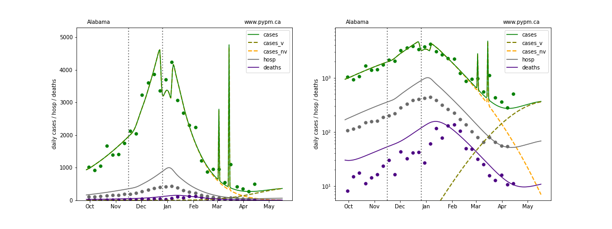
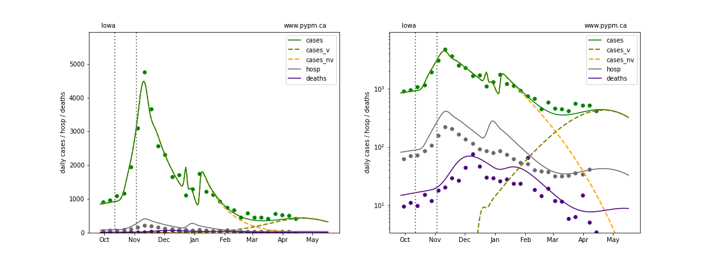
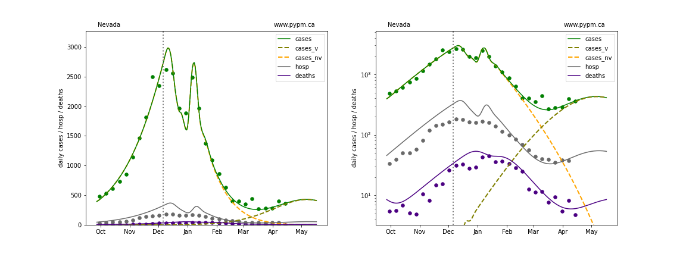
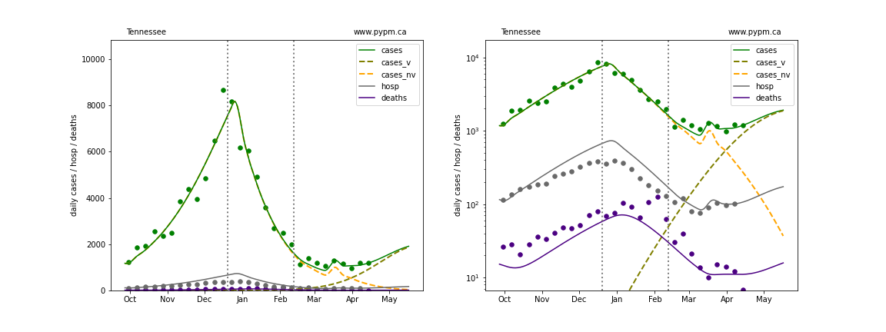
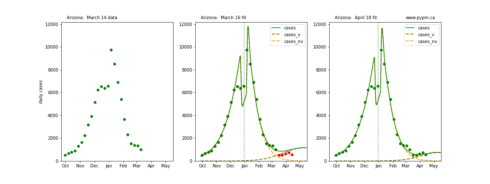
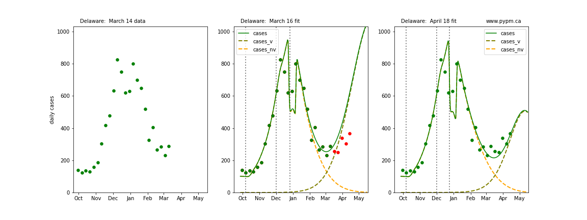
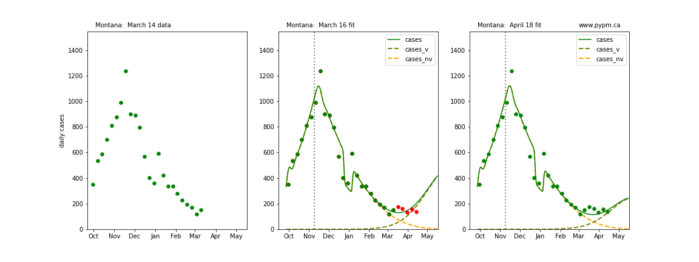
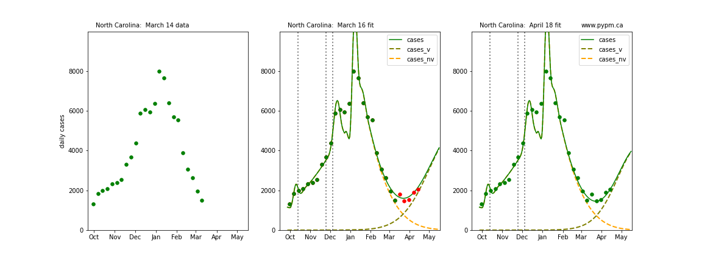
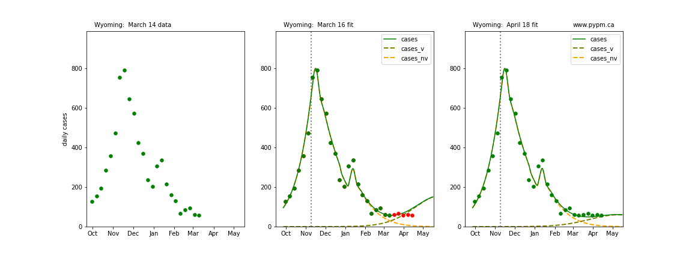

## April 18, 2021 Analysis of USA state data

## Individual state histories

The plots below show the case / hospitalization / deaths data for all 50 states, DC, and PR.
The data fits were done using data up until April 17, 2021.

The green points are the daily cases, the grey points the daily hospitalizations, and
indigo points are the daily deaths (each averaged over a week).
The case data are used to define the periods for which transmission rate appears to be constant.
The vertical lines show where the transmission rate is changed.
In absence of immunity, constant transmission rates
lead to steady exponential growth or decline during, which appear as straight lines on
these log-scale plots.
With immunity growing, these lines are no longer straight - bending downwards due to the herd effect.
The curves are the model expectations for cases, hospitalizations, and deaths, as determined from
the case data.
The dashed curves separately show the reported cases from the original strain and from variants of concern.

The final set of plots show a comparison of forecasts from 5 weeks ago
with the most recent data.

## Genomic data

For some staes, genomic screening [data](https://github.com/myhelix/helix-covid19db)
using the SGTF protocol,
is available to estimate the growth advantage (aka selection coefficient, s)
of the B117 variant as well as the current fraction of cases dues to that variant.

Recently in several states, the  SGTF/non-SGTF ratio is no longer growing exponentially, which
could be due to other variants of concern with a similar growth advantage but which are not
tagged by SGTF.

Below is a figure showing fits to
the ratio of the SGTF cases to non-SGTF cases which is used
used to estimate the selection coefficient (s),
the ratio of other VoC to the B.1.1.7 (rpb), and
the current fraction of cases due to variants of concern (f_v).

The curves are the best fit, the shaded region indicates the 95% central interval of the ensemble of
curves (modifying the parameters according to their covariance) and the vertical bars are the
central 95% intervals for each binomial sampling.

region | s | rpb| w |f_v (Apr 18)
---|---|---|---|---
Arizona|0.086 +/- 0.008|0.538 +/- 0.241|0.000 +/- 0.000|0.920 +/- 0.043
California|0.071 +/- 0.002|0.633 +/- 0.076|0.002 +/- 0.000|0.936 +/- 0.013
Florida|0.074 +/- 0.002|0.396 +/- 0.018|0.006 +/- 0.000|0.978 +/- 0.003
Georgia|0.098 +/- 0.003|0.255 +/- 0.026|0.001 +/- 0.000|0.987 +/- 0.003
Illinois|0.071 +/- 0.007|0.270 +/- 0.179|0.000 +/- 0.001|0.869 +/- 0.051
Indiana|0.098 +/- 0.005|0.264 +/- 0.053|0.001 +/- 0.000|0.959 +/- 0.011
Louisiana|0.127 +/- 0.028|0.387 +/- 0.118|0.002 +/- 0.001|0.989 +/- 0.017
Massachusetts|0.121 +/- 0.010|0.964 +/- 0.071|0.030 +/- 0.002|0.994 +/- 0.003
Michigan|0.107 +/- 0.005|0.220 +/- 0.015|0.001 +/- 0.000|0.992 +/- 0.002
Minnesota|0.096 +/- 0.010|0.186 +/- 0.043|0.001 +/- 0.000|0.983 +/- 0.010
North Carolina|0.091 +/- 0.004|0.413 +/- 0.075|0.001 +/- 0.000|0.945 +/- 0.015
New Jersey|0.071 +/- 0.010|0.515 +/- 0.254|0.000 +/- 0.001|0.914 +/- 0.054
New York|0.085 +/- 0.018|1.054 +/- 0.286|0.004 +/- 0.004|0.983 +/- 0.023
Pennsylvania|0.095 +/- 0.004|0.677 +/- 0.040|0.003 +/- 0.001|0.976 +/- 0.005
Texas|0.099 +/- 0.004|0.400 +/- 0.041|0.000 +/- 0.000|0.989 +/- 0.003

 * s: selection coefficient
 * rpb: ratio of other VoC to B.1.1.7
 * w: SGTF false identification of VoC per sample
 * f_v: fraction of cases due to variants of concern on April 18, 2021

## States with genomic data

The states with independent genomic data allow for better constraint on the growth advantage and current
case fraction.
With the variant potentially causing growth in the weeks to come, predictions for these states
are much better established.

### [Arizona](img/az_2_8_0418.pdf)

### [California](img/ca_2_8_0418.pdf)

### [Florida](img/fl_2_8_0418.pdf)

### [Georgia](img/ga_2_8_0418.pdf)

### [Illinois](img/il_2_8_0418.pdf)

### [Indiana](img/in_2_8_0418.pdf)

### [Louisiana](img/la_2_8_0418.pdf)

### [Massachusetts](img/ma_2_8_0418.pdf)

### [Michigan](img/mi_2_8_0418.pdf)

### [Minnesota](img/mn_2_8_0418.pdf)

### [North Carolina](img/nc_2_8_0418.pdf)

### [New Jersey](img/nj_2_8_0418.pdf)

### [New York](img/ny_2_8_0418.pdf)

### [Pennsylvania](img/pa_2_8_0418.pdf)

### [Texas](img/tx_2_8_0418.pdf)

## States without genomic data

In absence of genomic data, the growth advantage s = 0.08 is assumed. The current strength of the B117
is estimated from the fit to case data.
Essentially this is derived by how fare the case data deviate from the expected trajectory for the original
strain model (orange dashed curve).
For states where the deviation is just beginning, there will be significant uncertainty on the
timing of the next peak.

These model fits assume that there is no change to NPI (non-pharmiceutical intervention) between the
vertical dotted lines.
Such NPI changes can lead to large changes in the projections for the future growth of the variant.

### [Alaska](img/ak_2_8_0418.pdf)

### [Alabama](img/al_2_8_0418.pdf)

### [Arkansas](img/ar_2_8_0418.pdf)

### [Colorado](img/co_2_8_0418.pdf)

### [Connecticut](img/ct_2_8_0418.pdf)

### [District Of Columbia](img/dc_2_8_0418.pdf)

### [Delaware](img/de_2_8_0418.pdf)

### [Hawaii](img/hi_2_8_0418.pdf)

### [Iowa](img/ia_2_8_0418.pdf)

### [Idaho](img/id_2_8_0418.pdf)

### [Kansas](img/ks_2_8_0418.pdf)

### [Kentucky](img/ky_2_8_0418.pdf)

### [Maryland](img/md_2_8_0418.pdf)

### [Maine](img/me_2_8_0418.pdf)

### [Missouri](img/mo_2_8_0418.pdf)

### [Mississippi](img/ms_2_8_0418.pdf)

### [Montana](img/mt_2_8_0418.pdf)

### [North Dakota](img/nd_2_8_0418.pdf)

### [Nebraska](img/ne_2_8_0418.pdf)

### [New Hampshire](img/nh_2_8_0418.pdf)

### [New Mexico](img/nm_2_8_0418.pdf)

### [Nevada](img/nv_2_8_0418.pdf)

### [Ohio](img/oh_2_8_0418.pdf)

### [Oklahoma](img/ok_2_8_0418.pdf)

### [Oregon](img/or_2_8_0418.pdf)

### [Puerto Rico](img/pr_2_8_0418.pdf)

### [Rhode Island](img/ri_2_8_0418.pdf)

### [South Carolina](img/sc_2_8_0418.pdf)

### [South Dakota](img/sd_2_8_0418.pdf)

### [Tennessee](img/tn_2_8_0418.pdf)

### [Utah](img/ut_2_8_0418.pdf)

### [Virginia](img/va_2_8_0418.pdf)

### [Vermont](img/vt_2_8_0418.pdf)

### [Washington](img/wa_2_8_0418.pdf)

### [Wisconsin](img/wi_2_8_0418.pdf)

### [West Virginia](img/wv_2_8_0418.pdf)

### [Wyoming](img/wy_2_8_0418.pdf)

## Forecasts

The following plots show the combined US 4 week forecast. The shaded areas are 50%, 80%, and 95% intervals.

### [USA](img/usa-forecast.pdf)

## Comparison with model fit to case data from 5 weeks ago

The following plots show 3 figures for each state
 * Left: case data available until March 14
 * Middle: case data fit on March 16. Red points show data collected after model fit
 * Right: case data fit on April 18.

For many states, the 2 strain model correctly predicted the rise following the plateau.
In several cases, the rise was predicted to come earlier than obsevered.
Without genomic data, the fraction of cases arising from variants of concern is unknown before
observing the rise in cases.

### [Alabama](img/al_2_8_0418_cmp.pdf)

### [Alaska](img/ak_2_8_0418_cmp.pdf)

### [Arkansas](img/ar_2_8_0418_cmp.pdf)

### [Arizona](img/az_2_8_0418_cmp.pdf)

### [California](img/ca_2_8_0418_cmp.pdf)

### [Colorado](img/co_2_8_0418_cmp.pdf)

### [Connecticut](img/ct_2_8_0418_cmp.pdf)

### [District Of Columbia](img/dc_2_8_0418_cmp.pdf)

### [Delaware](img/de_2_8_0418_cmp.pdf)

### [Florida](img/fl_2_8_0418_cmp.pdf)

### [Georgia](img/ga_2_8_0418_cmp.pdf)

### [Hawaii](img/hi_2_8_0418_cmp.pdf)

### [Iowa](img/ia_2_8_0418_cmp.pdf)

### [Idaho](img/id_2_8_0418_cmp.pdf)

### [Illinois](img/il_2_8_0418_cmp.pdf)

### [Indiana](img/in_2_8_0418_cmp.pdf)

### [Kansas](img/ks_2_8_0418_cmp.pdf)

### [Kentucky](img/ky_2_8_0418_cmp.pdf)

### [Louisiana](img/la_2_8_0418_cmp.pdf)

### [Massachusetts](img/ma_2_8_0418_cmp.pdf)

### [Maryland](img/md_2_8_0418_cmp.pdf)

### [Maine](img/me_2_8_0418_cmp.pdf)

### [Michigan](img/mi_2_8_0418_cmp.pdf)

### [Minnesota](img/mn_2_8_0418_cmp.pdf)

### [Missouri](img/mo_2_8_0418_cmp.pdf)

### [Mississippi](img/ms_2_8_0418_cmp.pdf)

### [Montana](img/mt_2_8_0418_cmp.pdf)

### [North Carolina](img/nc_2_8_0418_cmp.pdf)

### [North Dakota](img/nd_2_8_0418_cmp.pdf)

### [Nebraska](img/ne_2_8_0418_cmp.pdf)

### [New Hampshire](img/nh_2_8_0418_cmp.pdf)

### [New Jersey](img/nj_2_8_0418_cmp.pdf)

### [New Mexico](img/nm_2_8_0418_cmp.pdf)

### [Nevada](img/nv_2_8_0418_cmp.pdf)

### [New York](img/ny_2_8_0418_cmp.pdf)

### [Ohio](img/oh_2_8_0418_cmp.pdf)

### [Oklahoma](img/ok_2_8_0418_cmp.pdf)

### [Oregon](img/or_2_8_0418_cmp.pdf)

### [Pennsylvania](img/pa_2_8_0418_cmp.pdf)

### [Puerto Rico](img/pr_2_8_0418_cmp.pdf)

### [Rhode Island](img/ri_2_8_0418_cmp.pdf)

### [South Carolina](img/sc_2_8_0418_cmp.pdf)

### [South Dakota](img/sd_2_8_0418_cmp.pdf)

### [Tennessee](img/tn_2_8_0418_cmp.pdf)

### [Texas](img/tx_2_8_0418_cmp.pdf)

### [Utah](img/ut_2_8_0418_cmp.pdf)

### [Vermont](img/vt_2_8_0418_cmp.pdf)

### [Virginia](img/va_2_8_0418_cmp.pdf)

### [Washington](img/wa_2_8_0418_cmp.pdf)

### [Wisconsin](img/wi_2_8_0418_cmp.pdf)

### [West Virginia](img/wv_2_8_0418_cmp.pdf)

### [Wyoming](img/wy_2_8_0418_cmp.pdf)

## [return to case studies](../index.md)

