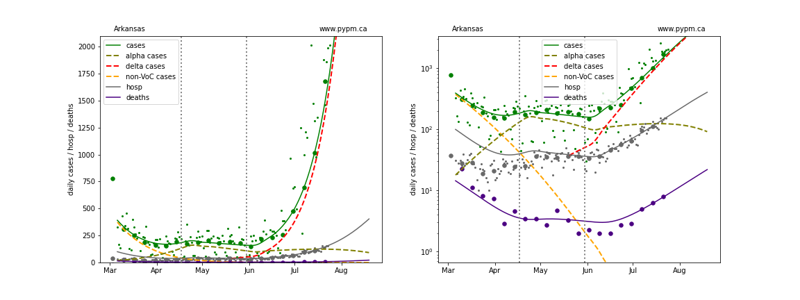
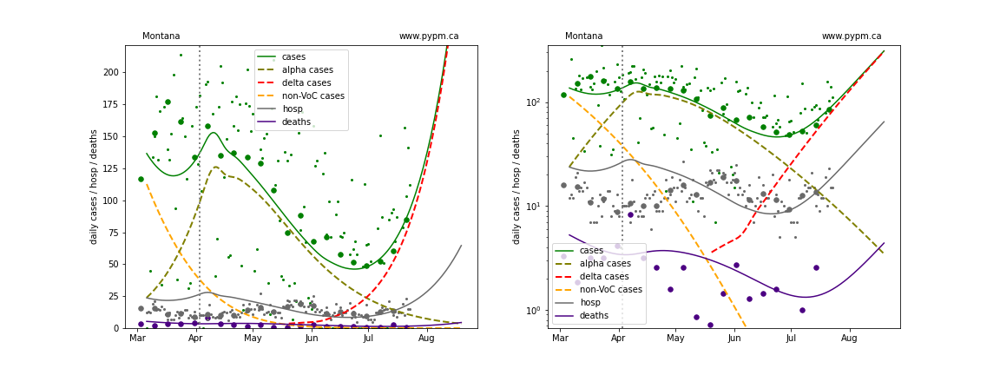
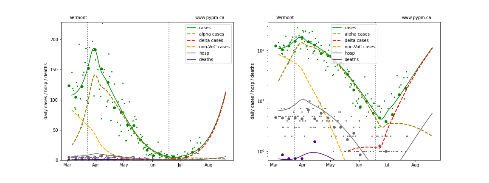

## July 25, 2021 Analysis of USA state data

## Studies of variant prevalence and growth advantage

### Genomic analysis using GISAID data from outbreak.info

Many states submit whole genomic sequencing data to GISAID that can be used to track the growth of VoC state by state.
The ratios of delta (B.1.617.2), gamma (P.1), and iota (B.1.526) to alpha (B.1.1.7)
cases are shown in the plots below, where it is evident that
both delta and gamma have higher transmission than alpha, with delta significantly larger.
Also shown are B.1.621 and C.37.
Sub lineages have been included in the main lineages (so AY.1, AY.2, and AY.3 are included in delta, for example).
All other strains are combined in the group designated 'nota' (none of the above).
For states with insufficient data to estimate the selection coefficient,
they are fixed at 0.08 (0.02) for delta (gamma), in order to estimate the current
delta prevalence, and the lines are shown as dashed in the figures below.

A summary of the estimated selection coefficients for each state are below.

The mean selection coefficient for delta (gamma) is 0.092 (0.020). There is large variance in the estimates from each state.

## Swing in growth rates due to delta and relaxation

The selection coefficient for delta (wrt alpha) indicates that the daily growth rate for delta is about 9% per day larger than
the daily growth rate for alpha (under the same circumstances.
The emergence of delta has occured at the same time as 

At the same that the delta variant has emerged, there has been general relaxation of health measures.
As a result, the swing in growth rate is much larger than 9% in the past several week.
The figure below shows the distribution of growth swing for the states, having a mean of 15% and standard deviation of 3%.

The growth of delta in the US is now on average 9% per day with a standardard deviation of 3%.

## Individual state histories

The plots below show the case / hospitalization / deaths data for all 50 states, DC, and PR.
The data fits were done using data up until July 24, 2021.

The green points are the daily cases, the grey points the daily hospitalizations, and
indigo points are the daily deaths (each averaged over a week).
The case data are used to define the periods for which transmission rate appears to be constant.
The vertical lines show where the transmission rate is changed.
If the susceptibe fraction is constant (immunity not changing quickly), constant transmission rates
lead to steady exponential growth or decline during, which appear as straight lines on
these log-scale plots.
With immunity growing, these lines are no longer straight - bending downwards due to the herd effect.
The curves are the model expectations for cases, hospitalizations, and deaths, and for most states
all three are determined from the case data. These states:
AR, CA, FL, IL, KY, LA, MA, MD, MI, MN, MS,NJ,NY,OH,OK, VA
were found to
have hospitalization growth rates significantly less than their case growth rates, and therefore hospitalization data was used to
define the most recent trajectories for hospitalizations and deaths.

The dashed curves separately show the reported cases from the original strains and from variants of
concern, divided into two types B.1.1.7 (alpha) and B.1.617.2 (delta).

At the bottom of this page, plots showing the combined forecast for the US are shown.

### [Alaska](img/ak_2_9_0725.pdf)

### [Alabama](img/al_2_9_0725.pdf)

### [Arkansas](img/ar_2_9_0725.pdf)

### [Arizona](img/az_2_9_0725.pdf)

### [California](img/ca_2_9_0725.pdf)

### [Colorado](img/co_2_9_0725.pdf)

### [Connecticut](img/ct_2_9_0725.pdf)

### [District Of Columbia](img/dc_2_9_0725.pdf)

### [Delaware](img/de_2_9_0725.pdf)

### [Florida](img/fl_2_9_0725.pdf)

### [Georgia](img/ga_2_9_0725.pdf)

### [Hawaii](img/hi_2_9_0725.pdf)

### [Iowa](img/ia_2_9_0725.pdf)

### [Idaho](img/id_2_9_0725.pdf)

### [Illinois](img/il_2_9_0725.pdf)

### [Indiana](img/in_2_9_0725.pdf)

### [Kansas](img/ks_2_9_0725.pdf)

### [Kentucky](img/ky_2_9_0725.pdf)

### [Louisiana](img/la_2_9_0725.pdf)

### [Massachusetts](img/ma_2_9_0725.pdf)

### [Maryland](img/md_2_9_0725.pdf)

### [Maine](img/me_2_9_0725.pdf)

### [Michigan](img/mi_2_9_0725.pdf)

### [Minnesota](img/mn_2_9_0725.pdf)

### [Missouri](img/mo_2_9_0725.pdf)

### [Mississippi](img/ms_2_9_0725.pdf)

### [Montana](img/mt_2_9_0725.pdf)

### [North Carolina](img/nc_2_9_0725.pdf)

### [North Dakota](img/nd_2_9_0725.pdf)

### [Nebraska](img/ne_2_9_0725.pdf)

### [New Hampshire](img/nh_2_9_0725.pdf)

### [New Jersey](img/nj_2_9_0725.pdf)

### [New Mexico](img/nm_2_9_0725.pdf)

### [Nevada](img/nv_2_9_0725.pdf)

### [New York](img/ny_2_9_0725.pdf)

### [Ohio](img/oh_2_9_0725.pdf)

### [Oklahoma](img/ok_2_9_0725.pdf)

### [Oregon](img/or_2_9_0725.pdf)

### [Pennsylvania](img/pa_2_9_0725.pdf)

### [Puerto Rico](img/pr_2_9_0725.pdf)

### [Rhode Island](img/ri_2_9_0725.pdf)

### [South Carolina](img/sc_2_9_0725.pdf)

### [South Dakota](img/sd_2_9_0725.pdf)

### [Tennessee](img/tn_2_9_0725.pdf)

### [Texas](img/tx_2_9_0725.pdf)

### [Utah](img/ut_2_9_0725.pdf)

### [Virginia](img/va_2_9_0725.pdf)

### [Vermont](img/vt_2_9_0725.pdf)

### [Washington](img/wa_2_9_0725.pdf)

### [Wisconsin](img/wi_2_9_0725.pdf)

### [West Virginia](img/wv_2_9_0725.pdf)

### [Wyoming](img/wy_2_9_0725.pdf)

## USA Forecast

The following plots show the combined US 4 week forecast. The shaded areas are 50%, 80%, and 95% intervals.
Overall, cases are forecast to grow at a rate of about 7% per day (doubling every 10 days).

### [USA](img/usa-forecast.pdf)

## [return to case studies](../index.md)

