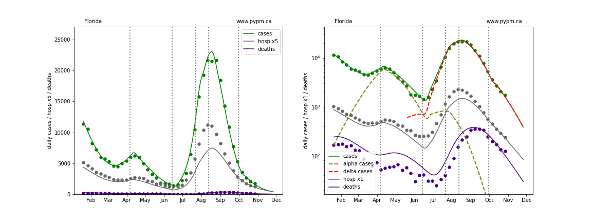
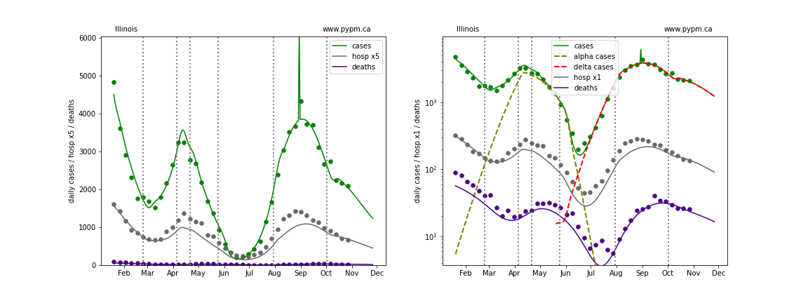
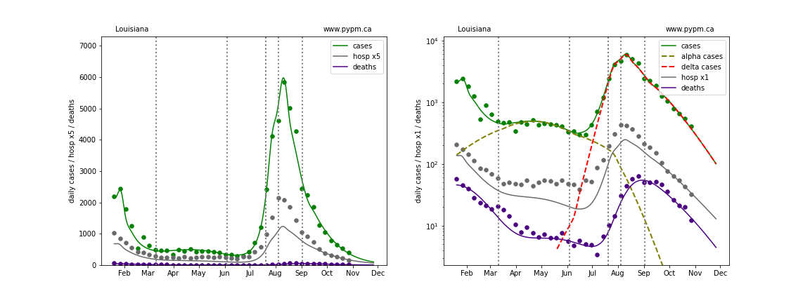
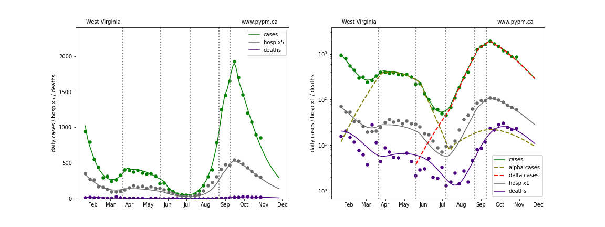

## October 31, 2021 Analysis of USA state data

Summary: For most states, daily growth rates for cases
are negative, meaning that infection rates are in decline.
Furthermore, the daily growth rates themselves are trending
more negative for many states.

See the October 24 report for the
comparison of growth rates then and 4 weeks prior
for US states, Canadian provinces, and European nations.
The situation in Europe is very concerning, showing an increase in
growth rates by 5%/day or more, resulting in rapid
growth in the majority of Europe.
European studies are posted [here](../index.md).

Some states have shown a recent upswing in growth rates, namely
Alabama,
Arkansas,
California,
Georgia,
Hawaii,
Mississippi, and
Nebraska.
Given the recent situation in Europe, it is important to monitor
the situation closely in the US.

## Individual state histories

The plots below show the case / hospital admissions / deaths data for all 50 states, DC, and PR.
The data fits were done using data up until October 30, 2021.

An infection model is setup for each state, calibrated using the case data from that state.
Given the time history of infections, projections for hospitalization and death are calculated
and shown as curves in the plots below.
The degree that hospitalization and death data following the model projections, indicates the
ability of this approach to forecast future hospitalization and death.

The green points are the daily cases, the grey points the daily hospitalizations, and
indigo points are the daily deaths (each averaged over a week).
The case data are used to define the periods for which transmission rate appears to be constant.
The vertical lines show where the transmission rate is changed.
If the susceptibe fraction is constant (immunity not changing quickly), constant transmission rates
lead to steady exponential growth or decline during, which appear as straight lines on
these log-scale plots.
With immunity growing, these lines are no longer straight - bending downwards due to the herd effect.
The curves are the model expectations for cases, hospitalizations, and deaths, and
all three are determined from the case data.

For several states recently, case data are problematic, having many anomalous entries.
For those states, hospital admission data is used instead to define the recent trends in the infection model.
The list of states affected for this analysis are:
Arkansas, Arizona, California, Colorado, Delaware, Florida, Iowa, Indiana, Kansas, Minnesota, Nebraska, and Wisconsin.

The dashed curves separately show the reported cases from the original strains and from variants of
concern, divided into two types B.1.1.7 (alpha) and B.1.617.2 (delta).

At the bottom of this page, plots showing the combined forecast for the US are shown.

### [Alaska](img/ak_2_9_1031.pdf)

### [Alabama](img/al_2_9_1031.pdf)

### [Arkansas](img/ar_2_9_1031.pdf)

### [Arizona](img/az_2_9_1031.pdf)

### [California](img/ca_2_9_1031.pdf)

### [Colorado](img/co_2_9_1031.pdf)

### [Connecticut](img/ct_2_9_1031.pdf)

### [District Of Columbia](img/dc_2_9_1031.pdf)

### [Delaware](img/de_2_9_1031.pdf)

### [Florida](img/fl_2_9_1031.pdf)

### [Georgia](img/ga_2_9_1031.pdf)

### [Hawaii](img/hi_2_9_1031.pdf)

### [Iowa](img/ia_2_9_1031.pdf)

### [Idaho](img/id_2_9_1031.pdf)

### [Illinois](img/il_2_9_1031.pdf)

### [Indiana](img/in_2_9_1031.pdf)

### [Kansas](img/ks_2_9_1031.pdf)

### [Kentucky](img/ky_2_9_1031.pdf)

### [Louisiana](img/la_2_9_1031.pdf)

### [Massachusetts](img/ma_2_9_1031.pdf)

### [Maryland](img/md_2_9_1031.pdf)

### [Maine](img/me_2_9_1031.pdf)

### [Michigan](img/mi_2_9_1031.pdf)

### [Minnesota](img/mn_2_9_1031.pdf)

### [Missouri](img/mo_2_9_1031.pdf)

### [Mississippi](img/ms_2_9_1031.pdf)

### [Montana](img/mt_2_9_1031.pdf)

### [North Carolina](img/nc_2_9_1031.pdf)

### [North Dakota](img/nd_2_9_1031.pdf)

### [Nebraska](img/ne_2_9_1031.pdf)

### [New Hampshire](img/nh_2_9_1031.pdf)

### [New Jersey](img/nj_2_9_1031.pdf)

### [New Mexico](img/nm_2_9_1031.pdf)

### [Nevada](img/nv_2_9_1031.pdf)

### [New York](img/ny_2_9_1031.pdf)

### [Ohio](img/oh_2_9_1031.pdf)

### [Oklahoma](img/ok_2_9_1031.pdf)

### [Oregon](img/or_2_9_1031.pdf)

### [Pennsylvania](img/pa_2_9_1031.pdf)

### [Puerto Rico](img/pr_2_9_1031.pdf)

### [Rhode Island](img/ri_2_9_1031.pdf)

### [South Carolina](img/sc_2_9_1031.pdf)

### [South Dakota](img/sd_2_9_1031.pdf)

### [Tennessee](img/tn_2_9_1031.pdf)

### [Texas](img/tx_2_9_1031.pdf)

### [Utah](img/ut_2_9_1031.pdf)

### [Virginia](img/va_2_9_1031.pdf)

### [Vermont](img/vt_2_9_1031.pdf)

### [Washington](img/wa_2_9_1031.pdf)

### [Wisconsin](img/wi_2_9_1031.pdf)

### [West Virginia](img/wv_2_9_1031.pdf)

### [Wyoming](img/wy_2_9_1031.pdf)

## Comparing prevalence between states 

The following plots show the daily cases per 100,000 people in each state, grouped according to the 10 standard federal regions.

## USA Forecast

The following plots show the combined US 4 week forecast. The shaded areas are 50%, 80%, and 95% intervals.
Overall, case rates, hospitalizations, and deaths are forecast to continue to decline.

### [USA](img/usa-forecast.pdf)

## [return to case studies](../index.md)

