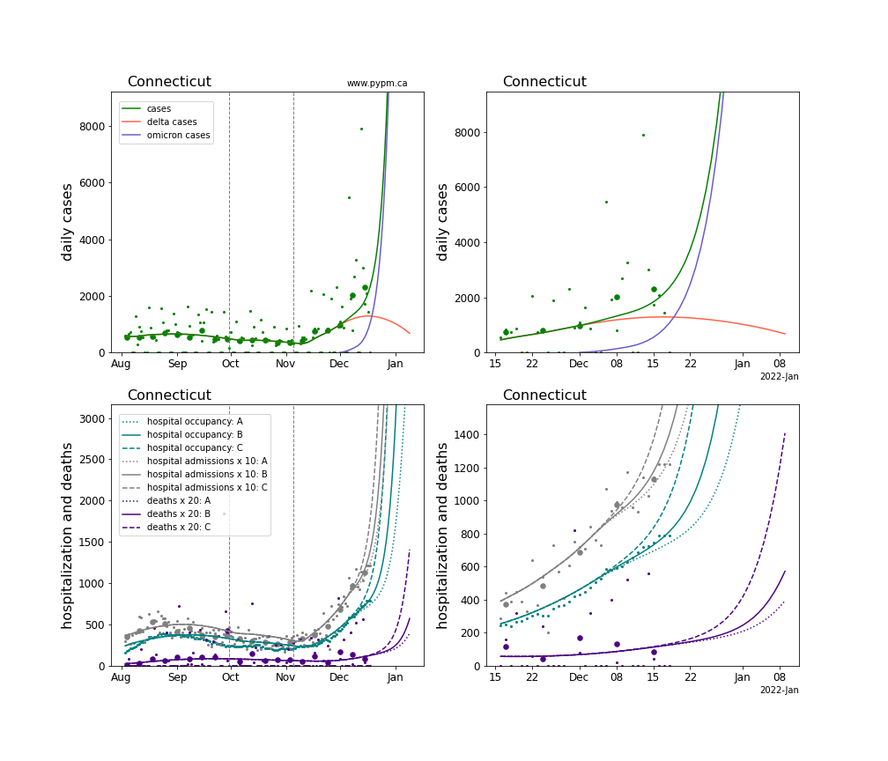
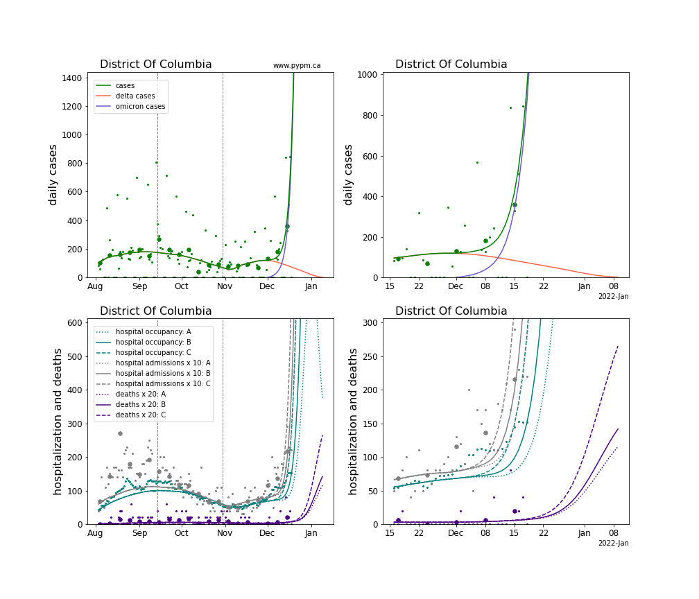
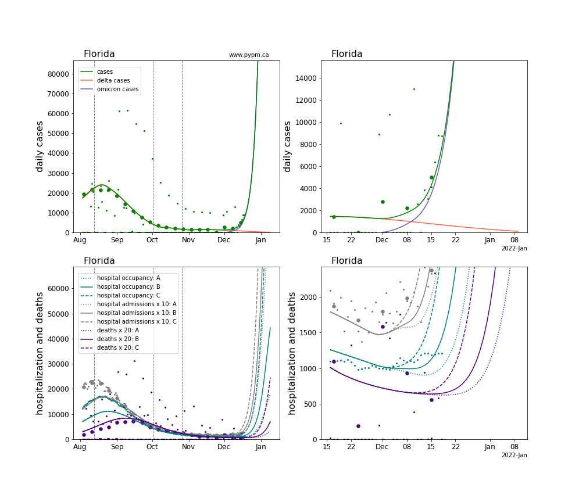
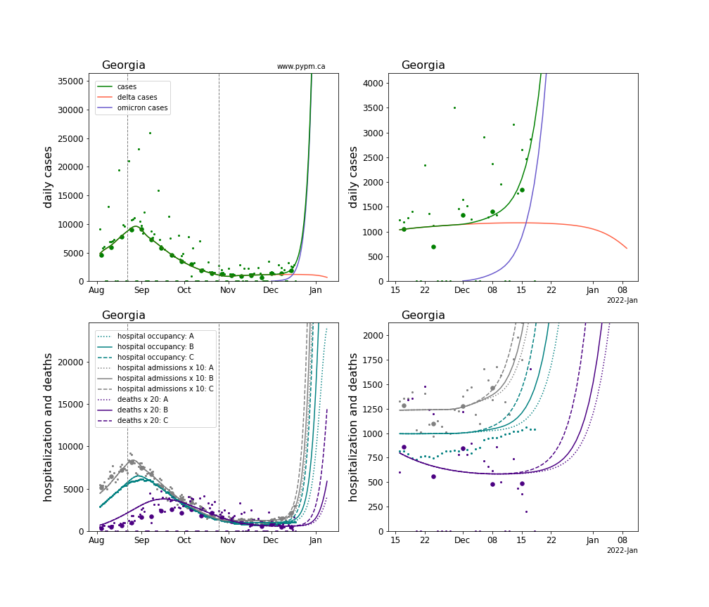
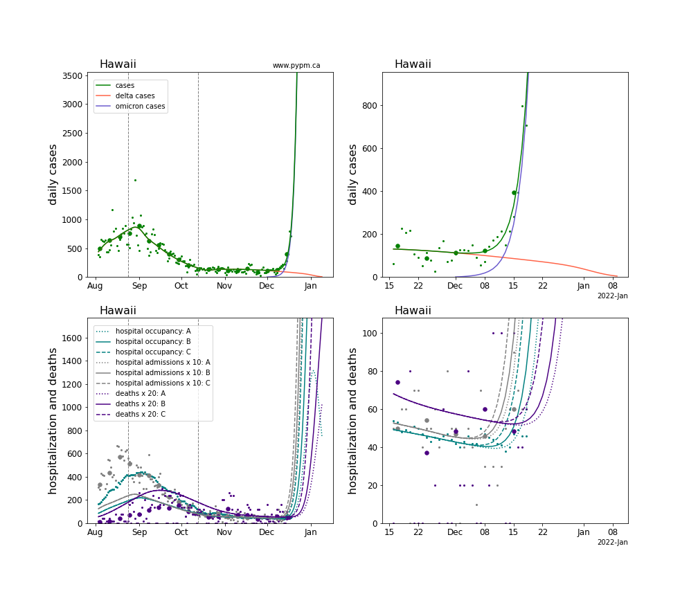
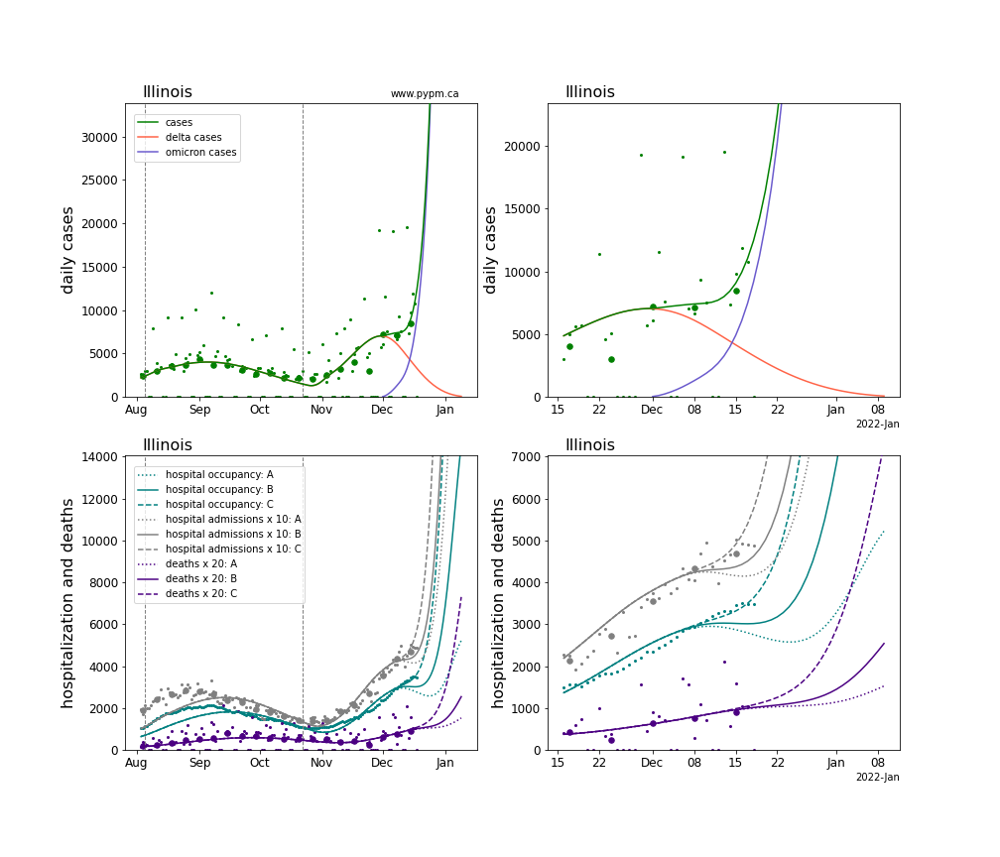
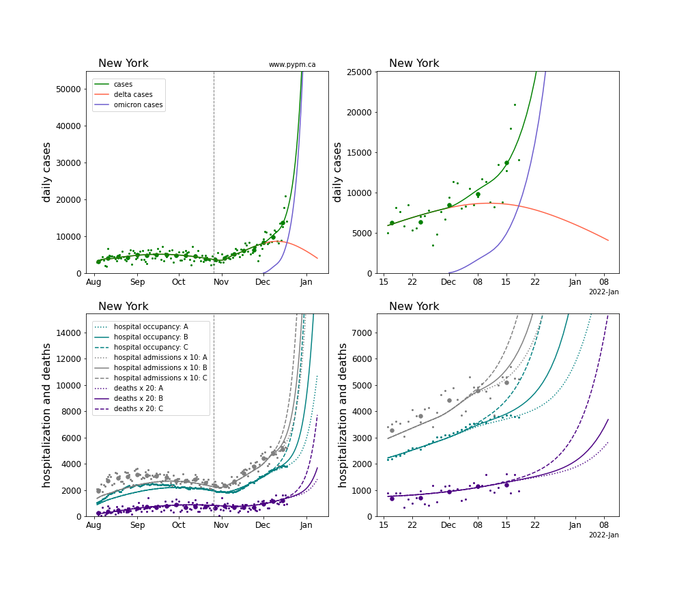
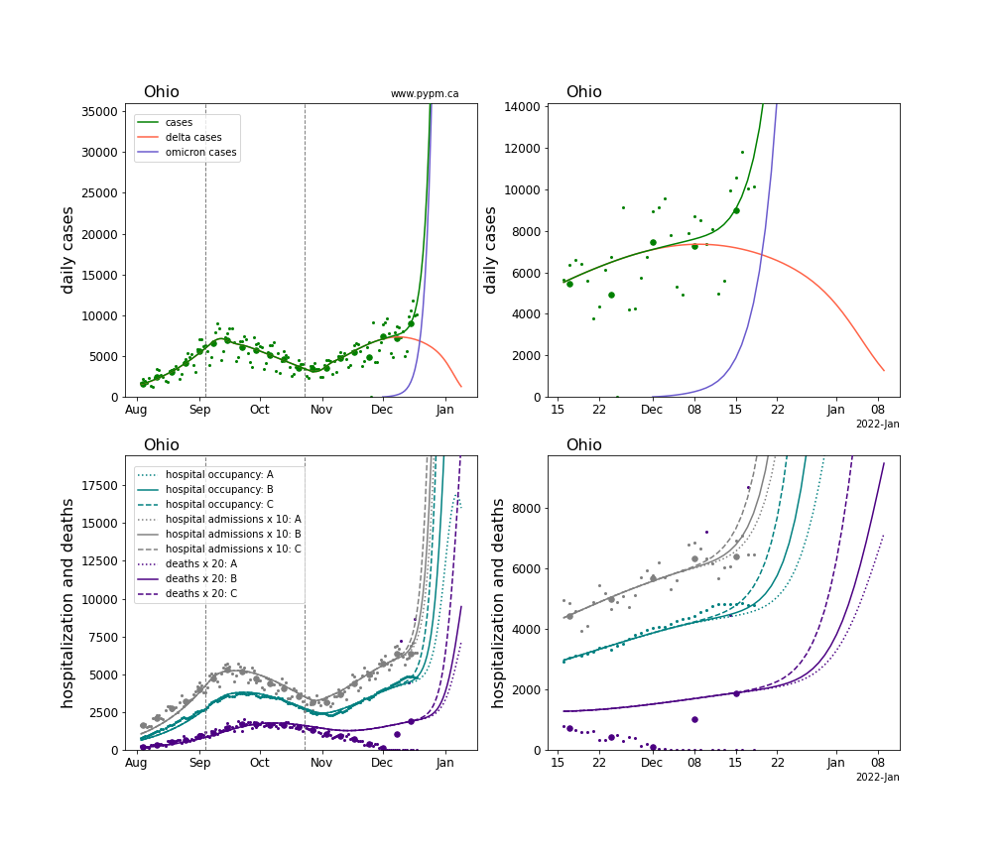
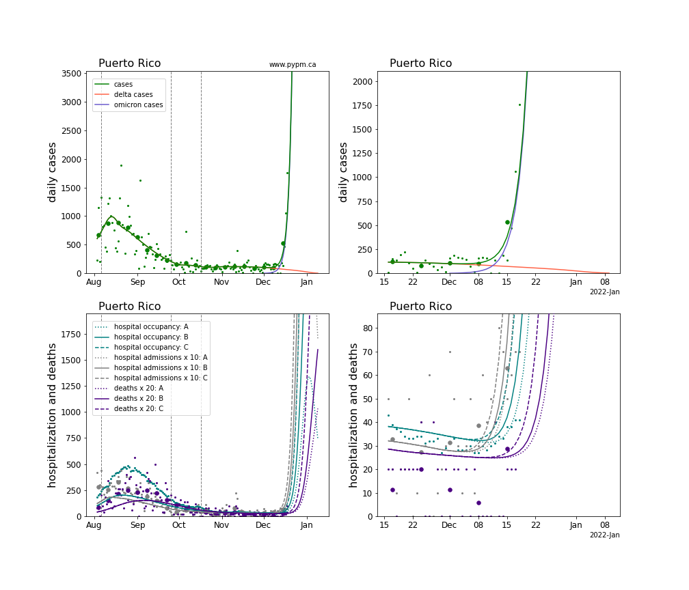
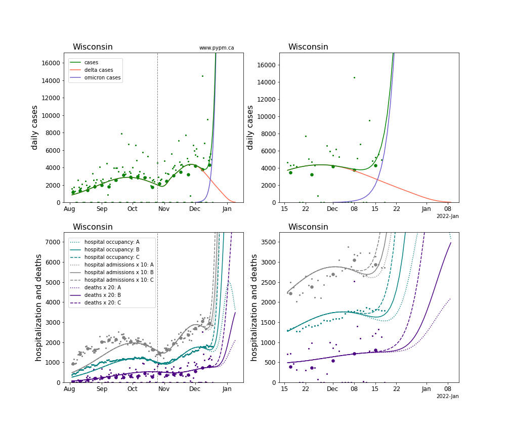

## December 19, 2021 Omicron projections for US states

Omicron infections are spreading rapidly around the globe.
Doubling times of 2-3 days are found in many jurisdictions.

For several US states, omicron produces most of the cases resulting in 
significant increases in case growth rates. 
Unlike earlier studies posted on this site, only a subset of states
are included in this report, namely
those with an apparant omicron signature in their case data.

Fitting models to these data at this stage gives estimates for omicron
growth rates and current case fraction, but with rather large uncertainty.
Detailed error analysis is not performed, given the rapidly changing situation.

## Individual state projections

The plots for each state below shows the case, hospitalization, and deaths data since
August 2021 (left) and since November 15 2021 (right).

Generally, the infection model is defined by fitting the model to the case data, and the
hospitalization and deaths models are derived from the infection model.

The omicron variant is assumed to have a much larger susceptible population, due to its
ability to evade immunity (natural and vaccination immunity). 
For this study, those immunized against earlier strains only have 20% effective immunity
against omicron.

Three severity levels are considered:
 * **A**: Probability for an immunized person to need hospitalization is reduced by the
 multiplicative factor of 0.3 and the probability of death is reduced by that factor squared.
 The length of hospital stays for all are reduced by the same factor of 0.3.
 * **B**: The severity factor is 0.5, instead of 0.3.
 * **C**: The severity factor is 1., or in other words, there is no reduction in severity
 as compared to delta infections.

The plots below show projections for hospitalization (daily admissions and hospital occupancy)
and for deaths, for the three severity levels.

It is too soon to judge which, if any, of these severities are supported by data.
One additional week should provide clarity to this important question.
Unfortunately, all the levels considered lead to hospital demands far in excess of capacity.

The green points are the daily cases, the grey points the daily hospitalizations, 
the teal points are hospital occupancy, and the indigo points are the daily deaths. 
The larger circles are weekly averages to help guide the eye.

The case data are used to define the periods for which transmission rate appears to be constant.
The vertical lines show where the transmission rate is changed.
If the susceptibe fraction is constant (immunity not changing quickly), constant transmission rates
lead to steady exponential growth or decline.
With immunity growing, the curves bend downwards due to the herd effect.
Interpretting the growth of omicron with changing delta rates growth rates leads to additional
uncertainty in the interpretations.

The curves are the model expectations for cases, hospitalizations, and deaths, and
all three are determined from the case data.

There are several challenges arising from data issues, in particular Thanksgiving closures.
In the past few months, hospitalization per case has generally declined, whereas the model
assumes constant probability for an infection to lead to hospitalization.

### [Connecticut](img/ct_4_1_1219_linear_omicron.pdf)

### [District Of Columbia](img/dc_4_1_1219_linear_omicron.pdf)

### [Florida](img/fl_4_1_1219_linear_omicron.pdf)

### [Georgia](img/ga_4_1_1219_linear_omicron.pdf)

### [Hawaii](img/hi_4_1_1219_linear_omicron.pdf)

### [Illinois](img/il_4_1_1219_linear_omicron.pdf)

### [New York](img/ny_4_1_1219_linear_omicron.pdf)

### [Ohio](img/oh_4_1_1219_linear_omicron.pdf)

### [Puerto Rico](img/pr_4_1_1219_linear_omicron.pdf)

### [Wisconsin](img/wi_4_1_1219_linear_omicron.pdf)

## Table of omicron parameter estimates

State | growth (%/day) | current case fraction (%)
---|---|---
CT | 24 | 51
DC | 36 | 94
FL | 26 | 93
GA | 30 | 69
HI | 45 | 93
IL | 22 | 79
NY | 19 | 54
OH | 34 | 47
PR | 47 | 96
WI | 41 | 79

## [return to case studies](../index.md)

