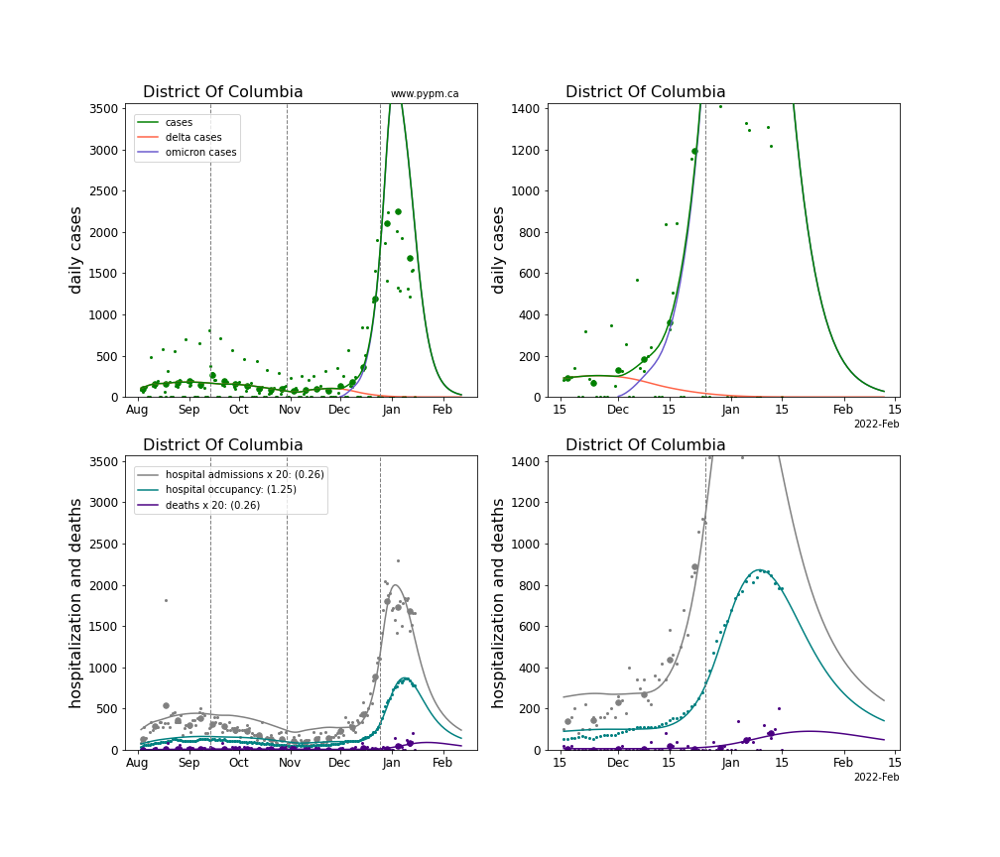
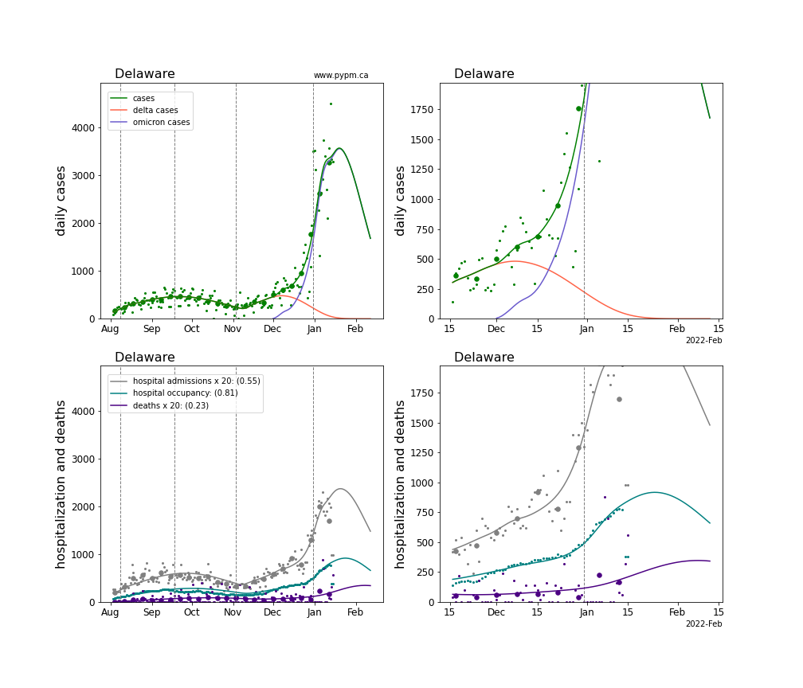
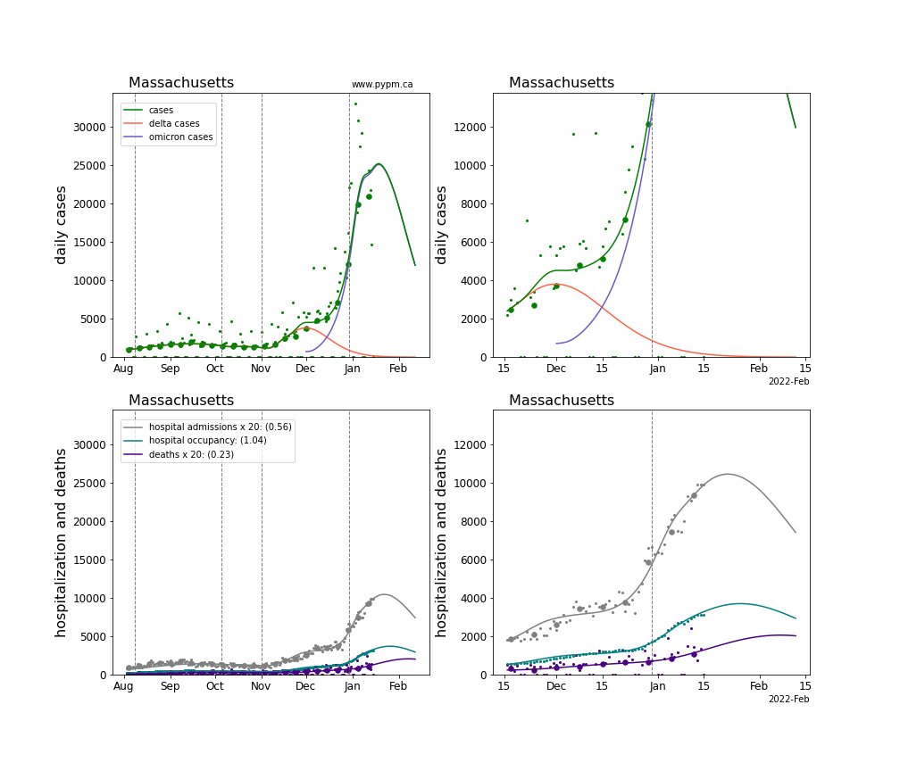

## January 16, 2022 Analysis of Omicron hospitalizations for US states

The characteristic signature of recent rapid growth due to Omicron is
visible in all US state case history data.

For some states, testing capacity limits have changed the fraction of
infections that are reported as cases, making interpretation of cases
much more difficult.
Further complicating matters is the usual effect of holiday periods
disrupting testing and reporting.
Hospital admission data can be used when cases are no longer reliable.

The analysis presented here, fits multi-strain models 
to case data in each state
and use hospital data to compare Omicron to Delta in terms of:

 * the relative severity of omicron infections 
 (odds ratio for hospital admission) and relative
 
 * duration of hospital stays (ratio of mean duration)

Case and hospital data broken down by variant(using genomic information) are not available.
Instead, the multi-strain model fit uses the characteristic
signature of rapidly growing cases to describe the transition from
Delta to Omicron cases.
Fits are illustrated for each state showing the resulting curves for
Delta and Omicron daily cases and their sum compared to overall cases.
This approach of disentangling the two strains compares well with available GISAID data,
as shown in the plot below produced by Daniel McDonald (UBC):

Having the infection model defined for each variant separately allows for
parameters for their relative hospitalization rate and hospital treatment durations to be 
fit for each state.

The Omicron severity is defined as the fraction of symptomatic Omicron infections that lead to hospitalizations,
relative to the same fraction for Delta infections.
Hospital admission data and case data are sufficient to estimate severity.
The distribution for Omicron severity in the US states is shown in the histogram below, having a
mean of 0.38 and standard deviation of 0.12,
indicating that Omicron infections are significantly less severe than Delta infections.

By using hospital occupancy data, the duration of hospital stays can be estimated.
The figures below show the estimate mean durations for Omicron and Delta hospitalizations,
and their ratio.
The mean ratio of durations is 0.9 with a standard deviation of 0.2,
indicating that the duration of treatment does not appear to be significantly
shorter for Omicron hospitalizations.

## Individual state projections

For this analysis, the case and death data source is the New York Times, since it has
has more regular updates and fewer irregularities than the JHU data.

The plots for each state below show the case, hospitalization, and deaths data since
August 2021 (left) and since November 15 2021 (right).
The maximum vertical axis values for cases are 500/100k (left) and 200/100k (right).
Daily hospital admissions and deaths are scaled up by 20 to be able to see them on a single plot.

The infection model is defined by fitting the model to the case data, and the
hospitalization and deaths models are derived from the infection model.

The Omicron variant is assumed to have a much larger susceptible population, due to its
ability to evade immunity (natural and vaccination immunity). 
For this study, those immunized against earlier strains only have 20% effective immunity
against omicron.

The Omicron variant is assumed to produce many more infections that go undetected as cases.
The reporting fraction of omicron infections is assumed to be 0.4 times that of Delta infections.
This has the effect of reducing peak infection and hospitalization rates.

The green points are the daily cases, the grey points the daily hospitalizations, 
the teal points are hospital occupancy, and the indigo points are the daily deaths. 
The larger circles are weekly averages to help guide the eye.

The case data are used to define the periods for which transmission rate appears to be constant.
The vertical lines show where the transmission rate is changed.
If the susceptibe fraction is constant (immunity not changing quickly), constant transmission rates
lead to steady exponential growth or decline.
With immunity growing, the curves bend downwards due to the herd effect.
Interpretting the growth of Omicron with changing Delta rates growth rates leads to additional
uncertainty in the interpretations.

Some states appear to have reached peak hospitalization, while most are
several weeks away from that point.

The curves are the model expectations for cases, hospitalizations, and deaths, and
all three are determined from the case data.
The severity is estimated from the hospital admission data, and its value is shown in the legend.
The hospital durations (mean Omicron duration and mean Delta duration) are estimated from the
hospital occupancy data, and the ratio (Omicron divided by Delta) is shown in the legend.
Omicron and Delta hospital parameters can both be estimated from these data only
because of the different relative prevalence by date, as indicated by the
fits to the case data.

For many states there are now sufficent data to estimate the relative death rates for Omicron and Delta
infections, with values shows in the legend. 
For the remaining states, round estimates of 0.1 or 0.2 are shown.

### [Alaska](img/ak_4_2_0116_linear_omicron.pdf)

### [Alabama](img/al_4_2_0116_linear_omicron.pdf)

### [Arkansas](img/ar_4_2_0116_linear_omicron.pdf)

### [Arizona](img/az_4_2_0116_linear_omicron.pdf)

### [California](img/ca_4_2_0116_linear_omicron.pdf)

### [Colorado](img/co_4_2_0116_linear_omicron.pdf)

### [Connecticut](img/ct_4_2_0116_linear_omicron.pdf)

### [District Of Columbia](img/dc_4_2_0116_linear_omicron.pdf)

### [Delaware](img/de_4_2_0116_linear_omicron.pdf)

### [Florida](img/fl_4_2_0116_linear_omicron.pdf)

### [Georgia](img/ga_4_2_0116_linear_omicron.pdf)

### [Hawaii](img/hi_4_2_0116_linear_omicron.pdf)

### [Iowa](img/ia_4_2_0116_linear_omicron.pdf)

### [Idaho](img/id_4_2_0116_linear_omicron.pdf)

### [Illinois](img/il_4_2_0116_linear_omicron.pdf)

### [Indiana](img/in_4_2_0116_linear_omicron.pdf)

### [Kansas](img/ks_4_2_0116_linear_omicron.pdf)

### [Kentucky](img/ky_4_2_0116_linear_omicron.pdf)

### [Louisiana](img/la_4_2_0116_linear_omicron.pdf)

### [Massachusetts](img/ma_4_2_0116_linear_omicron.pdf)

### [Maryland](img/md_4_2_0116_linear_omicron.pdf)

### [Maine](img/me_4_2_0116_linear_omicron.pdf)

### [Michigan](img/mi_4_2_0116_linear_omicron.pdf)

### [Minnesota](img/mn_4_2_0116_linear_omicron.pdf)

### [Missouri](img/mo_4_2_0116_linear_omicron.pdf)

### [Mississippi](img/ms_4_2_0116_linear_omicron.pdf)

### [Montana](img/mt_4_2_0116_linear_omicron.pdf)

### [North Carolina](img/nc_4_2_0116_linear_omicron.pdf)

### [North Dakota](img/nd_4_2_0116_linear_omicron.pdf)

### [Nebraska](img/ne_4_2_0116_linear_omicron.pdf)

### [New Hampshire](img/nh_4_2_0116_linear_omicron.pdf)

### [New Jersey](img/nj_4_2_0116_linear_omicron.pdf)

### [New Mexico](img/nm_4_2_0116_linear_omicron.pdf)

### [Nevada](img/nv_4_2_0116_linear_omicron.pdf)

### [New York](img/ny_4_2_0116_linear_omicron.pdf)

### [Ohio](img/oh_4_2_0116_linear_omicron.pdf)

### [Oklahoma](img/ok_4_2_0116_linear_omicron.pdf)

### [Oregon](img/or_4_2_0116_linear_omicron.pdf)

### [Pennsylvania](img/pa_4_2_0116_linear_omicron.pdf)

### [Puerto Rico](img/pr_4_2_0116_linear_omicron.pdf)

### [Rhode Island](img/ri_4_2_0116_linear_omicron.pdf)

### [South Carolina](img/sc_4_2_0116_linear_omicron.pdf)

### [South Dakota](img/sd_4_2_0116_linear_omicron.pdf)

### [Tennessee](img/tn_4_2_0116_linear_omicron.pdf)

### [Texas](img/tx_4_2_0116_linear_omicron.pdf)

### [Utah](img/ut_4_2_0116_linear_omicron.pdf)

### [Virginia](img/va_4_2_0116_linear_omicron.pdf)

### [Vermont](img/vt_4_2_0116_linear_omicron.pdf)

### [Washington](img/wa_4_2_0116_linear_omicron.pdf)

### [Wisconsin](img/wi_4_2_0116_linear_omicron.pdf)

### [West Virginia](img/wv_4_2_0116_linear_omicron.pdf)

### [Wyoming](img/wy_4_2_0116_linear_omicron.pdf)

## Comparisons of state projections

The daily case rates per 100,000 greatly exceed the levels seen earlier in the epidemic. The plots show the
model fits to case data for states grouped according to region.

The daily hospital admissions per 100,000 generally exceed previous levels, but it is clearly less significant,
given the lower severity of Omicron infections.
The figure shows all hospital admissions, including those from Delta.

To compare the growth of hospital demands arising the Omicron infections, the following curves show the
modelled number of Omicron hospital admissions per 100,000.
The curves are aligned on the day that Omicron hospital admissions first exceeded 2 per day per 100,000
and end on January 16, 2022.
The growth is remarkably similar across the states, considering
the large variety of populations and environments.

## USA Forecast

The following plots show the combined US 4 week forecast. The shaded areas are 50%, 80%, and 95% intervals.
Overall, case rates and hospitalizations are expected to begin declining while deaths are forecast to grow.

### [USA](img/usa-forecast.pdf)

## [return to case studies](../index.md)

