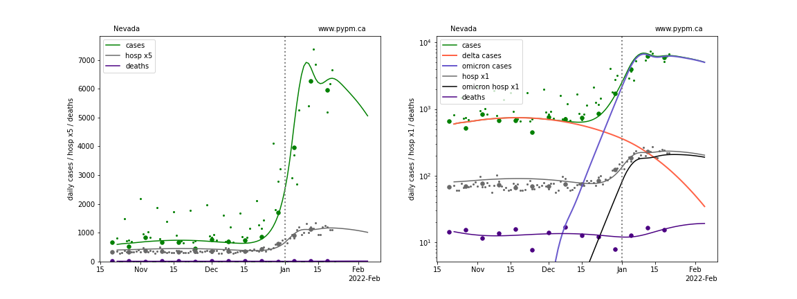
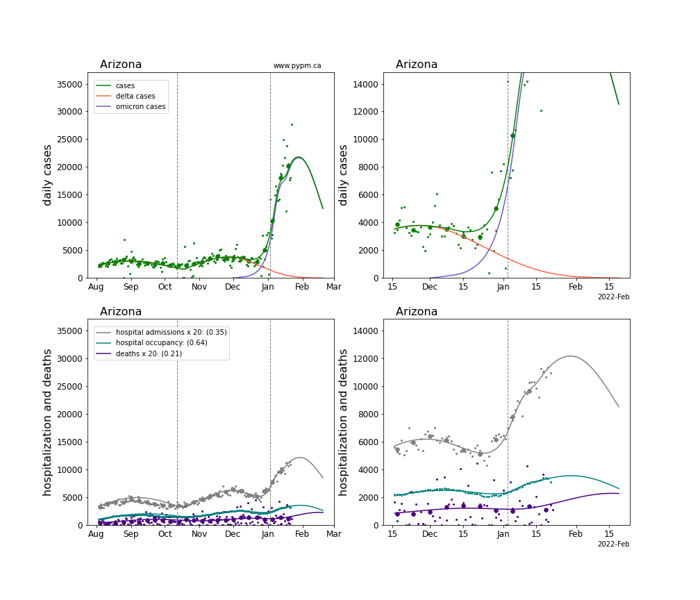
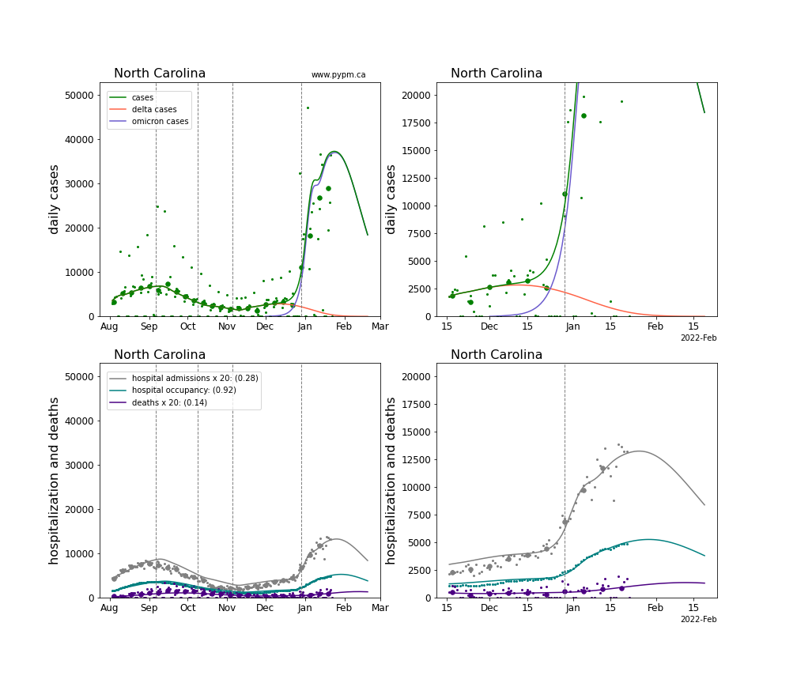
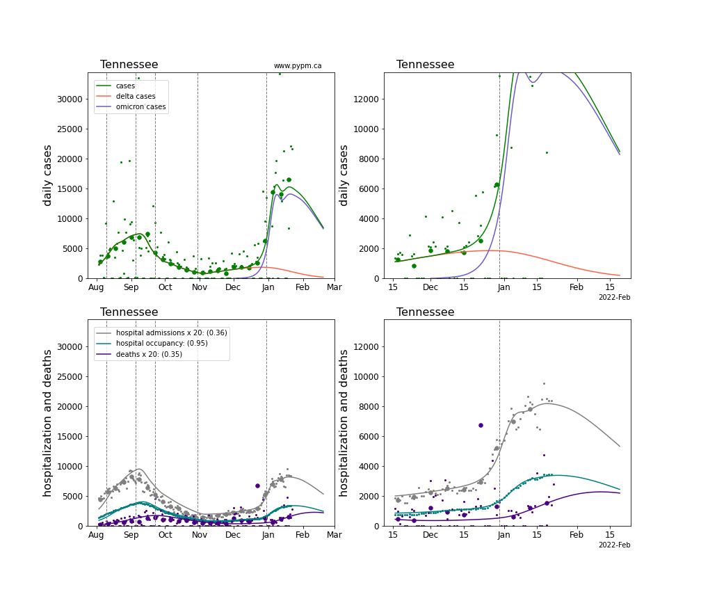

## January 23, 2022 Analysis of US state data

The characteristic signature of recent rapid growth due to Omicron is
visible in all US state case history data.
For this analysis, the case and death data source is the New York Times, since it has
has more regular updates and fewer irregularities than the JHU data.

For some states, testing capacity limits have changed the fraction of
infections that are reported as cases, making interpretation of cases
much more difficult.
Further complicating matters is the usual effect of holiday periods
disrupting testing and reporting.
Hospital admission data can be used when cases are no longer reliable.

The report has two sections, the first showing the rapid decline
in growth rates for Omicron infections and the second showing studies of
hospital demands for Omicron infections.

## Rapid reduction in Omicron growth rates

As usual, the infection model is defined by fitting the model to the case data, and the
hospitalization and deaths models are derived from the infection model.
To estimate the recent transmission rate of Omicron, hospital admission data
is used.
For many states, case data appears to be reliable and yields similar transmission rate estimates.

The Omicron variant is assumed to have a much larger susceptible population, due to its
ability to evade immunity (natural and vaccination immunity). 
For this study, those immunized against earlier strains only have 20% effective immunity
against omicron.

Booster doses have been included in this analysis, and are assumed to raise the
vaccine effectiveness from 20% to 80% with a time delay given by a gamma distribution with
mean 10 days and standard deviation 5 days.

The Omicron variant is also assumed to produce more infections that go undetected as cases.
The reporting fraction of omicron infections is assumed to be 0.6 times that of Delta infections.
This has the effect of reducing peak infection and hospitalization rates.
The scaling of the reporting fraction had been 0.4 in previous analyses of US data, 
but is changed to 0.6, given the inclusion of boosters in the model, which increases
population immunity.

The green points are the daily cases, the grey points the daily hospitalizations, 
the teal points are hospital occupancy, and the indigo points are the daily deaths. 
The larger circles are weekly averages to help guide the eye.

The case data are used to define the periods for which transmission rate appears to be constant.
The vertical lines show where the transmission rate is changed.
If the susceptibe fraction is constant (immunity not changing quickly), constant transmission rates
lead to steady exponential growth or decline.
With immunity growing, the curves bend downwards due to the herd effect.
Interpretting the growth of Omicron with changing Delta rates growth rates leads to additional
uncertainty in the interpretations.

Note that for these analyses, hospital admission data were used to estimate the recent
infection trajectory, to avoid potential problems with case data no longer being reliable.

### Individual state hospitalization analyses

The plots for each state below show the case, hospital admisions, and deaths data since
October 15 2021, on a linear scale (left) and log scale (right).
Daily hospital admissions are scaled up by 5 to be able to see them on the linear scales.
The right figures show how the model attributes cases from Delta and Omicron infections,
and the hospital admissions from Omicron infections.
Omicron hospital admissions make a useful metric to compare 
the growth of Omicron across different states, removing
the widely variable Delta hospital admissions.

The model is able to describe data from the states by introducing a transition to lower
transmission rate near the end of December 2021.
This introduces a kink in the log scale plots (as constant transmission rate
corresponds to straight lines, if population immunity is roughly constant).

Following the individual state plots, summaries of all states are shown below.

### [Alaska](img/ak_4_2_0123.pdf)

### [Alabama](img/al_4_2_0123.pdf)

### [Arkansas](img/ar_4_2_0123.pdf)

### [Arizona](img/az_4_2_0123.pdf)

### [California](img/ca_4_2_0123.pdf)

### [Colorado](img/co_4_2_0123.pdf)

### [Connecticut](img/ct_4_2_0123.pdf)

### [District Of Columbia](img/dc_4_2_0123.pdf)

### [Delaware](img/de_4_2_0123.pdf)

### [Florida](img/fl_4_2_0123.pdf)

### [Georgia](img/ga_4_2_0123.pdf)

### [Hawaii](img/hi_4_2_0123.pdf)

### [Iowa](img/ia_4_2_0123.pdf)

### [Idaho](img/id_4_2_0123.pdf)

### [Illinois](img/il_4_2_0123.pdf)

### [Indiana](img/in_4_2_0123.pdf)

### [Kansas](img/ks_4_2_0123.pdf)

### [Kentucky](img/ky_4_2_0123.pdf)

### [Louisiana](img/la_4_2_0123.pdf)

### [Massachusetts](img/ma_4_2_0123.pdf)

### [Maryland](img/md_4_2_0123.pdf)

### [Maine](img/me_4_2_0123.pdf)

### [Michigan](img/mi_4_2_0123.pdf)

### [Minnesota](img/mn_4_2_0123.pdf)

### [Missouri](img/mo_4_2_0123.pdf)

### [Mississippi](img/ms_4_2_0123.pdf)

### [Montana](img/mt_4_2_0123.pdf)

### [North Carolina](img/nc_4_2_0123.pdf)

### [North Dakota](img/nd_4_2_0123.pdf)

### [Nebraska](img/ne_4_2_0123.pdf)

### [New Hampshire](img/nh_4_2_0123.pdf)

### [New Jersey](img/nj_4_2_0123.pdf)

### [New Mexico](img/nm_4_2_0123.pdf)

### [Nevada](img/nv_4_2_0123.pdf)

### [New York](img/ny_4_2_0123.pdf)

### [Ohio](img/oh_4_2_0123.pdf)

### [Oklahoma](img/ok_4_2_0123.pdf)

### [Oregon](img/or_4_2_0123.pdf)

### [Pennsylvania](img/pa_4_2_0123.pdf)

### [Puerto Rico](img/pr_4_2_0123.pdf)

### [Rhode Island](img/ri_4_2_0123.pdf)

### [South Carolina](img/sc_4_2_0123.pdf)

### [South Dakota](img/sd_4_2_0123.pdf)

### [Tennessee](img/tn_4_2_0123.pdf)

### [Texas](img/tx_4_2_0123.pdf)

### [Utah](img/ut_4_2_0123.pdf)

### [Virginia](img/va_4_2_0123.pdf)

### [Vermont](img/vt_4_2_0123.pdf)

### [Washington](img/wa_4_2_0123.pdf)

### [Wisconsin](img/wi_4_2_0123.pdf)

### [West Virginia](img/wv_4_2_0123.pdf)

### [Wyoming](img/wy_4_2_0123.pdf)

## Comparisons of Omicron daily hospital admissions

Hospital admissions can be used in a per-capita comparison of infections between states,
avoiding potential issues with test capacity.
Using Omicron hospital admissions removes the variability of the Delta hospital admissions taking
place during the emergence of Omicron.
This metric relies on a model to attribute hospital admissions during the phase when Delta contributes
a substantial fraction of hospital admissions.

The plot below shows this metric, aligned on the day that Omicron hospital 
admissions first exceeded 2 per day per 100,000.
The solid lines end on January 23, and the dashed lines show
model projections.

The same figure shown in log scale:

The growth pattern is remarkably similar across the states, considering
the large variety of populations and environments.

The figure below shows the daily growth rate of Omicron hospital admissions
(as derived from the models).
A remarkable drop in Omicron infection rates is apparent.
The reason for the rather sudden and persistent change in transmission rate
is not understood.

## Omicron and hospitalization

The analysis presented here, fits multi-strain models 
to case data in each state
and use hospital data to compare Omicron to Delta in terms of:

 * the relative severity of omicron infections 
 (odds ratio for hospital admission) and relative
 
 * duration of hospital stays (ratio of mean duration)

Case and hospital data broken down by variant(using genomic information) are not available.
Instead, the multi-strain model fit uses the characteristic
signature of rapidly growing cases to describe the transition from
Delta to Omicron cases.
Fits are illustrated for each state showing the resulting curves for
Delta and Omicron daily cases and their sum compared to overall cases.

Having the infection model defined for each variant separately allows for
parameters for their relative hospitalization rate and hospital treatment durations to be 
fit for each state.

The Omicron severity is defined as the fraction of symptomatic Omicron infections that lead to hospitalizations,
relative to the same fraction for Delta infections.
Assuming that both case and hospital admission data remain consistent indicators for infections, previous
analyses here have established the severity to be approximately 0.4,
indicating that Omicron infections are significantly less severe than Delta infections.

For these analyses, hospital admission data were primarily used to estimate the recent
infection trajectory, which could affect estimates of severity.

By using hospital admission and occupancy data, the duration of hospital stays can be estimated.
The figures below show the estimate mean durations for Omicron and Delta hospitalizations,
and their ratio.
The mean ratio of durations is 0.9 with a standard deviation of 0.2.
The duration of treatment does not appear to be significantly
shorter for Omicron hospitalizations.

### Individual state hospitalization analyses

The plots for each state below show the case, hospitalization, and deaths data since
August 2021 (left) and since November 15 2021 (right).
The maximum vertical axis values for cases are 500/100k (left) and 200/100k (right).
Daily hospital admissions and deaths are scaled up by 20 to be able to see them on a single plot.

The severity is estimated from the hospital admission data, and its value is shown in the legend.
The hospital durations (mean Omicron duration and mean Delta duration) are estimated from the
hospital occupancy data, and the ratio (Omicron divided by Delta) is shown in the legend.
Omicron and Delta hospital parameters can both be estimated from these data only
because of the different relative prevalence by date, as indicated by the
fits to the case data.

For many states there are now sufficent data to estimate the relative death rates for Omicron and Delta
infections, with values shows in the legend. 
For the remaining states, round estimates of 0.1 or 0.2 are shown.

### [Alaska](img/ak_4_2_0123_linear_omicron.pdf)

### [Alabama](img/al_4_2_0123_linear_omicron.pdf)

### [Arkansas](img/ar_4_2_0123_linear_omicron.pdf)

### [Arizona](img/az_4_2_0123_linear_omicron.pdf)

### [California](img/ca_4_2_0123_linear_omicron.pdf)

### [Colorado](img/co_4_2_0123_linear_omicron.pdf)

### [Connecticut](img/ct_4_2_0123_linear_omicron.pdf)

### [District Of Columbia](img/dc_4_2_0123_linear_omicron.pdf)

### [Delaware](img/de_4_2_0123_linear_omicron.pdf)

### [Florida](img/fl_4_2_0123_linear_omicron.pdf)

### [Georgia](img/ga_4_2_0123_linear_omicron.pdf)

### [Hawaii](img/hi_4_2_0123_linear_omicron.pdf)

### [Iowa](img/ia_4_2_0123_linear_omicron.pdf)

### [Idaho](img/id_4_2_0123_linear_omicron.pdf)

### [Illinois](img/il_4_2_0123_linear_omicron.pdf)

### [Indiana](img/in_4_2_0123_linear_omicron.pdf)

### [Kansas](img/ks_4_2_0123_linear_omicron.pdf)

### [Kentucky](img/ky_4_2_0123_linear_omicron.pdf)

### [Louisiana](img/la_4_2_0123_linear_omicron.pdf)

### [Massachusetts](img/ma_4_2_0123_linear_omicron.pdf)

### [Maryland](img/md_4_2_0123_linear_omicron.pdf)

### [Maine](img/me_4_2_0123_linear_omicron.pdf)

### [Michigan](img/mi_4_2_0123_linear_omicron.pdf)

### [Minnesota](img/mn_4_2_0123_linear_omicron.pdf)

### [Missouri](img/mo_4_2_0123_linear_omicron.pdf)

### [Mississippi](img/ms_4_2_0123_linear_omicron.pdf)

### [Montana](img/mt_4_2_0123_linear_omicron.pdf)

### [North Carolina](img/nc_4_2_0123_linear_omicron.pdf)

### [North Dakota](img/nd_4_2_0123_linear_omicron.pdf)

### [Nebraska](img/ne_4_2_0123_linear_omicron.pdf)

### [New Hampshire](img/nh_4_2_0123_linear_omicron.pdf)

### [New Jersey](img/nj_4_2_0123_linear_omicron.pdf)

### [New Mexico](img/nm_4_2_0123_linear_omicron.pdf)

### [Nevada](img/nv_4_2_0123_linear_omicron.pdf)

### [New York](img/ny_4_2_0123_linear_omicron.pdf)

### [Ohio](img/oh_4_2_0123_linear_omicron.pdf)

### [Oklahoma](img/ok_4_2_0123_linear_omicron.pdf)

### [Oregon](img/or_4_2_0123_linear_omicron.pdf)

### [Pennsylvania](img/pa_4_2_0123_linear_omicron.pdf)

### [Puerto Rico](img/pr_4_2_0123_linear_omicron.pdf)

### [Rhode Island](img/ri_4_2_0123_linear_omicron.pdf)

### [South Carolina](img/sc_4_2_0123_linear_omicron.pdf)

### [South Dakota](img/sd_4_2_0123_linear_omicron.pdf)

### [Tennessee](img/tn_4_2_0123_linear_omicron.pdf)

### [Texas](img/tx_4_2_0123_linear_omicron.pdf)

### [Utah](img/ut_4_2_0123_linear_omicron.pdf)

### [Virginia](img/va_4_2_0123_linear_omicron.pdf)

### [Vermont](img/vt_4_2_0123_linear_omicron.pdf)

### [Washington](img/wa_4_2_0123_linear_omicron.pdf)

### [Wisconsin](img/wi_4_2_0123_linear_omicron.pdf)

### [West Virginia](img/wv_4_2_0123_linear_omicron.pdf)

### [Wyoming](img/wy_4_2_0123_linear_omicron.pdf)

## USA Forecast

The following plots show the combined US 4 week forecast. The shaded areas are 50%, 80%, and 95% intervals.
Overall, case rates and hospitalizations are expected to begin declining while deaths are forecast to grow.

### [USA](img/usa-forecast.pdf)

## [return to case studies](../index.md)

