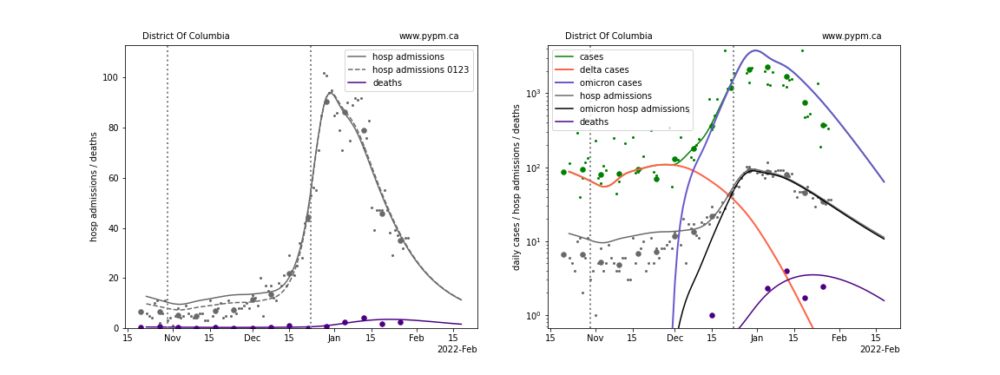

## January 30, 2022 Analysis of US state data

The characteristic Omicron signature of rapid growth in cases and hospital admissions,
has been visible in all US states for several weeks.
This was followed by a dramatic reduction in growth rate near the end of December, as reported
in previous reports.
Many states are now past the peak in daily cases and hospital admissions.

This report shows the result of analyses that use hospital admission data to estimate
the transmission rate following the rapid transition to lower growth rate.
The only parameters adjusted are the current transmission rate (assumed constant since
the transition near the end of December), and normalization constants.
Hospital admission data are used, to avoid testing capacity issues and to
better predict future hospital admission rates.

## Rapid reduction in Omicron growth rates

As usual, the infection model is defined by fitting the model to the case data, and the
hospitalization and deaths models are derived from the infection model.
To estimate the current transmission rate of Omicron, however, hospital admission data
are used.

The Omicron variant is assumed to have a much larger susceptible population, due to its
ability to evade immunity (natural and vaccination immunity). 
For this study, those immunized against earlier strains only have 20% effective immunity
against omicron.

Booster doses have been included in this analysis, and are assumed to raise the
vaccine effectiveness from 20% to 80% with a time delay given by a gamma distribution with
mean 10 days and standard deviation 5 days.

The Omicron variant is also assumed to produce more infections that go undetected as cases.
The reporting fraction of omicron infections is assumed to be 0.6 times that of Delta infections.
This has the effect of reducing peak infection and hospitalization rates.
The scaling of the reporting fraction had been 0.4 in previous analyses of US data, 
but is changed to 0.6, given the inclusion of boosters in the model, which increases
population immunity.

The green points are the daily cases, the grey points the daily hospitalizations, 
The larger circles are weekly averages to help guide the eye.

The case data are used to define the periods for which transmission rate appears to be constant.
The vertical dashed lines show where the transmission rate is changed.
If the susceptible fraction is constant (immunity not changing quickly), constant transmission rates
lead to steady exponential growth or decline.
With immunity growing, the curves bend downwards due to the herd effect.
Interpretting the growth of Omicron with changing Delta rates growth rates leads to additional
uncertainty in the interpretations.

### Individual state hospitalization analyses

The plots for each state below show the case, hospital admisions, and deaths data since
October 15 2021, on a linear scale (left) and log scale (right).
The right figures show how the model attributes cases from Delta and Omicron infections,
and the hospital admissions from Omicron infections.
Omicron hospital admissions make a useful metric to compare 
the growth of Omicron across different states, removing
the widely variable Delta hospital admissions.

The left plots also show the hospital admission model curves from the previous week's analysis,
to show the degree of variability when new data is included.
For those states where peak hospital admission was reached more than a week ago, the
new model projections are typically close to the previous week's projection, as expected.

The model is able to describe data from the states by introducing a transition to lower
transmission rate near the end of December 2021.
This introduces a kink in the log scale plots (as constant transmission rate
corresponds to straight lines, if population immunity is roughly constant).

Following the individual state plots, summaries of all states are shown below.

### [Alaska](img/ak_4_2_0130.pdf)

### [Alabama](img/al_4_2_0130.pdf)

### [Arkansas](img/ar_4_2_0130.pdf)

### [Arizona](img/az_4_2_0130.pdf)

### [California](img/ca_4_2_0130.pdf)

### [Colorado](img/co_4_2_0130.pdf)

### [Connecticut](img/ct_4_2_0130.pdf)

### [District Of Columbia](img/dc_4_2_0130.pdf)

### [Delaware](img/de_4_2_0130.pdf)

### [Florida](img/fl_4_2_0130.pdf)

### [Georgia](img/ga_4_2_0130.pdf)

### [Hawaii](img/hi_4_2_0130.pdf)

### [Iowa](img/ia_4_2_0130.pdf)

### [Idaho](img/id_4_2_0130.pdf)

### [Illinois](img/il_4_2_0130.pdf)

### [Indiana](img/in_4_2_0130.pdf)

### [Kansas](img/ks_4_2_0130.pdf)

### [Kentucky](img/ky_4_2_0130.pdf)

### [Louisiana](img/la_4_2_0130.pdf)

### [Massachusetts](img/ma_4_2_0130.pdf)

### [Maryland](img/md_4_2_0130.pdf)

### [Maine](img/me_4_2_0130.pdf)

### [Michigan](img/mi_4_2_0130.pdf)

### [Minnesota](img/mn_4_2_0130.pdf)

### [Missouri](img/mo_4_2_0130.pdf)

### [Mississippi](img/ms_4_2_0130.pdf)

### [Montana](img/mt_4_2_0130.pdf)

### [North Carolina](img/nc_4_2_0130.pdf)

### [North Dakota](img/nd_4_2_0130.pdf)

### [Nebraska](img/ne_4_2_0130.pdf)

### [New Hampshire](img/nh_4_2_0130.pdf)

### [New Jersey](img/nj_4_2_0130.pdf)

### [New Mexico](img/nm_4_2_0130.pdf)

### [Nevada](img/nv_4_2_0130.pdf)

### [New York](img/ny_4_2_0130.pdf)

### [Ohio](img/oh_4_2_0130.pdf)

### [Oklahoma](img/ok_4_2_0130.pdf)

### [Oregon](img/or_4_2_0130.pdf)

### [Pennsylvania](img/pa_4_2_0130.pdf)

### [Puerto Rico](img/pr_4_2_0130.pdf)

### [Rhode Island](img/ri_4_2_0130.pdf)

### [South Carolina](img/sc_4_2_0130.pdf)

### [South Dakota](img/sd_4_2_0130.pdf)

### [Tennessee](img/tn_4_2_0130.pdf)

### [Texas](img/tx_4_2_0130.pdf)

### [Utah](img/ut_4_2_0130.pdf)

### [Virginia](img/va_4_2_0130.pdf)

### [Vermont](img/vt_4_2_0130.pdf)

### [Washington](img/wa_4_2_0130.pdf)

### [Wisconsin](img/wi_4_2_0130.pdf)

### [West Virginia](img/wv_4_2_0130.pdf)

### [Wyoming](img/wy_4_2_0130.pdf)

## Comparisons of Omicron daily hospital admissions

Hospital admissions can be used in a per-capita comparison of infections between states,
avoiding potential issues with test capacity.
Using Omicron hospital admissions removes the variability of the Delta hospital admissions taking
place during the emergence of Omicron.
This metric relies on a model to attribute hospital admissions during the phase when Delta contributes
a substantial fraction of hospital admissions.

The plot below shows this metric, aligned on the day that Omicron hospital 
admissions first exceeded 2 per day per 100,000.
The solid lines end on January 23, and the dashed lines show
model projections.

The same figure shown in log scale:

## USA Forecast

The following plots show the combined US 4 week forecast. The shaded areas are 50%, 80%, and 95% intervals.
Overall, case rates and hospitalizations are expected to begin declining while deaths are forecast to grow.

### [USA](img/usa-forecast.pdf)

## [return to case studies](../index.md)

