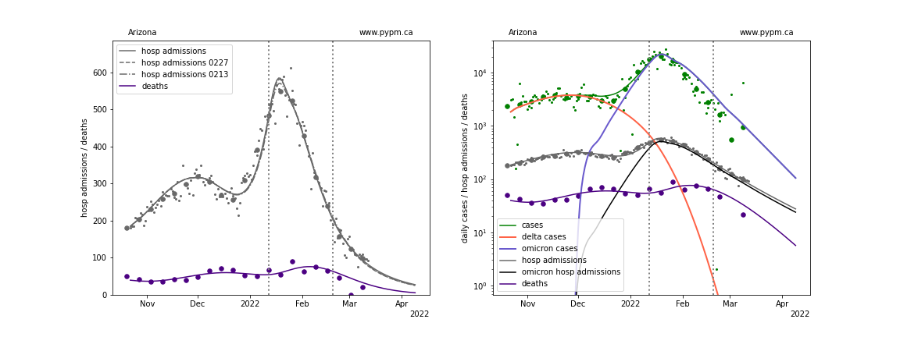
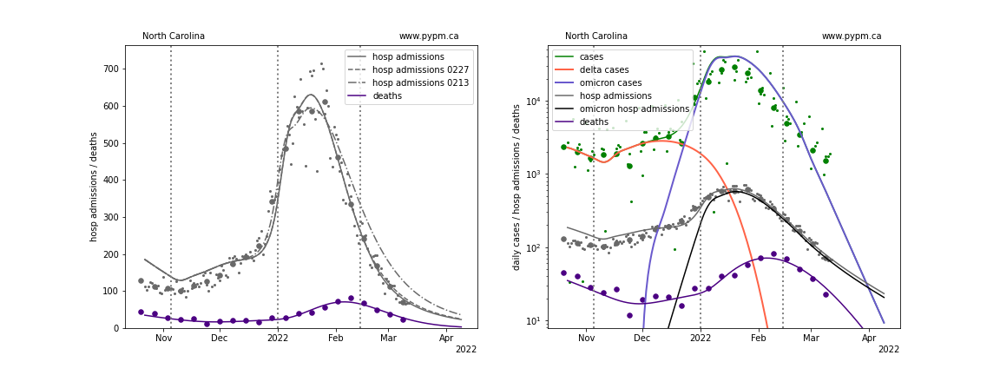

## March 13, 2022 Analysis of US state data

The characteristic Omicron signature of rapid growth in cases and hospital admissions,
was followed by a dramatic reduction in growth rate near the end of 2021, as reported
in previous reports.
Infection rates have declined significantly over the past several weeks.

This report shows the result of analyses that use hospital admission data to estimate
the transmission rate following the rapid transition to lower growth rate.
The only parameters adjusted are the transmission rates 
and normalization constants.
Hospital admission data are used, to avoid testing capacity issues and to
better predict future hospital admission rates.
For some states, the model for cases differs significantly from case data.

## Rapid reduction in Omicron growth rates

As usual, the infection model is defined by fitting the model to the case data, and the
hospitalization and deaths models are derived from the infection model.
To estimate the transmission rates of Omicron in 2022 hospital admission data
are used.

The Omicron variant is assumed to have a much larger susceptible population, due to its
ability to evade immunity (natural and vaccination immunity). 
For this study, those immunized against earlier strains only have 20% effective immunity
against omicron.

Booster doses have been included in this analysis, and are assumed to raise the
vaccine effectiveness from 20% to 80% with a time delay given by a gamma distribution with
mean 10 days and standard deviation 5 days.
The Omicron variant is also assumed to produce more infections that go undetected as cases
(as compard to Delta).

The green points are the daily cases, the grey points the daily hospitalizations, 
The larger circles are weekly averages to help guide the eye.

The vertical dashed lines show where the transmission rate is changed.
If the susceptible fraction is constant (immunity not changing quickly), constant transmission rates
lead to steady exponential growth or decline.
With immunity growing, the curves bend downwards due to the herd effect.

### Individual state hospitalization analyses

The plots for each state below show the case, hospital admisions, and deaths data since
October 15 2021, on a linear scale (left) and log scale (right).
The right figures show how the model attributes cases from Delta and Omicron infections,
and the hospital admissions from Omicron infections.
Omicron hospital admissions make a useful metric to compare 
the growth of Omicron across different states, removing
the widely variable Delta hospital admissions.

The left plots also show the hospital admission model curves from previous projections (2 and 4 weeks ago)
(February 13 and 27), to show the degree of variability when new data is included.
For most states the previous weeks' model projections agree with the recent data.
With the rapid drop in infection rates, the decay of daily hospital admissions has much to do with the
long tail in the time delay between infection and hospital admission (reported in the August 10, 2021 report).
As a result the sensitivity to recent changes in transmission rate (relaxation or BA.2) is reduced.

The model is able to describe data from the states by introducing a transition to lower
transmission rate near the end of December 2021.
This introduces a kink in the log scale plots (as constant transmission rate
corresponds to straight lines, if population immunity is roughly constant).
For several states, a transition is included in February to improve the model fit to data.

Following the individual state plots, summaries of all states are shown below.

### [Alaska](img/ak_4_2_0313.pdf)

### [Alabama](img/al_4_2_0313.pdf)

### [Arkansas](img/ar_4_2_0313.pdf)

### [Arizona](img/az_4_2_0313.pdf)

### [California](img/ca_4_2_0313.pdf)

### [Colorado](img/co_4_2_0313.pdf)

### [Connecticut](img/ct_4_2_0313.pdf)

### [District Of Columbia](img/dc_4_2_0313.pdf)

### [Delaware](img/de_4_2_0313.pdf)

### [Florida](img/fl_4_2_0313.pdf)

### [Georgia](img/ga_4_2_0313.pdf)

### [Hawaii](img/hi_4_2_0313.pdf)

### [Iowa](img/ia_4_2_0313.pdf)

### [Idaho](img/id_4_2_0313.pdf)

### [Illinois](img/il_4_2_0313.pdf)

### [Indiana](img/in_4_2_0313.pdf)

### [Kansas](img/ks_4_2_0313.pdf)

### [Kentucky](img/ky_4_2_0313.pdf)

### [Louisiana](img/la_4_2_0313.pdf)

### [Massachusetts](img/ma_4_2_0313.pdf)

### [Maryland](img/md_4_2_0313.pdf)

### [Maine](img/me_4_2_0313.pdf)

### [Michigan](img/mi_4_2_0313.pdf)

### [Minnesota](img/mn_4_2_0313.pdf)

### [Missouri](img/mo_4_2_0313.pdf)

### [Mississippi](img/ms_4_2_0313.pdf)

### [Montana](img/mt_4_2_0313.pdf)

### [North Carolina](img/nc_4_2_0313.pdf)

### [North Dakota](img/nd_4_2_0313.pdf)

### [Nebraska](img/ne_4_2_0313.pdf)

### [New Hampshire](img/nh_4_2_0313.pdf)

### [New Jersey](img/nj_4_2_0313.pdf)

### [New Mexico](img/nm_4_2_0313.pdf)

### [Nevada](img/nv_4_2_0313.pdf)

### [New York](img/ny_4_2_0313.pdf)

### [Ohio](img/oh_4_2_0313.pdf)

### [Oklahoma](img/ok_4_2_0313.pdf)

### [Oregon](img/or_4_2_0313.pdf)

### [Pennsylvania](img/pa_4_2_0313.pdf)

### [Puerto Rico](img/pr_4_2_0313.pdf)

### [Rhode Island](img/ri_4_2_0313.pdf)

### [South Carolina](img/sc_4_2_0313.pdf)

### [South Dakota](img/sd_4_2_0313.pdf)

### [Tennessee](img/tn_4_2_0313.pdf)

### [Texas](img/tx_4_2_0313.pdf)

### [Utah](img/ut_4_2_0313.pdf)

### [Virginia](img/va_4_2_0313.pdf)

### [Vermont](img/vt_4_2_0313.pdf)

### [Washington](img/wa_4_2_0313.pdf)

### [Wisconsin](img/wi_4_2_0313.pdf)

### [West Virginia](img/wv_4_2_0313.pdf)

### [Wyoming](img/wy_4_2_0313.pdf)

## USA Forecast

The following plots show the combined US 4 week forecast. The shaded areas are 50%, 80%, and 95% intervals.

### [USA](img/usa-forecast.pdf)

## [return to case studies](../index.md)

