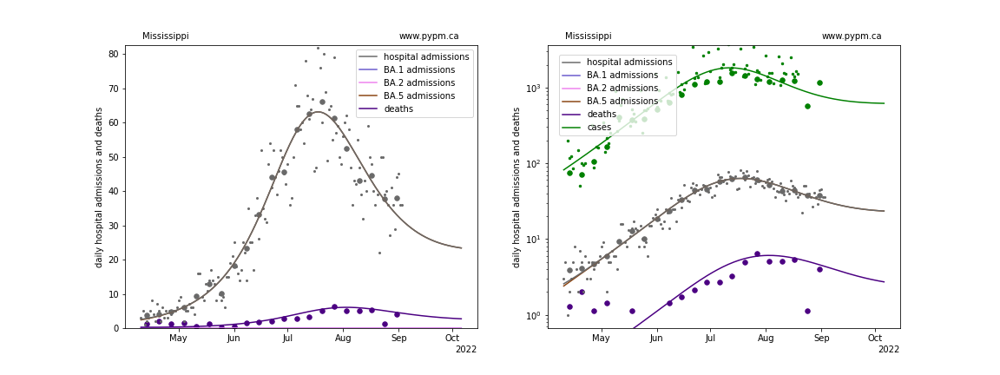
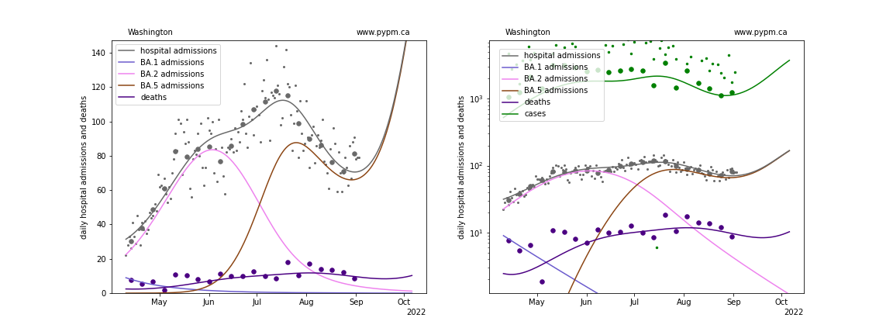

## September 4, 2022 Analysis of US state data

This report shows the result of analyses that use hospital admission data to estimate
the transmission rates in the past few months to characterize the recent Omicron waves.
Hospital admission data are used, to avoid testing capacity issues and to
better predict future hospital admission rates.

The modelling approach for US states has now changed to follow the approach first
applied in July for European nations.
See this [link](../eu20220717/index.md) for more information.

The European nations in the study were chosen for the distinct BA.2 wave which allowed
critical aspects of population-level immunity to be measured from the data:
* the population-level immunity at the start of the BA.2 wave
* the rate at which immunity grew with every hospital admission

Few US states had a distinct BA.2 wave, and so the identical approach cannot be applied.
Instead, information from the previous models (that included the entire time history)
was transferred to the new models that contain now history prior to 2022,
and mimic the initial population immunity as arising from natural infections
occuring near the beginning of 2022.
Since the turnover of waves results from the growth in immunity from infections,
the rate to which immunity grows is effectively measured by fit of the model parameters
to the data, assuming constant transmission rates.

As seen in the recent European analyses, immunity waning appears to be a significant
effect, and the same waning parameters are fit in the US data.
Given the lack of the well established BA.2 wave to calibrate immunity, the
waning parameter estimates may not be directly comparable to those from Europe.

In the figures below, the small dots show daily values, and
the larger circles are weekly averages to help guide the eye.
There are no changes to transmission rates (normally shown by dashed vertical lines)
within the time periods shown below. Each strain has just 2 parameters (transmission rate and timing).

### Individual state hospitalization analyses

The plots for each state below show the daily hospital admissions and deaths since April
on a linear scale (left) and log scale (right).
Cases are also included on the right.
BA.4 and BA.5 are combined into one strain, labelled BA.5.
For some states, the combination of BA.2, BA.4 and BA.5 are combined in one strain, labelled BA.5.

The projections below show a significant resurgance for some states.
These are not definitive predictions, but instead 
is an indication of the sensitivity on the degree to which immunity wanes, which is not yet well established.

### [Alaska](img/ak_4_4_0904.pdf)

### [Alabama](img/al_4_4_0904.pdf)

### [Arkansas](img/ar_4_4_0904.pdf)

### [Arizona](img/az_4_4_0904.pdf)

### [California](img/ca_4_4_0904.pdf)

### [Colorado](img/co_4_4_0904.pdf)

### [Connecticut](img/ct_4_4_0904.pdf)

### [District Of Columbia](img/dc_4_4_0904.pdf)

### [Delaware](img/de_4_4_0904.pdf)

### [Florida](img/fl_4_4_0904.pdf)

### [Georgia](img/ga_4_4_0904.pdf)

### [Hawaii](img/hi_4_4_0904.pdf)

### [Iowa](img/ia_4_4_0904.pdf)

### [Idaho](img/id_4_4_0904.pdf)

### [Illinois](img/il_4_4_0904.pdf)

### [Indiana](img/in_4_4_0904.pdf)

### [Kansas](img/ks_4_4_0904.pdf)

### [Kentucky](img/ky_4_4_0904.pdf)

### [Louisiana](img/la_4_4_0904.pdf)

### [Massachusetts](img/ma_4_4_0904.pdf)

### [Maryland](img/md_4_4_0904.pdf)

### [Maine](img/me_4_4_0904.pdf)

### [Michigan](img/mi_4_4_0904.pdf)

### [Minnesota](img/mn_4_4_0904.pdf)

### [Missouri](img/mo_4_4_0904.pdf)

### [Mississippi](img/ms_4_4_0904.pdf)

### [Montana](img/mt_4_4_0904.pdf)

### [North Carolina](img/nc_4_4_0904.pdf)

### [North Dakota](img/nd_4_4_0904.pdf)

### [Nebraska](img/ne_4_4_0904.pdf)

### [New Hampshire](img/nh_4_4_0904.pdf)

### [New Jersey](img/nj_4_4_0904.pdf)

### [New Mexico](img/nm_4_4_0904.pdf)

### [Nevada](img/nv_4_4_0904.pdf)

### [New York](img/ny_4_4_0904.pdf)

### [Ohio](img/oh_4_4_0904.pdf)

### [Oklahoma](img/ok_4_4_0904.pdf)

### [Oregon](img/or_4_4_0904.pdf)

### [Pennsylvania](img/pa_4_4_0904.pdf)

### [Puerto Rico](img/pr_4_4_0904.pdf)

### [Rhode Island](img/ri_4_4_0904.pdf)

### [South Carolina](img/sc_4_4_0904.pdf)

### [South Dakota](img/sd_4_4_0904.pdf)

### [Tennessee](img/tn_4_4_0904.pdf)

### [Texas](img/tx_4_4_0904.pdf)

### [Utah](img/ut_4_4_0904.pdf)

### [Virginia](img/va_4_4_0904.pdf)

### [Vermont](img/vt_4_4_0904.pdf)

### [Washington](img/wa_4_4_0904.pdf)

### [Wisconsin](img/wi_4_4_0904.pdf)

### [West Virginia](img/wv_4_4_0904.pdf)

### [Wyoming](img/wy_4_4_0904.pdf)

## [return to case studies](../index.md)

