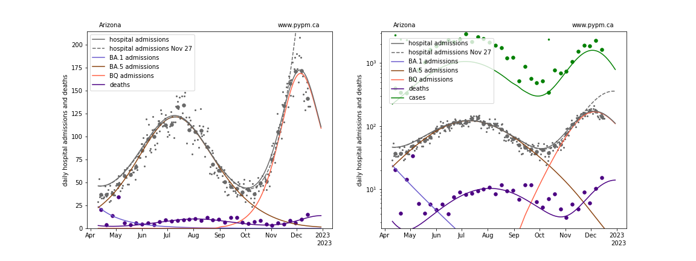
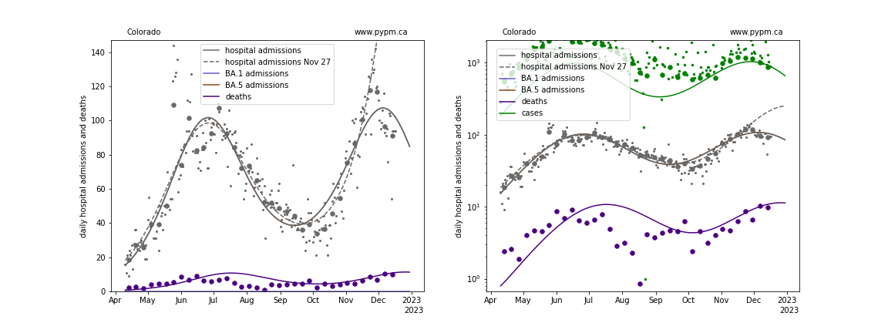
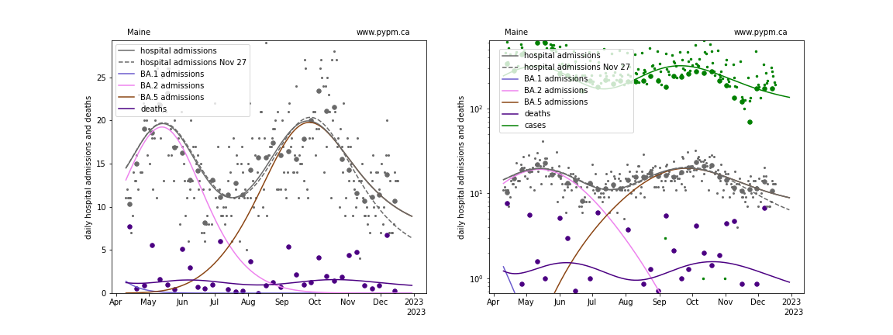

## December 18, 2022

This report shows the result of analyses that use hospital admission data to estimate
the transmission rates in the past few months to characterize the recent Omicron waves.
Hospital admission data are used, to avoid testing capacity issues and to
better predict future hospital admission rates.

The modelling approach for US states has now changed to follow the approach first
applied in July for European nations.
See this [link](../eu20220717/index.md) for more information.

In the figures below, the small dots show daily values, and
the larger circles are weekly averages to help guide the eye.
There are no changes to transmission rates (normally shown by dashed vertical lines)
within the time periods shown below. Each strain has just 2 parameters (transmission rate and timing).

### Individual state hospitalization analyses

The plots for each state below show the daily hospital admissions and deaths since April
on a linear scale (left) and log scale (right).
Cases are also included on the right.
BA.4 and BA.5 are combined into one strain, labelled BA.5.
For some states, the combination of BA.2, BA.4 and BA.5 are combined in one strain, labelled BA.5.

There is recent growth in hospital admissions in several states.
This may primarily be a result of waning of immunity, as was seen in Europe, as well as recent variants such as BQ.1.
At the bottom of the page, results for selection coefficients for recent strains are shown, and are found to be consistent with
the analysis for Europe data.

Many states recent transitioned to rapid growth. For those states a new variant is included, and labelled as BQ.1.
The figures below also show projections from a few weeks ago (November 27) to indicate the rapid change in behaviour seen in these states.

### [Alaska](img/ak_4_4_1218.pdf)

### [Alabama](img/al_4_4_1218.pdf)

### [Arkansas](img/ar_4_4_1218.pdf)

### [Arizona](img/az_4_4_1218.pdf)

### [California](img/ca_4_4_1218.pdf)

### [Colorado](img/co_4_4_1218.pdf)

### [Connecticut](img/ct_4_4_1218.pdf)

### [District Of Columbia](img/dc_4_4_1218.pdf)

### [Delaware](img/de_4_4_1218.pdf)

### [Florida](img/fl_4_4_1218.pdf)

### [Georgia](img/ga_4_4_1218.pdf)

### [Hawaii](img/hi_4_4_1218.pdf)

### [Iowa](img/ia_4_4_1218.pdf)

### [Idaho](img/id_4_4_1218.pdf)

### [Illinois](img/il_4_4_1218.pdf)

### [Indiana](img/in_4_4_1218.pdf)

### [Kansas](img/ks_4_4_1218.pdf)

### [Kentucky](img/ky_4_4_1218.pdf)

### [Louisiana](img/la_4_4_1218.pdf)

### [Massachusetts](img/ma_4_4_1218.pdf)

### [Maryland](img/md_4_4_1218.pdf)

### [Maine](img/me_4_4_1218.pdf)

### [Michigan](img/mi_4_4_1218.pdf)

### [Minnesota](img/mn_4_4_1218.pdf)

### [Missouri](img/mo_4_4_1218.pdf)

### [Mississippi](img/ms_4_4_1218.pdf)

### [Montana](img/mt_4_4_1218.pdf)

### [North Carolina](img/nc_4_4_1218.pdf)

### [North Dakota](img/nd_4_4_1218.pdf)

### [Nebraska](img/ne_4_4_1218.pdf)

### [New Hampshire](img/nh_4_4_1218.pdf)

### [New Jersey](img/nj_4_4_1218.pdf)

### [New Mexico](img/nm_4_4_1218.pdf)

### [Nevada](img/nv_4_4_1218.pdf)

### [New York](img/ny_4_4_1218.pdf)

### [Ohio](img/oh_4_4_1218.pdf)

### [Oklahoma](img/ok_4_4_1218.pdf)

### [Oregon](img/or_4_4_1218.pdf)

### [Pennsylvania](img/pa_4_4_1218.pdf)

### [Puerto Rico](img/pr_4_4_1218.pdf)

### [Rhode Island](img/ri_4_4_1218.pdf)

### [South Carolina](img/sc_4_4_1218.pdf)

### [South Dakota](img/sd_4_4_1218.pdf)

### [Tennessee](img/tn_4_4_1218.pdf)

### [Texas](img/tx_4_4_1218.pdf)

### [Utah](img/ut_4_4_1218.pdf)

### [Virginia](img/va_4_4_1218.pdf)

### [Vermont](img/vt_4_4_1218.pdf)

### [Washington](img/wa_4_4_1218.pdf)

### [Wisconsin](img/wi_4_4_1218.pdf)

### [West Virginia](img/wv_4_4_1218.pdf)

### [Wyoming](img/wy_4_4_1218.pdf)

## [return to case studies](../index.md)

