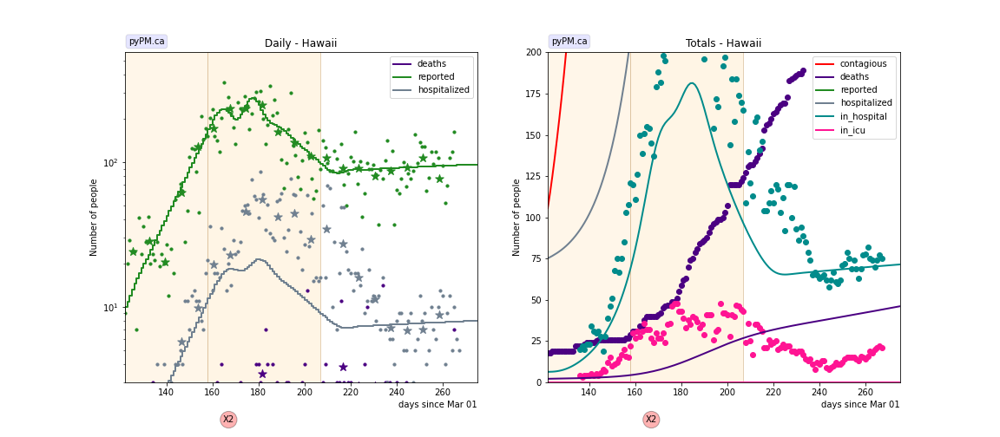
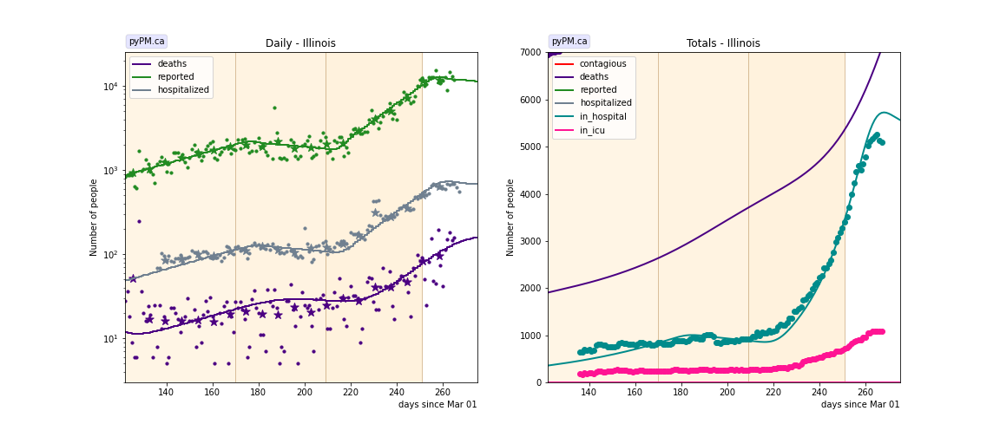

## November 22, 2020 Analysis of USA state data: New hospitalization data

A new data source for hospitalization data has
been made available by the US HHS [here](https://healthdata.gov/dataset/covid-19-reported-patient-impact-and-hospital-capacity-state-timeseries)

The plots shown in this summary can be compared to similar
[plots](../usa20201115)
that used data from the [Covid Tracking Project](https://covidtracking.com/data/api).

## Summary

For each state, its infection trajectory
can be summarized by the observed exponential growth in cases or
exponential growth in hospitalization.
The plot below compares the current inferred growth rate (in % per day)
for each state measured in these two ways.
For many states the hospitalization growth (from HHS data) is
remarkably close to the case growth.

The HHS data has both daily hospitalizations and current hospital
occupancy data for every state.
Having both, allows one to infer the mean stay for patients.

The Covid Tracking Project provided one or both of these data for
many states.

The inferred mean hospital stay time is found to be much more
consistent with the HHS data, compared to the Covid Tracking Project data,
as shown in the figures below. The only outlier in the HHS data is
for the state of Rhode Island.

#### Mean hospital stay (days) inferred from the covid tracking project data

#### Mean hospital stay (days) inferred from the US HHS data

## Individual state fits

The plots below show the case / hospitalization / deaths data for all 50 states, DC, and PR.
The infection trajectory is determined by fits to the cumulative case data.
The data fits were done using data up until November 21. 

The left figures show the daily cases, hospitalization, and deaths
on a log scale, since July 1.
The green points are the case data, the stars show the
weekly average, and the green curve is the fit of the model to the case data.
Hospitalization and deaths are in grey and purple.

For states where the hospitalization indicates a different trajectory,
the growth is inferred from the hospitalization data.

The right figures highlight the in-hospitalization numbers (hospital occupancy) in teal.
The curve shows the model prediction with the growth inferred from cases (or hospitalization).
A single parameter, the mean stay in hospital, is adjusted to fit the data.
That parameter value is shown in the histogram above.

### [Alaska](img/ak_2_3_1122.pdf)

### [Alabama](img/al_2_3_1122.pdf)

### [Arkansas](img/ar_2_3_1122_h.pdf)

### [Arizona](img/az_2_3_1122.pdf)

### [California](img/ca_2_3_1122_h.pdf)

### [Colorado](img/co_2_3_1122.pdf)

### [Connecticut](img/ct_2_3_1122.pdf)

### [District Of Columbia](img/dc_2_3_1122.pdf)

### [Delaware](img/de_2_5_1122.pdf)

### [Florida](img/fl_2_3_1122_h.pdf)

### [Georgia](img/ga_2_3_1122_h.pdf)

### [Hawaii](img/hi_2_3_1122.pdf)

### [Iowa](img/ia_2_5_1122.pdf)

### [Idaho](img/id_2_3_1122.pdf)

### [Illinois](img/il_2_5_1122.pdf)

### [Indiana](img/in_2_3_1122_h.pdf)

### [Kansas](img/ks_2_3_1122.pdf)

### [Kentucky](img/ky_2_3_1122.pdf)

### [Louisiana](img/la_2_5_1122_h.pdf)

### [Massachusetts](img/ma_2_3_1122_h.pdf)

### [Maryland](img/md_2_3_1122_h.pdf)

### [Maine](img/me_2_3_1122.pdf)

### [Michigan](img/mi_2_3_1122.pdf)

### [Minnesota](img/mn_2_3_1122.pdf)

### [Missouri](img/mo_2_3_1122.pdf)

### [Mississippi](img/ms_2_3_1122.pdf)

### [Montana](img/mt_2_3_1122.pdf)

### [North Carolina](img/nc_2_3_1122.pdf)

### [North Dakota](img/nd_2_3_1122.pdf)

### [Nebraska](img/ne_2_3_1122.pdf)

### [New Hampshire](img/nh_2_3_1122.pdf)

### [New Jersey](img/nj_2_3_1122.pdf)

### [New Mexico](img/nm_2_3_1122.pdf)

### [Nevada](img/nv_2_3_1122.pdf)

### [New York](img/ny_2_3_1122.pdf)

### [Ohio](img/oh_2_3_1122.pdf)

### [Oklahoma](img/ok_2_3_1122_h.pdf)

### [Oregon](img/or_2_3_1122.pdf)

### [Pennsylvania](img/pa_2_3_1122.pdf)

### [Puerto Rico](img/pr_2_3_1122.pdf)

### [Rhode Island](img/ri_2_3_1122.pdf)

### [South Carolina](img/sc_2_3_1122_h.pdf)

### [South Dakota](img/sd_2_3_1122.pdf)

### [Tennessee](img/tn_2_3_1122_h.pdf)

### [Texas](img/tx_2_3_1122.pdf)

### [Utah](img/ut_2_3_1122.pdf)

### [Virginia](img/va_2_3_1122.pdf)

### [Vermont](img/vt_2_3_1122.pdf)

### [Washington](img/wa_2_3_1122.pdf)

### [Wisconsin](img/wi_2_3_1122.pdf)

### [West Virginia](img/wv_2_3_1122.pdf)

### [Wyoming](img/wy_2_3_1122.pdf)

## [return to case studies](../index.md)

